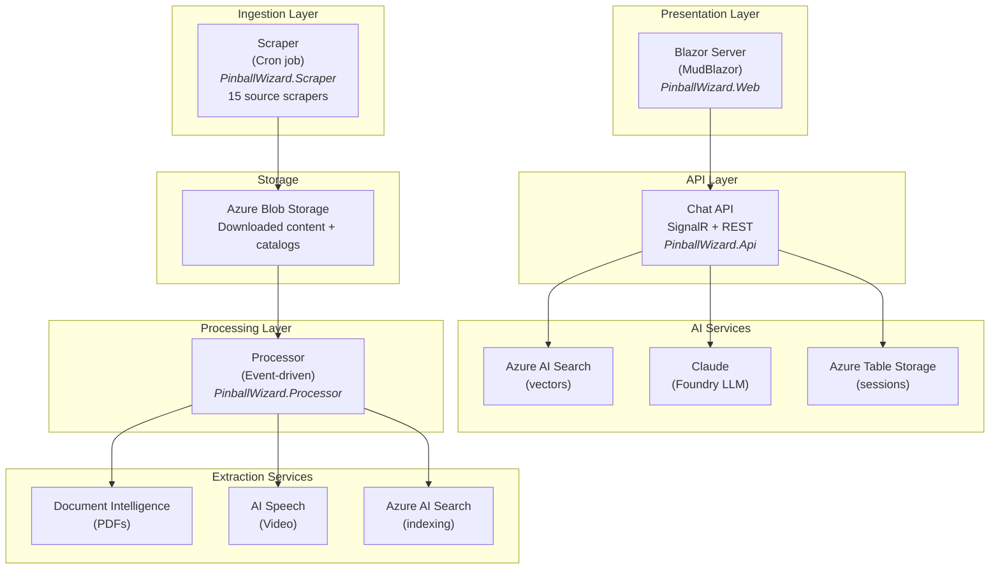
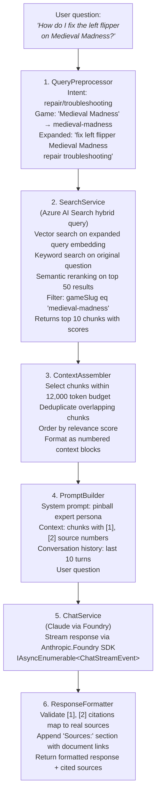
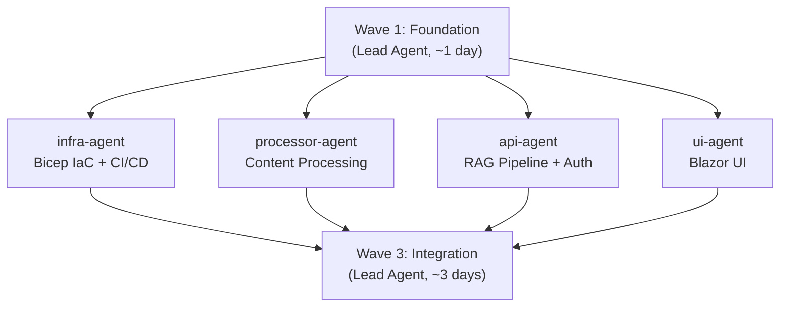

# PinballWizard — Enterprise Implementation Plan

**Version:** 1.0
**Date:** 2026-02-18
**Status:** Draft — Awaiting Approval

---

## 1. Vision

PinballWizard is a **public pinball knowledge base** that aggregates content from 15+ pinball information sources and makes it queryable through natural language. Users ask questions like *"How do I fix the left flipper on Medieval Madness?"* and receive accurate, cited answers drawn from manuals, repair guides, rulesheets, wiki articles, and video transcripts.

---

## 2. Architecture Overview



### Services (Azure Container Apps)

| Service | Type | Scaling | Purpose |
|---------|------|---------|---------|
| **Scraper** | Container App Job | Cron (daily 6 AM UTC) | Content discovery + download |
| **Processor** | Container App | Event-driven (scale to zero) | Text extraction, chunking, indexing |
| **API + Web** | Container App | Min 1, max 10 replicas | Chat API, Blazor UI, game browser |

---

## 3. Technology Decisions

| Decision | Choice | Rationale |
|----------|--------|-----------|
| **Cloud** | Azure (full stack) | Enterprise-grade, managed services |
| **AI Platform** | Azure AI Foundry | Model catalog (Claude, embeddings), managed endpoints |
| **LLM** | Claude (via Foundry) | Strong reasoning, 200K context, good citations |
| **Embeddings** | Integrated vectorization (Azure AI Search) | Managed, auto-embeds during indexing |
| **Vector Store** | Azure AI Search (Basic tier) | Hybrid search (vector + keyword + semantic), scaleable |
| **PDF Extraction** | Azure AI Document Intelligence | Layout-aware, handles scanned docs |
| **Video Transcription** | Azure AI Speech (Whisper) | High quality, batch processing |
| **Frontend** | Blazor Server + MudBlazor | C# full stack, Material Design, real-time SignalR |
| **Auth** | Social login (Google + GitHub) | Low friction for public service |
| **IaC** | Bicep + deployment stacks | Azure-native, per CLAUDE.md policy |
| **Processing Trigger** | Event Grid (blob events) | Reactive, serverless-friendly |
| **Architecture** | Microservices (3 Container Apps) | Independent scaling and deploys |

---

## 4. Solution Structure

```
PinballWizard/
├── src/
│   ├── PinballWizard.Domain/              # Shared models (NEW)
│   │   ├── Models/
│   │   │   ├── DocumentRecord.cs          # (moved from Scraper)
│   │   │   ├── GameRecord.cs              # (moved from Scraper)
│   │   │   ├── Catalog.cs                 # (moved from Scraper)
│   │   │   └── Enums.cs                   # (moved from Scraper)
│   │   └── PinballWizard.Domain.csproj
│   │
│   ├── PinballWizard.Scraper/             # DONE — 15 scrapers
│   │   └── (references PinballWizard.Domain)
│   │
│   ├── PinballWizard.Processor/           # Content processing (NEW)
│   │   ├── Program.cs                     # Host + DI + Event Grid listener
│   │   ├── ProcessorSettings.cs
│   │   ├── Pipeline/
│   │   │   ├── PipelineOrchestrator.cs    # Routes blobs to extractors
│   │   │   ├── IContentExtractor.cs       # Interface for text extraction
│   │   │   ├── PdfExtractor.cs            # Azure AI Document Intelligence
│   │   │   ├── HtmlExtractor.cs           # AngleSharp text extraction
│   │   │   ├── JsonExtractor.cs           # Structured data (OPDB, IFPA)
│   │   │   ├── VideoTranscriber.cs        # Azure AI Speech (Whisper)
│   │   │   └── ImageExtractor.cs          # Document Intelligence (OCR)
│   │   ├── Chunking/
│   │   │   ├── IChunkingStrategy.cs
│   │   │   ├── SlidingWindowChunker.cs    # Default: 512 tokens, 128 overlap
│   │   │   ├── SectionAwareChunker.cs     # For manuals with clear sections
│   │   │   └── WholeDocumentChunker.cs    # For short docs (rulesheets, glossary)
│   │   ├── Indexing/
│   │   │   ├── SearchIndexManager.cs      # Create/update Azure AI Search index
│   │   │   ├── SearchChunk.cs             # Index document model
│   │   │   └── IndexBatchPublisher.cs     # Push chunks to index
│   │   └── PinballWizard.Processor.csproj
│   │
│   ├── PinballWizard.Api/                 # Chat API + RAG (NEW)
│   │   ├── Program.cs                     # ASP.NET Core host + DI
│   │   ├── ApiSettings.cs
│   │   ├── Pipeline/
│   │   │   ├── QueryPreprocessor.cs       # Intent detection, game extraction
│   │   │   ├── SearchService.cs           # Azure AI Search hybrid queries
│   │   │   ├── ContextAssembler.cs        # Token budget, chunk selection
│   │   │   ├── PromptBuilder.cs           # System prompt + message construction
│   │   │   ├── ChatService.cs             # Claude streaming via Foundry
│   │   │   └── ResponseFormatter.cs       # Citation validation + formatting
│   │   ├── Endpoints/
│   │   │   ├── ChatEndpoints.cs           # POST /api/chat
│   │   │   ├── SearchEndpoints.cs         # GET /api/search
│   │   │   ├── GameEndpoints.cs           # GET /api/games
│   │   │   ├── FeedbackEndpoints.cs       # POST /api/feedback
│   │   │   └── HealthEndpoints.cs         # GET /api/health
│   │   ├── Hubs/
│   │   │   └── ChatHub.cs                 # SignalR streaming hub
│   │   ├── Auth/
│   │   │   ├── AuthEndpoints.cs           # OAuth login/callback/logout
│   │   │   └── JwtTokenService.cs         # JWT generation
│   │   ├── Services/
│   │   │   ├── ConversationStore.cs       # In-memory + Azure Table Storage
│   │   │   ├── GameService.cs             # Game catalog queries
│   │   │   ├── EmbeddingService.cs        # Query-time embedding
│   │   │   └── FeedbackService.cs         # Answer quality tracking
│   │   └── PinballWizard.Api.csproj
│   │
│   └── PinballWizard.Web/                 # Blazor UI (NEW)
│       ├── Program.cs                     # Blazor Server host
│       ├── App.razor
│       ├── _Imports.razor
│       ├── Layout/
│       │   ├── MainLayout.razor           # MudBlazor layout + theme
│       │   └── NavMenu.razor
│       ├── Pages/
│       │   ├── Index.razor                # Landing page
│       │   ├── Chat.razor                 # Chat interface
│       │   ├── Games.razor                # Game browser
│       │   ├── GameDetail.razor           # Game detail page
│       │   └── Documents.razor            # Document browser
│       ├── Components/
│       │   ├── Chat/
│       │   │   ├── ChatContainer.razor    # SignalR lifecycle + streaming
│       │   │   ├── MessageThread.razor    # Message list
│       │   │   ├── MessageBubble.razor    # Single message (markdown)
│       │   │   ├── SourceCitationCard.razor
│       │   │   ├── GameSelector.razor     # Autocomplete game filter
│       │   │   └── StreamingIndicator.razor
│       │   ├── Landing/
│       │   │   ├── HeroSection.razor
│       │   │   ├── FeaturedQuestions.razor
│       │   │   └── StatsBar.razor
│       │   ├── Games/
│       │   │   └── GameCard.razor
│       │   └── Shared/
│       │       ├── SearchBar.razor
│       │       ├── LoginButton.razor
│       │       ├── UserMenu.razor
│       │       ├── ThemeToggle.razor
│       │       └── ConnectionIndicator.razor
│       ├── Services/
│       │   ├── IChatService.cs
│       │   ├── IGameCatalogService.cs
│       │   └── IConversationStore.cs
│       ├── wwwroot/
│       │   ├── css/app.css
│       │   └── favicon.ico
│       └── PinballWizard.Web.csproj
│
├── infra/                                 # Bicep IaC (NEW)
│   ├── main.bicep                         # Orchestrator
│   ├── main.bicepparam                    # Parameters
│   ├── modules/
│   │   ├── container-registry.bicep
│   │   ├── container-apps-env.bicep
│   │   ├── container-app-scraper.bicep    # Cron job
│   │   ├── container-app-processor.bicep  # Event-driven
│   │   ├── container-app-web.bicep        # Always-on
│   │   ├── storage.bicep                  # Blob + Table
│   │   ├── ai-search.bicep               # Azure AI Search
│   │   ├── ai-foundry.bicep              # AI Foundry hub + model deployments
│   │   ├── document-intelligence.bicep
│   │   ├── speech-services.bicep
│   │   ├── event-grid.bicep              # Blob event subscriptions
│   │   ├── key-vault.bicep
│   │   ├── log-analytics.bicep
│   │   └── managed-identity.bicep         # User-assigned identity + RBAC
│   └── environments/
│       ├── dev.bicepparam
│       └── prod.bicepparam
│
├── tests/
│   ├── PinballWizard.Scraper.Tests/       # DONE — 7 tests
│   ├── PinballWizard.Processor.Tests/     # (NEW)
│   ├── PinballWizard.Api.Tests/           # (NEW)
│   └── PinballWizard.Web.Tests/           # (NEW — bUnit)
│
├── .github/
│   └── workflows/
│       ├── ci.yml                         # Build + test on PR
│       └── deploy.yml                     # Deploy to Azure on merge to main
│
├── PinballWizard.slnx                     # Updated with all projects
├── Dockerfile.scraper
├── Dockerfile.processor
├── Dockerfile.web
├── docker-compose.yml                     # Local development
└── .gitignore
```

---

## 5. Azure Resource Architecture

### 5.1 Resource Naming Convention

Pattern: `pw-{resource}-{env}` (e.g., `pw-search-prod`, `pw-acr-prod`)

| Resource | Name (prod) | SKU | Est. Cost/mo |
|----------|-------------|-----|-------------|
| Resource Group | `rg-pinballwizard-prod` | — | — |
| Container Registry | `pwacr` | Basic | $5 |
| Container Apps Environment | `pw-cae-prod` | Consumption | Pay-per-use |
| Container App (Web) | `pw-web-prod` | 0.5 vCPU, 1 GiB | ~$15 |
| Container App (Processor) | `pw-processor-prod` | Scale to zero | ~$5 |
| Container App Job (Scraper) | `pw-scraper-prod` | Cron trigger | ~$2 |
| Storage Account | `pwstorageprod` | Standard LRS | ~$5 |
| Azure AI Search | `pw-search-prod` | Basic (15 GB, 3 indexes) | $70 |
| Azure AI Foundry | `pw-ai-prod` | — | — |
| Claude model deployment | (via Foundry) | Pay-per-token | ~$20-50 |
| Embedding model deployment | (via Foundry) | text-embedding-3-small | ~$5 |
| AI Document Intelligence | `pw-docint-prod` | S0 | Pay-per-page (~$3) |
| AI Speech | `pw-speech-prod` | S0 | Pay-per-hour (~$5) |
| Key Vault | `pw-kv-prod` | Standard | ~$0.03 |
| Log Analytics | `pw-logs-prod` | Per-GB | ~$5 |
| Application Insights | `pw-appins-prod` | — | Included |
| Event Grid System Topic | `pw-eg-prod` | — | $0.60/M events |
| **Total estimated** | | | **~$140-165/mo** |

### 5.2 RBAC Assignments

A single **user-assigned managed identity** (`pw-identity-prod`) is shared across Container Apps:

| Identity | Resource | Role |
|----------|----------|------|
| `pw-identity-prod` | Storage Account | Storage Blob Data Contributor |
| `pw-identity-prod` | Storage Account | Storage Table Data Contributor |
| `pw-identity-prod` | Azure AI Search | Search Index Data Contributor |
| `pw-identity-prod` | Azure AI Search | Search Service Contributor |
| `pw-identity-prod` | Key Vault | Key Vault Secrets User |
| `pw-identity-prod` | AI Foundry | Cognitive Services User |
| `pw-identity-prod` | Document Intelligence | Cognitive Services User |
| `pw-identity-prod` | AI Speech | Cognitive Services User |

All service-to-service auth uses `DefaultAzureCredential` — **no connection strings in code**.

### 5.3 Networking (MVP)

**Domain:** `pinwiz.ai`

For the "start small" phase, use **simplified public access**:
- Container Apps with public ingress (HTTPS only), custom domain `pinwiz.ai`
- Azure AI Search with API key auth (via Key Vault)
- Storage with managed identity auth
- No VNet initially — add private endpoints when scaling to production

### 5.4 Secret Management

All secrets stored in Key Vault with `contentType` and 90-day expiry:

| Secret | Used By |
|--------|---------|
| `google-oauth-client-id` | Web |
| `google-oauth-client-secret` | Web |
| `github-oauth-client-id` | Web |
| `github-oauth-client-secret` | Web |
| `jwt-signing-key` | API |
| `opdb-api-token` | Scraper |
| `ifpa-api-key` | Scraper |

---

## 6. Content Processing Pipeline (PinballWizard.Processor)

### 6.1 Event-Driven Flow

```mermaid
flowchart LR
    Blob["Blob uploaded<br/>to Storage"] --> EG["Event Grid fires<br/>BlobCreated event"]
    EG --> CA["Container App receives<br/>event via HTTP webhook"]
    CA --> Orch["PipelineOrchestrator<br/>routes by content type"]
    Orch --> Extract["Extractor produces<br/>raw text"]
    Extract --> Chunk["Chunker splits into<br/>semantic chunks"]
    Chunk --> Publish["IndexBatchPublisher<br/>pushes to Azure AI Search"]
    Publish --> Vector["Integrated vectorization<br/>auto-embeds chunks"]
```



### 6.2 Content Extractors

| Content Type | Extractor | Details |
|-------------|-----------|---------|
| PDF | `PdfExtractor` | Azure AI Document Intelligence (Layout model). Returns pages with section headers, tables, images. |
| HTML | `HtmlExtractor` | AngleSharp — strip nav/footer/ads, extract article body text with heading hierarchy. |
| JSON (API data) | `JsonExtractor` | Deserialize OPDB/PinballMap/IFPA records. Convert structured fields to searchable text. |
| Video | `VideoTranscriber` | Download audio -> Azure AI Speech batch transcription (Whisper). Returns timestamped text. |
| Images | `ImageExtractor` | Document Intelligence (Read model) for OCR on schematics. |

### 6.3 Chunking Strategies

| Strategy | Token Size | Overlap | Used For |
|----------|-----------|---------|----------|
| **SlidingWindowChunker** | 512 | 128 | Default — manuals, repair guides, long articles |
| **SectionAwareChunker** | 512-1024 | 64 | Manuals with clear H1/H2/H3 sections — respects heading boundaries |
| **WholeDocumentChunker** | Up to 2048 | 0 | Short docs — rulesheets, glossary entries, forum posts |

Each chunk includes metadata:
- `parentDocumentId` — links back to `DocumentRecord`
- `gameSlug`, `gameTitle` — game association
- `sectionPath` — e.g., "Chapter 3 > Flipper Assembly > Troubleshooting"
- `pageNumber` — for PDFs
- `documentType`, `sourceType`, `contentCategories`

### 6.4 Azure AI Search Index Schema

Index name: `pinball-chunks`

```
Fields:
  chunkId            string                  (key, filterable)
  content            string                  (searchable)
  contentVector      Collection(Edm.Single)  (searchable, 1536 dims)
  parentDocId        string                  (filterable)
  gameSlug           string                  (filterable, facetable)
  gameTitle          string                  (searchable, filterable)
  manufacturer       string                  (filterable, facetable)
  documentType       string                  (filterable, facetable)
  sourceType         string                  (filterable, facetable)
  sourceUrl          string                  (retrievable)
  sourceName         string                  (retrievable)
  sectionPath        string                  (searchable)
  pageNumber         Int32                   (filterable, sortable)
  contentCategories  Collection(string)      (filterable, facetable)
  lastUpdated        DateTimeOffset          (sortable)

Semantic Configuration: "pinball-semantic-config"
  Title field: sectionPath
  Content field: content
  Keyword fields: gameTitle, documentType, manufacturer

Integrated Vectorization:
  Skillset calls text-embedding-3-small (1536 dims) via Azure OpenAI
  Vectorizer applied to: content field -> contentVector field
  Also used at query time for vectorizing user queries

Suggester: "game-suggest"
  Source fields: gameTitle, manufacturer
```

---

## 7. RAG Query Pipeline (PinballWizard.Api)

### 7.1 Query Flow



### 7.2 System Prompt

```
You are PinballWizard, an expert pinball knowledge assistant. You help players,
collectors, technicians, and enthusiasts with anything pinball-related.

RULES:
1. Answer ONLY from the provided context. If the context doesn't contain the
   answer, say "I don't have enough information about that in my knowledge base."
2. Cite your sources using [1], [2], etc. matching the numbered context blocks.
3. Every factual claim MUST have at least one citation.
4. For repair/maintenance questions, include safety warnings where appropriate.
5. If the question is about a specific game, focus on that game's documentation.
6. For general questions, draw from multiple sources to give comprehensive answers.
7. Use clear, concise language. Use markdown formatting for readability.
8. If the question is ambiguous (e.g., "Flash" could be multiple games), ask
   for clarification.
```

### 7.3 SignalR Streaming

The `ChatHub` streams `IAsyncEnumerable<ChatStreamEvent>` to the Blazor client:

```csharp
public enum ChatStreamEventType
{
    Sources,     // Emitted first — sources appear before answer text
    TextDelta,   // Incremental token from Claude
    Complete,    // Stream finished
    Error        // Error occurred
}
```

Flow: Claude stream -> ChatService -> ChatHub (SignalR) -> Blazor ChatContainer

Two SignalR connections:
1. **Blazor circuit** (`/_blazor`) — handles UI rendering (automatic)
2. **Chat hub** (`/hubs/chat`) — dedicated LLM streaming (explicit)

### 7.4 REST API Endpoints

| Method | Route | Auth | Rate Limit | Description |
|--------|-------|:----:|:----------:|-------------|
| POST | `/api/chat` | Yes | Chat (20/hr) | Send question, get streamed answer |
| GET | `/api/chat/{id}/history` | Yes | General | Get conversation history |
| GET | `/api/search` | No | General (100/min) | Direct search (no LLM) |
| GET | `/api/games` | No | General | Browse game catalog |
| GET | `/api/games/{slug}` | No | General | Game detail + documents |
| POST | `/api/feedback` | Yes | General | Submit answer quality feedback |
| GET | `/api/health` | No | None | Health check |

### 7.5 Rate Limiting

| Tier | Limit | Scope |
|------|-------|-------|
| Chat (authenticated) | 20 questions/hour | Per user |
| General API (public) | 100 requests/minute | Per IP |
| Search (public) | 60 requests/minute | Per IP |

---

## 8. Blazor UI (PinballWizard.Web)

### 8.1 Pages

| Route | Page | Auth Required | Description |
|-------|------|:---:|-------------|
| `/` | Landing | No | Hero, search bar, featured questions, stats |
| `/chat` | Chat | Yes | Chat interface with conversation history |
| `/chat/{id}` | Chat | Yes | Resume existing conversation |
| `/games` | Games | No | Searchable/filterable game catalog |
| `/games/{slug}` | GameDetail | No | Game metadata, editions, related documents |
| `/documents` | Documents | No | Browse documents by type/source/game |

### 8.2 Component Library

**MudBlazor** — Material Design components for Blazor:
- `MudThemeProvider` — dark/light mode (default: dark, arcade aesthetic)
- `MudMarkdown` — render LLM responses as formatted markdown
- `MudAutocomplete` — game selector with typeahead
- `MudExpansionPanel` — expandable source citations
- `MudDrawer` — conversation history sidebar
- `MudSkeleton` — loading states

### 8.3 Theme

```
Light:  Primary #7B1FA2 (deep purple), Secondary #FF6F00 (amber)
Dark:   Primary #CE93D8 (light purple), Secondary #FFB74D (warm amber)
        Background #0F0F23 (arcade black), Surface #1A1A2E (deep navy)
```

### 8.4 Streaming Text Rendering

Tokens render at 50ms intervals (20fps) via a debounce timer to avoid excessive re-renders. `MudMarkdown` re-parses on each render; Blazor Server diffs the DOM so only changed nodes actually update in the browser.

### 8.5 Responsive Breakpoints

- **xs** (0-599px): Single column, drawer collapses to overlay
- **sm** (600-959px): Compact cards, drawer overlay
- **md** (960-1279px): Responsive drawer, 2-column game grid
- **lg+** (1280px+): Full layout, persistent drawer, 3-column grid

---

## 9. Authentication

### 9.1 Flow

1. User clicks "Sign in with Google" or "Sign in with GitHub"
2. ASP.NET Core redirects to provider's OAuth consent screen
3. Provider redirects back to callback URL
4. Server creates/upserts user in Azure Table Storage
5. Issues JWT token (24-hour expiry)
6. Blazor stores JWT, includes in SignalR connection + API calls

### 9.2 Authorization Matrix

| Resource | Anonymous | Authenticated |
|----------|:---------:|:------------:|
| Landing page | Yes | Yes |
| Game catalog | Yes | Yes |
| Document browser | Yes | Yes |
| Direct search API | Yes | Yes |
| Chat (LLM) | No | Yes |
| Conversation history | No | Yes (own only) |
| Feedback | No | Yes |

---

## 10. Infrastructure as Code (Bicep)

### 10.1 Module Structure

```bicep
// main.bicep orchestrates all modules in dependency order
module identity    './modules/managed-identity.bicep'
module logging     './modules/log-analytics.bicep'
module keyVault    './modules/key-vault.bicep'
module storage     './modules/storage.bicep'
module acr         './modules/container-registry.bicep'
module aiSearch    './modules/ai-search.bicep'
module aiFoundry   './modules/ai-foundry.bicep'
module docIntel    './modules/document-intelligence.bicep'
module speech      './modules/speech-services.bicep'
module cae         './modules/container-apps-env.bicep'
module scraper     './modules/container-app-scraper.bicep'
module processor   './modules/container-app-processor.bicep'
module web         './modules/container-app-web.bicep'
module eventGrid   './modules/event-grid.bicep'
```

### 10.2 Deployment

```bash
# Deploy via deployment stack (per CLAUDE.md policy)
az stack group create \
  --name pinballwizard \
  --resource-group rg-pinballwizard-prod \
  --template-file infra/main.bicep \
  --parameters infra/environments/prod.bicepparam \
  --deny-settings-mode denyWriteAndDelete \
  --action-on-unmanage deleteAll
```

### 10.3 CI/CD (GitHub Actions)

**ci.yml** (on PR):
1. `dotnet build` all projects
2. `dotnet test` all test projects
3. `az bicep lint` on all .bicep files
4. `az bicep build` to validate templates

**deploy.yml** (on merge to main):
1. Build + test
2. Build Docker images (scraper, processor, web)
3. Push to ACR
4. Deploy Bicep via deployment stack
5. Update Container App revisions

---

## 11. Implementation Phases (Parallel Agent Strategy)

Work is structured in 3 waves. After a sequential foundation step, 4 agents work in parallel on completely disjoint file sets, sharing only the Domain project. This cuts wall-clock time from ~7 weeks (sequential) to ~2.5 weeks.



### Wave 1: Foundation (Sequential — Lead Agent)

**Goal:** Create shared Domain project with all contracts, project skeletons with NuGet packages, and Docker scaffolding — so all Wave 2 agents can compile and work independently.

**Gate:** `dotnet build PinballWizard.slnx && dotnet test PinballWizard.slnx` must pass before Wave 2 begins.

| # | Task | Deliverable |
|---|------|-------------|
| 1.1 | Create `PinballWizard.Domain` project | Zero-dependency shared models library |
| 1.2 | Move models from Scraper → Domain | `DocumentRecord`, `GameRecord`, `Catalog`, `Enums` (namespace: `PinballWizard.Domain.Models`) |
| 1.3 | Create `SearchChunk` model in Domain | Shared index schema used by Processor (write) and Api (read) |
| 1.4 | Create `ChatModels.cs` in Domain | API contracts: `ChatRequest`, `ChatResponse`, `ChatStreamEvent`, `SearchRequest`, `SearchResult`, `GameSummary`, `SourceCitation`, `FeedbackRequest`, `ConversationSummary`, `UserInfo` |
| 1.5 | Create processing abstractions in Domain | `IContentExtractor`, `IChunkingStrategy`, `ExtractionResult`, `TextSection`, `TextChunk` |
| 1.6 | Update Scraper to reference Domain | Change `using` statements, verify build + tests pass |
| 1.7 | Create `PinballWizard.Processor` skeleton | .csproj with all NuGet refs, stub `Program.cs`, `ProcessorSettings.cs` |
| 1.8 | Create `PinballWizard.Api` skeleton | .csproj with all NuGet refs, ASP.NET Core `Program.cs`, health endpoint, `ApiSettings.cs` |
| 1.9 | Create `PinballWizard.Web` skeleton | .csproj with MudBlazor + SignalR, `Program.cs`, `App.razor`, `MainLayout.razor` |
| 1.10 | Create 3 test project skeletons | `.Processor.Tests`, `.Api.Tests`, `.Web.Tests` (bUnit) |
| 1.11 | Update `PinballWizard.slnx` | All 7 projects (4 src + 3 test) |
| 1.12 | Create Dockerfiles | `Dockerfile.scraper` (rename existing), `Dockerfile.processor`, `Dockerfile.web` |
| 1.13 | Update `docker-compose.yml` | All 3 services + Azurite emulator |

### Wave 2: Parallel Implementation (4 Agents)

Each agent owns a completely disjoint set of files and depends only on `PinballWizard.Domain` (frozen after Wave 1). No cross-agent coordination is needed.

#### Agent 1 — `infra-agent` (Bicep IaC + CI/CD)

**Owns:** `infra/`, `.github/workflows/`

| # | Task | Files |
|---|------|-------|
| I1 | Core infra modules | `managed-identity.bicep`, `log-analytics.bicep`, `key-vault.bicep`, `storage.bicep` |
| I2 | AI service modules | `ai-search.bicep`, `ai-foundry.bicep`, `document-intelligence.bicep`, `speech-services.bicep` |
| I3 | Compute modules | `container-registry.bicep`, `container-apps-env.bicep` |
| I4 | Service modules | `container-app-scraper.bicep`, `container-app-processor.bicep`, `container-app-web.bicep` |
| I5 | Event routing | `event-grid.bicep` |
| I6 | Orchestrator + params | `main.bicep`, `main.bicepparam`, `environments/dev.bicepparam`, `environments/prod.bicepparam` |
| I7 | CI/CD pipelines | `.github/workflows/ci.yml`, `.github/workflows/deploy.yml` |
| I8 | Deploy + verify | All resources healthy via deployment stack |
| I9 | Configure secrets | Key Vault populated with placeholder values |

#### Agent 2 — `processor-agent` (Content Processing Pipeline)

**Owns:** `src/PinballWizard.Processor/`, `tests/PinballWizard.Processor.Tests/`

**Depends on from Domain:** `DocumentRecord`, `SearchChunk`, `IContentExtractor`, `IChunkingStrategy`, enums

| # | Task | Files |
|---|------|-------|
| P1 | PDF extraction | `Pipeline/PdfExtractor.cs` (Azure AI Document Intelligence) |
| P2 | HTML extraction | `Pipeline/HtmlExtractor.cs` (AngleSharp) |
| P3 | JSON extraction | `Pipeline/JsonExtractor.cs` (OPDB/PinballMap/IFPA records) |
| P4 | Video transcription | `Pipeline/VideoTranscriber.cs` (Azure AI Speech/Whisper) |
| P5 | Image OCR | `Pipeline/ImageExtractor.cs` (Document Intelligence Read model) |
| P6 | Chunking strategies | `Chunking/SlidingWindowChunker.cs`, `SectionAwareChunker.cs`, `WholeDocumentChunker.cs` |
| P7 | Search index management | `Indexing/SearchIndexManager.cs` (create/update index from `SearchChunk` schema) |
| P8 | Index publishing | `Indexing/IndexBatchPublisher.cs` (push chunk batches) |
| P9 | Pipeline orchestrator | `Pipeline/PipelineOrchestrator.cs` (Event Grid → extract → chunk → index) |
| P10 | DI + Event Grid host | `Program.cs` (ASP.NET Core webhook listener) |
| P11 | Unit tests | `Processor.Tests/` (extractors, chunkers, orchestrator) |

#### Agent 3 — `api-agent` (RAG Pipeline + Auth)

**Owns:** `src/PinballWizard.Api/`, `tests/PinballWizard.Api.Tests/`

**Depends on from Domain:** `SearchChunk`, `ChatRequest/Response/StreamEvent`, `SearchRequest/Result`, `GameSummary`, `SourceCitation`, `GameRecord`, enums

| # | Task | Files |
|---|------|-------|
| R1 | Query preprocessing | `Pipeline/QueryPreprocessor.cs` (intent detection, game extraction, query expansion) |
| R2 | Search service | `Pipeline/SearchService.cs` (hybrid vector + keyword + semantic reranking) |
| R3 | Context assembly | `Pipeline/ContextAssembler.cs` (12K token budget, dedup, ranking) |
| R4 | Prompt construction | `Pipeline/PromptBuilder.cs` (system prompt, conversation history) |
| R5 | Claude integration | `Pipeline/ChatService.cs` (streaming via Foundry SDK) |
| R6 | Response formatting | `Pipeline/ResponseFormatter.cs` (citation validation) |
| R7 | REST endpoints | `Endpoints/ChatEndpoints.cs`, `SearchEndpoints.cs`, `GameEndpoints.cs`, `FeedbackEndpoints.cs`, `HealthEndpoints.cs` |
| R8 | SignalR streaming hub | `Hubs/ChatHub.cs` |
| R9 | OAuth + JWT auth | `Auth/AuthEndpoints.cs`, `Auth/JwtTokenService.cs` |
| R10 | Rate limiting | Middleware config in `Program.cs` (20/hr chat, 100/min general, 60/min search) |
| R11 | Support services | `Services/ConversationStore.cs`, `GameService.cs`, `EmbeddingService.cs`, `FeedbackService.cs` |
| R12 | Unit tests | `Api.Tests/` (preprocessor, context assembler, response formatter, hub) |

#### Agent 4 — `ui-agent` (Blazor UI)

**Owns:** `src/PinballWizard.Web/`, `tests/PinballWizard.Web.Tests/`

**Depends on from Domain:** `ChatRequest/Response/StreamEvent`, `SearchRequest/Result`, `GameSummary`, `SourceCitation`, `ConversationSummary`, `UserInfo`, `GameRecord`, `EditionInfo`

| # | Task | Files |
|---|------|-------|
| U1 | Landing page | `Pages/Index.razor`, `Components/Landing/HeroSection.razor`, `FeaturedQuestions.razor`, `StatsBar.razor` |
| U2 | Chat interface | `Pages/Chat.razor`, `Components/Chat/ChatContainer.razor`, `MessageThread.razor`, `MessageBubble.razor` |
| U3 | Chat components | `Components/Chat/SourceCitationCard.razor`, `GameSelector.razor`, `StreamingIndicator.razor` |
| U4 | SignalR integration | `ChatContainer.razor` SignalR lifecycle + `IAsyncEnumerable<ChatStreamEvent>` consumption |
| U5 | Game browser | `Pages/Games.razor`, `Pages/GameDetail.razor`, `Components/Games/GameCard.razor` |
| U6 | Document browser | `Pages/Documents.razor` |
| U7 | Shared components | `Components/Shared/SearchBar.razor`, `LoginButton.razor`, `UserMenu.razor`, `ThemeToggle.razor`, `ConnectionIndicator.razor` |
| U8 | Theme + layout | `Layout/MainLayout.razor`, `Layout/NavMenu.razor`, `wwwroot/css/app.css` |
| U9 | Service interfaces | `Services/IChatService.cs`, `IGameCatalogService.cs`, `IConversationStore.cs` (with mock impls for dev) |
| U10 | Responsive + a11y | MudBlazor breakpoints, accessibility audit |
| U11 | bUnit tests | `Web.Tests/` (ChatContainer, MessageBubble, GameCard) |

### Wave 2: Zero-Blocking Guarantee

Why agents never block on each other:
- **No compile-time cross-dependencies** — each agent's project references only `PinballWizard.Domain`
- **Shared schema defined upfront** — `SearchChunk` (index), `ChatModels` (API contracts) are in Domain from Wave 1
- **Disjoint file ownership** — no two agents touch the same file
- **Solution file frozen** — `PinballWizard.slnx` is set in Wave 1, unchanged in Wave 2

### Wave 3: Integration + Launch (Sequential — Lead Agent)

**Goal:** End-to-end system tested, deployed to production at `pinwiz.ai`.

**Prerequisites:** All 4 Wave 2 agents have completed their work, all projects build and pass unit tests.

| # | Task |
|---|------|
| G1 | Wire Web + Api into single Container App host |
| G2 | End-to-end pipeline: scrape → process → index → query → answer |
| G3 | SignalR streaming integration test (Blazor ↔ ChatHub ↔ Claude) |
| G4 | OAuth integration test with real providers |
| G5 | Cross-service contract validation (Processor writes ↔ Api reads `SearchChunk`) |
| G6 | Performance testing (search < 500ms P95, first token < 2s P95) |
| G7 | Security review (OWASP top 10) |
| G8 | Deploy to Azure via `az stack group create` |
| G9 | Configure custom domain `pinwiz.ai` + SSL |
| G10 | Monitoring dashboards (Application Insights) |

### Timeline Comparison

| Approach | Wall-clock |
|----------|-----------|
| Original (sequential A→G) | ~7 weeks |
| 3-Wave (parallel) | ~2.5 weeks |

---

## 12. Key NuGet Packages

### PinballWizard.Domain
- (no dependencies — pure models)

### PinballWizard.Processor
- `Azure.AI.DocumentIntelligence` — PDF/image text extraction
- `Microsoft.CognitiveServices.Speech` — Whisper transcription
- `Azure.Search.Documents` — Index management + document push
- `Azure.Storage.Blobs` — Read downloaded content
- `Azure.Identity` — DefaultAzureCredential
- `AngleSharp` — HTML text extraction

### PinballWizard.Api
- `Anthropic.Foundry` — Claude via Azure AI Foundry
- `Azure.Search.Documents` — Hybrid search queries
- `Azure.Data.Tables` — Conversation persistence
- `Azure.Identity` — DefaultAzureCredential
- `Microsoft.AspNetCore.Authentication.Google` — Google OAuth
- `Microsoft.AspNetCore.Authentication.JwtBearer` — JWT validation
- `Microsoft.ML.Tokenizers` — Token counting for budget management

### PinballWizard.Web
- `MudBlazor` — Material Design component library
- `Markdig` — Markdown parsing
- `RamType0.Markdig.Renderers.MudBlazor` — MudBlazor markdown renderer
- `Microsoft.AspNetCore.SignalR.Client` — SignalR client

---

## 13. Risk Register

| Risk | Impact | Mitigation |
|------|--------|------------|
| Claude via Foundry SDK is pre-1.0 | Breaking changes | Pin version, have fallback to direct Anthropic SDK |
| Azure AI Search Basic tier limits (15 GB, 3 indexes) | Index capacity | Monitor usage, upgrade to Standard if needed |
| PDF extraction quality varies | Poor search results for some docs | Use Layout model (not Read), add manual quality checks |
| YouTube auto-captions unavailable | Missing video content | Whisper transcription handles all cases |
| Rate limiting may frustrate users | User churn | Clear UI messaging, generous limits (20/hr) |
| LLM hallucination | Incorrect answers | Strict system prompt, citation validation, user feedback loop |
| Cold start latency (scale to zero) | Slow first request | Min 1 replica for web service in production |

---

## 14. Success Criteria

1. **Functional:** User asks a natural language pinball question -> receives accurate, cited answer within 5 seconds
2. **Coverage:** 80%+ of indexed documents are searchable (successful extraction + chunking)
3. **Quality:** 90%+ of answers include at least one valid source citation
4. **Performance:** P95 search latency < 500ms, P95 streaming first-token < 2s
5. **Reliability:** 99.5% uptime for the web service
6. **Scale:** Supports 100 concurrent users without degradation

---

## 15. Open Questions

1. **Content licensing** — Any scraped sources with restrictive licenses that affect public display?
2. **Feedback loop** — Should user feedback on answer quality trigger re-indexing or prompt tuning?
3. **Incremental indexing** — Should the processor support updating existing chunks when source content changes (vs. full reindex)?
4. **Multi-language** — English only, or support other languages?

## 16. Resolved Decisions

| # | Question | Decision |
|---|----------|----------|
| 1 | Custom domain | `pinwiz.ai` (purchased) |
