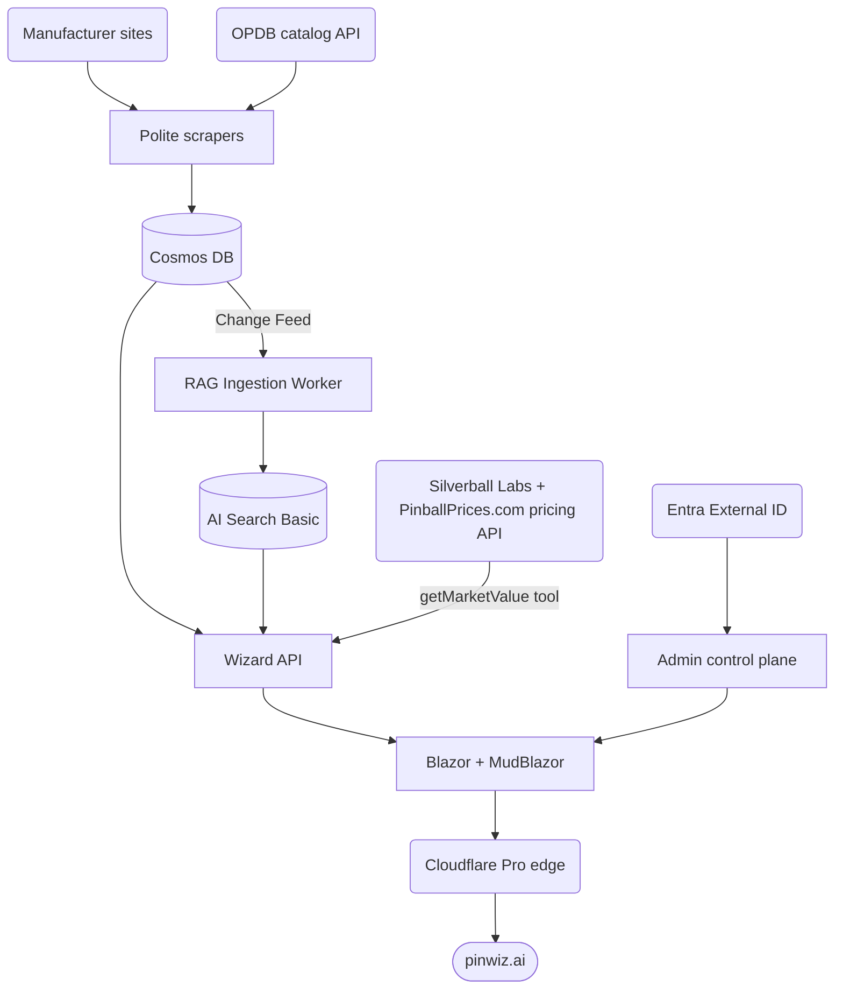

# PinballWizard

[](https://github.com/Early-Bird-Solutions-LLC/PinballWizard/actions/workflows/ci.yml)
[](https://github.com/Early-Bird-Solutions-LLC/PinballWizard/actions/workflows/codeql.yml)
[](https://github.com/Early-Bird-Solutions-LLC/PinballWizard/actions/workflows/ci.yml)
[](https://github.com/Early-Bird-Solutions-LLC/PinballWizard/releases)
[](https://dotnet.microsoft.com/)
[](https://learn.microsoft.com/en-us/dotnet/aspire/)

> **An enterprise AI reference application by Earlybird Solutions** — demonstrating end-to-end architecture, build, and operation of a modern Azure + .NET Aspire AI platform.
> The pinball domain is the vehicle. The engineering is the point.

PinballWizard is a polite, manufacturer-agnostic content-ingestion pipeline feeding an event-driven, source-citing RAG platform. Public users ask the Wizard questions about pinball machines and get answers that cite original manuals, schematics, and bulletins on the manufacturers' own sites when grounding is available — refusing rather than fabricating when it isn't. Threshold-driven refusal (per [ADR-0017](docs/adr/0017-confidence-threshold-refusal.md)) is the safety invariant; citations are the differentiator.

Every architectural decision is justified in an [ADR](docs/adr/). Every PR clears a two-step pre-push audit (qualitative critique + mechanical checklist). Every external request is throttled, identified, and respectful of `robots.txt` by construction.

## Live demo

Phases 2–6 are complete. The shipped product is a live RAG-powered Wizard on [pinwiz.ai](https://pinwiz.ai) with source-cited Q&A, admin control plane, and end-to-end observability. Phase 7 is the current active work stream. See [`docs/vision.md`](docs/vision.md) for the full prospect-facing positioning.

## Architecture at a glance



**Data partners.** Two authorized sources feed the catalog through the scraper path — **OPDB** (canonical machine catalog, keyed on OPDB id) and the **manufacturer sites** (Stern, JJP, AP, Spooky, Pinball Brothers, BoF, Multimorphic, CGC). A third, **Silverball Labs** (with **PinballPrices.com** as the origin dataset), is a *live* partner: the Wizard API calls its OPDB-id-keyed pricing REST API at answer time via the `getMarketValue` function tool ([ADR-0045](docs/adr/0045-silverball-labs-pricing-integration.md)), and every pricing answer carries dual attribution taken from the API payload.

Manufacturer sources include Stern, JJP, AP, Spooky, Pinball Brothers, BoF, Multimorphic, and CGC. Polite scrapers extend `PoliteScraperBase` + `IPolitenessGate` + `RobotsTxtCache` (robots.txt honored unconditionally). Cosmos holds `machines`, `ingestion_sources`, and RAG-state containers; the RAG Ingestion Worker (`PinballWizard.RagIngestionWorker`) consumes the Cosmos Change Feed, runs PdfPig text extraction, hybrid chunking ([ADR-0019](docs/adr/0019-hybrid-chunking.md)), and embeds into AI Search ([ADR-0021](docs/adr/0021-ai-search-index-schema.md)). The Wizard API (Microsoft Agent Framework + Azure Foundry orchestration, [ADR-0014](docs/adr/0014-microsoft-foundry-orchestration.md)) runs four agents — Wizard, Valuation, Rules, Repair — with `getMachineByTitle` + `searchCorpus` + `getMarketValue` function tools, per-agent cost routing ([ADR-0015](docs/adr/0015-cost-routing-and-semantic-cache.md)), confidence-threshold refusal ([ADR-0017](docs/adr/0017-confidence-threshold-refusal.md)), and two-stage re-ranking ([ADR-0024](docs/adr/0024-two-stage-reranking.md)). The Blazor Web App ([ADR-0026](docs/adr/0026-user-delight-frontend-and-streaming.md)) streams answers over SSE with source citations and community-resource refusal panels; admin RBAC is gated by Entra External ID ([ADR-0009](docs/adr/0009-entra-external-id-admin-rbac-v1.md)). Cloudflare Pro provides DNS + CDN + WAF + Bot Fight. Phase 6 adds the Application Insights workbook, five metric alert rules, and the Wizard ACA app definition in Bicep.

## Provenance model

Every item the scraper captures becomes a `DocumentRecord` with a deterministic ID
(`"doc_" + SHA-256(canonical_url.ToLower())[0:16]`) and a full attribution chain.
This chain is the contract between Phase 1 and the Phase 2 RAG layer — every answer
the Wizard gives cites a `document_id` that resolves through this record back to the
original page on `sternpinball.com`.

The lineage below traces one `doc_id` from the manufacturer page it was scraped from through to the citation the Wizard renders — the provenance fields carried at each hop are the contract that makes every answer auditable ([diagram conventions](docs/diagram-conventions.md)):

```mermaid
flowchart LR
    Src(["Manufacturer page<br/>(discovery_url)"]):::ext
    Scrape["Polite scraper<br/>OG / JSON-LD / sitemap"]:::svc
    Rec[("DocumentRecord (Cosmos)<br/>id=doc_9f3a1c7b…<br/>source · game · classification")]:::data
    Worker["RAG worker<br/>PdfPig + hybrid chunking"]:::svc
    Idx[("AI Search chunk<br/>document_id · page_start/end")]:::data
    Ans(["Wizard citation<br/>document_id + file_url + page_range"]):::gov
    Orig(["Original PDF on<br/>manufacturer site"]):::ext

    Src --> Scrape --> Rec
    Rec -->|Change Feed| Worker --> Idx
    Idx --> Ans
    Ans -->|ProvenanceService resolves| Orig

    classDef ext fill:#fde8c4,stroke:#c77d1a,color:#000
    classDef svc fill:#dbe9ff,stroke:#3a6fd0,color:#000
    classDef data fill:#ececec,stroke:#8a8a8a,color:#000
    classDef gov fill:#d9ead3,stroke:#4a8a3a,color:#000
```



```json
{
  "id": "doc_9f3a1c7b2e004d51",
  "source": {
    "discovery_url": "https://sternpinball.com/game/stranger-things/",
    "discovery_context": "game page — Manuals tab",
    "file_url": "https://sternpinball.com/.../stranger-things-premium-manual.pdf",
    "link_text": "Stranger Things Premium Manual",
    "source_type": "manual",
    "tab": "manuals"
  },
  "game": {
    "title": "Stranger Things",
    "slug": "stranger-things",
    "edition": "Premium",
    "game_page_url": "https://sternpinball.com/game/stranger-things/"
  },
  "classification": {
    "document_type": "manual",
    "content_categories": ["rules", "wiring", "parts"],
    "file_format": "pdf"
  },
  "timeline": {
    "first_discovered": "2026-05-04T12:01:00Z",
    "last_checked": "2026-05-04T12:01:00Z",
    "last_downloaded": "2026-05-04T12:01:00Z",
    "last_content_changed": null,
    "version_count": 1
  },
  "http": {
    "etag": "\"a3f9c2b1d8e74056\"",
    "last_modified": "2023-08-15T00:00:00Z"
  },
  "cross_references": []
}
```

Every Phase 2 citation carries `document_id` + `file_url` + `discovery_url` + `page_range` — resolving through `ProvenanceService` so every answer traces to a clickable original source.

## What this demonstrates

Capabilities verifiable directly in this repository:

- **Cloud-native architecture (Azure + .NET Aspire)** — Container Apps (Wizard app + RAG Ingestion Worker), Cosmos Serverless, AI Search Basic, Azure OpenAI / Microsoft Foundry, Application Insights; Aspire-orchestrated local dev mirroring production topology
- **AI engineering** — Event-driven RAG (Cosmos Change Feed → PdfPig → hybrid chunking → AI Search); Microsoft Agent Framework four-agent surface with function tools; two-stage re-ranking; LRU semantic cache; per-agent cost ceiling; threshold-driven refusal; evaluation harness (Foundry `EvaluationClient`) with citation-precision baseline
- **Real-time streaming UI** — Blazor Web App (auto-render mode) with Server-Sent Events answer streaming; MudBlazor chrome + five theme variants (Modern LCD, Daytime Route, Backbox, Cabinet, Score Reel); citation strips with provenance metadata; community-resource refusal panels meeting ADR-0027 plurality thresholds
- **Live pricing integration** — Silverball Labs API provides secondary-market valuations via the `getMarketValue` agent tool; every pricing answer carries source attribution ([ADR-0045](docs/adr/0045-silverball-labs-pricing-integration.md))
- **Shared Blazor component library** — eight `App*` wrapper components in `Components/Shared/` extract repeated MudBlazor patterns across all pages; enforced by project convention tests ([ADR-0046](docs/adr/0046-shared-blazor-component-library.md))
- **Clean Architecture and engineering discipline** — Core / Application / Infrastructure / Web / Api layering enforced by architecture fitness tests; 47 ADRs for non-obvious decisions; behavior-asserting test culture; zero-warning build under `TreatWarningsAsErrors`
- **Identity, access, and admin separation** — Microsoft Entra External ID with blanket `FallbackPolicy` (auth required by default); admin RBAC from day one; complete admin control plane (AdminDashboard, AdminSources with enable/disable toggle, AdminMachines, AdminManufacturers, AdminMonitoring with live App Insights telemetry via `IMonitoringStatsReader`, per-source run history, corpus/RAG stats)
- **Infrastructure-as-code and operability** — Bicep with two-tier deploy gating; ARM-vs-data-plane Cosmos abstraction ([ADR-0012](docs/adr/0012-cosmos-arm-schema-data-plane-items.md)); OpenTelemetry throughout; Application Insights workbook (7 tiles); 7 metric alert rules; 7 operational runbooks; H-chain operator procedures
- **Polite integration with external systems** — `robots.txt` honored unconditionally; machine-consumer metadata (OG / JSON-LD / sitemap) preferred over DOM scraping; identifying User-Agents; `IPolitenessGate` enforced at every outbound HTTP call
- **Cost discipline** — $300–$400/month steady-state cap with cost-per-feature attribution; per-call LLM cost ceiling (ADR-0015)
- **Disciplined AI-authored delivery** — AI writes nearly all the code under a human-governed process (spec → plan → TDD → first-party `/local-review` + `/standards-audit` → CI gates → independent CodeQL/code-quality safety net → whole-branch senior review → human merge); see [`docs/ai-development-model.md`](docs/ai-development-model.md)

## Documentation map

The repository's documentation is part of the showcase artifact. A senior engineer should be able to skim the docs and form a confident view of the engineering rigor in 5 minutes.

| Doc | What it covers |
| --- | --- |
| [`docs/vision.md`](docs/vision.md) | What's being built and why; how prospects encounter the project; what this is *not* |
| [`docs/guardrails.md`](docs/guardrails.md) | Meta-spec — seven main goals, scope discipline, decision framework, phase gates, risk register, escalation triggers, monthly self-evaluation |
| [`docs/build-spec.md`](docs/build-spec.md) | Comprehensive WHAT — phase by phase with exit criteria and retrospectives; Phases 0–6 closed; Phase 7 current |
| [`docs/quality-spec.md`](docs/quality-spec.md) | Comprehensive HOW — every quality gate (current and future) across code, tests, review, docs, ops, accessibility, security, cost |
| [`docs/adr/`](docs/adr/) | Architecture Decision Records (0001–0047) |
| [`docs/decision-log.md`](docs/decision-log.md) | Sub-ADR decisions (tool versions, threshold settings, naming conventions) |
| [`docs/runbooks/`](docs/runbooks/) | Operational runbooks (incident response, cost anomaly, Cosmos restore, AI Search rebuild, secret rotation, source-site outage, job missing run) |
| [`docs/observability.md`](docs/observability.md) | OTel instrument catalogue — scraper, RAG, AI orchestration, and user-delight instruments |
| [`docs/local-development.md`](docs/local-development.md) | Seeding the local Cosmos emulator for a fully functional catalog; identity isolation; `matchTokens` data-shape contract |
| [`CLAUDE.md`](CLAUDE.md) | Per-session context for Claude Code — locked invariants, PR self-audit protocol, showcase obligations |
| [`docs/ai-development-model.md`](docs/ai-development-model.md) | How this app is built — the AI-authored, human-governed operating model and the layered review process that makes AI-written code verifiable |
| [`docs/learning-from-failure.md`](docs/learning-from-failure.md) | How incidents become permanent guarantees — the failure→memory→mechanical-guardrail loop, a registry of real conversions, and case studies |

## Project status

| Phase | Status | Notes |
| --- | --- | --- |
| 0 — Foundation (Clean Architecture + IaC + Aspire + Cosmos provisioning) | ✅ Complete | Deployed to personal Earlybird Azure subscription; smoke-test passes end-to-end via `ArmCosmosProvisioner` |
| 1 — Content ingestion pipeline (8 manufacturers + OPDB) | ✅ Complete | 10 `ISourceScraper` implementations; polite-by-construction; shared JSON-LD + Open Graph parsers; family-wide test infra |
| 2 — Runtime validation | ✅ Complete | ADRs 0012/0013 promoted; `ingestion_sources` seeded; OPDB sync against deployed Cosmos populated 2,154 base machines + 165 alias-editions; OTel groundwork; work-email denylist; Playwright 1.59 bump |
| 3 — AI & Integration layer | ✅ Complete | Microsoft Foundry orchestration ([ADR-0014](docs/adr/0014-microsoft-foundry-orchestration.md)); four-agent surface with `getMachineByTitle`; confidence-threshold refusal ([ADR-0017](docs/adr/0017-confidence-threshold-refusal.md)); per-agent cost routing + LRU semantic cache ([ADR-0015](docs/adr/0015-cost-routing-and-semantic-cache.md)); evaluation harness via Foundry `EvaluationClient` ([ADR-0016](docs/adr/0016-evaluation-harness.md)); H2 baseline captured |
| 4 — Event-driven RAG | ✅ Complete | Cosmos Change Feed → `PinballWizard.RagIngestionWorker` → PdfPig text extraction → hybrid chunking ([ADR-0019](docs/adr/0019-hybrid-chunking.md)) → text-embedding-3-large ([ADR-0020](docs/adr/0020-embedding-model.md)) → AI Search index ([ADR-0021](docs/adr/0021-ai-search-index-schema.md)); `searchCorpus` function tool with tool-call-trace citation extraction ([ADR-0022](docs/adr/0022-citation-extraction.md)); citation-required guardrail ([ADR-0023](docs/adr/0023-citation-required-guardrail.md)); two-stage re-ranking ([ADR-0024](docs/adr/0024-two-stage-reranking.md)); connected-agents dispatch wired |
| 5 — Blazor + MudBlazor frontend | ✅ Complete | Blazor Web App (auto-render mode) + SSE streaming answer surface; five themes (Modern LCD, Daytime Route, Backbox, Cabinet, Score Reel); citation strips; community-resource refusal panels ([ADR-0027](docs/adr/0027-community-resource-posture.md)); Entra External ID auth + blanket `FallbackPolicy`; complete admin control plane (AdminDashboard, AdminSources with enable/disable toggle, AdminMachines, AdminManufacturers, AdminMonitoring with live App Insights telemetry via `IMonitoringStatsReader`, per-source run history, corpus/RAG stats); axe-core CI; Lighthouse CI; Cosmos for user-delight containers ([ADR-0025](docs/adr/0025-cosmos-for-user-delight.md)) |
| 6 — Operability + launch readiness | ✅ Complete | 6 operational runbooks; Application Insights workbook (7 tiles); 5 metric alert rules; Wizard ACA app in Bicep; threat model; blanket auth `FallbackPolicy`; H-chain operator procedures complete; pinwiz.ai live |
| 7 — Post-launch features | 🚧 In progress | Active work stream |

**Tests:** 2,875 passing across foundation + scrapers + Cosmos + OPDB + Foundry orchestration + RAG pipeline + Web (bUnit + Playwright + endpoint). Build runs clean with `TreatWarningsAsErrors`.

### Known limitations v1

The application is live on [pinwiz.ai](https://pinwiz.ai). The following limitations are accurate as of Phase 7:

- **RAG corpus is a curated subset.** The AI Search index currently covers approximately 10 machines from the evaluation harness fixture set. Coverage expands as the scraper pipeline runs at scale against deployed Cosmos and the Change Feed worker processes the full `scraped_documents` backlog — this is a Phase 4.5 operator action, not a code gap.
- **Cost attribution reads zero until upstream is resolved.** The `pinwiz.ai.cost_usd_cents` OTel instrument emits 0 because the Microsoft Agent Framework does not yet expose per-call token consumption in a consumable API surface (tracked upstream as `agent-framework#2688`). The AdminMonitoring cost tile is deployed in eval-only mode (alert rule suppressed) for the same reason. Azure Cost Management is the authoritative budget signal for the $300–$400/mo cap until that issue resolves.
- **Lighthouse CI measures the test environment.** The CI pipeline runs Lighthouse against the locally-served Blazor app. Live-surface Lighthouse validation (Core Web Vitals, TTI, LCP from the real Cloudflare-fronted edge) against the live pinwiz.ai edge is a Phase 7 follow-up item.

## Tech stack

- **.NET 10 / C# 14**, `Directory.Build.props` enforcing zero warnings as errors
- **.NET Aspire 13.4.6** — local orchestration ([`PinballWizard.AppHost`](src/PinballWizard.AppHost/) + [`PinballWizard.ServiceDefaults`](src/PinballWizard.ServiceDefaults/) — OTel, service discovery, standard HTTP resilience, `/healthz` + `/alive`)
- **Azure** — Cosmos DB Serverless, AI Search Basic, Azure OpenAI / Microsoft Foundry, Container Apps, Container Registry, Storage, Key Vault, Application Insights, Log Analytics
- **Microsoft.Azure.Cosmos** (data-plane SDK) + **Azure.ResourceManager.CosmosDB** (ARM SDK) — split per [ADR-0012](docs/adr/0012-cosmos-arm-schema-data-plane-items.md): schema CRUD via ARM, item CRUD via data-plane SDK
- **Microsoft Agent Framework (`Microsoft.Agents.AI` 1.5.0)** — Responses Agent pattern; `AIProjectClient.AsAIAgent`; OTel auto-emission
- **MudBlazor** — strict mode per [ADR-0008](docs/adr/0008-mudblazor-strict.md); five theme variants
- **[Microsoft.Playwright](https://playwright.dev/dotnet/)** — browser automation for Vue.js scraper targets
- **[AngleSharp](https://anglesharp.github.io/)** — HTML parsing for static pages
- **[PdfPig](https://uglytoad.github.io/PdfPig/)** — text extraction for PDF manuals and bulletins
- **[System.CommandLine](https://learn.microsoft.com/en-us/dotnet/standard/commandline/)** — CLI surface
- **xUnit + NSubstitute + bUnit** — testing (bUnit 2.x for Razor component tests)
- **Bicep** — infrastructure as code, two-tier deploy gating per [ADR-0013](docs/adr/0013-two-tier-bicep-deploy.md)
- **Cloudflare Pro** — DNS + CDN + managed WAF + Bot Fight + DDoS

## Quickstart

```bash
# Restore + build + test
dotnet restore
dotnet build
dotnet test PinballWizard.slnx

# CLI status (no Cosmos required — file-catalog only)
dotnet run --project src/PinballWizard.Cli -- --status
```

For end-to-end local development with Cosmos and Azurite emulators, see the next section.

## Local development with .NET Aspire

For end-to-end local dev with Cosmos persistence (required for OPDB sync and per-source politeness overrides) and Azurite-backed blob storage (used by the RAG ingestion worker), spin up the [`PinballWizard.AppHost`](src/PinballWizard.AppHost/) orchestrator:

```pwsh
# Start the Cosmos preview emulator + Azurite + Aspire dashboard
pwsh ./start-apphost.ps1
```

First run pulls ~3 GB of container images (Cosmos preview emulator + Azurite); subsequent runs reuse persistent volumes. Requires Docker Desktop (for the emulator containers) and the .NET Aspire workload (`dotnet workload install aspire`).

### AI coding agent integration (Aspire MCP)

`start-apphost.ps1` launches via `aspire run` (not `dotnet run`) so the Aspire CLI registers the running AppHost. The committed [`.mcp.json`](.mcp.json) wires the Aspire MCP server:

```json
{ "mcpServers": { "aspire": { "command": "aspire", "args": ["agent", "mcp"] } } }
```

When the AppHost is running, AI coding agents (Claude Code and compatible tools) that load `.mcp.json` automatically get live access to Aspire logs, traces, and resource state via the MCP server — no manual configuration required. The `.agents/` directory that the Aspire CLI populates with machine-generated agent skills is gitignored; the portable wiring lives in `.mcp.json` only.

The dashboard runs at the URL printed in the AppHost output (default `https://localhost:17110`). Inspect the `cosmos` resource for the auto-generated connection string; copy it into a shell env var:

```pwsh
$env:ConnectionStrings__cosmos = "<the-emulator-connection-string-from-the-dashboard>"
$env:Opdb__BaseUrl = "https://opdb.org/api/"
$env:Opdb__ApiToken = "<your-token>"  # register at https://opdb.org/api

# Now run the CLI — auto-detects Cosmos via ConnectionStrings:cosmos and
# wires the persistence layer + OPDB integration + the Cosmos-backed
# politeness-overrides resolver
dotnet run --project src/PinballWizard.Cli -- --ensure-cosmos-containers
dotnet run --project src/PinballWizard.Cli -- --source opdb
```

When the CLI is run without `ConnectionStrings:cosmos` / `Cosmos:AccountEndpoint` set, Cosmos persistence and OPDB integration are skipped — the CLI falls back to pure-scraper Phase 1 behavior with the default per-source politeness resolver returning global defaults for every host.

### Running against deployed Cosmos

When the CLI authenticates to a deployed Cosmos account via Managed Identity (or, in dev, your own `az login` token via `DefaultAzureCredential`), schema bootstrap (`--ensure-cosmos-containers`) goes through Azure Resource Manager — Cosmos's data-plane RBAC genuinely does not model schema-mutation actions, regardless of role definition (full rationale at [`docs/adr/0012-cosmos-arm-schema-data-plane-items.md`](docs/adr/0012-cosmos-arm-schema-data-plane-items.md)). Set both env vars:

```pwsh
$env:Cosmos__AccountEndpoint   = az cosmosdb show -n <account> -g <rg> --query documentEndpoint -o tsv
$env:Cosmos__AccountResourceId = az cosmosdb show -n <account> -g <rg> --query id              -o tsv

dotnet run --project src/PinballWizard.Cli -- --ensure-cosmos-containers
```

`Cosmos:AccountResourceId` is the Bicep output `cosmosAccountResourceId` and selects the ARM-backed `ICosmosProvisioner` at DI-resolution time. Leave it unset for the Aspire emulator path. The principal making the ARM call needs Azure RBAC write permissions on the account — subscription Owner inheritance covers the developer in dev; the production runtime principal needs `Cosmos DB Operator` (or equivalent) at account scope.

> ⚠️ **Run via PowerShell, not Git-Bash, for `Cosmos__AccountResourceId`.** Git-Bash's MSYS path translation rewrites the leading `/subscriptions/...` to `C:/Program Files/Git/subscriptions/...`. The friendly-error guard in `ArmCosmosProvisioner` catches this with a clean remediation message, but PowerShell avoids the trip-up entirely.

## Azure deploy — two-tier (Phase 1 / Phase 2+)

The Bicep at [`infra/main-shared.bicep`](infra/main-shared.bicep) accepts a `deployPhase2 bool = false` parameter that gates everything beyond the Phase 1 minimum (full rationale at [`docs/adr/0013-two-tier-bicep-deploy.md`](docs/adr/0013-two-tier-bicep-deploy.md)):

| Phase 1 (default — `deployPhase2 = false`) | Phase 2+ (set `deployPhase2 = true`) |
| --- | --- |
| Cosmos DB Serverless (NoSQL API) | App Insights + Application Insights workbook (7 tiles) |
| Log Analytics workspace | Key Vault |
| Cosmos diagnostic settings → Log Analytics | Container Registry (Basic) |
| Resource group | AI Search Basic |
| | Azure OpenAI (S0) |
| | Storage (LRS) + 3 blob containers (`pinwiz-raw` / `pinwiz-processed` / `pinwiz-photos`) |
| | Wizard ACA app + ACA environment |
| | RAG Ingestion Worker ACA Job |
| | 7 metric alert rules (latency p95, 5xx rate, cost anomaly, dead letters, availability, ACA job failure, ACA job missing run) |
| | Diagnostic settings + developer RBAC for the above |

Phase 1 spend: **~$30/mo** (Cosmos serverless idle + Log Analytics 1 GB cap). Phase 2+ brings the platform to **~$150/mo** even when idle.

```pwsh
pwsh ./infra/scripts/Deploy-SharedResources.ps1 -Environment dev -WhatIf
pwsh ./infra/scripts/Deploy-SharedResources.ps1 -Environment dev
```

> ⚠️ **The `deployPhase2` toggle is one-way safe.** Flipping `true → false` on an *existing* Phase 2 deploy will **delete** the Phase 2 resources — Key Vault enters 7-day soft-delete (recoverable, but secrets inaccessible during the window), blob containers and their data are gone, the AI Search index is lost. Use a separate environment (e.g., `-Environment dev2`) rather than toggling the existing one.

## CLI flags

| Flag | Purpose |
| --- | --- |
| `--source <alias>` | Restrict scope: `manuals` / `games` / `bulletins` / `jjp` / `ap` / `spooky` / `pinballbrothers` / `barrelsoffun` / `cgc` / `multimorphic` / `opdb` / `all`. `opdb` is special-cased — syncs the OPDB machine catalog into Cosmos via [`IOpdbSyncService`](src/PinballWizard.Application/Sync/IOpdbSyncService.cs) rather than yielding scraped items. |
| `--ensure-cosmos-containers` | Run [`CosmosBootstrapper.EnsureCreatedAsync`](src/PinballWizard.Infrastructure/Persistence/Cosmos/CosmosBootstrapper.cs) against the configured Cosmos account. Idempotent post-deploy smoke-test. |
| `--scrape-only` | Discover URLs and metadata only; don't download files. |
| `--download` | Download new or changed files. |
| `--download-all` | Force re-download of every known file. |
| `--build-catalog` | Reconcile `catalog.json` against files on disk. |
| `--status` | Print a summary of tracked documents (file catalog only — does not exercise Cosmos). |
| `--dry-run` | Run scraping without persisting any output. |
| `--install-playwright` | Install Playwright browsers and exit (one-time setup). |
| `--verbose` | Debug-level logging. |

Default behavior (no action flag) is `--scrape-only` followed by `--download`.

## Project structure

```text
src/
├── PinballWizard.Core            ← Domain entities; ISourceScraper; no external deps
├── PinballWizard.Application     ← Orchestration; ScraperOrchestrator; no infra refs
├── PinballWizard.Infrastructure  ← Scraping (per manufacturer), Persistence (Cosmos), Integrations (OPDB, AI Search)
├── PinballWizard.Cli             ← Entry point; conditional Aspire + Cosmos + OPDB DI gating
├── PinballWizard.Api             ← Wizard API — SSE streaming endpoint + Microsoft Agent Framework wiring
├── PinballWizard.Web             ← Blazor Web App (auto-render mode) — chat surface, themes, admin pages
├── PinballWizard.Web.Client      ← Blazor WASM client project (interactive components)
├── PinballWizard.RagIngestionWorker ← Cosmos Change Feed worker — PdfPig, chunking, embedding, AI Search
├── PinballWizard.AppHost         ← .NET Aspire orchestrator (Cosmos preview emulator + Azurite)
└── PinballWizard.ServiceDefaults ← OTel + service discovery + HTTP resilience + health checks
tests/                              ← per-layer test projects (ADR-0030); see CONTRIBUTING.md § Test suites
├── PinballWizard.Core.Tests
├── PinballWizard.Application.Tests
├── PinballWizard.Infrastructure.Tests ← largest: scrapers, Cosmos, OPDB, RAG, AI orchestration, evaluators, contract
├── PinballWizard.Cli.Tests
├── PinballWizard.Api.Tests
├── PinballWizard.Web.Tests          ← bUnit components + Playwright (Accessibility / Circuit / Snapshots / E2E) + endpoints
└── PinballWizard.ServiceDefaults.Tests
docs/
├── vision.md / guardrails.md / build-spec.md / quality-spec.md / observability.md
├── adr/ (numbered MADR-lite decision records)
├── decision-log.md
├── runbooks/ (01–06 + h-chain-operator-runbook)
├── ui/ (prototypes, screen specs, theme specs)
└── scraper_plan_v4.md / infra_analysis.md / architecture-v2.md (reference / forward direction)
infra/
├── main-shared.bicep (two-tier deploy)
├── modules/shared.bicep
├── dashboards/pinwiz-ops-workbook.json
└── scripts/Deploy-SharedResources.ps1
```

## Deploy targets

- **Local dev** — `pwsh ./start-apphost.ps1` brings up the Aspire orchestrator (Cosmos preview emulator + Azurite for blob storage), and the CLI auto-detects the emulator via `ConnectionStrings:cosmos`. See [Local development with .NET Aspire](#local-development-with-net-aspire) above.
- **Production** — Azure Container Apps. The Wizard chat surface and API run as an ACA App; each manufacturer scraper runs as an ACA Job on its own per-origin schedule (politeness is per-origin); the RAG Ingestion Worker runs as a Change Feed-triggered ACA Job. Deploy via [`infra/scripts/Deploy-SharedResources.ps1`](infra/scripts/Deploy-SharedResources.ps1) — see [Azure deploy — two-tier (Phase 1 / Phase 2+)](#azure-deploy--two-tier-phase-1--phase-2) above.

## Contributing

This is a personal showcase project; external contributions aren't expected, but the engineering practices on display are intended to be referenceable. See [`CONTRIBUTING.md`](CONTRIBUTING.md) for development setup, conventions, and the quality bar.

## License

[MIT](LICENSE) — Copyright (c) 2026 Early Bird Solutions LLC.

### Third-party fonts

PinballWizard.Web bundles four web font families, self-hosted under [`src/PinballWizard.Web/wwwroot/fonts/`](src/PinballWizard.Web/wwwroot/fonts/) to avoid leaking visitor IPs to a third-party CDN on every page load. All four are licensed under the [SIL Open Font License 1.1](https://scripts.sil.org/OFL); see [`wwwroot/fonts/README.md`](src/PinballWizard.Web/wwwroot/fonts/README.md) for per-family attribution and the upstream `LICENSE.txt` shipped alongside each `.woff2`.
