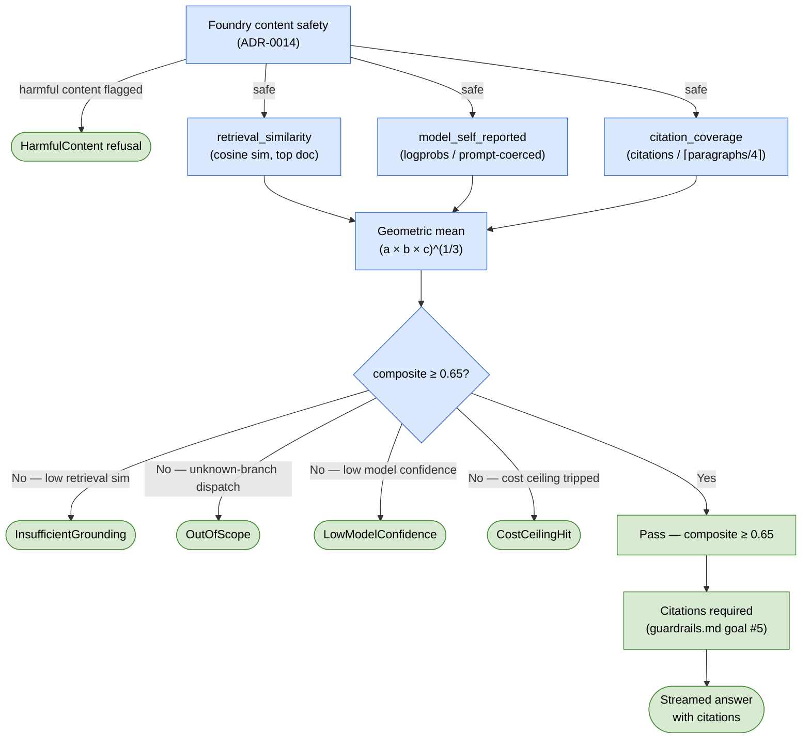

# 0017 — Confidence-threshold refusal: geometric-mean confidence + categorized "I don't know"

**Status:** Accepted
**Date:** 2026-05-04

## Context

`project_phase2_architecture_decisions.md` (private project memory, not in this repo)
locks the principle that the Wizard must refuse rather than
fabricate when confidence is low: *"Manual wiring questions can be
physically dangerous; threshold-driven refusal is non-negotiable."*
[`guardrails.md`](../guardrails.md) goal #5 (provenance is sacred)
extends the principle: a Wizard answer without a clickable citation
back to source is a 🔴 — and the only correct response when no
citable grounding is available is "I don't know."

Phase 3 lands the orchestrator. The refusal-or-answer decision lives
in our code (the `IAiRouter`), wrapped around Foundry agent
responses — Foundry agents themselves don't natively support
threshold-driven refusal. We need a recorded definition of
"confidence" and a recorded threshold value, both calibrated against
the eval set.

## Decision

The diagram below shows how the three confidence signals flow through the pipeline to produce either a categorized refusal or a citation-backed streamed answer.



### Confidence calculation

Per-answer confidence is the **geometric mean** of three normalized
signals in `[0,1]`:

| Signal | Definition | Source |
| --- | --- | --- |
| `retrieval_similarity` | Highest cosine similarity between question embedding and any retrieved-document embedding | Phase 4 RAG; Phase 3 stub returns `1.0` for OPDB-grounded answers, `0.5` if no machine matched |
| `model_self_reported` | Agent's self-rated confidence | Logprobs where Foundry exposes them (chat completion `logprobs` flag); otherwise from a `Rate your confidence 0-1:` suffix coerced into the agent prompt; clipped to `[0,1]` |
| `citation_coverage` | Fraction of factual claims in the answer that have at least one citation | Counted in the post-process step; falls to `0.0` if the answer cites zero sources |

Geometric mean (`(a*b*c)^(1/3)`) chosen over arithmetic mean so
**any signal near zero pulls the composite to near zero**. A
plausible-sounding answer with zero citations should not pass; a
high-citation-coverage answer with low retrieval similarity should
also not pass. Arithmetic mean would average them out.

### Threshold value

**Initial draft: 0.65.** Calibrated at H2 (operational hand-off,
scope item 13 in build-spec § Phase 3) against the eval-set
distribution. Calibration target:

- `citation_precision ≥ 0.7`
- `citation_recall ≥ 0.6`
- `over_eager_refusal_rate ≤ 0.20` (refusals on questions with
  `acceptable_refusal == false`)

If the calibrated value moves >0.05 from the initial draft, this
ADR gets a follow-up entry recording the post-calibration value
(append-only; original 0.65 stays in history).

### Refusal response shape

When refusal triggers, return a `WizardAnswer` with:

```csharp
WizardAnswer.IsRefusal == true
WizardAnswer.RefusalCategory == one of
    InsufficientGrounding   // retrieval_similarity below floor
    OutOfScope              // Wizard agent dispatched to "unknown" branch
    LowModelConfidence      // model_self_reported below floor
    CostCeilingHit          // per-call ceiling tripped (ADR-0015)
    HarmfulContent          // Foundry content safety blocked the response
WizardAnswer.Text == "I don't know — <category-specific reason>"
WizardAnswer.SuggestedRephrase == optional invitation
WizardAnswer.Citations == [] (empty, never fabricated)
```

The five categories are *what we'd want to know* when investigating
a refusal in production logs, not what would maximize user-facing
politeness. UX text on top of these categories is Phase 5 (UI).

### Layered with Foundry content safety

Per [ADR-0014](0014-microsoft-foundry-orchestration.md), each
`AIAgent` is constructed with Foundry's content-safety filter and
prompt-injection shields enabled. Foundry returns harmful-content
refusals *before* our confidence-calculation layer runs — the
agent framework surfaces them through the response's safety verdict
metadata, which `IAiRouter` reads and translates into a refusal
with category `HarmfulContent`, distinct from confidence-driven
refusals. This separation matters in production: a spike in
`HarmfulContent` refusals means our prompts or grounding are
producing flagged content (or someone is probing); a spike in
`InsufficientGrounding` means retrieval is degraded. Same surface
(refusal), different root causes.

The `pinwiz.ai.refusals` counter (per
[ADR-0015](0015-cost-routing-and-semantic-cache.md)) is tagged
with the category, so the dashboard distinction is mechanical
rather than narrative.

### Telemetry

`pinwiz.ai.refusals` counter, tagged with `category` + `sub_agent` +
`prompt_version`. Refusal rate per category is observable in Log
Analytics + (post-deployPhase2) App Insights.

## Consequences

**Positive:**

- The refusal decision is a single, auditable code path
  (`ConfidenceCalculator.IsConfident(...)` returning `bool`). A
  reviewer can read the policy in one method.
- Geometric-mean composition means we don't need to argue about
  which signal "matters most" — they all matter equally, and
  near-zero in any one signal triggers refusal.
- Calibrating against the eval set produces a defensible threshold
  number rather than an arbitrary one. The H2 hand-off captures the
  calibration data; the post-calibration value is recorded in this
  ADR.
- Categorized refusals are the right surface for prod debugging:
  `pinwiz.ai.refusals{category=InsufficientGrounding}` spiking
  signals retrieval drift; `category=OutOfScope` spiking signals
  classifier drift.
- Provenance is preserved: a refusal returns empty `Citations`, never
  fabricated ones. This is the safety invariant
  ([guardrails.md](../guardrails.md) goal #5).

**Negative:**

- Threshold value is a single number across all sub-agents. If
  post-launch eval shows Repair needs a different threshold than
  Rules (e.g., because Repair's grounding has different
  characteristics), the refactor adds per-agent thresholds via
  `AiOptions.PerAgentThresholds[<agent_name>]`. Recorded as a
  Phase 5+ revisit point in the calibration retrospective at H2.
- `model_self_reported` via logprobs is partially supported by
  Foundry agents — the underlying model exposes logprobs, but
  Foundry's agent abstraction may not always surface them. The
  fallback (prompt-coerced "rate your confidence 0-1") is less
  reliable but always available. If the prompt-coercion fallback
  produces noisy values, switch to a calibration-temperature-style
  approach (Phase 6+).
- Geometric-mean's "any zero kills it" property is a feature for
  safety but a bug for showcase polish: a perfectly grounded answer
  with one missing citation could refuse. The
  `citation_coverage` signal includes a +epsilon floor (`max(actual,
  0.05)`) so a missing citation downweights but doesn't zero-out.
  Tunable, documented in code.
- Refusal rate is itself a metric to watch: too low = silent
  fabrication risk, too high = unhelpful Wizard. The eval-set
  `over_eager_refusal_rate` is the calibration check; production
  monitoring is Phase 6.

## Alternatives considered

- **Single-signal threshold** (e.g., model logprobs only). Rejected:
  one signal can be confidently wrong; three signals together are
  harder to fool.
- **Arithmetic mean** of the three signals. Rejected: zero-signals
  get averaged into "okay," which is exactly the failure mode this
  ADR exists to prevent.
- **Hard-coded threshold** with no calibration. Rejected:
  unprincipled, can't be defended in a showcase ADR. Calibration
  against the eval set is small effort and produces a defensible
  number.
- **No refusal mechanism** (always answer). Rejected:
  `project_phase2_architecture_decisions.md` (private project memory, not in this repo)
  locked refusal as non-negotiable for safety reasons. This ADR
  honors that lock.
- **Foundry-side refusal only** (drop our confidence layer entirely).
  Rejected: Foundry's filters refuse on harmful content, not on
  low-confidence grounding. The provenance-sacred invariant
  (`guardrails.md` goal #5) requires refusal when we lack citable
  grounding, which Foundry has no opinion about. Confidence-driven
  refusal is our orchestrator's responsibility, layered on top of
  Foundry's content safety (kept enabled per
  [ADR-0014](0014-microsoft-foundry-orchestration.md)). Both
  produce refusals; both surface via `RefusalCategory`.
- **One refusal category instead of four.** Rejected: production
  debugging needs the cause, not just the fact of refusal.

## Follow-up 2026-06-10 — `citation_coverage` saturating expectation

The Phase 3 approximation of `citation_coverage` ("fraction of factual
claims with at least one citation") was `min(1, citations /
paragraphs)`. Citations are extracted from tool traces — answer-level
artifacts with no paragraph attribution — so the formula demanded a
per-paragraph resolution the data does not carry. Observed effect
(eval `wizard.20260610T094029Z.json`): two well-grounded answers
refused on coverage alone — ev-valuation-0001 (`r=1.00 m=0.85
c=0.17`, composite 0.521) and ev-repair-0001 (`r=1.00 m=0.85 c=0.20`,
composite 0.554). Both count against this ADR's own
`over_eager_refusal_rate ≤ 0.20` calibration target.

**Refined formula:** `min(1, citations / ceil(paragraphs / 4))` — one
citation covers up to four paragraphs
(`ParagraphsPerExpectedCitation = 4`, the single tuning knob in
`ConfidenceCalculator`). A 6-paragraph single-citation answer now
scores 0.5 (composite ≈ 0.75, answers). The single-citation refusal
boundary sits at exactly 13 paragraphs: 12 paragraphs → coverage
0.333 → composite 0.657 (passes); 13 paragraphs → coverage 0.25 →
composite 0.597 (refuses) — the thin-grounding safety gradient is
preserved. Zero-citation answers are unchanged (0.0 → epsilon
floor → refusal); the "plausible answer with zero citations must not
pass" invariant is untouched.

Alternatives rejected at this revision: binary presence (collapses
the safety gradient entirely) and entity-level coverage (distinct
cited machines ÷ machines named in text — most faithful to the
original definition but requires machine-name detection in prose;
revisit alongside claim-level extraction, Phase 6+).

Design spec:
[`docs/superpowers/specs/2026-06-10-citation-coverage-saturation-design.md`](../superpowers/specs/2026-06-10-citation-coverage-saturation-design.md).
Verification eval results recorded in the implementing PR.

## References

- [ADR-0014](0014-microsoft-foundry-orchestration.md) — the Foundry
  orchestrator the refusal logic wraps
- [ADR-0015](0015-cost-routing-and-semantic-cache.md) — the
  `CostCeilingHit` refusal category, also defined here
- [ADR-0016](0016-evaluation-harness.md) — the eval harness that
  calibrates the threshold at H2
- [build-spec.md § Phase 3](../build-spec.md) — scope item 9
  (refusal implementation) and item 13 (H2 calibration)
- [guardrails.md](../guardrails.md) goal #5 — provenance / refusal
  invariant
- `project_phase2_architecture_decisions.md` (memory) — original
  refusal lock
