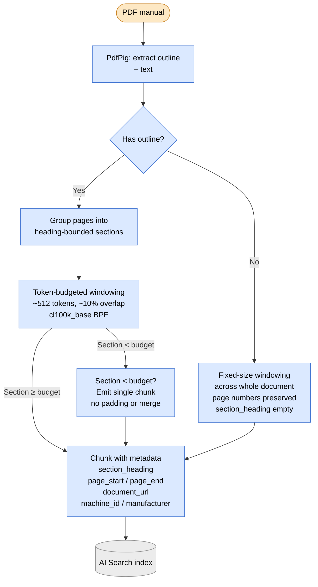

# 0019 — Hybrid chunking: token-budgeted windows within heading-bounded sections

**Status:** Accepted
**Date:** 2026-05-07

## Context

Phase 4 ingests PDF manuals (and synthesized metadata cards) into
AI Search. Citation precision depends on chunks that are bounded
enough to cite a specific page/section, but big enough to carry
semantic context for retrieval. Two pure approaches were considered
during Phase 4 design:

- **Page-aware only** (1 chunk per page) — produces uneven chunks
  (some pages dense, some sparse), and fixes citation granularity
  at "page X" rather than "page X, § Foo Mode rules". Fine for
  thin user manuals; weak for the long, heading-rich Stern manuals
  in the curated subset.
- **Token-budgeted only** (e.g., 512-token windows across the doc)
  — produces even chunks but multi-page citation spans, which hurt
  the showcase narrative ("here's where exactly that's
  documented") and the page-anchor differentiator over the Phase 3
  OPDB-URL-only citations.

Phase 4's design conversation (2026-05-07) called for the hybrid
that gives both clean per-section citations AND even-sized chunks
for retrieval consistency.

## Decision

Hybrid chunking. Token-budgeted chunks within heading-bounded
sections.

The following diagram traces the algorithm from PDF input through section
discovery, the has-outline branch, token-budgeted windowing, and chunk
metadata assembly to AI Search upsert.

### Algorithm

1. **Section discovery.** Use PdfPig's outline tree as the section
   delimiter. Each outline entry (chapter, section, sub-section)
   becomes a section boundary. Pages inside a section group
   together; chunks never cross a section boundary.
2. **No-outline fallback.** If a PDF has no outline (some scanned
   manuals, some boutique docs), fall back to fixed-size windowing
   across the whole document. Page numbers stay preserved per
   chunk; section heading is empty.
3. **Token-budgeted windowing inside a section.** Within a
   bounded section, tokenize the section text and split into
   ~512-token chunks with ~10% overlap. Tokenizer:
   `Microsoft.ML.Tokenizers` with `cl100k_base` BPE — matches the
   embedding model's tokenizer per [ADR-0020](0020-embedding-model.md).
4. **Small-section handling.** Sections shorter than the budget
   produce a single chunk smaller than 512 tokens. No padding, no
   merging across sections.
5. **Per-chunk metadata** preserved on every chunk:
   `section_heading`, `page_start`, `page_end` (a chunk can span
   pages within a section, e.g. tables that flow), `document_url`,
   `machine_id`, `manufacturer`. Schema lives in
   [ADR-0021](0021-ai-search-index-schema.md).

### Citation surface

Citations resolve as `<document>.pdf p.42–43, § Foo Mode rules`.
The page range comes from `page_start` / `page_end`; the section
name comes from `section_heading`. This is the differentiator vs.
Phase 3's OPDB-URL-only citations.

## Consequences

**Positive:**

- Page-anchor citations are clean AND specific — readers click
  through to the actual relevant pages of a manual, not "this PDF,
  somewhere".
- Even chunks for retrieval. Similar token counts mean similar
  embedding behavior; vector search isn't biased toward long
  documents whose chunks happen to be denser.
- Heading-bounded sections preserve semantic coherence. A chunk
  doesn't accidentally span "Coil Replacement" and "Switch
  Calibration" — a retrieval hit on either topic returns text
  about that one topic only.
- Tokenizer alignment with the embedding model means token counts
  in chunks match what the embedding model sees; we don't
  over-budget or under-budget.

**Negative:**

- More complex than either pure approach (PdfPig outline parsing +
  tokenizer + section grouping). Worth it for citation precision.
- Section boundaries depend on PDF outline quality. Stern manuals
  have clean outlines; some boutique manuals and CGC remake docs
  may not. The no-outline fallback covers this but loses the
  section-name citation surface — a chunk from a no-outline doc
  cites only "p.42–43" without the heading. Acceptable; logs
  flag no-outline docs so coverage is observable.
- Some sections produce very small chunks (< 100 tokens). Vector
  retrieval performs worse on very short text. Calibration at H3
  identifies any pathological short-chunk patterns; if rate is
  high, ADR-0019 follow-up considers minimum chunk size with
  cross-section merge (constrained to same document).

## Alternatives considered

- **Page-aware only.** Rejected — citation granularity too coarse
  for the showcase posture; uneven chunk sizes hurt retrieval
  consistency.
- **Token-budgeted only.** Rejected — multi-page citation spans
  hurt the page-anchor narrative; chunks cross semantic
  boundaries.
- **Heading-aware only** (no token budget; one chunk per section).
  Rejected — long sections produce multi-page chunks anyway, AND
  embedding behavior degrades on very long inputs.
- **LangChain `RecursiveCharacterTextSplitter`-style splitters.**
  Rejected — we don't run LangChain in .NET; PdfPig +
  Microsoft.ML.Tokenizers cover the same ground without the
  dependency.
- **Semantic chunking** (cluster-then-split based on embedding
  distance between sentences). Rejected for v1 — expensive
  (requires pre-embedding the entire doc to detect cluster
  boundaries); revisit if v1 retrieval quality is poor.
- **Sliding-window-only without section bounds.** Rejected —
  cross-section bleed is the failure mode this ADR exists to
  prevent.

## References

- [ADR-0020](0020-embedding-model.md) — embedding model and
  tokenizer alignment
- [ADR-0021](0021-ai-search-index-schema.md) — index schema where
  the chunk fields land
- [ADR-0022](0022-citation-extraction.md) — how chunk metadata
  becomes a Wizard citation
- [build-spec.md § Phase 4](../build-spec.md) — scope items 1, 15
- [guardrails.md](../guardrails.md) goal #5 — provenance / page
  anchors as the showcase differentiator
