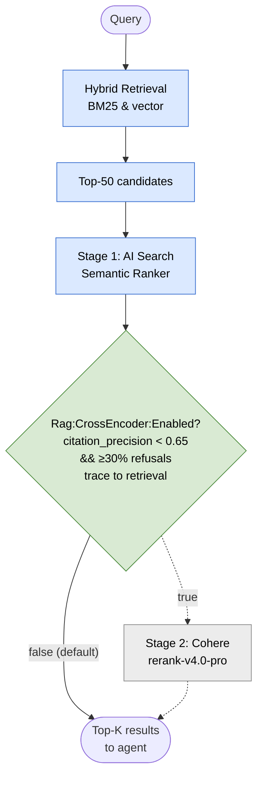

# 0024 — Two-stage re-ranking: AI Search semantic ranker now, cross-encoder layer deferred behind H3 gate

**Status:** Accepted
**Date:** 2026-05-07

## Context

[ADR-0021](0021-ai-search-index-schema.md) enables AI Search's
built-in semantic ranker as the Phase 4 default. Industry
best-practice for high-precision RAG goes one step further: a
**two-stage re-rank** — top-k vector + keyword retrieval, then a
cross-encoder model that scores `(query, candidate)` pairs
directly and re-orders the top results. Cohere Rerank, BGE-Reranker,
and Azure AI Foundry's `Text-Embedding-Reranker` model card all
fit this shape.

Without a cross-encoder layer, retrieval precision plateaus around
what hybrid (vector + semantic + keyword) alone delivers. For a
customer-facing showcase whose differentiator is citation
fidelity, retrieval precision is the load-bearing metric — every
percentage point in `citation_precision` traces back through the
retrieval surface to the chunks the agent gets to see.

Phase 4 design conversation (2026-05-07) flagged the question
explicitly: *"are we cutting anything that changes the end-state
goal?"* The honest answer was that the architecture is correct
but a re-rank ADR was missing — implementation could defer, but
the decision should be locked in repo from Phase 4 forward.

## Decision

The pipeline runs two re-ranking stages; the second is provisioned but disabled pending the gate condition below.



### Phase 4 v1: AI Search semantic ranker is the re-rank layer

The semantic ranker enabled by [ADR-0021](0021-ai-search-index-schema.md)
re-orders the top-50 hybrid retrieval results using Microsoft's
deep-learning model trained for query–document relevance. It is
*a* re-ranker — just not a cross-encoder. For Phase 4's curated
subset (~7 manuals, ~5K–10K chunks), the semantic ranker is
sufficient based on Microsoft's published benchmarks for similar
corpus shapes.

### Cross-encoder layer (second stage) is deferred behind an H3 quality gate

If H3 final eval baseline (build-spec.md § Phase 4 scope item 24)
reports `citation_precision < 0.65` AND ≥30% of refusals trace
back to retrieval-side root causes (analyzed via the per-question
trace correlation in eval results), implementation lands in
Phase 4.5 or as a Phase 4 fix-up PR — whichever is faster. The
trigger is data-driven: H3 numbers tell us whether the layer is
needed.

### Locked implementation path (when triggered)

If the H3 gate triggers, the implementation choice is **Cohere
Rerank API via Foundry connection**, not a self-hosted
cross-encoder:

- Cohere Rerank-v3 (`rerank-english-v3.0`) accessible through
  Azure AI Foundry's external-model connection surface
  (Foundry's Connections feature supports Cohere as a first-class
  external provider)
- Cost: ~$1 per 1,000 reranks of up to 100 documents each. At
  even high-volume scale (~1K Wizard queries/day each reranking
  ~50 chunks), monthly cost is ~$30, well within the $300–$400/mo
  cap headroom
- Integration shape: `ICrossEncoderReranker` abstraction in
  `Application/Ai/Retrieval/`; `CohereRerankerImpl` in
  `Infrastructure`; injected into `AiSearchRagRetriever` (per
  [ADR-0021](0021-ai-search-index-schema.md)) which calls it
  on the top-K vector+semantic results before returning to
  `IAiRouter`
- Configuration: `Rag:CrossEncoder:Enabled` flag; default
  `false` until H3 gate triggers, then `true`. **The flag is
  part of the deferred implementation surface, not Phase 4 v1
  code.** Phase 4 v1 has zero `Rag:CrossEncoder:*` reads —
  the flag and its options class land in the same PR as the
  Cohere integration code if/when the gate triggers. Reviewers
  running the dead-config grep should treat this ADR as the
  documentation that explains why no Phase 4 v1 reads exist.

## Consequences

**Positive:**

- The re-rank decision is a recorded ADR, not an unspoken assumption.
  A reviewer reading the repo sees that Phase 4's retrieval ceiling
  was deliberately measured against the cross-encoder option, not
  ignored.
- H3 gate is data-driven, not opinion-driven. The decision to add
  the cross-encoder rests on actual `citation_precision` numbers,
  not on team intuition.
- Locked implementation path means there's no "what reranker do
  we use?" debate when the gate triggers. Cohere Rerank via
  Foundry connection is the choice; configuration flag is
  pre-built. Lights-out switch-on.
- Cost framework is documented up-front. The $30/mo projected
  cost is well within the cap; the ADR notes that explicitly so
  budget conversations don't rehash it.

**Negative:**

- **Implementation deferral means H3 may surface a precision gap
  that we'd then close by adding the layer mid-flight.** If the
  gate triggers, Phase 4 closeout includes a +1 PR for the
  Cohere integration. Acceptable trade — the deferral saves
  scope if the gate doesn't trigger.
- **Cohere is an external provider** (cross-tenant, even via
  Foundry's connection abstraction). For long-term enterprise
  posture, dependency on a non-Microsoft model surface may be
  considered a vendor-lock-in concern. Foundry-hosted reranker
  fallback path mitigates this if/when Microsoft ships the
  model.
- **Semantic ranker is "good enough" until proven otherwise** —
  but Microsoft doesn't publish corpus-shape-specific benchmarks
  for technical PDF manuals. The H3 number is the first
  empirical data point; cost of being wrong is one extra PR.

## Alternatives considered

**Phase 4 stance — should we ship this layer now?**

- **Implement cross-encoder layer in Phase 4 unconditionally.**
  Rejected — adds scope to Phase 4 without evidence it's needed;
  Phase 4 already grew by bulletins (decision 2026-05-07);
  preserve the showcase wall-time budget.
- **Hard defer to Phase 4.5 with no Phase 4 ADR.** Rejected —
  the *decision* to defer is itself architectural; without an
  ADR the decision is invisible to a reviewer 6 months later.
- **Add a re-ranking layer that's "off by default but
  configurable on" to test in dev.** Acceptable as part of the
  locked implementation path (above); not the primary v1
  stance.

**Implementation choice — when the gate triggers, what do we
use?**

- **Self-hosted BGE-Reranker on ACA.** Rejected — adds GPU
  compute cost (~$200–$400/mo), operational burden (model
  versioning, container rebuilds), and runs counter to the
  managed-Azure showcase posture per
  [ADR-0014](0014-microsoft-foundry-orchestration.md).
- **Foundry-hosted reranker model deployment** (similar to
  `text-embedding-3-large`). Reserved as a fallback path: if
  Microsoft ships a first-class reranker model on Foundry by
  H3, it preempts Cohere. Cost projection comparable.
- **Use Foundry's connection abstraction for self-hosted
  reranker.** Rejected as initial path — operational burden
  doesn't justify the marginal gain over Cohere's managed
  service for v1.
- **No cross-encoder at all (semantic ranker only forever).**
  Rejected — the H3 gate exists to determine if this is
  acceptable; without the gate the question stays open.

## Phase 4.5 H5 outcome (2026-05-26)

H5 eval run: `citation_precision=0.478` on the Phase 4.5 realigned eval set (30 questions, 7 curated machines). Results file: `data/eval/results/wizard.20260526T143313Z.json`.

Full H5 metrics: `citation_recall=0.500`, `citation_coverage=0.533`, `subagent_accuracy=0.167`, `refusal_correctness=0.933`.

Gate status: **Triggered** (`citation_precision=0.478 < 0.50`).

Proceeding to W4 fix-up PR: wire `CohereRerankReranker` per the locked implementation path above. Cohere Rerank-v3 via Foundry connection; `ICrossEncoderReranker` abstraction in `Application/Ai/Retrieval/`; `CohereRerankReranker` in `Infrastructure`; injected into `AiSearchRagRetriever`. Re-run eval as H5b to confirm precision lift.

## Amendment (2026-06-29) — Cohere via Foundry MaaS deployment, not an external connection

**Status:** Accepted. Supersedes the "external `api.cohere.com` connection" mechanism from the original Decision; the gate (`citation_precision ≥ 0.50`) and everything else are unchanged.

The original implementation provisioned Cohere Rerank as a Foundry **external-model connection** to `api.cohere.com`, authenticated with a Cohere.com API key. That carried an irreducible non-IaC step — obtaining and storing a third-party SaaS credential — which conflicts with the showcase's all-infrastructure-in-IaC posture and the account's `disableLocalAuth: true` stance.

Cohere Rerank is available in the Azure AI Foundry model catalog as a **first-class MaaS model deployment** (`Microsoft.CognitiveServices/accounts/deployments`, `model.format: 'Cohere'`), billed through Azure Marketplace. We deploy it exactly like the existing `gpt-4o` / `text-embedding-3-large` deployments. The live eastus2 catalog (verified 2026-06-29) offers `Cohere-rerank-v4.0-fast` and `Cohere-rerank-v4.0-pro` (v3.5 from the initial design is not offered in eastus2); we deploy **`Cohere-rerank-v4.0-pro`** for reranking quality and to avoid the v4.0-fast keyless-auth gap below. Consequences:

- **Fully IaC, no external account or key.** The model is a Bicep resource (`cohereRerankDeployment`, gated by `deployCohereRerank`); billing is Azure-native pay-per-token (~$30/mo at 1K queries/day, within cap).
- **Keyless inference.** `CohereRerankReranker` POSTs the native Cohere v2 rerank body — unchanged — to the account's native route `https://<account>.services.ai.azure.com/providers/cohere/v2/rerank`, authenticated by the ACA managed identity (already holds `Azure AI User` on the Foundry account). No secret anywhere; honors `disableLocalAuth: true`.
- **Known risk (verify at H5b):** keyless Entra auth on the native Cohere rerank route has community reports of failures on `Cohere-rerank-v4.0-fast`; we deploy `v4.0-pro` partly to avoid it, but pro's keyless status is unreported (not in official limitation docs). Validate the H5b run end-to-end before flipping `Rag:CrossEncoder:Enabled` to production. Fallback if keyless proves unsupported: a keyed path, which would require revisiting the account's `disableLocalAuth` posture.
- **First-enable prereq:** the deploying identity must have accepted the Cohere Marketplace terms; confirm the exact deployed model name/version against the live catalog (`az cognitiveservices model list`).

## Phase 4.5 H5b outcome (2026-06-30) — reranker enabled, but the v2 set can't measure it

H5b ran the reranker (`Cohere-rerank-v4.0-pro`, keyless) against `wizard.v2.jsonl`.
The amendment's keyless risk is **resolved**: keyless Entra auth on the native Cohere
rerank route works end-to-end on `v4.0-pro` (two live reranker bugs fixed in PR #586 —
`400 no_content_length_header` → buffered `StringContent`; `429` capacity-1 → 20).

But the A/B could not measure the reranker's value:

| Arm | citation_precision (mean of 3 runs, ~37q each) |
| --- | --- |
| Control (reranker off) | 0.965 |
| Treatment (reranker on) | 0.963 |

The v2 set is **near-ceiling** on `citation_precision`: its `acceptable_citation_sets`
realignment (PR #466) made it easy enough that first-stage AI Search retrieval already
puts the right chunk in the top-5 the agent sees, so reranking has nothing to reorder.
The original H5 `0.478` that triggered this ADR was on the **old, misaligned** set.
Conclusion: we had no instrument that could tell us whether the reranker helps.

## Phase 4.5 H5b-hard outcome (2026-06-30) — reranker-sensitive instrument built; no measurable benefit

To get an instrument that *can* see a reranker effect, we built a **reranker-sensitive
hard eval** (`data/eval/wizard.hard.v1.jsonl`, 62 questions) plus a first-stage
**retrieval-rank probe** (`--probe-retrieval`) and slice-aware harness scoring (PR #587).
A question is reranker-sensitive iff its gold chunk lands in first-stage positions
`(TopN=5, TopK=10]` — retrieved, but below the top-5 cutoff, so reranking *could* promote
it into view. The headline metric is `citation_recall`, not precision (precision is at
ceiling on both arms — exactly the v2 blindness above).

**Finding 1 — reranker-sensitivity is structurally rare on this corpus.** The probe
(reranker off, live `pinwiz-rag-v1`, 27,572 chunks / 306 machine_ids) classified the 62
deliberately-hard, adversarially-phrased questions:

```text
easy=58   reranker-sensitive=3   retrieval-miss=1     (49/62 at first-stage rank 1)
```

First-stage hybrid+semantic retrieval already resolves the correct **machine** into the
agent's top-5 for **94%** of even hand-engineered hard questions. Because citations are
machine-level and gold machines carry dozens–hundreds of chunks, "first gold-machine chunk
at rank ≤5" is near-guaranteed once retrieval finds the machine at all. The only reliable
way to push a gold to rank 6–10 is a *low-chunk* gold (e.g. Monster Bash, 22 chunks)
against a *theme-similar high-chunk* distractor (The Munsters, 185) named as a contrastive
foil. This **independently explains the v2 null**: there is little machine-level reordering
headroom for the reranker.

**Finding 2 — on the reranker-sensitive slice, recall is routing-dominated, not
retrieval-dominated.** A confirmatory A/B on the 3 reranker-sensitive rows (reranker off
vs on, 2 runs each, `Cohere-rerank-v4.0-pro`):

| Arm | citation_recall (n=3) | per-question driver |
| --- | --- | --- |
| Control (off) | 0.333, 0.333 | recall=1 **iff** routed to `Rules` (searches corpus, cites); recall=0 when routed to `Wizard` (refuses) |
| Treatment (on) | 0.333, 0.000 | identical pattern — routing, not rerank, decides the outcome |

When a question routed to `Rules` it scored recall=1 in **both** arms; when it routed to
`Wizard` it refused and scored 0 in **both** arms. The off-vs-on difference is pure
sub-agent-routing noise on n=3 (`subagent_accuracy ≈ 0.33`). These confusable cross-machine
prompts route to `Wizard` ~⅔ of the time and refuse rather than searching the corpus; and
where the agent *does* search, it often self-filters retrieval to a single machine
(observed `machine=GRBE4-MJ9rE`), bypassing cross-machine reranking entirely. The reranker
had no opportunity to change recall.

**Decision: leave `Rag:CrossEncoder:Enabled=false` in production.** There is no measurable
citation-recall benefit on the corpus + pipeline as they stand, and the gate metric
(`citation_precision ≥ 0.50`) is comfortably met without it (0.96 on v2). The reranker
deployment stays provisioned and is verified working end-to-end (keyless `v4.0-pro`), so
re-enabling is a one-flag change — but it must be driven by evidence. **Re-evaluate the
flag when any of:** (i) the corpus grows denser / introduces chunk-level (passage-anchored)
citations, where intra-machine passage ordering — which this machine-level instrument
cannot see — becomes the metric; (ii) sub-agent routing of confusable cross-machine
questions improves (the actual recall bottleneck this surfaced — logged as a follow-up);
or (iii) the `reranker-sensitive` slice of `wizard.hard.v1.jsonl` grows large enough
(~6+ rows) for a powered slice A/B.

> **Production-enablement prerequisite (unchanged):** the deployed ACA apps still carry the
> pre-#586 reranker code (they are `Enabled=false`, so prod is unaffected). If the flag is
> ever flipped on, deploy the #586-fixed image first.

## References

- [ADR-0014](0014-microsoft-foundry-orchestration.md) —
  managed-Azure showcase posture
- [ADR-0021](0021-ai-search-index-schema.md) — first-stage
  re-ranking via the AI Search semantic ranker
- [ADR-0022](0022-citation-extraction.md) — citations downstream
  of the re-ranked retrieval set
- [build-spec.md § Phase 4](../build-spec.md) — H3 gate; risk
  P4-R7 (semantic ranker A/B); scope item 24 (H3 final eval +
  threshold calibration evaluating the ADR-0024 cross-encoder
  gate)
- [build-spec.md § Phase 4.5](../build-spec.md) — owns
  implementation if H3 gate triggers and Phase 4 closeout
  defers
- Phase 4 design conversation 2026-05-07 — explicit ask to lock
  the path even if implementation defers
