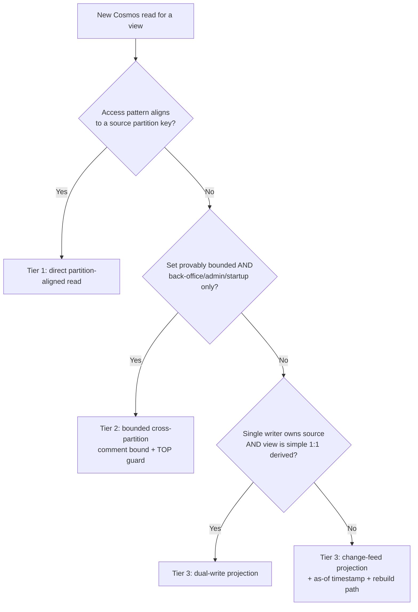

# ADR-0036 — Cosmos read-access standard

**Status:** Accepted
**Date:** 2026-06-15
**Deciders:** Jim Keeley

---

## Context

The app is acquiring many read-heavy "data screens" (admin/QA dashboards, public
catalog browsing, user activity). Each one needs a defensible answer to "which
partition does this read hit, and is that affordable at scale." Without a standard,
screens drift into cross-partition `SELECT *` fan-outs that pass in dev and degrade
in production.

This is not a new direction. **ADR-0025 already chose it**: *"Cosmos as primary
document store with targeted CQRS-style materialized views per query pattern. NOT
full event sourcing,"* and it explicitly rejected full event sourcing on `machines`
(point-lookup-shaped reads; OPDB is the upstream source of truth, not authored state;
the event-log + replay + snapshot tax is unearned). ADR-0025 also pre-declared that
the second projection over `machines` should adopt the change-feed hosted-service
abstraction the RAG worker already uses.

ADR-0036 **generalizes that machines-scoped decision into a standing, enforced project
standard.** It does not supersede ADR-0025; it extends and makes explicit what ADR-0025
already decided.

Current data-access inventory (2026-06-15) that the standard is calibrated against:

- **Source-of-truth containers:** `machines` (`/manufacturer`), `scraped_documents`
  (`/machine_id`), `scraped_documents_raw` (`/document_id`), `ingestion_sources`
  (`/partitionKey`="config"), `link_overrides` (`/source_pattern`), `admin_settings`
  (`/key`), `admin_prompts` (`/agent_name`), `featured_machines` (`/slug`).
- **Existing projections:** `machine_title_lookups` (`/normalizedTitle`, dual-write off
  `machines`), `rag_index_state` (`/document_id`, pipeline-internal), and the Azure AI
  Search index (change-feed projection of `scraped_documents`).
- **Reusable change-feed abstraction:** `CosmosChangeFeedHostedService<T>` +
  `ICosmosChangeFeedHandler<T>` (RagIngestionWorker).
- **No event sourcing exists** in the codebase (confirmed).

---

## Decision

Every Cosmos read is classified into one of four tiers. A read's tier is declared in
a comment on the repository method.

**Tier 0 — Source of truth.** Containers partitioned by their dominant write/identity
key. Unchanged.

**Tier 1 — Direct partition-aligned read (default).** Any view that aligns to a source
partition key reads it directly: point read or single-partition scan (`pk` supplied).
No projection needed. *Examples: machines for a manufacturer, docs for a machine,
prompt versions for an agent.*

**Tier 2 — Bounded cross-partition (allowed, justified).** A `pk: null` query is
permitted **only** for back-office / admin / startup paths over a **provably bounded**
set, and **must** carry a comment stating the bound and a `TOP`/limit guard. Not
permitted for user-facing or unbounded reads. *Examples: featured machines (~6), link
overrides (<1k), admin settings (tens).*

**Tier 3 — Projection / read model (required)** when the read access pattern does not
match the source PK **and** the set is large/unbounded, **or** the view is an aggregate
across many source docs, **or** it is a user-facing/scale read. Two implementation
styles, with a selection rule:

- **Dual-write projection** — when a *single writer* owns the source and the view is a
  simple derived (≈1:1) shape; synchronous, immediately consistent. *Example:
  `machine_title_lookups`.*
- **Change-feed projection** — when the source has *multiple writers*, high change
  volume, the view is an *aggregate*, or rebuildability matters. Reuse
  `CosmosChangeFeedHostedService<T>` + `ICosmosChangeFeedHandler<T>`. Eventual-
  consistent; the screen surfaces an "as of" timestamp; rebuildable by lease reset +
  replay. *Example: RAG ingestion pipeline.*

**Event sourcing — not the data model.** Reserved for a *future* subsystem whose value
*is* its history (e.g. an admin-action audit log, or user activity/scoring). When one
appears it gets its own ADR and is implemented as an event container + change-feed
projections — i.e. it *composes with* Tier 3, never a global rewrite.

### Selection flow

Tier 0 = the source container itself; the flow below classifies *reads* against it.

### Enforcement

- Each repository read method declares its tier in a comment.
- Any `pk: null` query must state its bound + justification (Tier 2) or be replaced by
  a Tier 3 projection.
- User-facing aggregate views must be projection-backed.
- Cross-partition queries route through `StreamCrossPartitionAsync`; an architecture
  test (`CrossPartitionQueryAllowListTests`) pins every call site to a reviewed
  allow-list, so a new cross-partition query fails the build until consciously reviewed
  and added.

---

## Consequences

**Positive:** Every data screen has a defensible, partition-aligned (or
projection-backed) read. Cross-partition becomes a reviewed exception, not a default.
The standard reuses abstractions already in the repo. Strong showcase narrative
(textbook CQRS on Cosmos). Generalizes ADR-0025 rather than contradicting it.

**Negative:** Tier 3 projections add eventual-consistency lag (mitigated by an "as of"
stamp on QA screens) and a rebuild path to maintain. Some up-front ceremony (tier
declaration, architecture test).

**Neutral:** Existing Tier 2 sites (featured machines, link overrides, admin settings)
are grandfathered with explicit bound comments; no rewrite required.

---

## References

- ADR-0007 — Per-manufacturer ingestion sources are Cosmos data, not Bicep config
- ADR-0012 — Cosmos schema CRUD via ARM, item CRUD via data-plane SDK
- ADR-0025 — Cosmos for User Delight (the decision this ADR generalizes; not superseded)
- ADR-0031 (Proposed) — Document→Machine linking source of truth (rebuildable projection pattern)

---

## Amendment (2026-06-18) — catalog-stats count reads a narrow projection, not the write model

**Context.** The `catalog_stats` Tier-3 projection is maintained two ways: the
change-feed consumer (`CatalogStatsChangeFeedHandler`) and the rebuild backstop
(`CatalogStatsRebuildService`). Both count `document_type` per machine by
streaming a machine's `scraped_documents` partition. Originally both issued
`SELECT * FROM c` and deserialized the full write-model `ScrapedDocumentRecord`.

**Problem (live incident, 2026-06-19).** `ScrapedDocumentRecord` carries `required`
write-side invariants — e.g. `edition_scope`, added in #318. Documents written
before #318 lack the field, so deserializing them into the write model throws
`JsonException`. With containers freshly created and the change-feed starting from
the beginning, the catalog-stats `BackgroundService` hit a pre-#318 document and
threw → `HostOptions.BackgroundServiceExceptionBehavior=StopHost` crash-looped the
RAG worker, and `--rebuild-catalog-stats` failed outright. Net effect: empty
`/admin/machines` and stalled RAG ingestion.

**Decision.** The doc-type count now reads a dedicated narrow projection
(`ScrapedDocumentTypeProjection` — `document_type` + `machine_title` only, no
`required` fields) via `SELECT c.document_type, c.machine_title FROM c`. Counting
must never depend on a historical document satisfying the *current* write-model
schema; a read-for-aggregation path is not bound by write-side invariants. The
write model and its enforcement are unchanged. This keeps the Tier-1
single-partition read pattern; it only narrows the projected columns (also a small
RU win).

**Scope.** Limited to the catalog-stats count path. The machine-*detail* read
(`CosmosMachineDocumentReadRepository`) still reads the full `ScrapedDocumentRecord`
and remains susceptible to the same pre-#318 failure on the detail surface —
tracked as a separate follow-up.
