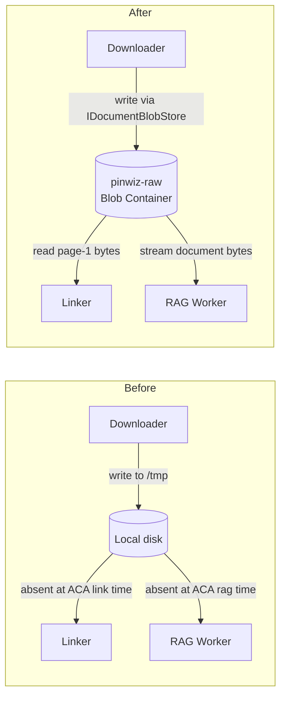

# 0039 — Blob-backed document store (`pinwiz-raw`)

**Status:** Accepted
**Date:** 2026-06-19

## Context

The downloader wrote PDFs and other document files to a local filesystem path (the
"download root"). The linker used that path to open page-1 content for edition
resolution; the RAG ingestion worker used it to stream file bytes into the indexing
pipeline.

On Azure Container Apps the local filesystem is ephemeral — the ACA job's `/tmp`
tree is discarded after each run. This meant:

- **At link time,** page-1 content was absent. Edition resolution silently fell back
  from the page-1 tier to the filename/metadata tier, or further to the over-broad
  `franchise-wide` scope — the weakest, noisiest option. A forced full re-crawl was
  the only way to recover document bytes.
- **Ad-hoc backfills** had to re-download the whole corpus every time instead of
  skipping already-seen files, which is impolite and doesn't scale.

The immediate trigger was the catalog-stats over-select incident (PR #445 context):
the linker's `edition_scope` values had drifted because byte-content was unavailable
at link time, leaving a large share of documents tagged `franchise-wide` rather than
the machine-specific scope the page-1 text would have resolved. The underlying cause
was the ephemeral download root.



## Decision

Persist documents in the existing `pinwiz-raw` blob container (provisioned in
Phase 2 Bicep — see [ADR-0013](0013-two-tier-bicep-deploy.md)) via a new Application
abstraction `IDocumentBlobStore` with four operations: write, exists, open-read, and
try-open-read. The Infrastructure implementation uses `BlobContainerClient` with
managed identity (`DefaultAzureCredential`) against the deployed storage account, and
falls through to Azurite locally via `ConnectionStrings:blobs` (the Aspire-injected
connection string). No access keys are used anywhere (see [ADR-0012](0012-cosmos-arm-schema-data-plane-items.md)
for the identity-first pattern this mirrors).

Blob naming: `{sourceType}/{filename}` — directly equal to
`RawDocumentRecord.File.LocalPath`, so no additional mapping is needed for existing
records.

The nightly linker ACA Job runs a combined `--download-and-link` command so bytes are
written to blob before the linker reads them in the same job execution.

## Consequences

**Positive:**

- Edition resolution can reach the page-1 tier on every ACA run. The `franchise-wide`
  fallback becomes rare rather than the default.
- Incremental skip (`IDocumentBlobStore.ExistsAsync`) keeps scrape runs polite —
  already-downloaded documents are not re-fetched.
- Local dev is fully functional via Azurite (`ConnectionStrings:blobs` → Aspire
  emulator). No degraded-local workaround.
- Reuses the `pinwiz-raw` container and developer RBAC already provisioned in Phase 2
  Bicep. No new infrastructure.
- Managed identity end-to-end; no keys, no secrets in config.

**Negative:**

- Documents are buffered fully in memory during the blob write (the SDK's
  `BlobClient.UploadAsync(Stream)` path). At the current corpus maximum (~80 MB per
  document) this is well within the ACA job's 1 GiB memory limit. Revisit with a
  temp-file streaming path if significantly larger documents appear.

**Neutral:**

- `RawDocumentRecord.File.LocalPath` now holds a blob key (`{sourceType}/{filename}`)
  rather than an absolute disk path. The change is backward-compatible for records in
  Cosmos because the blob key format is identical to the trailing path segment the
  downloader wrote before, just without the leading download-root prefix.
- The legacy `--migrate-download-paths` CLI command was written to normalize old
  disk-absolute paths. That command is now vestigial — its target layout no longer
  exists on ACA. Flag for removal in a future cleanup PR.

## Alternatives considered

- **Azure Files share mounted into the ACA job.** ACA Azure Files mounts require
  storage account access keys — they are not compatible with Entra-only / managed
  identity access. Adopting them would undo the identity posture established across
  Cosmos, Service Bus, and Storage. Rejected.

- **Co-located ephemeral download + link in one job run, no persistence.** The
  downloader and linker run in the same execution and the bytes are thrown away
  afterward. Rejected: forces a full re-download of the entire corpus on every nightly
  run (impolite, breaks the incremental-skip guarantee, doesn't scale as the corpus
  grows).

## Backfill runbook (post-deploy, run once)

This is an operational step performed after the blob-document-store PR is merged and
deployed. It is NOT part of CI or the build — run it manually from a dev machine with
the live subscription active (`az account set -s b1f33f17-...`).

**Prerequisites:** Phase 2 Bicep deployed (`deployPhase2 = true`), Storage Blob Data
Contributor RBAC granted to the ACA managed identity and to the operator running the
backfill, and `Storage:AccountName` wired in the running environment.

**Steps:**

1. **Download the corpus to blob** — streams each document from its source URL into
   `pinwiz-raw`. Already-present blobs are skipped unless `--force-redownload` is
   passed. Run once with force to populate from scratch:

   ```
   dotnet run --project src/PinballWizard.Cli -- --download-documents --force-redownload
   ```

2. **Re-resolve edition scope from blob page-1** — runs the linker over every
   `RawDocumentRecord` in Cosmos, re-reading page-1 bytes from `pinwiz-raw` and
   writing the resolved `edition_scope` back:

   ```
   dotnet run --project src/PinballWizard.Cli -- --relink-all
   ```

3. **Rebuild catalog stats** — refreshes the Cosmos `catalog_stats` projection to
   reflect the corrected `edition_scope` values:

   ```
   dotnet run --project src/PinballWizard.Cli -- --rebuild-catalog-stats
   ```

These three steps run sequentially. After `--relink-all` completes, verify in the
admin dashboard (`/admin/documents`) that the share of `franchise-wide` records has
dropped to near-zero for manufacturers whose documents carry per-machine page-1 text
(Stern, JJP).

## References

- [ADR-0012](0012-cosmos-arm-schema-data-plane-items.md) — Cosmos ARM/data-plane identity model (managed identity pattern this mirrors)
- [ADR-0013](0013-two-tier-bicep-deploy.md) — two-tier Bicep deploy (`pinwiz-raw` container is Phase 2)
- [ADR-0031](0031-document-machine-linking-source-of-truth.md) — document→machine linking (linker reads page-1 from blob)
- [ADR-0032](0032-document-edition-scope-model.md) — edition-scope model (edition resolution relies on page-1 bytes)
- PR #445 context — catalog-stats over-select incident; root cause was `edition_scope` drift from missing blob content
- `thoughts/shared/plans/2026-06-19-blob-document-store-design.md` — design spec for this work
