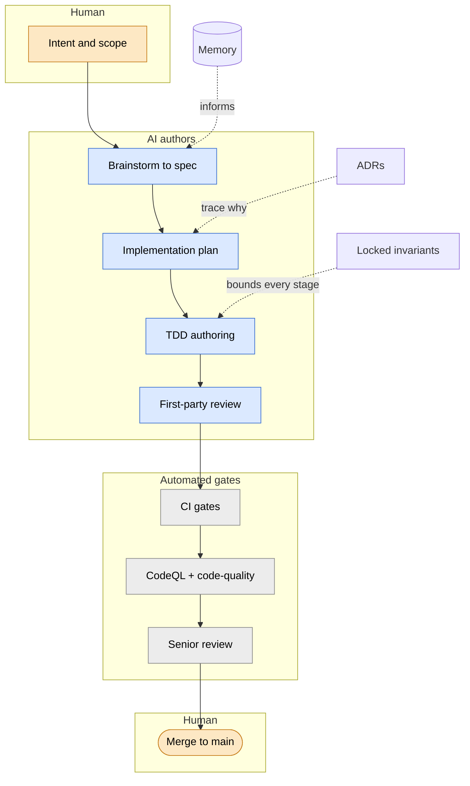

# How PinballWizard is built — the AI-authored, human-governed model

This is the companion to [`claude-code.md`](claude-code.md). That document describes the
*configuration* — the in-repo `.claude/` layers that make Claude Code a first-class,
portable engineering participant (ADR-0040). This one describes the *operating model and
governance*: how a codebase that is **authored almost entirely by AI** is held to an
enterprise quality bar, and why you can trust the result.

It exists to answer the question a skeptical prospect or hiring manager will eventually
ask: *if AI wrote nearly all of this, how do you manage quality when you aren't typing the
code yourself?*

## The model in one screen

AI authors nearly all of the code in this repository. A human owns the three things AI
does not: **intent** (what to build and why), **judgment** (whether a given change is
actually right), and **the merge button** (the irreducible decision to ship).

The load-bearing idea is simple: **every change passes through the same gates regardless of
who or what typed it.** AI-written code is not trusted because it came from a capable
model — it is trusted because it survives the same spec, the same tests, the same reviews,
and the same automated analysis that any change would. Nothing merges on faith.

The pinball domain is the vehicle; the engineering rigor is the point. The sections below
are the actual process, not an aspiration — each stage links to the artifact that enforces
it.

The whole pipeline on one screen — who owns each stage, and the gate chain every change
passes through on the way to `main`:

The color reinforces the lanes at a glance: **amber = human-owned**, **blue =
AI-authored**, **grey = automated / independent gate**. The **human** owns the two
irreducible ends — intent at the top, the merge to `main` at the bottom — while **AI**
authors everything in between and the change earns its way across the automated,
independently-owned gates we cannot quietly tune. The dotted inputs (locked invariants,
memory, ADRs) are the cross-cutting controls detailed below and are left untinted, since
they run through every stage rather than belonging to one. The stage-by-stage sections that
follow expand each node.

## The process, stage by stage

Each stage controls for a specific failure mode and is backed by an artifact in this repo.

- **Intent & design — brainstorm → spec.** A human sets intent; a structured brainstorm
  turns it into a written spec under [`superpowers/specs/`](superpowers/specs/) before any
  code exists. The design space is constrained up front by the project's locked invariants
  and standards ([`.claude/INVARIANTS.md`](../.claude/INVARIANTS.md)), so the AI is not free
  to "decide" load-bearing architecture on a whim.
- **Plan.** The spec becomes a decomposed, reviewable implementation plan under
  [`superpowers/plans/`](superpowers/plans/) — bite-sized tasks, each with its own tests and
  verification — *before* implementation. The plan is where the work is made legible enough
  to govern.
- **Authoring — subagent-driven development + TDD.** Code is written test-first, with tests
  that assert behavior, not structure (a test named "deduplicates" must include a fixture
  where dedup actually fires). The discipline is documented in
  [`quality-spec.md`](quality-spec.md) and the code standards in
  [`ENGINEERING_STANDARDS.md`](ENGINEERING_STANDARDS.md).
- **First-party pre-push review.** Before anyone else sees the change, it runs through *our
  own* review: `/local-review` (a qualitative, 10-category critique) and `/standards-audit`
  (a mechanical gate over [`.claude/standards/`](../.claude/standards/README.md)), plus the
  full CI-equivalent test suite locally. We grade our own homework first — thoroughly — so
  the later layers are a check, not a crutch.
- **CI gates.** Every PR must pass the pipeline in [`.github/workflows/`](../.github/workflows/):
  a warnings-as-errors build, the full test suite, a coverage floor (≥ 70%), secret/PII
  sanitization, and Bicep validation. These are objective and non-negotiable.
- **Automated second-opinion review — the safety net.** GitHub-native analysis runs on the
  PR: **CodeQL** (`github-advanced-security`) for security and code-scanning, and
  **`github-code-quality`** for maintainability findings. This layer is deliberately
  positioned *after* our own review and framed as exactly what it is — an **independent
  second opinion that we did not write and cannot quietly tune**, precisely because a team
  should not only grade its own homework. It is a safety net, not the primary control: most
  of the quality is built upstream, and this catches what slips.
- **Whole-branch senior review.** Before merge, the entire branch diff gets a senior
  (opus-model) critique — the equivalent of a staff engineer reading the whole change at
  once, not just line comments.
- **Human merge.** The final gate is a person. No automation merges to `main`.

## Cross-cutting controls

Some controls are not a single stage — they run through the whole process:

- **Locked invariants & standards.** [`.claude/INVARIANTS.md`](../.claude/INVARIANTS.md) and
  the machine-checkable rules under [`.claude/standards/`](../.claude/standards/README.md)
  encode the things that must never regress (provenance is sacred, polite-by-construction
  scraping, honest failure, personal-identity-only commits, Cosmos read discipline). They
  bound what the AI is allowed to do, every session.
- **ADRs.** Non-obvious decisions are recorded in [`docs/adr/`](adr/), not left as folklore.
  A reviewer can trace *why* a subsystem is the way it is without reverse-engineering it.
- **Memory.** Institutional knowledge — past incidents, hard-won gotchas, project
  constraints — persists across sessions, so the AI does not relearn (or repeat) the same
  mistakes. This is how an AI-authored project accumulates judgment over time. See
  [`learning-from-failure.md`](learning-from-failure.md) for how specific incidents became
  permanent mechanical guardrails.
- **Provenance.** Every captured item traces back to its source URL (see the provenance
  model in [`../CLAUDE.md`](../CLAUDE.md)); the same fidelity that powers RAG citations also
  makes the data auditable.
- **Automated review-feedback triage.** When review or bot feedback lands on a PR, a
  server-side GitHub Action (`.github/workflows/pr-feedback-triage.yml`) triages it within
  minutes and posts one structured comment that classifies each finding as **mechanical vs.
  judgment** — the post-open counterpart to the pre-open `/local-review` + `/standards-audit`
  gate. It is governed by construction: comment-only and tool-scoped so it cannot push code,
  keeping a human accountable for every merge decision. Because it is version-controlled, it
  is non-optional and independent of any developer being online. See [ADR-0041](adr/0041-pr-feedback-triage.md)
  for the rationale and the deferred autonomous-mode upgrade path.

## Two kinds of agents

The automation described above involves AI agents, but not all agents play the same role.
PinballWizard runs two distinct categories, and the boundary matters ([ADR-0051](adr/0051-agent-categories-foundry-vs-ci.md)):

**Foundry runs the product.** The Wizard's grounding, search, and repair agents serve live
user traffic on pinwiz.ai inside Microsoft Foundry. They carry managed identity, eval
harness evaluation, per-agent model routing, and latency SLOs. A regression here degrades
the answer a visitor receives.

**Claude Code builds and maintains the repo.** Agents triggered by git events — push, PR,
schedule — run as ephemeral GitHub Actions jobs via `claude-code-action@v1`, authenticated
keylessly through GitHub OIDC → Anthropic WIF (ADR-0047). They need `git`, `gh pr create`,
and repo checkout; they have no place in a product-runtime orchestrator. The `@claude`
mention handler (`claude.yml`) and the PR-feedback triage bot (`pr-feedback-triage.yml`)
are already in this category. The **docs-agent** (Phase 3) is the worked example that made
the boundary explicit: it opens a PR to refresh documentation on a schedule — a canonical
repo-maintenance task, not a product-serving one.

The classification rule for any future agent is a single question: does it serve live user
traffic, or does it act on git events? Foundry and CI respectively.

## Verification & evidence

The most common failure mode of an AI contributor is not a syntax error — it is a confident,
plausible-sounding claim that something works when it has not been checked. The countermeasure
is a single discipline: **a claim is not accepted until its command output is shown.** Evidence
before assertions, every time.

Three standing rules make this concrete:

- **Verify before completion.** "Done", "fixed", and "passing" are claims that require running
  the check and reading the output first — not predictions. A green build is shown, not asserted.
- **No masking fallbacks.** Failures degrade visibly and are logged; synthetic or placeholder
  output is never presented as real (Invariant #17). A fallback that hides the underlying
  failure is a bug, not resilience.
- **No guessing.** A configuration value, API parameter, or flag is verified from source or
  current docs — never recalled from memory and hoped to be right. See
  [`.claude/rules/no-guessing.md`](../.claude/rules/no-guessing.md).

In practice this looks like: running the full CI-equivalent test suite before claiming it is
green (not a filtered subset that can miss a cross-file contract test); confirming a dismissed
code-scanning alert actually reports `dismissed` via the API rather than assuming the change
took; and running a scripted link-integrity check over a doc before committing it. None of these
is exotic — the point is that they are *run*, and their output is what backs the claim.

This is a discipline, not a guarantee: it is reinforced by the mechanical gates (CI,
`/standards-audit`) and is the reason the merge decision stays human. A person ratifies the
evidence; the AI does not get to grade its own claim of success.

## When a tool disagrees with a decision

The interesting case is not when the tools are silent — it is when an automated finding
*conflicts with a deliberate design decision*. The standing rule is **fix-or-justify**: an
automated finding is either fixed, or dismissed with a written engineering justification
that lives in the open. It is never silently ignored, and it is never blindly obeyed.

**Worked example — PR [#484](https://github.com/Early-Bird-Solutions-LLC/PinballWizard/pull/484).**
Both CodeQL (`cs/catch-of-all-exceptions`, alerts #542 and #543) and `github-code-quality`
flagged two `catch (Exception ex)` blocks on the new manufacturers admin page as "generic
catch clauses," and suggested narrowing them to specific exception types.

That suggestion is reasonable in the general case — and wrong here. Those two catches are
**deliberate boundary catches** implementing **Invariant #17 (honest failure / degrade
visibly):** a customer-facing page must never white-screen. Each catch logs the *full*
exception (so the failure is recorded, not masked) and then degrades the UI visibly — a
failure alert, or a row that falls back to its raw key. Narrowing to an enumerated set of
exception types would do the opposite of what the bot intends: an *unanticipated* exception
type would no longer be caught, and would crash the page — the exact failure Invariant #17
exists to prevent.

So the resolution was to **justify, not narrow**: the two CodeQL alerts were dismissed with
a written reason ("Intentional boundary catch (Invariant #17 — honest failure)… narrowing
would let an unanticipated type crash the page"), the `github-code-quality` threads were
answered with the same rationale, and the code comments were sharpened to make the intent
obvious to the next reader. The paper trail is the point. **Reasoned dismissal with a
documented justification is a stronger quality signal than a suspiciously empty board** — it
shows the tools are engaged with judgment, not appeased or ignored.

## Who decides what

The previous sections describe *how* work is governed; this one says *who* holds each decision,
concretely. The "human-governed" claim is only as good as its specifics — so here they are. The
prose that follows ("What the human still owns") is the narrative complement: this table is the
audit.

| Decision | AI proposes | AI decides | Human decides |
| --- | --- | --- | --- |
| Feature intent & scope (what to build, what's out) | | | ✓ |
| Architecture & ADRs | ✓ drafts | | ✓ ratifies |
| Implementation within an approved spec/plan | | ✓ | |
| Test design & coverage | ✓ | ✓ within behavior-not-structure | spot-checks |
| Dependency version bumps | ✓ | ✓ minor/patch via Renovate auto-merge | ✓ majors |
| Dismissing an automated-review finding | ✓ writes the justification | | ✓ ratifies via merge |
| Converting an incident into a guardrail | ✓ | ✓ adds the test/rule | ✓ ratifies via merge |
| Merge to `main` | | | ✓ only |
| Production deploy | ✓ prepares | | ✓ |

The pattern: AI does the proposing and the bounded, reversible deciding; the human owns the
irreversible and the load-bearing — intent, architecture, and every merge to `main`.

## What the human still owns

Honesty about the limits is part of the model. AI is strong at producing large volumes of
tested, standards-conformant code quickly, at applying patterns consistently across a
codebase, and at the mechanical parts of review. It is weakest exactly where governance is
needed: it will, left unchecked, confidently produce a plausible-but-wrong design, optimize
the wrong thing, or accept a tool's suggestion that conflicts with a project invariant.

The process above exists to put a human in the loop at the points where that matters most.
What no automation in this repo replaces:

- **Intent** — deciding what is worth building, and what is explicitly out of scope.
- **Taste and judgment** — recognizing when a passing-but-wrong change is wrong anyway.
- **The merge decision** — and the accountability that comes with it.

AI writes nearly all the code. A human is still answerable for all of it. That is the
model.
