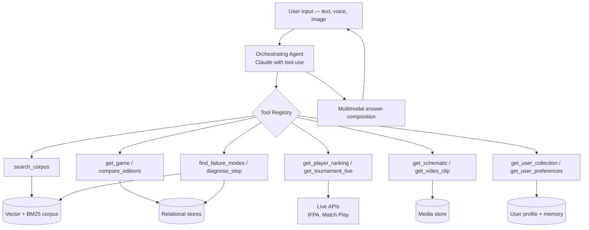
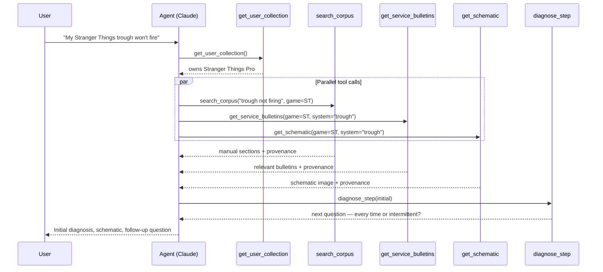

# The Pinball Wizard — System Architecture v2

## 1. Purpose

This document describes the system architecture for The Pinball Wizard. It supersedes the RAG-only assumptions of `infra_analysis.md` (whose Azure infrastructure reference architecture remains valid) and corresponds directly to the knowledge domains catalogued in `knowledge-sources.md`.

The central claim of this document: **The Pinball Wizard is an AI-first, tool-using agent — not a RAG retrieval pipeline with a chat interface.** That distinction has consequences across data modeling, infrastructure, query handling, and the user experience.

---

## 2. Why the Shift: RAG-Only Falls Short

The original Phase 2 design followed a clean RAG template:

```
ingest → chunk → embed → vector index → retrieve → LLM → answer + citation
```

That is the right design when the source content is shaped uniformly — a corpus of documents you parse, embed, and search. It is the wrong design when the knowledge spans wildly different shapes, which is what the wizard's full scope demands.

The four shapes (developed in `knowledge-sources.md` §5):

1. **Unstructured text** — manuals, bulletins, articles, technique transcripts. RAG works perfectly.
2. **Structured records** — game catalog, designer registry, parts catalog, player profiles. Embedding these wastes tokens and produces fuzzy answers when crisp ones exist. A database lookup beats vector search for "Who designed Godzilla?"
3. **Live data** — IFPA rankings, in-progress tournaments, marketplace prices. Embedding stale data is misleading. API calls at query time produce correct answers.
4. **Multimedia** — schematics (images), callouts (audio), gameplay clips (video). Transcripts go in the corpus, but the underlying media should be returnable as part of the answer, not just referenced.

A pure RAG pipeline serves shape #1 well, fakes shape #2, ignores shape #3, and waves at shape #4. To handle all four well, we need the LLM to reason about which retrieval mechanism to use for each query — that is tool use, not retrieval.

---

## 3. The Architectural Pivot: Agent + Tool Registry

The wizard's front door is an **orchestrating agent** (Claude, with tool use) that reasons about user intent and invokes one or more tools to produce an answer. RAG search is one tool among many.



The agent's reasoning loop per query:

1. Parse intent. If ambiguous, ask a clarifying question.
2. Decide which tool(s) to call. Tools may be called in parallel.
3. Receive results, each carrying provenance.
4. Decide whether more tool calls are needed (the answer may require iteration).
5. Compose a multimodal answer with uniform citations across modalities.

This is not RAG with extra steps. The mental model is fundamentally different.

---

## 4. The Four Knowledge Shapes — Concrete Mapping

### 4.1 Unstructured text (RAG corpus)

**What goes here:** Manuals (PDF), service bulletins, code release notes, articles, forum posts, podcast transcripts, video transcripts, callout transcripts, technique guides.

**Storage:** PostgreSQL with pgvector (text + embedding) plus AI Search for hybrid retrieval (BM25 + vector + semantic ranking + Cohere reranking).

**Tools that hit this:** `search_corpus`, `get_document`, `get_document_section`, `find_failure_modes` (with quality weighting).

**Provenance:** Each chunk carries `document_id` linking back to a `DocumentRecord` (the model defined in Phase 1 — `scraper_plan_v4.md`).

### 4.2 Structured records (relational store)

**What goes here:** Game catalog, manufacturer registry, designer/artist/programmer registry, parts catalog, player profiles (static bio data).

**Storage:** PostgreSQL relational tables. No embedding for these records — they are queried directly.

**Tools that hit this:** `get_game`, `compare_games`, `compare_editions`, `find_games`, `get_designer`, `get_artist`, `get_player`, `find_part`, `get_compatible_parts`.

**Provenance:** Each record tracks `source` (where the data was scraped from) and `last_updated`.

### 4.3 Live data (API tools)

**What goes here:** IFPA rankings, in-progress tournament standings, upcoming/recent tournaments, marketplace listings.

**Storage:** None canonical. A thin caching layer with short TTLs may be added if measured latency demands it; otherwise live data has no persistent home.

**Tools that hit this:** `get_player_ranking`, `get_tournament_live`, `find_tournaments`, `get_market_listings`.

**Provenance:** Each tool response carries `api_source`, `fetched_at`, `endpoint_url`.

### 4.4 Multimedia (media store + metadata)

**What goes here:** Schematic images (extracted from manuals or scanned separately), gameplay video clips with timestamps, callout audio (deferred per `knowledge-sources.md` §7).

**Storage:** Azure Blob for the media itself; PostgreSQL for metadata (which game, which system, page reference, video timestamp, embedding of caption/transcript for searchability).

**Tools that hit this:** `get_schematic`, `get_video_clip`, `get_callout_context` (text only initially).

**Provenance:** Each media item carries the same source chain as the document it was extracted from.

---

## 5. The Tool Registry

A first-cut catalog. Each tool will have a typed signature, a description (which the agent reads to choose tools), and a Polly-protected implementation.

### 5.1 Text retrieval

| Tool | Purpose |
|---|---|
| `search_corpus(query, filters?, limit?)` | Hybrid retrieval over the full text corpus. Filters: domain, source quality, game, manufacturer, document type. |
| `get_document(document_id)` | Full document content with provenance chain. |
| `get_document_section(document_id, section_or_page_range)` | Specific section or page range. |

### 5.2 Structured lookups

| Tool | Purpose |
|---|---|
| `get_game(slug)` | Full game record — editions, designer, artist, year, manufacturer, theme. |
| `compare_games(slugs[])` | Side-by-side comparison. |
| `compare_editions(game_slug)` | Pro / Premium / LE differences. |
| `find_games(filters)` | By manufacturer, designer, year range, theme, mechanic. |
| `get_designer(name)` | Designer profile and credits. |
| `get_artist(name)` | Artist profile and credits. |
| `get_player(name)` | Static bio — career highlights, notable wins. |
| `find_part(description, game?)` | Parts catalog query. |
| `get_compatible_parts(game, system)` | Parts compatible with a specific system. |

### 5.3 Live data

| Tool | Purpose |
|---|---|
| `get_player_ranking(name)` | Current IFPA WPPR rank. |
| `get_tournament_live(tournament_id)` | Live standings for a tournament in progress. |
| `find_tournaments(location?, date_range?)` | Upcoming and recent events. |
| `get_market_listings(game, condition?)` | Current marketplace listings. |

### 5.4 Media

| Tool | Purpose |
|---|---|
| `get_schematic(game, system?, page?)` | Image with metadata; optional region annotation. |
| `get_video_clip(skill?, technique?, game?, mode?)` | Video URL with start timestamp. |
| `get_callout_context(game, situation)` | Paraphrased callouts and triggers. |

### 5.5 Diagnostics

| Tool | Purpose |
|---|---|
| `find_failure_modes(symptom, game?)` | Community Q&A retrieval with source-quality weighting. |
| `get_service_bulletins(game?, system?)` | Relevant service bulletins. |
| `diagnose_step(state)` | Stateful multi-turn diagnostic; takes current state, returns next question or conclusion. |

### 5.6 User context (memory)

| Tool | Purpose |
|---|---|
| `get_user_collection()` | Machines the user owns. |
| `get_user_preferences()` | Skill level, league affiliation, content preferences. |
| `get_diagnostic_history(game)` | What has been tried for this user's specific machine. |
| `record_diagnostic_attempt(game, what_tried, outcome)` | Persist for future sessions. |
| `get_user_tournament_calendar()` | Events the user is registered for or tracking. |

---

## 6. The Agent Orchestration Layer

The agent is the system's central nervous system. It is responsible for:

- **Intent classification.** Routing simple lookups directly; planning multi-step responses for complex ones.
- **Tool selection.** Reading tool descriptions, choosing the right one(s), often in parallel.
- **Iteration.** A complex question may cascade through several tool calls before the agent has enough to answer.
- **Answer composition.** Producing a structured response — text, embedded images, embedded video clips, comparison tables, follow-up questions.
- **Citation.** Every claim attributable to a source carries a citation back to that source, regardless of whether the source was a PDF chunk, a database row, an API response, or a video timestamp.

### 6.1 A worked example

A user asks: *"My Stranger Things trough won't fire."*



The user gets a single response that combines manufacturer guidance, community wisdom, a visual reference, and an interactive follow-up — all properly cited.

### 6.2 Implementation

Claude with tool use, via the Anthropic API. Tools are defined in code and registered with the agent at session start. The agent runs in a dedicated API service (likely separate from the existing JungleTech API App for clean boundaries — see §15).

**Why Claude:** mature tool use, long context windows for multi-tool sessions, vision support for image input.

---

## 7. Knowledge Stores

| Store | Tech | Holds | Notes |
|---|---|---|---|
| Text corpus | PostgreSQL + pgvector + AI Search | Embedded chunks with metadata | Hybrid retrieval (BM25 + vector + semantic + Cohere rerank) per `infra_analysis.md` |
| Structured records | PostgreSQL tables | Game, designer, artist, parts, player records | Queried directly; no embedding |
| Media metadata | PostgreSQL tables | Schematic refs, video clip refs, callout refs | Points to Blob URLs |
| Media files | Azure Blob | Images, audio, video | Referenced by media metadata |
| Provenance graph | PostgreSQL tables | DocumentRecord, MediaRecord, RecordSource | Unifies citations across data shapes |
| Conversation state | PostgreSQL (with TTL) or Redis | Active session context | Short-lived; session-scoped |
| User memory | PostgreSQL tables | User profile, collection, diagnostic history, preferences | Long-lived; user-scoped |
| Live data cache | Redis or in-memory (optional) | IFPA / Match Play / marketplace responses with short TTLs | Optimization, not source of truth |

More stores than the original Phase 2 design, but the volume per store remains modest. PostgreSQL handles most of it.

---

## 8. Conversation and Memory

Two layers:

**Session memory** — what we have discussed in this conversation. Mostly handled by the LLM context window. For long sessions, older turns are summarized into a session summary so context does not blow.

**Long-term user memory** — persistent facts:
- Collection: which machines the user owns (with editions, condition notes)
- Preferences: skill level, content modality preferences (text vs. video), league affiliation
- Diagnostic history: per-machine, what has been tried with what outcome
- Tournament calendar: events the user is registered for or tracking
- Conversation history: vector-indexed for "what did we discuss about my Iron Maiden last month"

Long-term memory is **structured for queryable facts** (in tables) and **vector-indexed for past conversations** (a personal mini-corpus). Both are exposed as tools so the agent pulls from memory the same way it pulls from any other knowledge source.

This is what makes the wizard feel like *your* wizard, not a generic FAQ.

---

## 9. Multimodal Input and Output

### 9.1 Output

The agent produces structured output blocks, not just text:
- Text (the prose answer)
- Embedded image (a schematic, optionally annotated)
- Embedded video (URL + start timestamp)
- Embedded audio (a callout sample, when legally clear)
- Comparison table (rendered)
- Diagnostic form (interactive multi-turn)
- Citation block (uniform across modalities)

The web/mobile UI renders these blocks. A non-UI client (CLI, voice) degrades gracefully — images become "see [link]," videos become "watch at [link] starting 2:14."

### 9.2 Input

- **Text** — primary, MVP.
- **Image** — a photo of a board, part, or playfield. Routed through Claude's vision capability to identify the subject, then triggers the appropriate tool path.
- **Voice** — Whisper STT on input; optional TTS on output. Critical for hands-on diagnostic flows ("I'm under the playfield right now, what does the trough opto wire look like?").

Voice and image are post-MVP roadmap items. The architecture must not preclude them.

---

## 10. Provenance — Unified Across Shapes

The Phase 1 `DocumentRecord` provenance model generalizes. Every tool response carries provenance metadata in a uniform schema:

```
{
  "source_type": "document_chunk" | "structured_record" | "live_api" | "media",
  "source_url":     "...",   // canonical link wherever applicable
  "discovery_url":  "...",   // page the user could browse to
  "source_label":   "...",   // human-readable: "Stranger Things Pro Manual, p. 23"
  "freshness":      "...",   // for live: fetched_at; for static: last_updated
  "confidence":     "...",   // optional, for community sources
  "additional":     { ... }  // type-specific fields
}
```

The agent receives provenance with every tool result and is instructed to attach citations to claims. The UI renders citations consistently regardless of source type.

This is what makes the wizard's answers trustworthy and verifiable — and what makes it a portfolio piece worth showing.

---

## 11. Ingestion Pipelines

Each data shape has its own pipeline. Phase 1 (`scraper_plan_v4.md`) covers the document ingestion path for Stern. Other pipelines:

- **Document** (manuals, bulletins, articles): scrape → text extract (PdfPig for PDFs, AngleSharp for HTML) → page-aware chunking → embed → index. Same pattern as the original Phase 2.
- **Structured records**: scrape → parse to typed records → upsert into relational tables. No embedding step.
- **Multimedia**: extract from documents (schematic images from PDFs) or scrape separately → store in Blob → metadata in PostgreSQL → caption/transcript indexed in the text corpus for searchability.
- **Live**: no ingestion — query at runtime.
- **User memory**: written by the agent during sessions (via `record_diagnostic_attempt` and similar) and read by tools.

---

## 12. Infrastructure Implications

The Azure resources catalogued in `infra_analysis.md` remain valid. Additions and clarifications:

- **More PostgreSQL tables** — structured records, media metadata, user profiles, conversation state, provenance graph. The B1ms server is sized appropriately; storage growth is the only meaningful cost change.
- **Redis (optional)** — for live data caching. Can start without it (PostgreSQL with TTL works) and add only if measured latency demands it.
- **Anthropic API account** — for Claude with tool use. Existing Azure OpenAI usage may shift partly to Anthropic depending on whether we want model + tool use + vision on one provider.
- **No new resource group** — runs alongside existing JungleTech infrastructure (per `infra_analysis.md` §5 Option A).

**Cost impact:** Token usage per query rises noticeably under the agent model — multi-tool reasoning is more tokens than pure RAG. Worth budgeting for. Infrastructure cost is essentially flat.

---

## 13. Phased Rollout

Aligns with `knowledge-sources.md` §8 but adds the agent transition explicitly:

- **Phase 2a — Stern RAG MVP.** Document ingestion + basic retrieval. Pure RAG, no agent yet. Validates the corpus and pipeline.
- **Phase 2b — Agent transition.** Wrap the existing RAG capability as a `search_corpus` tool. The front door becomes the agent. Single-tool agent, but the architecture is in place.
- **Phase 2c — Structured stores.** Add game / designer / parts tables and the structured lookup tools.
- **Phase 2d — Live tools.** IFPA and Match Play integrations. The agent now demonstrably handles static, structured, and live data together.
- **Phase 2e — Multimedia.** Schematic extraction, video clip metadata, multimodal output composition.
- **Phase 2f — Memory and personalization.** User profile, collection, diagnostic history. Memory tools.
- **Phase 3 — Multimodal input.** Voice (Whisper) and image (Claude vision).

---

## 14. Trade-offs and Non-Goals

Explicit non-goals (so reviewers see we considered them):

- **Not building our own LLM.** Claude is the agent.
- **Not running our own vector DB at scale.** PostgreSQL + pgvector handles our volume.
- **Not building a tournament platform.** We read from IFPA, Match Play, Brackelope.
- **Not building a marketplace.** We read existing listings.
- **Not chasing real-time streaming.** Polling with short TTLs serves our use cases.
- **Not building multi-tenant infrastructure for v1.** Single-user (or small group) until the architecture proves out.

Acknowledged trade-offs:

- **Latency.** Multi-tool agent calls take longer than single-pass RAG. Parallel tool execution mitigates but does not eliminate. Budget: typical query under 5 seconds end-to-end.
- **Cost.** More tokens per query under the agent model. The cost of a delightful experience.
- **Complexity.** More moving parts than pure RAG. Justified by the breadth of knowledge shapes we are modeling.

---

## 15. Open Questions

- **API service separation.** Does the wizard share the existing JungleTech API App, or get its own service? Probably its own — clean boundary, independent deployment cadence.
- **Tool framework choice.** Use the Anthropic SDK directly, or adopt Semantic Kernel / LangChain for tool orchestration? Direct SDK is simpler; framework gives optionality.
- **Vector store choice.** Stick with pgvector throughout, or use AI Search for the heavy hybrid retrieval and pgvector for everything else? `infra_analysis.md` already supports both — defer the decision.
- **Memory consent and clarity.** Long-term memory is powerful but needs explicit user-facing controls — what is stored, how to view it, how to delete.
- **Streaming responses.** Should the agent stream partial answers as tools complete, or wait and synthesize? Streaming is better UX; harder to implement cleanly.

---

## 16. ADR Proposal

The following ADR will be filed as `docs/adr/0008-agent-orchestrated-architecture.md`:

**Title:** Agent-orchestrated polymorphic knowledge layer over pure RAG

**Status:** Proposed

**Context:** The Pinball Wizard's knowledge spans four structurally different data shapes (unstructured text, structured records, live data, multimedia). A pure RAG pipeline serves the first shape well but fakes, ignores, or underserves the rest.

**Decision:** Adopt a tool-using agent (Claude with tool use) as the system's front door. RAG search becomes one tool among many, alongside structured lookups, live API calls, media retrieval, and user-memory access.

**Consequences:**
- More moving parts than pure RAG.
- Higher per-query token cost.
- Multi-tool latency requires parallel execution.
- Provenance must be unified across heterogeneous tools (a uniform schema, defined in §10, solves this).
- Significantly better answer quality and a path to multimodal, multi-turn, personalized experiences.

**Alternatives considered:**
- Pure RAG over an enriched corpus that embeds all four shapes. Rejected: produces fuzzy answers to crisp questions, cannot handle live data, cannot return media as first-class output.
- Multiple specialized retrievers fronted by a hardcoded router. Rejected: brittle, does not scale to new tool types, does not support multi-step reasoning.

---

## 17. Related Documents

- `scraper_plan_v4.md` — Phase 1 scraper (Stern only)
- `infra_analysis.md` — Azure infrastructure reference architecture (still valid; the RAG-only mental model is superseded by this document)
- `knowledge-sources.md` — what the wizard knows and where it comes from
- `ENGINEERING_STANDARDS.md` — coding, testing, and operational standards
- `CLAUDE.md` — working context for Claude Code
