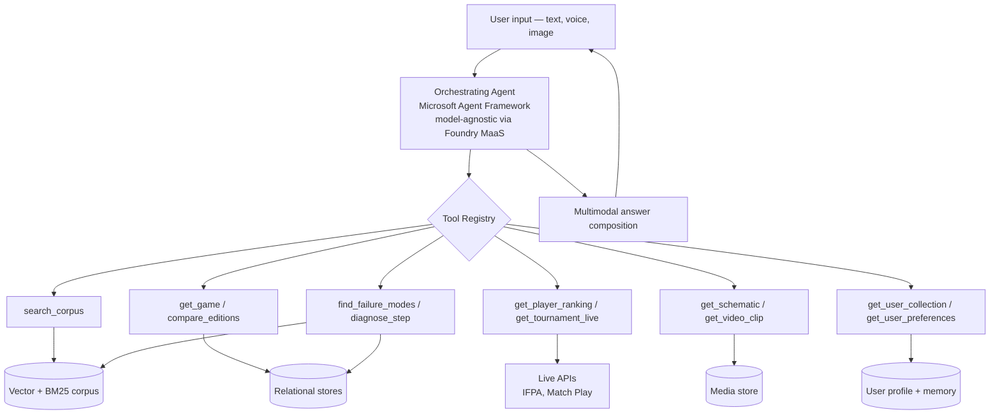
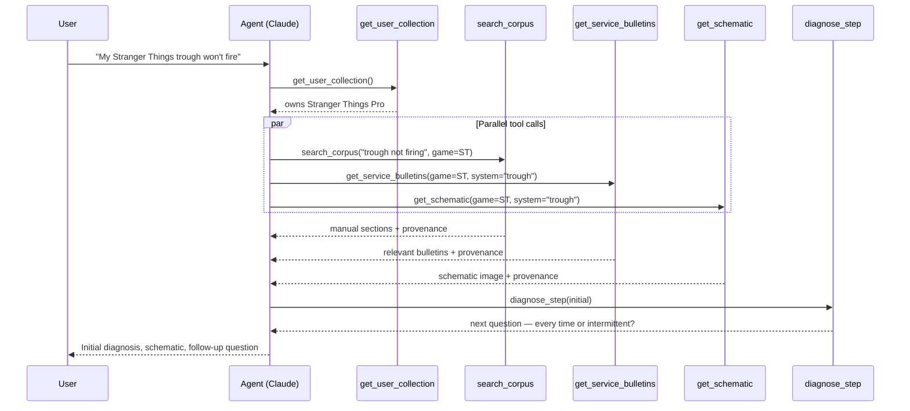

# The Pinball Wizard — System Architecture v2

## 1. Purpose

This document describes the system architecture for The Pinball Wizard. It supersedes the RAG-only assumptions of `infra_analysis.md` (whose Azure infrastructure reference architecture remains valid) and corresponds directly to the knowledge domains catalogued in `knowledge-sources.md`.

The central claim of this document: **The Pinball Wizard is an AI-first, tool-using agent — not a RAG retrieval pipeline with a chat interface.** That distinction has consequences across data modeling, infrastructure, query handling, and the user experience.

---

## 2. Why the Shift: RAG-Only Falls Short

The original Phase 2 design followed a clean RAG template:

```
ingest → chunk → embed → vector index → retrieve → LLM → answer + citation
```

That is the right design when the source content is shaped uniformly — a corpus of documents you parse, embed, and search. It is the wrong design when the knowledge spans wildly different shapes, which is what the wizard's full scope demands.

The four shapes (developed in `knowledge-sources.md` §5):

1. **Unstructured text** — manuals, bulletins, articles, technique transcripts. RAG works perfectly.
2. **Structured records** — game catalog, designer registry, parts catalog, player profiles. Embedding these wastes tokens and produces fuzzy answers when crisp ones exist. A database lookup beats vector search for "Who designed Godzilla?"
3. **Live data** — IFPA rankings, in-progress tournaments, marketplace prices. Embedding stale data is misleading. API calls at query time produce correct answers.
4. **Multimedia** — schematics (images), callouts (audio), gameplay clips (video). Transcripts go in the corpus, but the underlying media should be returnable as part of the answer, not just referenced.

A pure RAG pipeline serves shape #1 well, fakes shape #2, ignores shape #3, and waves at shape #4. To handle all four well, we need the LLM to reason about which retrieval mechanism to use for each query — that is tool use, not retrieval.

---

## 3. The Architectural Pivot: Agent + Tool Registry

The wizard's front door is an **orchestrating agent** (Claude, with tool use) that reasons about user intent and invokes one or more tools to produce an answer. RAG search is one tool among many.



The agent's reasoning loop per query:

1. Parse intent. If ambiguous, ask a clarifying question.
2. Decide which tool(s) to call. Tools may be called in parallel.
3. Receive results, each carrying provenance.
4. Decide whether more tool calls are needed (the answer may require iteration).
5. Compose a multimodal answer with uniform citations across modalities.

This is not RAG with extra steps. The mental model is fundamentally different.

---

## 4. The Four Knowledge Shapes — Concrete Mapping

### 4.1 Unstructured text (RAG corpus)

**What goes here:** Manuals (PDF), service bulletins, code release notes, articles, forum posts, podcast transcripts, video transcripts, callout transcripts, technique guides.

**Storage:** Azure AI Search (Basic SKU) for hybrid retrieval — BM25 + vector + semantic ranking per ADR-0021. Cohere rerank is gated behind H3 quality data per ADR-0024. The `pinwiz-rag-v1` index holds embedded chunks plus the metadata fields the citation surface needs (`document_url`, `page_start` / `page_end`, `section_heading`).

**Tools that hit this:** `search_corpus`, `get_document`, `get_document_section`, `find_failure_modes` (with quality weighting).

**Provenance:** Each chunk carries `document_id` linking back to a `ScrapedDocument` (the model shipped in Phase 1 — `scraper_plan_v4.md`).

### 4.2 Structured records (Cosmos DB)

**What goes here:** Game catalog, manufacturer registry, designer/artist/programmer registry, parts catalog, player profiles (static bio data).

**Storage:** Azure Cosmos DB (NoSQL) — schema CRUD via ARM, item CRUD via the data-plane SDK per ADR-0012. No embedding for these records; they are queried directly. JOIN-heavy lookups (`compare_games`, `find_games`, `get_designer`) are served via Cosmos cross-partition queries — see §7.1 for the explicit Cosmos-vs-relational tradeoff and the 200 ms p95 trigger that re-opens the call.

**Tools that hit this:** `get_game`, `compare_games`, `compare_editions`, `find_games`, `get_designer`, `get_artist`, `get_player`, `find_part`, `get_compatible_parts`.

**Provenance:** Each record tracks `source.discovery_url`, `source.discovery_context`, and `timeline.last_seen_at` per ADR-0002 / ADR-0004 — provenance is embedded, not a separate graph.

### 4.3 Live data (API tools)

**What goes here:** IFPA rankings, in-progress tournament standings, upcoming/recent tournaments, marketplace listings.

**Storage:** None canonical. An in-memory LRU cache with short TTLs (mirroring the ADR-0015 semantic-cache pattern) may be added if measured latency demands it; otherwise live data has no persistent home. Redis is deferred per §7.1 until the API goes multi-instance OR cold-start latency on IFPA exceeds ~500 ms.

**Tools that hit this:** `get_player_ranking`, `get_tournament_live`, `find_tournaments`, `get_market_listings`.

**Provenance:** Each tool response carries `api_source`, `fetched_at`, `endpoint_url`.

### 4.4 Multimedia (media store + metadata)

**What goes here:** Schematic images (extracted from manuals or scanned separately), gameplay video clips with timestamps, callout audio (deferred per `knowledge-sources.md` §7).

**Storage:** Azure Blob for the media itself; Azure Cosmos DB for the metadata records (which game, which system, page reference, video timestamp). Caption / transcript text gets indexed into the AI Search corpus per §4.1 so it's searchable alongside the rest of the unstructured-text surface.

**Tools that hit this:** `get_schematic`, `get_video_clip`, `get_callout_context` (text only initially).

**Provenance:** Each media item carries the same source chain as the document it was extracted from.

---

## 5. The Tool Registry

A first-cut catalog. Each tool will have a typed signature, a description (which the agent reads to choose tools), and a Polly-protected implementation.

### 5.1 Text retrieval

| Tool | Purpose |
|---|---|
| `search_corpus(query, filters?, limit?)` | Hybrid retrieval over the full text corpus. Filters: domain, source quality, game, manufacturer, document type. |
| `get_document(document_id)` | Full document content with provenance chain. |
| `get_document_section(document_id, section_or_page_range)` | Specific section or page range. |

### 5.2 Structured lookups

| Tool | Purpose |
|---|---|
| `get_game(slug)` | Full game record — editions, designer, artist, year, manufacturer, theme. |
| `compare_games(slugs[])` | Side-by-side comparison. |
| `compare_editions(game_slug)` | Pro / Premium / LE differences. |
| `find_games(filters)` | By manufacturer, designer, year range, theme, mechanic. |
| `get_designer(name)` | Designer profile and credits. |
| `get_artist(name)` | Artist profile and credits. |
| `get_player(name)` | Static bio — career highlights, notable wins. |
| `find_part(description, game?)` | Parts catalog query. |
| `get_compatible_parts(game, system)` | Parts compatible with a specific system. |

### 5.3 Live data

| Tool | Purpose |
|---|---|
| `get_player_ranking(name)` | Current IFPA WPPR rank. |
| `get_tournament_live(tournament_id)` | Live standings for a tournament in progress. |
| `find_tournaments(location?, date_range?)` | Upcoming and recent events. |
| `get_market_listings(game, condition?)` | Current marketplace listings. |

### 5.4 Media

| Tool | Purpose |
|---|---|
| `get_schematic(game, system?, page?)` | Image with metadata; optional region annotation. |
| `get_video_clip(skill?, technique?, game?, mode?)` | Video URL with start timestamp. |
| `get_callout_context(game, situation)` | Paraphrased callouts and triggers. |

### 5.5 Diagnostics

| Tool | Purpose |
|---|---|
| `find_failure_modes(symptom, game?)` | Community Q&A retrieval with source-quality weighting. |
| `get_service_bulletins(game?, system?)` | Relevant service bulletins. |
| `diagnose_step(state)` | Stateful multi-turn diagnostic; takes current state, returns next question or conclusion. |

### 5.6 User context (memory)

| Tool | Purpose |
|---|---|
| `get_user_collection()` | Machines the user owns. |
| `get_user_preferences()` | Skill level, league affiliation, content preferences. |
| `get_diagnostic_history(game)` | What has been tried for this user's specific machine. |
| `record_diagnostic_attempt(game, what_tried, outcome)` | Persist for future sessions. |
| `get_user_tournament_calendar()` | Events the user is registered for or tracking. |

---

## 6. The Agent Orchestration Layer

The agent is the system's central nervous system. It is responsible for:

- **Intent classification.** Routing simple lookups directly; planning multi-step responses for complex ones.
- **Tool selection.** Reading tool descriptions, choosing the right one(s), often in parallel.
- **Iteration.** A complex question may cascade through several tool calls before the agent has enough to answer.
- **Answer composition.** Producing a structured response — text, embedded images, embedded video clips, comparison tables, follow-up questions.
- **Citation.** Every claim attributable to a source carries a citation back to that source, regardless of whether the source was a PDF chunk, a database row, an API response, or a video timestamp.

### 6.1 A worked example

A user asks: *"My Stranger Things trough won't fire."*



The user gets a single response that combines manufacturer guidance, community wisdom, a visual reference, and an interactive follow-up — all properly cited.

### 6.2 Implementation

Microsoft Foundry with the Microsoft Agent Framework (per ADR-0014); models served via Foundry's MaaS catalog so the agent stack is model-agnostic (Claude, Cohere, etc. reachable through the same orchestration layer per `CLAUDE.md` § Phase 2 Preview). Tools are defined in code and registered with the agent at session start. The agent runs in a dedicated API service (separate from the scraper CLI for clean boundaries — see §15).

**Why Foundry:** enterprise-class showcase posture, first-party Azure integration, OTel auto-emission on `Azure.AI.Projects.*`, managed evaluation surface, AAD-native identity, and per-agent model selection (ADR-0015) for cost-tiered routing.

---

## 7. Knowledge Stores

| Store | Tech | Holds | Notes |
|---|---|---|---|
| Text corpus | Azure AI Search (Basic SKU) | Embedded chunks with metadata | Hybrid retrieval (BM25 + vector + semantic ranking) per ADR-0021. Cohere rerank is gated behind H3 quality data per ADR-0024. |
| Structured records | Azure Cosmos DB (NoSQL) | Game, designer, artist, parts, player records | Queried directly; no embedding. Schema CRUD via ARM, item CRUD via data-plane SDK per ADR-0012. |
| Media metadata | Azure Cosmos DB (NoSQL) | Schematic refs, video clip refs, callout refs | Points to Blob URLs |
| Media files | Azure Blob | Images, audio, video | Referenced by media metadata |
| Provenance | Embedded in source records | Source URL + discovery context + timeline + cross-references on every `Machine` / `ScrapedDocument` / `IndexedChunkDocument` | Provenance is structural (carried by every record), not a separate graph store. ADR-0002 / ADR-0004. |
| Conversation state | Azure Cosmos DB (TTL container) | Active session context | Short-lived; session-scoped |
| User memory | Azure Cosmos DB (NoSQL) | User profile, collection, diagnostic history, preferences | Long-lived; user-scoped |
| Live data cache | In-memory LRU (Redis only if measured demand) | IFPA / Match Play / marketplace responses with short TTLs | Optimization, not source of truth |

More stores than the original Phase 2 design, but the volume per store remains modest. **Cosmos DB handles most of it; AI Search holds the indexed text corpus.** PostgreSQL / pgvector are NOT in the locked stack — see CLAUDE.md § Phase 2 Preview for the implementation-layer reconciliation rationale.

### 7.1 Tradeoffs considered

The store-by-store choices above are deliberate, and they're all calibrated for **user delight at curated-subset scale** — fast on the queries users actually run today, with explicit triggers that re-open the call if scale changes the answer. Four tradeoffs are worth surfacing as explicit choices a sophisticated reviewer would push on:

**Structured records — Cosmos NoSQL vs. Azure SQL / PostgreSQL Flexible Server.**
The v2 tool registry's structured lookups (`compare_games`, `find_games`, `get_designer`, `get_compatible_parts`) are JOIN-heavy by their nature — *"all Stern horror-themed machines designed by John Borg between 2018–2024"* wants relational semantics. A relational engine answers that in 5–20 ms with a single indexed query; Cosmos serves it via cross-partition fan-out + app-side filtering at 200–500 ms, with latency that wobbles as the corpus grows. The chosen tradeoff: **stay on Cosmos** because (a) Phase 1 already ships a working Cosmos repository with a tuned partition strategy; (b) curated-subset volume keeps cross-partition queries fast enough that users feel them as instant; (c) `getMachineByTitle` (the single most-called tool) is a Cosmos point query, which is exactly Cosmos's strongest path; (d) introducing a second relational store doubles the schema-management surface and the ops bar for a reference app on a solo-developer budget. **Revisit when** any structured-lookup tool's p95 latency exceeds **200 ms** in production telemetry, OR Phase 4.5 corpus scaling drives RU costs on `find_games` / `compare_games` to dominate the per-query envelope. Both triggers are observable, not predictive.

**Provenance — embedded vs. separate graph store.**
Embedded means every `Machine` / `ScrapedDocument` / `IndexedChunkDocument` carries its own source URL + discovery context + timeline + cross-references. A separate provenance graph would unlock queries like *"show every record that traces back to source X"* or *"render the full citation chain end-to-end for this answer"*. The chosen tradeoff: **embedded** because (a) it's structurally simpler — the citation surface is whatever the tool result already carries; (b) there's no impedance mismatch between "the model sees provenance" and "the extractor reads provenance" — they read the same DTO instance per ADR-0022; (c) graph-traversal queries aren't on any current product surface. **Revisit when** a feature genuinely needs traversal (a "blame view" UI that walks answer → chunk → document → scrape job → source URL would be the trigger).

**Live data cache — in-memory LRU vs. Azure Redis Cache.**
In-memory LRU is zero infra cost and fastest; Redis Basic at ~$15/mo survives restarts + scales horizontally across multiple API instances + offers per-key TTLs without app-side eviction logic. The chosen tradeoff: **in-memory first** because (a) the API service is single-instance for v1; (b) live-data calls (IFPA / Match Play) are infrequent enough that cold-start cost is acceptable; (c) the existing in-process LRU semantic cache pattern from ADR-0015 is already a known-good template the new code can clone. **Add Redis when** the API goes multi-instance OR measured cold-start latency on IFPA queries exceeds ~500ms — both are observable triggers, not predictive guesses.

**AI Search SKU — Basic vs. Standard.**
Basic at ~$75/mo absorbs Phase 4's curated-subset corpus comfortably (2 GB total index cap; current curated-subset is under 50 MB). Standard at ~$250/mo unlocks built-in vectorizer integration, a 25 GB index cap, and higher replica + partition counts for query-side throughput. The chosen tradeoff: **Basic** until corpus growth approaches 1.5 GB (the 75% trip-wire documented in ADR-0020 § Negative consequences), at which point Phase 4.5 evaluates the Standard upgrade against the alternative of multi-index sharding on Basic. Locked in ADR-0021.

Each row's recommendation is a *current* call, not a permanent commitment — the embedded "Revisit when" triggers are the structural signals that re-open the decision.

---

## 8. Conversation and Memory

Two layers:

**Session memory** — what we have discussed in this conversation. Mostly handled by the LLM context window. For long sessions, older turns are summarized into a session summary so context does not blow.

**Long-term user memory** — persistent facts:
- Collection: which machines the user owns (with editions, condition notes)
- Preferences: skill level, content modality preferences (text vs. video), league affiliation
- Diagnostic history: per-machine, what has been tried with what outcome
- Tournament calendar: events the user is registered for or tracking
- Conversation history: vector-indexed for "what did we discuss about my Iron Maiden last month"

Long-term memory is **structured for queryable facts** (in tables) and **vector-indexed for past conversations** (a personal mini-corpus). Both are exposed as tools so the agent pulls from memory the same way it pulls from any other knowledge source.

This is what makes the wizard feel like *your* wizard, not a generic FAQ.

---

## 9. Multimodal Input and Output

### 9.1 Output

The agent produces structured output blocks, not just text:
- Text (the prose answer)
- Embedded image (a schematic, optionally annotated)
- Embedded video (URL + start timestamp)
- Embedded audio (a callout sample, when legally clear)
- Comparison table (rendered)
- Diagnostic form (interactive multi-turn)
- Citation block (uniform across modalities)

The web/mobile UI renders these blocks. A non-UI client (CLI, voice) degrades gracefully — images become "see [link]," videos become "watch at [link] starting 2:14."

### 9.2 Input

- **Text** — primary, MVP.
- **Image** — a photo of a board, part, or playfield. Routed through Claude's vision capability to identify the subject, then triggers the appropriate tool path.
- **Voice** — Whisper STT on input; optional TTS on output. Critical for hands-on diagnostic flows ("I'm under the playfield right now, what does the trough opto wire look like?").

Voice and image are post-MVP roadmap items. The architecture must not preclude them.

---

## 10. Provenance — Unified Across Shapes

The Phase 1 `DocumentRecord` provenance model generalizes. Every tool response carries provenance metadata in a uniform schema:

```
{
  "source_type": "document_chunk" | "structured_record" | "live_api" | "media",
  "source_url":     "...",   // canonical link wherever applicable
  "discovery_url":  "...",   // page the user could browse to
  "source_label":   "...",   // human-readable: "Stranger Things Pro Manual, p. 23"
  "freshness":      "...",   // for live: fetched_at; for static: last_updated
  "confidence":     "...",   // optional, for community sources
  "additional":     { ... }  // type-specific fields
}
```

The agent receives provenance with every tool result and is instructed to attach citations to claims. The UI renders citations consistently regardless of source type.

This is what makes the wizard's answers trustworthy and verifiable — and what makes it a portfolio piece worth showing.

---

## 11. Ingestion Pipelines

Each data shape has its own pipeline. Phase 1 (`scraper_plan_v4.md`) covers the document ingestion path for Stern. Other pipelines:

- **Document** (manuals, bulletins, articles): scrape → text extract (PdfPig for PDFs, AngleSharp for HTML) → page-aware chunking (per ADR-0019) → embed via `text-embedding-3-large` (per ADR-0020) → upsert into AI Search via the `IRagIndexer` shipped in W2-3 (per ADR-0021).
- **Structured records**: scrape → parse to typed records → upsert into Cosmos containers via the data-plane SDK (schema CRUD via ARM per ADR-0012). No embedding step.
- **Multimedia**: extract from documents (schematic images from PDFs) or scrape separately → store in Blob → metadata in Cosmos → caption / transcript text indexed into the AI Search corpus alongside the rest of §4.1 for searchability.
- **Live**: no ingestion — query at runtime.
- **User memory**: written by the agent during sessions (via `record_diagnostic_attempt` and similar) and read by tools.

---

## 12. Infrastructure Implications

The Azure resources catalogued in `infra_analysis.md` remain valid. Additions and clarifications:

- **More Cosmos containers** — structured records, media metadata, user profiles, conversation state. Cosmos serverless (per `infra_analysis.md`) absorbs the additional containers without a SKU bump; the per-RU cost is the only meaningful storage-side cost change. Schema CRUD via ARM, item CRUD via the data-plane SDK per ADR-0012.
- **In-memory LRU first; Redis only on measured demand** — for live data caching. Cosmos with a TTL container is the persistence-side fallback; in-memory is the latency-side optimization. Add Redis only if measured latency demands it.
- **No separate Anthropic API account.** Microsoft Foundry's MaaS catalog reaches Claude (and Cohere, etc.) through the same Azure-hosted, AAD-authed endpoint that already serves `gpt-4o-mini` / `gpt-4.1`. Selecting Claude for one or more agents is an `AiFoundryOptions.AgentModels[<agent>]` config change plus a deployment add (per ADR-0015) — see CLAUDE.md § Phase 2 Preview for the model-agnostic reconciliation.
- **No new resource group** — runs in the existing personal Earlybird Azure subscription (per `infra_analysis.md`).

**Cost impact:** Token usage per query rises noticeably under the agent model — multi-tool reasoning is more tokens than pure RAG. Worth budgeting for. Infrastructure cost is essentially flat. The per-call cost ceiling per ADR-0015 absorbs the worst case before it becomes a runaway.

---

## 13. Phased Rollout

Aligns with `knowledge-sources.md` §8 but adds the agent transition explicitly:

- **Phase 2a — Stern RAG MVP.** Document ingestion + basic retrieval. Pure RAG, no agent yet. Validates the corpus and pipeline.
- **Phase 2b — Agent transition.** Wrap the existing RAG capability as a `search_corpus` tool. The front door becomes the agent. Single-tool agent, but the architecture is in place.
- **Phase 2c — Structured stores.** Add game / designer / parts tables and the structured lookup tools.
- **Phase 2d — Live tools.** IFPA and Match Play integrations. The agent now demonstrably handles static, structured, and live data together.
- **Phase 2e — Multimedia.** Schematic extraction, video clip metadata, multimodal output composition.
- **Phase 2f — Memory and personalization.** User profile, collection, diagnostic history. Memory tools.
- **Phase 3 — Multimodal input.** Voice (Whisper) and image (Claude vision).

---

## 14. Trade-offs and Non-Goals

Explicit non-goals (so reviewers see we considered them):

- **Not building our own LLM.** Foundry serves the model — currently `gpt-4o-mini` + `gpt-4.1`, with Claude / Cohere / etc. reachable through the MaaS catalog when a per-agent benchmark justifies the swap (per ADR-0015 + CLAUDE.md § Phase 2 Preview).
- **Not running our own vector DB at scale.** Azure AI Search Basic (managed service) handles our volume per ADR-0021. Standard SKU upgrade is gated on corpus growth approaching the 2 GB cap; pgvector / Postgres aren't in the picture.
- **Not building a tournament platform.** We read from IFPA, Match Play, Brackelope.
- **Not building a marketplace.** We read existing listings.
- **Not chasing real-time streaming.** Polling with short TTLs serves our use cases.
- **Not building multi-tenant infrastructure for v1.** Single-user (or small group) until the architecture proves out.

Acknowledged trade-offs:

- **Latency.** Multi-tool agent calls take longer than single-pass RAG. Parallel tool execution mitigates but does not eliminate. Budget: typical query under 5 seconds end-to-end.
- **Cost.** More tokens per query under the agent model. The cost of a delightful experience.
- **Complexity.** More moving parts than pure RAG. Justified by the breadth of knowledge shapes we are modeling.

---

## 15. Open Questions

- **API service separation.** Does the wizard share the existing scraper CLI host, or get its own dedicated API service? Probably its own — clean boundary, independent deployment cadence, distinct scaling profile.
- **Memory consent and clarity.** Long-term memory is powerful but needs explicit user-facing controls — what is stored, how to view it, how to delete.
- **Streaming responses.** Should the agent stream partial answers as tools complete, or wait and synthesize? Streaming is better UX; harder to implement cleanly.

(The "tool framework" and "vector store" questions from earlier drafts are resolved: Microsoft Agent Framework per ADR-0014 is the locked tool framework; Azure AI Search Basic per ADR-0021 is the locked vector + hybrid-retrieval surface. See CLAUDE.md § Phase 2 Preview for the implementation-layer reconciliation.)

---

## 16. ADR Proposal

A future ADR will be filed at the next available number (currently the highest committed ADR is 0024; the agent-orchestrated-architecture ADR will land as **0025** or higher when it's drafted).

**Title:** Agent-orchestrated polymorphic knowledge layer over pure RAG

**Status:** Proposed (this document is the working draft)

**Context:** The Pinball Wizard's knowledge spans four structurally different data shapes (unstructured text, structured records, live data, multimedia). A pure RAG pipeline serves the first shape well but fakes, ignores, or underserves the rest.

**Decision:** Adopt a tool-using agent as the system's front door — implemented today via Microsoft Foundry + Microsoft Agent Framework (per ADR-0014), with models served from the Foundry MaaS catalog so the model layer is provider-agnostic (per ADR-0015). RAG search becomes one tool among many, alongside structured lookups, live API calls, media retrieval, and user-memory access.

**Consequences:**
- More moving parts than pure RAG.
- Higher per-query token cost.
- Multi-tool latency requires parallel execution.
- Provenance must be unified across heterogeneous tools (a uniform schema, defined in §10, solves this).
- Significantly better answer quality and a path to multimodal, multi-turn, personalized experiences.

**Alternatives considered:**
- Pure RAG over an enriched corpus that embeds all four shapes. Rejected: produces fuzzy answers to crisp questions, cannot handle live data, cannot return media as first-class output.
- Multiple specialized retrievers fronted by a hardcoded router. Rejected: brittle, does not scale to new tool types, does not support multi-step reasoning.
- Anthropic SDK directly (per the original Claude Desktop draft of this document). Rejected: gives up Foundry's first-party Azure integration, AAD identity, OTel auto-emission, managed evaluation surface, and per-agent model selection — all of which are precisely what an enterprise-class showcase posture (per `CLAUDE.md` § Showcase obligations) requires. Foundry MaaS still reaches Claude when a benchmark justifies the per-agent swap.

---

## 17. Related Documents

- `scraper_plan_v4.md` — Phase 1 scraper (Stern only)
- `infra_analysis.md` — Azure infrastructure reference architecture (still valid; the RAG-only mental model is superseded by this document)
- `knowledge-sources.md` — what the wizard knows and where it comes from
- `ENGINEERING_STANDARDS.md` — coding, testing, and operational standards
- `CLAUDE.md` — working context for Claude Code
