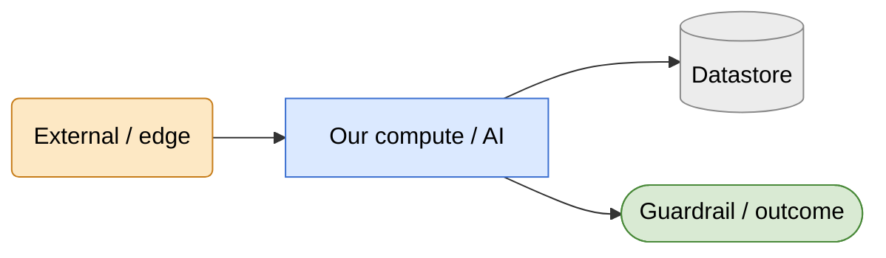

# Diagram conventions

PinballWizard's documentation uses [Mermaid](https://mermaid.js.org/) for every
diagram — authored as fenced ` ```mermaid ` blocks in the Markdown source, rendered
inline by GitHub. The source *is* the diagram: no external PNG / draw.io / Lucid links,
so a diagram can never drift from the doc it lives in, and every diagram is reviewable in
a normal diff.

A shared visual language keeps the ~14 diagrams across this repo reading as one family.

## Colour = node category

| Colour | Meaning | Examples |
| --- | --- | --- |
| 🟠 **Amber** | External actor / edge / third-party partner | Browser, Cloudflare, OPDB, Silverball Labs, manufacturer sites |
| 🔵 **Blue** | Our compute / process / AI agent or tool | Wizard API, RAG worker, scrapers, agents, function tools |
| ⚪ **Grey** | Datastore / backend / deferred stage | Cosmos, AI Search, Log Analytics |
| 🟢 **Green** | Guardrail / decision outcome / human-owned gate | refusal categories, human merge, escalation |

Dark text is pinned (`color:#000`) on every class so the light fills stay readable in
GitHub's dark mode. The canonical `classDef` set:



Colour is reinforcement, not the sole signal — shape carries the same information for
grayscale printing and colour-blind readers.

## Shape = node kind

| Shape | Mermaid | Kind |
| --- | --- | --- |
| Rounded | `(text)` | External actor / service |
| Rectangle | `[text]` | Process / service step |
| Cylinder | `[(text)]` | Datastore |
| Rhombus | `{text}` | Decision |
| Stadium | `([text])` | Terminal / outcome |

## Authoring rules (avoid renderer breakage)

These prevent the two failure modes that clip or break Mermaid across GitHub and PDF
renderers:

- **Quote any label containing `:` `?` `/` `&` `·` `<`** — e.g. `X["Stage 1: rank"]`, not
  `X[Stage 1: rank]`. Unquoted special characters break the parser.
- **Use `<br/>` for line breaks, never `\n`** — `\n` renders literally in most engines.
- **Escape ampersands as `&amp;`** inside labels.
- **Keep labels short**; push detail into the surrounding prose. Long single-line labels
  get truncated by the node box.
- **No `%%{init}%%` theme directives** — rendering targets (GitHub light/dark, PDF export)
  have different defaults; rely on the `classDef` set above instead.

## Validation

Every Mermaid block in the repo is parsed by CI ([`tools/docs/validate-mermaid.mjs`](../tools/docs/validate-mermaid.mjs))
on each pull request — a diagram that does not parse fails the build, the same way a
compile error would. Diagrams are tested, not just written.
