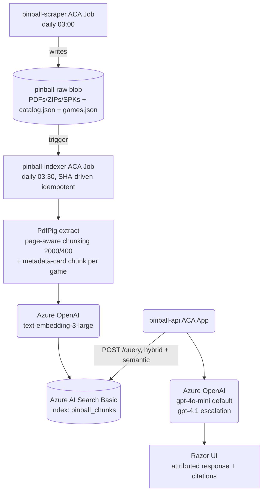
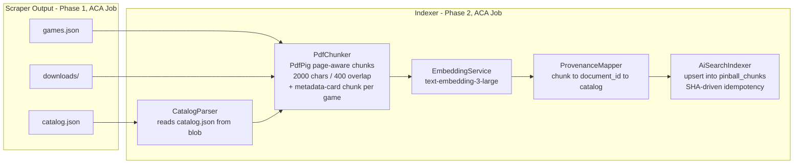
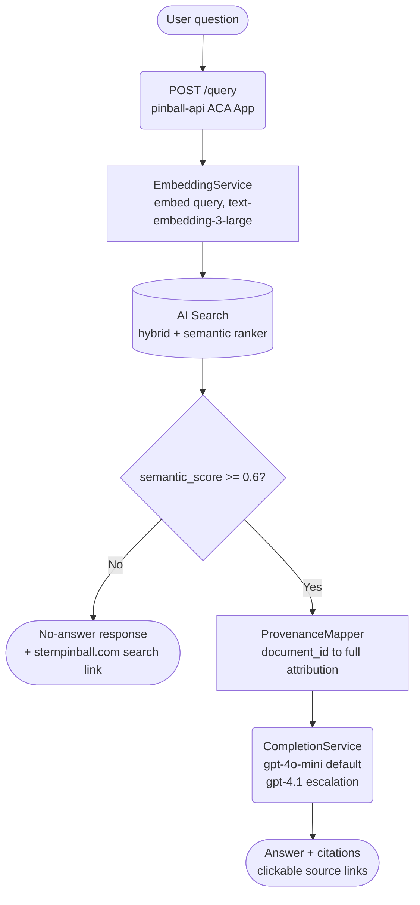
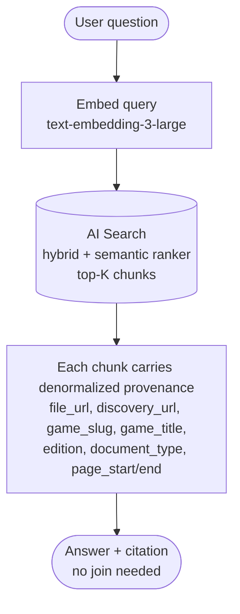

# pinwiz.ai — Phase 2 Infrastructure Plan

This document describes the Azure infrastructure that will host the
pinwiz.ai platform — the live, anonymous community resource for pinball
machine documentation, scoring, and (in v2) trade matchmaking and tournament
integration. Phase 1's scraper output (`catalog.json`, `games.json`,
downloaded files) is the input contract.

> **Brand:** Public-facing domain is `pinwiz.ai`. Repo name remains
> `PinballWizard` for continuity.
>
> **Decisions locked 2026-05-02 (initial scope) and same-day expanded to
> the master pinwiz.ai plan.** Architecture: Azure Container Apps + AI
> Search Basic + Cosmos DB Serverless + Cloudflare Pro, East US 2,
> **$400/mo cost cap** (anomaly alert at $300/mo). See the project memory
> `project_phase2_architecture_decisions.md` for the full rationale and the
> levers explicitly chosen *not* to pursue, and
> `project_phased_build_sequence.md` for the build order.

---

## 1. Topology

Single ACA environment hosting the API/UI, the scraper, and the indexer —
one platform for everything. Deployed via Azure Deployment Stacks.

### Edge layer (Cloudflare)

| Service | Plan | Role |
| --- | --- | --- |
| Cloudflare Registrar | — | Domain `pinwiz.ai` |
| Cloudflare DNS | Free | Authoritative DNS, traffic routes to ACA App |
| Cloudflare Pro | $20/mo ($240/yr annual) | Managed WAF (OWASP + Exposed Credentials), Bot Fight Mode, DDoS, CDN, rate limits, security headers |

Cloudflare terminates TLS at the edge and forwards clean traffic to Azure. Cloudflare Pro is the WAF tier for v1; **App Gateway WAF v2 + Front Door is explicitly deferred to v2** (§7).

### Shared resources (`main-shared.bicep` → `rg-pinwiz-shared`)

| Resource | Service | Notes |
| --- | --- | --- |
| AI Models | Azure OpenAI | `gpt-4o-mini` default, `gpt-4.1` escalation for hard queries; Vision LLM for OCR score photos |
| Embeddings | Azure OpenAI | `text-embedding-3-large` (3072-dim) |
| Search | Azure AI Search **Basic** ($74/mo) | Hybrid search + semantic ranker. The vector index. |
| **Document DB** | **Azure Cosmos DB Serverless** (NoSQL API) | Users, scores, passport, ingestion sources whitelist, raw ingestion documents (transcripts, forum sentiment). Source for the Change Feed. |
| Container Registry | ACR Basic | Images for ACA App + ACA Jobs |
| Functions runtime | Azure Functions Consumption | Cosmos DB Change Feed processor — chunks → embeds → upserts AI Search |
| **Identity** | **Microsoft Entra External ID** (CIAM tenant) | Admin RBAC (`GlobalAdmin` role) gating `/admin` from v1; social-login federations (Google / Apple / Discord) configured for end-user passport features when those ship |
| Secrets | Key Vault | Standard, Entra ID auth only |
| Monitoring | Log Analytics + App Insights | 1GB/mo capped; diagnostic settings route here |

### Per-environment (`main-env.bicep` → `rg-pinwiz-{prod|dev}`)

| Resource | Service | Config |
| --- | --- | --- |
| ACA Environment | Container Apps Env | Consumption profile, single environment |
| Web + API + Admin | ACA App `pinwiz-web` | **Blazor Web App** with **MudBlazor** UI library + ASP.NET Core API, HTTPS ingress, **min=1 live / min=0 during build** (Bicep parameter). Custom domain `pinwiz.ai` bound via ACA managed cert. Built-in `/admin` route group secured by Entra `GlobalAdmin` role for IngestionSources whitelist + telemetry views. |
| Scraper | ACA Job `pinwiz-scraper` | Schedule trigger, daily 03:00. Replaces the cron-on-VM Phase 1 shape. |
| Bulk indexer | ACA Job `pinwiz-indexer` | One-shot bulk reindex; routine indexing is event-driven via Function. |
| Storage | Blob Storage | Containers: `pinwiz-raw` (catalog.json + downloads), `pinwiz-processed` (chunk metadata), `pinwiz-photos` (score-photo SAS uploads) |

### Deployment posture: minimal/public

- Region: **East US 2**
- `enablePrivateNetworking = false` — public endpoints. VNet + Private Endpoints explicitly deferred (§7) — defense-in-depth would be theater for a public anonymous community resource with no PII / no payments.
- `searchBackend = 'azure-ai-search-basic'` — only supported backend
- `webMinReplicas` — Bicep parameter, `0` during active build, `1` in live
- `deployAcr = true` — ACR hosts ACA App + Job images
- Custom domain `pinwiz.ai`: bound to ACA Web App with managed cert; Cloudflare in front handles edge TLS
- Authentication: **Entra External ID** wired up in v1. Anonymous reads stay open for chat / search / browse. The `/admin` route is gated by Entra ID authorization policy requiring the `GlobalAdmin` role from day one. Federated social-login providers (Google / Apple / Discord) configured in v1 even though end-user auth-required features (passport / scores / trade) only enable when those features ship.

---

## 2. Security model

**Zero-secret architecture.** Every service-to-service connection uses Managed Identity + RBAC:

| Identity | Key Vault | Azure OpenAI | Storage | AI Search | ACR |
| --- | --- | --- | --- | --- | --- |
| `pinball-api` MI | Secrets User | OpenAI User | Blob Data Contributor | Index Data Reader (query) | AcrPull |
| `pinball-indexer` MI | Secrets User | OpenAI User | Blob Data Reader | Index Data Contributor | AcrPull |
| `pinball-scraper` MI | (none) | (none) | Blob Data Contributor | (none) | AcrPull |

- `disableLocalAuth = true` on Azure OpenAI — no API keys
- `allowSharedKeyAccess = false` on Storage — Entra ID only
- `disableLocalAuth = true` on AI Search — Entra ID only
- ACA Apps and Jobs all run with system-assigned managed identities; no shared secrets in container env vars

---

## 3. Data flow (RAG pipeline)



API and indexer share the same AI Search index. There is no alternative backend.

---

## 4. Phase 2 Architecture

### 4.1 Ingestion pipeline



### 4.2 Query pipeline



Example query: *"What's the wiring for Stranger Things trough opto?"* — embedding + hybrid retrieval returns top-K chunks; the threshold gate enforces refuse-rather-than-fabricate; provenance lookup populates the citation; the completion router picks model tier per query difficulty.

### 4.3 Search index schema (Azure AI Search)

One index, `pinball_chunks`. All metadata needed for filtering and citation
is denormalized onto each chunk so query-time joins are not required.

```jsonc
{
  "name": "pinball_chunks",
  "fields": [
    { "name": "chunk_id",          "type": "Edm.String",  "key": true },
    { "name": "document_id",       "type": "Edm.String",  "filterable": true },
    { "name": "content",           "type": "Edm.String",  "searchable": true, "analyzer": "en.microsoft" },
    { "name": "section_title",     "type": "Edm.String",  "searchable": true },
    { "name": "page_start",        "type": "Edm.Int32",   "filterable": true },
    { "name": "page_end",          "type": "Edm.Int32",   "filterable": true },
    { "name": "content_category",  "type": "Edm.String",  "filterable": true, "facetable": true },

    // Denormalized provenance (avoid query-time lookup against catalog.json)
    { "name": "file_url",          "type": "Edm.String",  "retrievable": true },
    { "name": "discovery_url",     "type": "Edm.String",  "retrievable": true },
    { "name": "document_type",     "type": "Edm.String",  "filterable": true, "facetable": true },
    { "name": "file_format",       "type": "Edm.String",  "filterable": true, "facetable": true },
    { "name": "tab",               "type": "Edm.String",  "filterable": true, "facetable": true },

    // Denormalized game metadata (faceted browse, pre-filter)
    { "name": "game_slug",         "type": "Edm.String",  "filterable": true, "facetable": true },
    { "name": "game_title",        "type": "Edm.String",  "searchable": true, "retrievable": true },
    { "name": "edition",           "type": "Edm.String",  "filterable": true, "facetable": true },

    // Vector field — text-embedding-3-large dimensionality
    { "name": "content_vector",    "type": "Collection(Edm.Single)", "searchable": true,
      "vectorSearchDimensions": 3072, "vectorSearchProfile": "default-vector-profile" }
  ],
  "semantic": { "configurations": [ { "name": "default", "prioritizedFields": {
      "titleField":          { "fieldName": "section_title" },
      "prioritizedContentFields":   [ { "fieldName": "content" } ],
      "prioritizedKeywordsFields":  [ { "fieldName": "game_title" }, { "fieldName": "document_type" } ]
  }}]}
}
```

**Why denormalize provenance onto chunks:** AI Search has no joins. Storing
`file_url`, `game_slug`, `edition`, etc. on each chunk lets the API return
a full citation in one round trip. The canonical source remains
`catalog.json` (and the `pinball-raw` blob); the chunk row is a derived
view that gets rebuilt from scratch if anything goes wrong.

### 4.4 RAG attribution chain (end-to-end)



Example response format:

```text
"The trough opto board uses a 12V supply with..."

Source: Stranger Things Pro Manual, pp. 23-24
   Direct link: https://sternpinball.com/wp-content/.../StrangerThings_Pro_web.pdf
   Found at: https://sternpinball.com/game/stranger-things/ → Specs & Manual tab
```

---

## 5. Deployment plan

### Step 1: Phase 1 scraper as ACA Job

The Phase 1 scraper container runs as `pinball-scraper` (ACA Job, schedule trigger). On each run it writes `catalog.json`, `games.json`, and downloaded files into the `pinball-raw` blob container. This replaces the cron-on-VM deployment shape originally planned for Phase 1.

### Step 2: Provision Phase 2 infrastructure

Deploy `main-shared.bicep` + `main-env.bicep` via Azure Deployment Stack to create the shared resource group (Search, OpenAI, ACR, Storage, Key Vault, monitoring) and the per-env resource group (ACA environment + apps + jobs).

### Step 3: Upload scraper output to Blob Storage

```bash
az storage blob upload-batch \
  --account-name <storage-account> \
  --destination pinball-raw \
  --source ./data/downloads
```

And separately upload `catalog.json` + `games.json` to the same container.

### Step 4: Ingestion pipeline

- Push the AI Search index schema (`pinball_chunks`) — see §4.3
- ACA Job `pinball-indexer` reads `catalog.json` from blob → for each doc where SHA changed since last index: extract PDF text (PdfPig) → chunk (page-aware, 2000 chars / 400 overlap) → embed (`text-embedding-3-large`) → upsert into AI Search
- Generate one synthesized "metadata-card" chunk per game (combining title, editions, designer, theme) so semantic queries can reach pure-metadata facts
- Idempotent on `document_id` so a re-run is safe; SHA-driven so unchanged content does not re-embed

### Step 5: Query endpoint

- Hybrid retrieval: vector similarity + BM25 + AI Search semantic ranker (Basic tier includes it)
- Threshold gate: top semantic_score < 0.6 → return "no answer found" with sternpinball.com search link (no hallucination)
- RAG prompt with denormalized provenance from the chunk row → completion router (`gpt-4o-mini` default, `gpt-4.1` for hard queries)

### Step 6: UI — Blazor Web App + MudBlazor

- **Blazor Web App** (interactive server components) inside the same `pinwiz-web` ACA App; no separate frontend container.
- **MudBlazor** is the strict UI component library. `MudDataGrid`, `MudPaper`, `MudChart`, etc. for everything. No mixing in other component libraries.
- **Public anonymous routes**: chat with attributed answers and citation chips clickable to source sites; faceted sidebar (game / edition / doc type / tab / category); game-detail pages; location map.
- **Admin Control Plane (`/admin`, built into the same Blazor app)** — secured by Entra ID authorization policy requiring `GlobalAdmin` role. Includes:
  - `/admin/ingestion-sources` — `MudDataGrid` over the Cosmos `ingestion_sources` container; enable/disable manufacturers, edit cadence, edit politeness overrides at runtime
  - `/admin/telemetry` — recent scrape runs, success/failure rates, document-volume trends
  - `/admin/users` — Entra-backed admin role management
- Custom domain bound via ACA managed certificate; Cloudflare Pro in front for edge TLS + WAF.

### Step 7: IngestionSources whitelist (Cosmos data, not Bicep config)

- Cosmos container `ingestion_sources` stores per-manufacturer config: `id`, `displayName`, `scraperImplKey` (mapped to a registered concrete `ISourceScraper` impl), `baseUrl`, `enabled`, `cadence`, `politenessOverrides`, telemetry counters.
- The Bicep still creates one ACA Job per manufacturer (failure isolation + parallelism), but the **enabled / cadence / config** state lives in Cosmos. Each ACA Job reads its config from Cosmos at startup.
- Adding a new manufacturer = code change (new `ISourceScraper` impl + new ACA Job in Bicep) + a row in `ingestion_sources`. The "is this source live in production?" toggle is a database flip via the Admin UI, not a redeploy.

---

## 6. Cost estimate

**Hard cap: $400/mo. Anomaly alert at $300/mo.**

| Component | SKU | Monthly |
| --- | --- | --- |
| Azure AI Search | Basic | $74 |
| ACA Web App `pinwiz-web` (0.5 vCPU + 1GB, Blazor + API) | Consumption, **min=1 live / min=0 build** | ~$35 live / ~$3-10 build |
| ACA Jobs (scraper + bulk indexer) | Consumption, schedule-triggered | <$1 combined |
| Azure Functions (Cosmos Change Feed → AI Search) | Consumption | $5-20 |
| **Cosmos DB Serverless** (users, scores, passport, ingestion docs) | NoSQL API, RU-based | $25-100 |
| Container Registry | Basic | $5 |
| Storage Account (catalog blobs + downloads + score photo SAS) | Standard LRS | $2-5 |
| Azure OpenAI: embeddings | `text-embedding-3-large`, SHA-gated re-embed | ~$5 one-time + ~$0.50/mo incremental |
| Azure OpenAI: completions | `gpt-4o-mini` default + `gpt-4.1` router (~15-20% of queries) | $10-40 variable |
| Azure OpenAI: Vision LLM | OCR for score photos | $5-50 variable |
| Application Insights | 1GB/mo cap | $2-5 |
| Log Analytics | 1GB/mo cap | $2-3 |
| Key Vault | Standard | <$1 |
| **Cloudflare Pro** | DNS + CDN + managed WAF + Bot Fight + DDoS + rate limits | $20 ($240/yr annual) |
| **Microsoft Entra External ID** | CIAM tenant (admin RBAC + social-login federations); free tier covers v1 monthly active users | $0 (free tier) |
| **Steady-state (live)** | | **~$195-370/mo** |
| **Steady-state (active build, min=0)** | | **~$165-340/mo** |

**Decisions explicitly NOT taken** (and the cost they would have added):

- AI Search Standard — would add ~$170/mo for marginal quality gain at v1 corpus size
- APIM (any tier) — replaced by Cloudflare Pro at the edge; LLM gateway pattern can be added if traffic justifies token-budget telemetry
- Redis Cache (semantic cache) — only made sense behind APIM; in-process LRU cache on the API container is sufficient at v1 scale
- VNet + Private Endpoints — public-endpoint posture is right-sized for a public community resource with no PII / no payments / no admin surface; defense-in-depth here is theater
- Multi-region failover — would ~2x infra cost; single region accepted
- Separate dev environment with its own AI Search — saves $74/mo dev tier; iterate on prod from a feature branch with min=0
- Custom embedding fine-tuning — entire engineering investment for ~2% recall
- End-user social login (passport/scores/trade) — Entra External ID infrastructure provisioned v1 (admin RBAC needs it from day one), end-user social-login flows enable when passport / scores / trade features ship

This trade space is the cost/value showcase — picking the managed service (AI Search Basic) that ships the semantic ranker rather than building it on pgvector, and refusing to gold-plate features the corpus size doesn't warrant.

---

## 7. Deferred to v2 (designed but unbuilt)

Each item below is in the architectural plan with explicit "designed but unbuilt" status. The decision to defer is the cost/value showcase — every item has a documented trigger condition for revisiting.

| Feature | v2 cost when activated | Trigger to revisit |
| --- | --- | --- |
| **Whisper transcription pipeline** | $36 per ~100 hrs + Function trigger | Proprietary content (gameplay tutorials) where YouTube auto-captions don't cover |
| **App Gateway WAF v2 + Front Door** | ~$330+/mo | Multi-region, compliance requirements, or Azure-native WAF demanded by use case |
| **Trade Matchmaker (3-way / 4-way graph algorithm)** | Engineering only | Real user activity threshold (~100 active users with wishlists) |
| **Match Play / IFPA real-time tournament push** (SignalR) | Engineering only | Platform adoption by tournament organizers |
| **Pinside scraping** | Politeness review needed | Community sign-off; PinballPrices first |
| **End-user social login** (Google / Apple / Discord federated identities for passport / scores / trade) | Entra External ID free tier; per-IDP config-only once tenant exists | When passport / scores / trade features start shipping |
| **VNet + Private Endpoints** | ~$30-50/mo + complexity | Compliance / payments / admin surface justifies it |
| **Dream Game generator** ([concept](dream_game_concept.md)) | Text generation negligible; image generation $50-150/mo at modest scale, quota-gated | Phase 5 marquee feature OR post-launch v2; decision when Phase 4 lands and budget headroom is known |
| **Strategy Tracker** ([concept](strategy_tracker_concept.md)) — competitive-player strategy library + session log + AI-assisted refinement, **headline module of Digital Passport** | Cost-trivial (no image gen); fits in $400/mo cap with room to spare | Sequence-dependent on OCR score capture + ≥1 tournament API integration. Strong reason to promote Passport's first module to ship alongside public Blazor launch. |

The WAF tier choice in particular is the headline cost/value story: **Cloudflare Pro ($20/mo amortized, $240/yr annual) hits the same OWASP threats at the edge that App Gateway WAF v2 ($330+/mo) would catch behind it**. For a public anonymous community resource at v1 traffic levels, paying 13x more for a second wall behind the first is the kind of decision a portfolio reviewer should be able to find clearly explained — that's why it's documented here rather than left implicit.

> **See also: [`ai_ml_ideas.md`](ai_ml_ideas.md) — AI/ML ideas catalog.**
> Distinct from this table. The deferred-to-v2 table above is "designed
> but unbuilt" — items with a specific design + cost + trigger. The
> AI/ML catalog is "evaluated but uncommitted" — brainstorm-stage
> features documented so the option set is visible during scope
> conversations. Three starred candidates (Playfield video analysis,
> AI pinball coach, Service bulletin diagnosis) get deeper feasibility
> treatment in that doc.

---

## 7. Engineering principles

These are the patterns Phase 2 will follow — standard Azure best practices, not project-specific:

1. **Managed Identity everywhere** — no API keys, no connection strings with passwords
2. **Entra ID auth** at every authentication boundary
3. **Feature flags in Bicep** — toggleable components via parameter files
4. **Deployment Stacks** — lifecycle-managed, drift-protected
5. **AVM modules** — Azure Verified Modules for all resource types where available
6. **Subscription guard** — `assert` to prevent wrong-subscription deployment
7. **Pre-flight checks** — auto-purge soft-deleted resources before deploy
8. **Retry with backoff** — transient Azure errors handled automatically
9. **Shared / per-environment split** — cross-cutting resources vs. isolated ones
10. **Diagnostic settings on everything** — all logs route to Log Analytics
