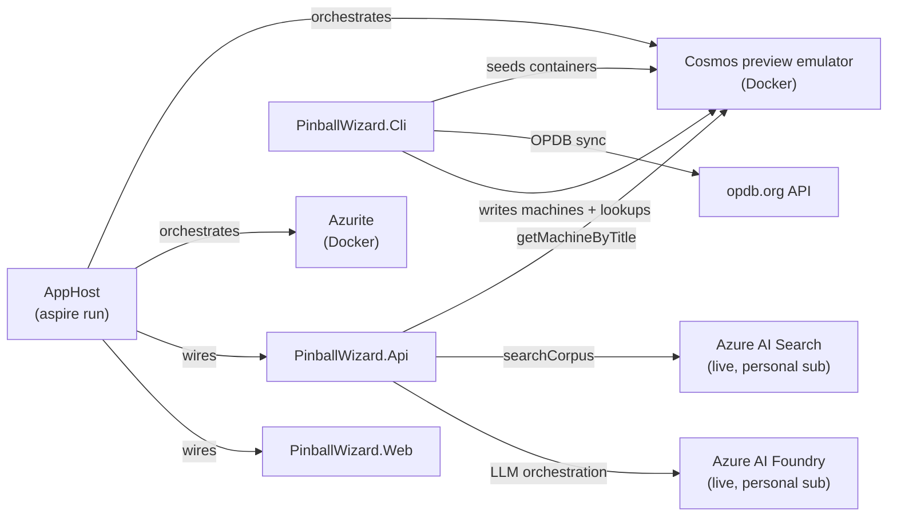

# Running PinballWizard locally with a functional catalog

This guide covers everything needed to get a fully functional local environment — one where the Wizard chat surface answers machine questions with grounded, cited responses rather than refusing with "Outside My Coverage."

---

## Architecture of a local session



The local/cloud split follows [ADR-0012](adr/0012-cosmos-arm-schema-data-plane-items.md):

| Dependency | Local path | Why |
|---|---|---|
| Cosmos DB | Aspire emulator (preview container, persistent Docker volume) | Emulator exists; full data-plane API |
| Blob Storage | Azurite (Docker) | Emulator exists |
| Azure AI Foundry | Live personal sub (`b1f33f17`) via `DefaultAzureCredential` | No emulator |
| Azure AI Search | Live personal sub via `DefaultAzureCredential` | No emulator |

Foundry and AI Search require a live Azure identity. The emulator containers are reachable only through the Aspire-injected connection string — not via a manually set `Cosmos:AccountEndpoint`.

---

## Prerequisites

- Docker Desktop (for the Cosmos preview emulator and Azurite containers)
- .NET 10 SDK (pinned via `global.json`)
- .NET Aspire workload (`dotnet workload install aspire`)
- Aspire CLI (`dotnet tool install -g Microsoft.Aspire.Cli` or via workload)
- An OPDB API token — register at [opdb.org/api](https://opdb.org/api); stored as machine env var `OPDB_API_TOKEN`
- Access to the personal Earlybird Azure subscription (`b1f33f17`) — the Foundry project and AI Search index live there
- **Preflight before any local-live CLI run** (i.e. any command that touches live Cosmos / AI Search / Foundry): run `pwsh ./infra/scripts/Check-DeveloperRbac.ps1`. The three developer data-plane RBAC grants (Cosmos Built-in Data Contributor, Search Index Data Contributor, Cognitive Services OpenAI User on Foundry) are stripped whenever a Deployment Stack runs without `developerObjectId` set — the committed `main-shared.dev.bicepparam` intentionally leaves it empty, so any deploy from a fresh clone silently removes them. Without them every live call 403s with no useful error. See [#744](https://github.com/Early-Bird-Solutions-LLC/PinballWizard/issues/744).

---

## Step 1 — Isolate your Azure identity

PinballWizard authenticates to live Azure services (Foundry, AI Search) via `DefaultAzureCredential -> AzureCliCredential`. The machine-default `~/.azure` CLI session may be signed in to a different tenant (such as a work Microsoft 365 tenant). An `.azure-local` directory in the repo root provides an isolated CLI session scoped to the personal pinwiz.ai identity.

The VS Code workspace settings wire this automatically for integrated terminals:

```json
// .vscode/settings.json (committed, portable)
"terminal.integrated.env.windows": {
    "AZURE_CONFIG_DIR": "${workspaceFolder}/.azure-local"
}
```

**First-time setup (one-time, any OS):** open a new terminal inside VS Code (so `AZURE_CONFIG_DIR` is already set), then sign in:

```pwsh
az login
# A browser tab opens — sign in as jim@earlybirdsolutions.com
# Select subscription: b1f33f17 (pinwiz.ai)
```

The credentials land in `.azure-local/` (gitignored) and persist across sessions. Subsequent terminal sessions in VS Code reuse them automatically. The AppHost relays `AZURE_CONFIG_DIR` to the orchestrated `Api` and `Web` children so their `DefaultAzureCredential` resolves the same personal identity.

> **Never run `az login` without `AZURE_CONFIG_DIR` set in this project.** Doing so writes to `~/.azure` and may overwrite a different active session on the machine. The VS Code terminal sets it automatically; PowerShell sessions outside VS Code need it set manually:
>
> ```pwsh
> $env:AZURE_CONFIG_DIR = "<repo-root>/.azure-local"
> ```
>
> **`AZURE_TOKEN_CREDENTIALS=dev` is required when running against live Azure from a local machine.** Without it, `DefaultAzureCredential` probes IMDS (the Azure managed-identity endpoint) first and blocks for several seconds before falling through to `AzureCliCredential`. On a local dev box IMDS never resolves, so Cosmos and AI Search writes time out silently rather than failing fast. Set it before any CLI command that touches live Azure:
>
> ```pwsh
> $env:AZURE_TOKEN_CREDENTIALS = "dev"
> ```
>
> The VS Code `.vscode/settings.json` does **not** set this automatically — add it to your shell profile or set it at the start of each session. The AppHost does not relay it to child processes; set it in the same terminal before running CLI commands against live services.

---

## Step 2 — Start the AppHost

```pwsh
pwsh ./start-apphost.ps1
```

This runs `aspire run --apphost src\PinballWizard.AppHost`, which:

1. Pulls the Cosmos preview emulator and Azurite images on first run (~3 GB, one-time).
2. Starts both containers with persistent Docker volumes so seed data survives restarts.
3. Wires the API and Web projects with Aspire-injected connection strings and the relayed `AZURE_CONFIG_DIR`.
4. Registers the AppHost with the Aspire CLI (enables `aspire agent mcp` for AI assistant integration via the committed `.mcp.json`).

**Finding the Web URL:** the AppHost prints a dashboard URL at startup, typically `https://localhost:17110`. Open it, navigate to the `web` resource, and click the endpoint URL. The Web app starts on a random HTTPS port; the dashboard is the canonical lookup.

> **First-run note:** the Cosmos emulator takes 60-90 seconds to initialize after the container starts. The dashboard shows the `cosmos` resource as "Starting" during this window. Wait for it to reach "Running" before proceeding to the seed steps.

---

## Step 3 — Seed the Cosmos emulator

The emulator starts **empty**. The `getMachineByTitle` function tool reads from the `machines` and `machine_title_lookups` containers. Until they are seeded, every machine question returns "Outside My Coverage" — not a bug; there is genuinely nothing in the catalog.

Open a **new** terminal in VS Code (so `AZURE_CONFIG_DIR` is set), then run the seed sequence below. The CLI auto-detects the Aspire emulator via the injected `ConnectionStrings:cosmos` env var and uses `DataPlaneCosmosProvisioner` (master-key auth, no ARM call required).

### 3a — Bootstrap containers (idempotent)

```pwsh
dotnet run --project src/PinballWizard.Cli -- --ensure-cosmos-containers
```

Creates all Cosmos databases and containers (`machines`, `machine_title_lookups`, `ingestion_sources`, `scraped_documents`, `rag_*` containers). Safe to re-run at any time.

### 3b — Seed ingestion sources

```pwsh
dotnet run --project src/PinballWizard.Cli -- --seed-ingestion-sources
```

Writes the 10 canonical `IngestionSource` records (one per manufacturer + OPDB) into the `ingestion_sources` container. Required for per-source politeness overrides to resolve correctly.

### 3c — Seed the machine catalog

**Option A: Full OPDB sync (complete catalog, slow)**

```pwsh
$env:Opdb__ApiToken = $env:OPDB_API_TOKEN     # from machine env var
$env:Opdb__BaseUrl  = "https://opdb.org/api/"

dotnet run --project src/PinballWizard.Cli -- --source opdb
```

Fetches the OPDB catalog (~2,400 machines) in paginated segments and writes each machine into `machines` + a title-lookup row into `machine_title_lookups` (dual-write per ADR-0025 section 1).

> **Time cost:** the full sync takes **30-90 minutes** due to the polite per-request delay enforced by `IPolitenessGate`. OPDB is a community resource and this delay is not negotiable. Plan accordingly, or use Option B for a quick start.

**Option B: Featured machines only (fast, ~10 machines)**

```pwsh
dotnet run --project src/PinballWizard.Cli -- --seed-featured-machines
```

Writes the curated set of ~10 featured machines (the landing page carousel) into both containers. The Wizard can answer questions about these machines immediately. Run Option A in the background or overnight to expand coverage to the full catalog.

---

## Step 4 — The `matchTokens` data-shape contract

The `machine_title_lookups` container holds a `matchTokens` field that expands manufacturer abbreviation keys to their full typeable token sets. This field **must be a nested array-of-arrays** (`List<List<string>>` in C#) — not a flat string array.

**Correct shape (written by `--source opdb` and `--seed-featured-machines`):**

```json
{
  "id": "stern godzilla",
  "normalizedTitle": "stern godzilla",
  "opdbIds": ["G9KLVB3IVH"],
  "matchTokens": [
    ["stern"],
    ["jjp", "jersey", "jack"]
  ]
}
```

**Wrong shape (flat array — causes silent refusal):**

```json
"matchTokens": ["jjp", "jersey", "jack"]
```

A flat insert causes `MachineGroundingTool.ScoreEntryAgainstTokens` to fail silently at deserialization time. The symptom is indistinguishable from a genuine lookup miss: the Wizard returns "Outside My Coverage" even for machines that are clearly present in `machines`. This is the same class of failure documented in [ADR-0025](adr/0025-cosmos-for-user-delight.md) (the 2026-06-18 serializer-mismatch follow-up, where the Aspire emulator client was constructed without the custom `SystemTextJsonCosmosSerializer`, causing all local writes to be silently rejected at the gateway level).

The risk only arises when inserting records **manually** — via the Cosmos Data Explorer, a raw test fixture, or a script that builds JSON by hand. The CLI seed commands always go through `OpdbMachineMapper.GetMatchTokens`, which produces the correct nested shape.

---

## Step 5 — Verify the catalog is functional

With the AppHost running and Cosmos seeded, open the Web app URL from the Aspire dashboard and ask about a machine that was synced:

> "What modes are available on Stern Godzilla Premium?"

A functioning catalog produces:

- A streamed answer referencing specific gameplay features
- One or more inline citation markers (e.g., `[1]`) linked to a source document on `sternpinball.com`
- A citation card at the bottom with the document title and URL

If you see "Outside My Coverage" or a generic refusal, work through this checklist:

| Symptom | Check | Fix |
|---|---|---|
| Refusal for any machine | `machines` container empty | Re-run Step 3 |
| Refusal despite machines present | `matchTokens` is a flat array | Re-seed via CLI (not Data Explorer) |
| Answer but no citations | AI Search index empty | Run `--ensure-ai-search`; check RAG worker logs in Aspire dashboard |
| Foundry auth error in AppHost console | `AZURE_CONFIG_DIR` not set | Open a fresh VS Code terminal; or set `$env:AZURE_CONFIG_DIR` manually |
| `cosmos` resource stays "Starting" | Docker not running or volume conflict | Restart Docker Desktop; re-run `start-apphost.ps1` |

---

## Known emulator limitation — related-machine suggestions

The Cosmos **vNext-preview emulator** (Postgres-backed) cannot execute a cross-partition query whose `WHERE` clause calls a **function** — both `STRINGEQUALS(c.title, @t, true)` and `LOWER(c.title) = @t` fail with `InternalServerError (500)` / `PGCosmosError … PostgresError(EXX000)`. Cross-partition queries with **exact equality** (e.g. `WHERE c.groupId = @g`) work fine, as do point-reads. This is a preview-emulator gap, not a code bug — the same queries run correctly against deployed Cosmos.

The one query this affects is [`MachineRepository.QueryByTitleAsync`](../src/PinballWizard.Infrastructure/Persistence/Cosmos/MachineRepository.cs) (case-insensitive title match, which forces the function). Its only consumer is the refusal recovery's **related-machine suggestions**, so **on the local emulator, refusals render without the "related machines" hint** — everything else (community routing CTAs, the honest reason/rephrase text, the answer flow, `getMachineByTitle` point-reads) works normally.

This degrades **gracefully and observably**: `RefusalRecoveryService` isolates the failure so it never drops the community CTAs, logs it at `Error`, and meters it on `pinwiz.ai.related_machines_lookup_errors_total`. A non-zero rate **locally** is this known emulator gap; a non-zero rate **in production** signals a real Cosmos read-path problem.

A future "works-everywhere" fix would store a lowercased `titleLower` field and match it by exact equality, or route related-machine matching through the `machine_title_lookups` point-read view (the ADR-0025 PR-5 direction). Neither is required for a functional local demo.

---

## How the emulator connection is detected

The CLI selects its Cosmos path based on which env vars are present at startup:

| Env var(s) present | Provisioner selected | Auth |
|---|---|---|
| `ConnectionStrings:cosmos` (Aspire-injected) | `DataPlaneCosmosProvisioner` | Master key (emulator only) |
| `Cosmos:AccountEndpoint` + `Cosmos:AccountResourceId` | `ArmCosmosProvisioner` | `DefaultAzureCredential` + ARM |
| Neither | Scraper-only mode (no Cosmos) | n/a |

When launched via `dotnet run` inside a terminal where the AppHost is running, Aspire injects `ConnectionStrings:cosmos` automatically. You do not need to set it manually. Full rationale for the ARM-vs-data-plane split is in [ADR-0012](adr/0012-cosmos-arm-schema-data-plane-items.md).

---

## AppHost auto-seed recommendation

The current posture requires a manual seed sequence after every fresh-emulator start. A candidate improvement: add an `IResourceLifecycleHook` to the AppHost that fires after the `cosmos` resource reaches Running state and, when the `PinballWizardDb` database is absent, automatically runs `--ensure-cosmos-containers` followed by `--seed-featured-machines`. This would make `pwsh ./start-apphost.ps1` fully self-contained for a demo-ready local environment — answering ~10 representative machines within two minutes of first boot — without blocking the full `--source opdb` sync. The hook would not run if the database already exists, so it is safe for day-to-day restarts. Tracked as a future enhancement; implementation would live in `src/PinballWizard.AppHost/`.

---

## Reference

| Link | What it covers |
|---|---|
| [ADR-0012](adr/0012-cosmos-arm-schema-data-plane-items.md) | ARM vs data-plane provisioner split; emulator vs live Cosmos auth |
| [ADR-0025](adr/0025-cosmos-for-user-delight.md) | `machine_title_lookups` design, `matchTokens` amendment, serializer-mismatch incident |
| [`docs/operations.md`](operations.md) | Live-environment operational commands and runbooks |
| [`README.md` — Local development with .NET Aspire](../README.md#local-development-with-net-aspire) | Quick reference already in the README |
