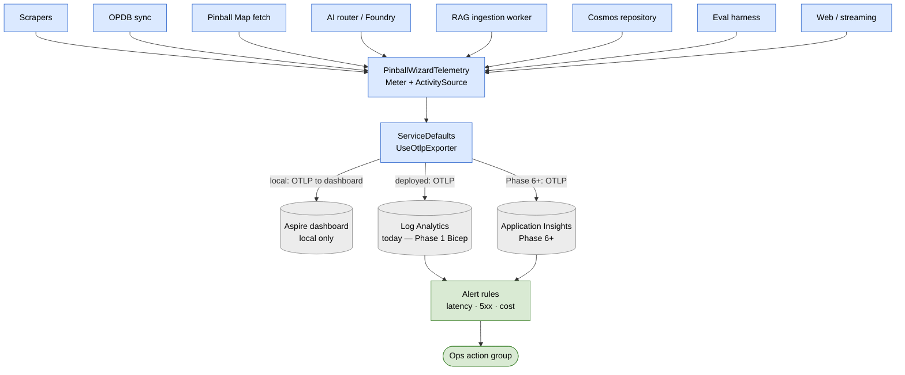

# Observability

The OpenTelemetry inventory for PinballWizard. Captures every metric, activity, and standard tag the project emits, plus the pattern Phase 3 / 4 / 5 services follow when adding new instruments.

Read alongside [`build-spec.md`](build-spec.md) Phase 2 § Scope item 5 (the scope entry that produced this doc) and [`quality-spec.md`](quality-spec.md) § "Operational quality" (the SLO targets these metrics back).

## Pipeline summary

- **Meter and ActivitySource:** [`PinballWizard.Application.Observability.PinballWizardTelemetry`](../src/PinballWizard.Application/Observability/PinballWizardTelemetry.cs) is the single project-wide source of metrics and traces. Both are named `"PinballWizard"`. New instruments — counters, histograms, activities — live alongside the existing ones in this static class.
- **Registration:** [`PinballWizard.ServiceDefaults`](../src/PinballWizard.ServiceDefaults/Extensions.cs) registers the Meter via `AddMeter("PinballWizard")` and the ActivitySource via `AddSource("PinballWizard")` in its `ConfigureOpenTelemetry`. The string literal is duplicated in ServiceDefaults rather than referencing the typed constant — a typed reference would invert the layering (ServiceDefaults → Application). The duplication is documented in both files.
- **Exporter:** the Aspire dashboard injects `OTEL_EXPORTER_OTLP_ENDPOINT` when running under `start-apphost.ps1`, which makes ServiceDefaults wire `UseOtlpExporter()`. Container Apps (Phase 5+) will inject the same env var pointing at Application Insights' OTLP endpoint, so the exporter wiring is unchanged across environments.
- **Where signals land today:** Log Analytics (via Cosmos diagnostic settings — Phase 1 Bicep). Aspire dashboard locally.
- **Where signals will land (Phase 6+):** Application Insights, once Phase 2 Bicep flips. Same OTLP exporter + Meter / Source names continue to work; only the destination changes.

The diagram below traces how telemetry moves from emitting sources through the shared instrumentation layer, out via the OTLP exporter, and into the backend(s) that back alert rules.



## Metric inventory

### OPDB sync (Phase 2 § Scope item 5)

All counters carry a `pinwiz.opdb.sync.mode` attribute — `"apply"` for real runs, `"dry_run"` for projection runs — so dashboards can filter operational charts to apply-only and pre-deploy validation runs to dry-run-only.

| Instrument | Type | Unit | Description |
| --- | --- | --- | --- |
| `pinwiz.opdb.sync.fetched` | Counter\<long> | `{record}` | OPDB records fetched from the API across all sync runs |
| `pinwiz.opdb.sync.inserted` | Counter\<long> | `{machine}` | Machines newly inserted into the repository (or projected-insert in dry-run) |
| `pinwiz.opdb.sync.updated` | Counter\<long> | `{machine}` | Existing machines updated with merged OPDB fields (or projected-update in dry-run) |
| `pinwiz.opdb.sync.skipped` | Counter\<long> | `{record}` | OPDB records skipped because they failed validation or mapping |
| `pinwiz.opdb.sync.failed` | Counter\<long> | `{run}` | OPDB sync runs that aborted with an exception |
| `pinwiz.opdb.sync.duration_ms` | Histogram\<double> | `ms` | Wall-clock duration of an OPDB sync run |

**Emission cadence:** all counters and the histogram emit a single observation **per run** (in the `finally` block of `OpdbSyncService.SyncAsync`). Per-record observations would multiply observation overhead and balloon cardinality without operational benefit at the current 9-source scale. When per-source metrics become valuable (Phase 3+), add a `pinwiz.source` attribute rather than fanning into per-source instruments.

### Pinball Map fetch (Phase 3)

Pinball Map fetches are per-region (1 fetch = 1 region's locations), not bulk-streamed like OPDB. Counters carry a `cache_outcome` attribute (`hit` / `miss` / `refresh`) so dashboards can observe how often the on-disk cache spares the network — the politeness story for Pinball Map is partially told through this attribute.

| Instrument | Type | Unit | Description |
| --- | --- | --- | --- |
| `pinwiz.pinballmap.fetched` | Counter\<long> | `{region}` | Pinball Map region-locations fetches across all calls (cache hits + misses) |
| `pinwiz.pinballmap.locations` | Counter\<long> | `{location}` | Locations returned by Pinball Map fetches. Useful for capacity planning vs API growth |
| `pinwiz.pinballmap.failed` | Counter\<long> | `{fetch}` | Pinball Map fetches that aborted with an exception |
| `pinwiz.pinballmap.fetch.duration_ms` | Histogram\<double> | `ms` | Wall-clock duration of a single Pinball Map region fetch in milliseconds |

**Emission cadence:** one observation per region-fetch invocation. The `cache_outcome` attribute lets dashboards distinguish miss-driven network load (the polite-by-construction signal) from refresh-driven load (cache-eviction policy signal). A spike in `cache_outcome="miss"` without a corresponding spike in `cache_outcome="refresh"` indicates either cache-storage pressure or new-region adoption — both worth alerting on.

## Activity inventory

| Activity name | Source | Captured tags |
| --- | --- | --- |
| `pinwiz.opdb.sync` | `PinballWizard` | `pinwiz.opdb.sync.mode`, `pinwiz.opdb.sync.fetched`, `pinwiz.opdb.sync.inserted`, `pinwiz.opdb.sync.updated`, `pinwiz.opdb.sync.skipped`, `pinwiz.opdb.sync.duration_ms`. On exception: `ActivityStatusCode.Error` + the exception's `Message` |
| `pinwiz.pinballmap.fetch` | `PinballWizard` | `pinwiz.pinballmap.region`, `pinwiz.pinballmap.locations`, `pinwiz.pinballmap.fetch.duration_ms`. On exception: `ActivityStatusCode.Error` + the exception's `Message`. `ActivityKind.Client` (outbound HTTP) |

Activities cover one OPDB sync invocation or one Pinball Map region fetch end-to-end. The trace tags duplicate the per-run / per-fetch metric observations so a trace alone tells the operation's full story without joining against the metric stream.

## IngestionSource write-back

Independent of the OTel pipeline, `OpdbSyncService` writes per-run state back to the source's Cosmos `IngestionSource` document via `IIngestionSourceRepository.RecordRunResultAsync`:

| Field on `IngestionSource` | Behavior on apply run | Behavior on dry-run |
| --- | --- | --- |
| `LastRunAt` | Set to run start time | **Not modified** (dry-run shouldn't update operator-visible "last run" timestamps) |
| `LastSuccessAt` | Set to run start time on success; preserved on failure | Not modified |
| `TotalDocumentsDiscovered` | Incremented by `inserted + updated` | Not modified |
| `TotalRunFailures` | Incremented by 1 on failure; unchanged on success | Not modified |

This write-back is the only metric path that distinguishes between apply and dry-run at storage level — the OTel counters use the `pinwiz.opdb.sync.mode` attribute for the same purpose at observation level.

A write-back failure does **not** mask the original sync outcome — it's caught and logged at error level inside the `OpdbSyncService.SyncAsync` finally. The source's `lastRunAt` may lag by one run; the next run reconciles.

## How to consume

### Locally (Aspire dashboard)

```pwsh
pwsh ./start-apphost.ps1
```

The dashboard URL printed in the AppHost output (default `https://localhost:17110`) renders the Meter and ActivitySource live. Counters chart over time; histograms render bucket distributions; activities show as traces with the captured tags inline.

### Deployed (Log Analytics today)

OTLP signals flow into Log Analytics via Cosmos diagnostic settings (Phase 1 Bicep). Query examples:

```kusto
// OPDB sync run summary, last 24h, apply mode only
AppMetrics
| where Name startswith "pinwiz.opdb.sync."
| where Properties["pinwiz.opdb.sync.mode"] == "apply"
| where TimeGenerated > ago(24h)
| summarize Total=sum(Sum) by Name, bin(TimeGenerated, 1d)

// Failed runs in the last week
AppMetrics
| where Name == "pinwiz.opdb.sync.failed"
| where TimeGenerated > ago(7d)
| summarize Failures=sum(Sum) by bin(TimeGenerated, 1d)
```

> **Table-name footnote:** the destination table depends on the OTLP ingestion path. Container Apps' direct Log Analytics workspace surfaces metrics under `AppMetrics`; Application Insights' classic OTel ingestion (Phase 6+ when AI is provisioned) surfaces them under `customMetrics`. If a query returns no rows, swap the table name and re-run; the column shapes are similar enough that the rest of the query lands.

### Deployed (Application Insights — Phase 6+)

Once Phase 2 Bicep flips and App Insights is provisioned, the same OTLP exporter writes there. KQL queries port directly; UI charts pick the metric names from the Meter automatically.

## Adding new instruments (Phase 3 / 4 / 5 pattern)

When a new service or scraper needs instrumentation:

1. **Add the instrument to [`PinballWizardTelemetry`](../src/PinballWizard.Application/Observability/PinballWizardTelemetry.cs).** Use the `pinwiz.<domain>.<operation>.<measure>` naming convention — e.g., `pinwiz.scrape.run.documents_discovered`, `pinwiz.rag.query.latency_ms`, `pinwiz.wizard.answer.citation_count`.
2. **Set unit + description.** `unit` is OTel UCUM (`{record}`, `{user}`, `ms`, `By`, etc.); `description` is a one-sentence explanation that appears in dashboards.
3. **Tag with attributes, not separate instruments.** A per-source counter is `pinwiz.scrape.run.documents_discovered{source="jjp"}`, NOT `pinwiz.scrape.jjp.run.documents_discovered`. Attribute cardinality stays bounded (8 sources × 2 modes = 16 series); per-source instruments multiply the inventory.
4. **Update this doc.** Add the new instrument to the inventory table in the same PR. The `PinballWizardTelemetryTests` pinning tests catch instrument-name typos at build time; this doc catches them at review time.
5. **Update the Aspire dashboard or Log Analytics dashboard if applicable.** A new metric without a chart is invisible.

## Standard tags

When emitting a metric or activity, prefer these attribute keys to maximize cross-service queryability:

| Attribute key | Type | Notes |
| --- | --- | --- |
| `pinwiz.<domain>.<operation>.mode` | string | `apply` / `dry_run` for operations that have those shapes |
| `pinwiz.source` | string | Source key from `IngestionSource.id` (e.g., `stern`, `jjp`, `opdb`) |
| `pinwiz.partition_key` | string | Cosmos partition key (when relevant) |
| `pinwiz.container` | string | Cosmos container name (when relevant) |

OTel semantic conventions (`db.*`, `messaging.*`, `http.*`) cover their respective surfaces — no need to re-invent. Use those for the kinds of operations they cover; use `pinwiz.*` for project-specific concepts (sync runs, citations, refusals, etc.).

## AI orchestrator instruments (Phase 3)

Per [ADR-0015](adr/0015-cost-routing-and-semantic-cache.md), the AI surface uses a **lean, Foundry-OTel-aware** pattern: token counts + per-call latencies + per-call model identity flow via Foundry's auto-emitted spans on the `Azure.AI.Projects.*` activity source (enabled in `ServiceDefaults.ConfigureOpenTelemetry` via the `Azure.Experimental.EnableGenAITracing` switch). The `pinwiz.ai.*` instruments below add **only what auto-emission doesn't cover**:

| Instrument | Type | Tags | Purpose |
| --- | --- | --- | --- |
| `pinwiz.ai.cache.hits` | Counter | (none) | User-questions answered from the in-process LRU semantic cache without invoking Foundry |
| `pinwiz.ai.cache.misses` | Counter | (none) | User-questions that missed the cache |
| `pinwiz.ai.cache.bypass_multiturn` | Counter | (none) | Multi-turn asks that bypassed the semantic cache entirely (no read, no write) because the cache key has no history component — follow-up meaning depends on conversation context. Watch against `cache.hits`/`cache.misses` to track the cost impact of uncacheable multi-turn traffic (ADR-0015 amendment). |
| `pinwiz.ai.cost_usd_cents` | Counter | `model`, `sub_agent`, `prompt_version` | Estimated USD cents per call. Computed from token counts × `AiFoundryOptions.PricingTable`; drives the per-call ceiling and the daily anomaly alarm. **Currently relies on `ITokenUsageReader` returning a `TokenUsage` snapshot — `NullTokenUsageReader` (default) returns null until `Microsoft.Agents.AI` exposes a stable Usage surface (issue #2688), so cost reads as 0 cents until the impl ships.** |
| `pinwiz.ai.refusals` | Counter | `refusal_category`, `sub_agent` | Refusals tagged with category (`InsufficientGrounding` / `OutOfScope` / `LowModelConfidence` / `CostCeilingHit` / `HarmfulContent` per ADR-0017; `NoCitation` per ADR-0023). A spike on a single category points at a specific failure mode — `InsufficientGrounding` ↑ ⇒ retrieval is degraded; `NoCitation` ↑ ⇒ agent isn't calling grounding tools (correlate with `pinwiz.ai.tool_errors_total` to distinguish "tool threw" from "agent didn't call tool"). |
| `pinwiz.ai.escalations` | Counter | (none) | User-questions where the Wizard routed from light-tier to heavy-tier (gpt-4o → gpt-4.1) |
| `pinwiz.ai.duration_ms` | Histogram | (none) | User-question wall-clock; complements per-call `gen_ai.*` durations from auto-emitted spans |
| `pinwiz.ai.first_token_ms` | Histogram | `cache_state`, `outcome` | Time from request to first text-bearing chunk emitted to the client. `cache_state` ∈ `hit`/`miss` keeps the cache-replay distribution (sub-ms) separate from live-stream distribution (hundreds of ms). `outcome` ∈ `streamed`/`refusal` distinguishes normal paths from guardrail-fires-before-first-token. Drives the ADR-0026 §7.1 user-delight revisit triggers. |
| `pinwiz.ai.citations.extracted_total` | Counter | `source` | Citations attached to a Wizard answer. `source` ∈ `tool_trace`/`regex_legacy` (per ADR-0022; both extractors run during the Phase 4 cutover for behavioral comparison). |
| `pinwiz.ai.citations.inherited_total` | Counter | (none) | Citations carried forward from a prior turn because the current turn answered from conversation context without firing a retrieval tool. High ratio of inherited-to-extracted is expected for clarifying questions. |
| `pinwiz.ai.inline_marker_total` | Counter | (none) | Inline `[[cite:k]]` tokens the model emitted in an answer, before reconciliation. |
| `pinwiz.ai.inline_marker_rendered_total` | Counter | (none) | Inline citation markers that reconciled to a real citation and were rewritten to `[[cite:N]]`. |
| `pinwiz.ai.inline_marker_dropped_total` | Counter | `reason` | Inline `[[cite:k]]` tokens dropped because no structural citation matched. Degrade-visibly signal (invariant #17 / OBS-01). |
| `pinwiz.ai.tool_errors_total` | Counter | `tool` | Function-tool calls whose inner catch boundary surfaced an exception (the tool returned an empty result rather than rethrowing — see [ADR-0023](adr/0023-citation-required-guardrail.md) § Negative consequence #3). Tag values: `searchCorpus`, `getMachineByTitle`. Distinguishes retrieval-side failures (which become `NoCitation` refusals) from agent-didn't-call-tool refusals — both can produce empty citation sets but operationally they need different alerts. |
| `pinwiz.ai.search_unavailable_total` | Counter | `reason` | `SearchCorpusTool` calls where the retriever threw and the tool returned an empty result. `reason` ∈ `timeout`/`http_5xx`/`auth_failure`/`other`. Finer failure-type attribution than `tool_errors_total`. Drives the PR-D2 `SearchUnavailable` degradation-context mark surfaced to the frontend. |
| `pinwiz.ai.tool_duration_ms` | Histogram | `tool` | Per-tool wall-clock measured at the tool's outer boundary (input normalization + downstream call + post-process). Tag values: `searchCorpus`, `getMachineByTitle`. Drives the [`architecture-v2.md`](architecture-v2.md) §7.1 user-delight revisit triggers (200ms p95 structured-records latency for `getMachineByTitle`, 500ms cold-start for `searchCorpus`). Pair with `pinwiz.rag.retrieval_duration_ms` to subtract retrieval latency and isolate per-tool overhead drift. |
| `pinwiz.ai.community_resources_load_errors_total` | Counter | `reason` | `RefusalRecoveryService` calls where `ICommunityResourceLoader` threw during `BuildRecoveryAsync`. When non-zero, community routing CTAs are absent from refusal panels. `reason` ∈ `FileNotFoundException`/`InvalidOperationException`/`other`. Non-zero prod rate means `community_resources.v1.json` seed is unresolvable in the container (invariant #17 / OBS-01). |
| `pinwiz.ai.related_machines_lookup_errors_total` | Counter | `reason` | `RefusalRecoveryService` calls where the related-machines lookup (`IMachineRepository.QueryByTitleAsync`) threw. When non-zero, related-machine suggestions are absent from refusal panels; community routing CTAs are **unaffected** (the two enrichments degrade independently). Non-zero rate on prod signals a cross-partition machine-title query failure (invariant #17 / OBS-01). |

The brainstorm draft proposed a second `cache_state` tag on `tool_duration_ms`. Code-review against the shipped stack found the LRU semantic cache (per [ADR-0015](adr/0015-cost-routing-and-semantic-cache.md)) wraps `IAiRouter` *above* the tools — when a tool fires the cache state is structurally always "miss-path", which would make `cache_state` a constant column. The dimension was dropped; cache effectiveness is observed via `pinwiz.ai.cache.hits` / `pinwiz.ai.cache.misses` instead. A future per-tool internal cache (e.g. `searchCorpus` caching AI-Search query results) is the right time to revisit the tag.

Activity (trace) names: `pinwiz.ai.router`, `pinwiz.eval.run`.

## RAG indexing + retrieval instruments (Phase 4)

Per [ADR-0021](adr/0021-ai-search-index-schema.md), the Phase 4 RAG surface uses Azure AI Search Basic with hybrid retrieval (BM25 + vector + semantic ranking). The `pinwiz.rag.*` instruments below cover both write-side (indexer, W2-3) and read-side (retriever, W3-3) — measured at each component's outer boundary so dashboards see user-felt latency including embed-TPM throttling on the write side and query-embedding cost on the read side.

| Instrument | Type | Tags | Purpose |
| --- | --- | --- | --- |
| `pinwiz.rag.indexing_duration_ms` | Histogram | `document_type` | Per-`UpsertAsync` wall-clock — embed batch + AI Search upsert + per-batch result aggregation. Tag breakdown lets dashboards compare bulletin-shaped (small, fast) vs. manual-shaped (large, slower) ingest cost on the same axis. Drives capacity planning at Phase 4.5 corpus scaling vs. the curated-subset baseline. |
| `pinwiz.rag.indexed_chunks_total` | Counter | `document_type` | Chunks successfully upserted. Per-doc failures (length-exceeded, schema validation) surface as `IndexUpsertResult.Failures` and are NOT counted here — only successes increment, so the counter is the canonical "ingestion volume" signal for dashboards. |
| `pinwiz.rag.retrieval_duration_ms` | Histogram | (none) | Per-`RetrieveAsync` wall-clock — query embedding + AI Search hybrid query + post-filter mapping. The §7.1 user-delight reference for the corpus-search path. Pair with `pinwiz.ai.tool_duration_ms{tool=searchCorpus}` to subtract retrieval latency and surface per-tool overhead drift. |
| `pinwiz.rag.retrieval_score_distribution` | Histogram | `score_source` | Per-result score sample: `semantic` when AI Search semantic ranker engaged, `bm25` when fallback to keyword, `fallback_zero` when both null. Surfaces drift between eval-baseline retrieval distribution and production-traffic retrieval distribution; informs the [ADR-0024](adr/0024-two-stage-reranking.md) cross-encoder gate trigger and [ADR-0017](adr/0017-confidence-threshold-refusal.md) confidence-threshold recalibration window. |

Pre-filter sampling intentional — `retrieval_score_distribution` records the full distribution AI Search produced, not just the post-`MinimumScore` shape. Post-filter chunk count is reflected in the per-call log statement, not in this histogram.

### RAG Change Feed worker (Phase 4 W3-2)

The W3-2 [`RagIngestionWorker`](../src/PinballWizard.RagIngestionWorker/) (Container App, KEDA-Cosmos-scaled) consumes the `scraped_documents` change feed and runs the Application-layer ingestion pipeline per delivered document. The instruments below cover the hosted-service shell — batch lifecycle + dead-letter routing + at-budget short-circuit. Per-document outcome distribution (`Indexed` / `Skipped_*`) lives in the pipeline's `IngestionOutcome` enum return value (surfaced in logs); chunk-level write volume is observed via [`pinwiz.rag.indexed_chunks_total`](#rag-indexing--retrieval-instruments-phase-4) so the two layers don't double-count.

| Instrument | Type | Tags | Purpose |
| --- | --- | --- | --- |
| `pinwiz.rag.changefeed_batch_duration_ms` | Histogram | `batch_size_bucket` | Per-`HandleChangesAsync` wall-clock — total time the hosted service spent processing one Change Feed batch (dead-letter lookups + handler invocations + sink upserts). Tag values: `0`, `1`, `2-10`, `11-50`, `51+`. p50/p95 charts surface ingestion slowdowns BEFORE they manifest as lease-lag spikes; the bucket tag attributes latency growth to batch-size shifts vs. per-document slowdown without exploding cardinality on raw counts. |
| `pinwiz.rag.changefeed_dead_letter_total` | Counter | `error_class` | Per-document failures the hosted service routed to the `rag_dead_letters` Cosmos container after an exception bubbled out of `ICosmosChangeFeedHandler.HandleAsync`. Tag values: truncated exception type names (`RequestFailedException`, `InvalidOperationException`, `CosmosException`, etc. — capped at 64 chars). A spike on a single `error_class` points at a specific upstream regression. Increments only AFTER the dead-letter UPSERT lands; sink failures log separately so the dashboard reflects what's actually persisted. |
| `pinwiz.rag.changefeed_short_circuit_total` | Counter | `reason` | Per-document Change Feed deliveries the hosted service skipped without invoking the handler. Tag values: `over_budget` (the dead-letter row's AttemptCount has reached `RagIngestionOptions.MaxFailuresPerDocument` — only an operator clearing the dead-letter row resumes processing); `empty_document_id` (the source-document payload was malformed, no doc id to key on). Distinguishes operator-actionable signals (over-budget = clear the dead-letter) from data-quality signals (empty id = upstream scraper bug). |
| `pinwiz.rag.changefeed_lease_lag` | ObservableGauge | (none) | Estimated number of source documents the worker is behind the source container's leading edge — summed across leases via Cosmos's `ChangeFeedEstimator`. Updated by a periodic poll inside `CosmosChangeFeedHostedService.ExecuteAsync` (default 30s cadence; `CosmosChangeFeedHostedServiceOptions.LeaseLagPollInterval`). A persistent positive value means the worker can't keep up with the change rate — either AI Search throughput is the bottleneck or per-document handler latency has regressed. Pair with `pinwiz.rag.changefeed_batch_duration_ms` p95 to triage. Per-process scope: a multi-replica deploy reports distinct gauge values per replica via OTel's natural per-instance emission, so dashboards see total backlog across replicas. |
| `pinwiz.rag.changefeed_reconcile_started` | Counter | (none) | Reconcile-on-startup invocations the worker began. Increments once per worker boot when `RagIngestionOptions.ReconcileOnStartup=true` (and zero times otherwise). Pair with `pinwiz.rag.changefeed_reconcile_duration_ms` to chart reconcile cost across deploys. |
| `pinwiz.rag.changefeed_reconcile_duration_ms` | Histogram | (none) | Wall-clock duration of one reconcile pass — Cosmos sampling query + per-document AI Search filter calls + result aggregation. Useful for capacity planning at Phase 4.5 corpus scaling: if reconcile p95 grows past `RagIngestionOptions.ReconcileSampleSize / 50` × 1s, the per-document AI Search verify cost is the bottleneck and the sample size should drop. |
| `pinwiz.rag.changefeed_reconcile_sampled_total` | Counter | (none) | Documents the reconcile pass actually inspected. May be less than `RagIngestionOptions.ReconcileSampleSize` if the `rag_index_state` container has fewer rows or the sampling query was cancelled mid-iteration. Pair with `pinwiz.rag.changefeed_reconcile_drift_total` to compute drift rate (drift / sampled). |
| `pinwiz.rag.changefeed_reconcile_drift_total` | Counter | `drift_type` | Documents where the reconcile pass detected drift between `rag_index_state` and AI Search. Tag values: `missing` (AI Search has zero chunks for the document_id — full write loss); `count_mismatch` (AI Search has a different chunk count than the state row recorded — partial write loss). A non-zero rate over multiple deploys is the canonical alert: the indexer isn't durably persisting every chunk, and the gap won't self-heal without an operator-driven re-ingest. |

**Pipeline-internal short-circuits NOT counted here.** The pipeline's `Skipped_NotInCuratedSubset` / `Skipped_DocumentTypeFiltered` / `Skipped_HashUnchanged` outcomes are healthy filtering, not signal-of-trouble — they live below the hosted-service instrumentation boundary. Operators charting "documents that didn't index" should join logs (per-outcome) rather than expecting a metric here.

**Reconcile-on-startup is opt-in.** Default `RagIngestionOptions.ReconcileOnStartup=false`. Enable per worker boot via Bicep param or appsettings override after a known purge / suspected drift event. The reconcile runs async after the change-feed processor starts so worker boot isn't blocked; a reconcile exception is logged at warning and the worker continues serving the change feed normally — a stale-but-trustworthy index is operationally better than a refusing-to-start worker.

### Cosmos repository operations (Phase 4 W4 — ADR-0025 § 8)

Two histograms emitted at the SDK boundary inside [`CosmosRepository<T>`](../src/PinballWizard.Infrastructure/Persistence/Cosmos/CosmosRepository.cs) (and from concrete repositories' specialized methods that route through `ExecuteWithMetricsAsync`). The instruments make the [`architecture-v2.md`](architecture-v2.md) § 7.1 user-delight revisit triggers (200ms p95 latency on the `getMachineByTitle` path, RU-cost-dominance) measurable for the first time.

| Instrument | Type | Tags | Purpose |
| --- | --- | --- | --- |
| `pinwiz.cosmos.ru_charge` | Histogram | `container`, `operation` | Cosmos request units consumed by a single SDK call. `operation` = `read` (`ReadItemAsync`) / `query` (per-page `iterator.ReadNextAsync`) / `upsert` (`UpsertItemAsync`) / `delete` (`DeleteItemAsync`). Streaming queries emit one observation per page so a 10-page result emits 10 samples — heavy multi-page queries don't get hidden inside an aggregate. Failed calls (any non-404 `CosmosException`) emit `CosmosException.RequestCharge` so RU spent on a failed operation is still surfaced. 404s emit RU too — operator visibility on the cost of looking for a missing item. |
| `pinwiz.cosmos.query_duration_ms` | Histogram | `container`, `operation` | Wall-clock duration of the same SDK call, same tags. PR 5 of the Cosmos delight track is validated against this instrument's pre/post p95 distribution on the `{operation=query, container=machines}` slice — the point-read refactor lands when the post-merge p95 drops under the §7.1 200ms trigger. |

**Diagnostic-log capture on failure.** On any non-404 `CosmosException`, [`CosmosRepository<T>`](../src/PinballWizard.Infrastructure/Persistence/Cosmos/CosmosRepository.cs)'s helper opens a structured `BeginScope` carrying `cosmos.diagnostics` (`ex.Diagnostics.ToString()` — region, retry count, RU consumed, per-stage timing breakdown), `cosmos.status_code`, `cosmos.sub_status_code`, `cosmos.activity_id`, `cosmos.request_charge`, `pinwiz.container`, and `pinwiz.operation`. Operators investigating a 429/503/408 see the failure context in the App Insights log entry without a separate trace lookup. 404s are deliberately suppressed from this path — they are normal flow on `GetByIdAsync` cache misses and `DeleteAsync` idempotency, and routine traffic should not page operators.

### Cosmos deserialization failures (invariant #17 / OBS-01)

| Instrument | Type | Tags | Purpose |
| --- | --- | --- | --- |
| `pinwiz.cosmos.deser_failed_total` | Counter | `container`, `operation` | Cosmos point-reads or query pages where `System.Text.Json` threw `JsonException` during deserialization (corrupt or schema-mismatched stored document — e.g. `matchTokens` written as a flat array instead of `List<List<string>>`). A non-zero rate requires operator action: identify the corrupt document from the Error log and re-upsert with the correct shape. Incremented by `CosmosMetricsHelper` inside `CosmosRepository<T>` alongside the Error log so the failure is never silent (invariant #17 / OBS-01). |

### Scraper degradation signals (invariant #17 / OBS-01)

| Instrument | Type | Tags | Purpose |
| --- | --- | --- | --- |
| `pinwiz.scraper.politeness_fallback_active` | Counter | (none) | `IngestionSourcePolitenessResolver` fell back to global politeness defaults because the Cosmos repository threw during initialization. When non-zero, per-source politeness overrides are not applied — all scraping proceeds at the global default rate. Paired with an Error log (invariant #17 / OBS-01). |
| `pinwiz.scraper.jsonld_missing_total` | Counter | `source`, `url` | Storefront product page where `JsonLdProductParser.FindFirstProduct` returned null and the extractor fell back to Open Graph / H1. Structured fields (editions, price, status) will be absent from the resulting `GameRecord`. `source` ∈ `JJP`/`BoF`/`Multimorphic`. Non-zero on BoF/Multimorphic indicates those sites have dropped JSON-LD; non-zero on JJP signals an unexpected Shopify theme regression. Paired with a `LogWarning` (invariant #17 / OBS-01). |

### Web and streaming fallback signals (invariant #17 / OBS-01)

| Instrument | Type | Tags | Purpose |
| --- | --- | --- | --- |
| `wizard.stream.fallback.attempted` | Counter | (none) | `WizardAnswerStream` attempts to recover from a stream error via the whole-response fallback path. Non-zero rate means streaming is degraded even if end-users receive an answer. Pair with the `wizard.stream.fallback.failed` Error log to compute fallback success rate (invariant #17). |
| `pinwiz.web.landing_fallback_total` | Counter | (none) | Interactive-mode renders where `IWizardLandingClient` returned null (endpoint unreachable or non-2xx) and the landing page fell back to compiled-in static seed questions and featured machines. A sustained non-zero rate means the landing endpoint is unhealthy even though the page serves HTTP 200s. Alert on p5m sum > 0 in prod (invariant #17). |

### Evaluation harness instruments (Phase 3 — ADR-0016)

Emitted by the `--eval` CLI verb. Counters carry no per-question attributes — per-question scores live in the committed JSON result files rather than as metrics (per-question-per-run metric cardinality would explode unhelpfully). Phase 6 dashboards aggregate these as a "metric trajectory" surface alongside the committed JSON.

| Instrument | Type | Tags | Purpose |
| --- | --- | --- | --- |
| `pinwiz.eval.runs` | Counter | (none) | Evaluation harness runs that completed (regardless of pass/fail). |
| `pinwiz.eval.runs.failed` | Counter | (none) | Evaluation harness runs that aborted with an exception before producing a result file. |
| `pinwiz.eval.questions.scored` | Counter | (none) | Per-question evaluations completed (success + per-question failure both increment). |
| `pinwiz.eval.evaluator.registrations` | Counter | (none) | Custom evaluator versions upserted into the Foundry project. Idempotent on every harness run; the counter increments per registration attempt regardless of whether the version already existed. |
| `pinwiz.eval.question.duration_ms` | Histogram | (none) | Wall-clock duration of a single eval question (`IAiRouter` dispatch + scoring). |

Activity (trace) name: `pinwiz.eval.run`.

### Document reclassification instruments (`--reclassify-documents`)

Emitted by `DocumentReclassifier.RunAsync` for the CLI maintenance verb that re-runs `ClassifyDocumentType` over stored `scraped_documents_raw` records and writes back any changed `document_type`. Safe to run repeatedly — second run is a no-op.

| Instrument | Type | Tags | Purpose |
| --- | --- | --- | --- |
| `pinwiz.reclassify.scanned` | Counter | (none) | Every `scraped_documents_raw` record streamed, regardless of outcome. Use to track run completeness at corpus scale. |
| `pinwiz.reclassify.changed` | Counter | `old_type`, `new_type` | Records whose `document_type` changed and were written back. Tag breakdown (e.g. `Other → Rulesheet`) confirms classification rule changes are taking effect. |
| `pinwiz.reclassify.unchanged` | Counter | (none) | Records whose `ClassifyDocumentType` result matched the stored type — no write issued. High unchanged count on re-runs confirms idempotency. |
| `pinwiz.reclassify.failed` | Counter | (none) | Per-document errors caught and logged without aborting the run (invariant #17 degrade-visibly). Non-zero rate means some documents were not reclassified; check Error logs for document IDs and exception types. |
| `pinwiz.reclassify.duration_ms` | Histogram | (none) | Wall-clock duration of a complete `--reclassify-documents` run. Useful for capacity planning at corpus scale. |

### Document download instruments (`--download-documents`)

Emitted by `DocumentDownloadService.RunAsync` when a document is permanently skipped because its file size exceeds the configured cap. The counter increments on every run that skips the document — both the first pass (which stamps a `download_skip` marker on the `scraped_documents_raw` record) and every later pass that reads that marker — so the rate reflects how many oversized documents are in the corpus, not how many were newly discovered.

| Instrument | Type | Tags | Purpose |
| --- | --- | --- | --- |
| `pinwiz.download.too_large_skip_total` | Counter | `source_type` | Documents skipped because their size exceeds `ScraperSettings.MaxFileSizeBytes`. A non-zero steady-state rate is expected for multi-GB manufacturer files (e.g. Spooky S3 software images); a spike in a new `source_type` means a new category of oversized files. These are terminal skips — reported as `skipped_too_large` and excluded from the `failed` count, so they do not set a non-zero exit code. Pair with the `Stamped as terminal skip` log line to identify specific documents. |

### RAG embedding token usage

| Instrument | Type | Tags | Purpose |
| --- | --- | --- | --- |
| `pinwiz.rag.embedding_tokens_total` | Counter | `call_site` | Input tokens sent to the embedding API per `EmbedBatchAsync` call. Sourced from the SDK's `EmbeddingTokenUsage.InputTokenCount` (actual billed tokens, not an estimate). `call_site` ∈ `backfill`/`changefeed`/`query` splits indexing cost from query-time cost. Use to measure peak tokens/minute during rebuilds vs. the deployed TPM ceiling and to compute per-rebuild embedding cost. |
| `pinwiz.rag.ingestion_type_filtered_total` | Counter | `document_type` | Documents skipped before download because their `document_type` is not in the RAG accepted-types set. A persistent non-zero rate for a type you expect to ingest means a classification or accept-list gap — the silent-drop class that hid the Domain-2 gameplay gap. |

### Inherited Foundry attributes (do NOT duplicate as `pinwiz.ai.*`)

Foundry's SDK emits OTel spans with these standard `gen_ai.*` semantic-convention attributes:

- `gen_ai.system="azure.ai.foundry"`
- `gen_ai.request.model` / `gen_ai.response.model`
- `gen_ai.usage.input_tokens` / `gen_ai.usage.output_tokens`
- `gen_ai.operation.name` (`chat`, `embed_documents`, etc.)
- `gen_ai.tool.call.name` / `gen_ai.tool.call.id` (function-tool invocations)
- `gen_ai.thread.id` (Foundry thread / conversation correlation)

Phase 6 dashboards query these alongside `pinwiz.ai.*` to correlate user-question metrics with per-call mechanics.

## Daily AI cost aggregation (Phase 6 deploy gate)

The $300/mo anomaly alarm (per [`guardrails.md`](guardrails.md) goal #3 + § Run-time triggers) needs a stable KQL query shape Phase 6 alert rules can pin against. Template captured here so the alert query doesn't drift across phases:

```kusto
// Daily AI cost in USD cents, broken down by model + sub-agent.
// Source: pinwiz.ai.cost_usd_cents counter
//   (custom-metric pipeline → Application Insights customMetrics,
//   post-deployPhase2). Switch the table to AppMetrics if querying
//   Log Analytics directly.
let WindowStart = ago(1d);
customMetrics
| where timestamp >= WindowStart
| where name == "pinwiz.ai.cost_usd_cents"
| extend model    = tostring(customDimensions.model)
| extend subAgent = tostring(customDimensions.sub_agent)
| extend version  = tostring(customDimensions.prompt_version)
| summarize totalCents = sum(value)
    by model, subAgent, version, bin(timestamp, 1d)
| extend usd = totalCents / 100.0
| project timestamp, model, subAgent, version, totalCents, usd
| order by timestamp desc, usd desc
```

Aggregate-monthly view (alerting on the $300/mo threshold) sums per-day rows × 30. Phase 6 wires that as a scheduled alert rule against this base query.

## Deferred to later phases

- **Per-scraper run metrics** (`pinwiz.scrape.<source>.*`) — Phase 3+. Lands when manufacturer scrapers gain ACA Job execution and the orchestrator-from-IngestionSource path comes online.
- **Real `ITokenUsageReader` impl** — pending Microsoft Agent Framework exposing a Usage surface on `AgentResponse` (issue #2688). `NullTokenUsageReader` is the default; cost telemetry stays at 0 cents until the impl swap. The pricing + ceiling enforcement machinery is in place (this PR) so the swap is a one-class change.
- **AI Search index size + document count** (`pinwiz.search.index_size_bytes`, `pinwiz.search.index_documents_total`) — Phase 4 follow-up. Periodic-sampler emission rather than hot-path; drives the §7.1 AI Search Basic-vs-Standard 1.5 GB trip-wire trigger.
- **Community outbound-click counter** (`pinwiz.ai.community_outbound_clicks_total`, tagged `resource_name` / `category`) — planned, GitHub issue #518, [ADR-0044](adr/0044-outbound-contribution-transparency-and-privacy-preserving-uniques.md). Increments on each outbound click to a community resource; aggregate-only, never per-user. Backed by a Tier-3 change-feed projection (per ADR-0036, same shape as `catalog_stats`) that also holds a per-`(destination, UTC-day)` HyperLogLog sketch for the **distinct-daily-visitor** estimate (daily-rotating salted hash → HLL; no stored IP / cookie / per-user row — see ADR-0044 § 3). Capture must not block navigation; a metering failure is logged + counted, never silent (invariant #17).

## Update triggers

Per [`guardrails.md`](guardrails.md) § Spec maintenance, this doc updates **in the same PR** as the work it describes:

- Adding a new instrument: this doc grows by one row; `PinballWizardTelemetryTests` gains a pinning assertion.
- Renaming an instrument: this doc updates; the test updates; dashboards and alert rules listed here are updated.
- Removing an instrument: this doc loses a row; the test loses an assertion; no dashboard references remain.

## SLO queries

Canonical KQL queries for the three core SLI metrics. These back the "PinballWizard Ops"
Application Insights workbook tiles and the metric alert rules in `infra/modules/shared.bicep`.
The `/admin/monitoring` page (`AdminMonitoring`) also runs the latency, 5xx-rate, and refusal KQL
shapes at runtime via `IMonitoringStatsReader` (`LogAnalyticsMonitoringStatsReader`); each tile
degrades visibly to an error state when its query fails rather than hiding the failure.

Run these in the Application Insights → Logs blade, or copy them into the workbook editor.

Alert thresholds (from `docs/build-spec.md` § Phase 6 — Alert routing):

| SLI | Alert fires when |
| --- | --- |
| Latency p95 | > 5 000 ms for 5 consecutive 1-min evaluation periods |
| 5xx rate | > 5% over 10-min rolling window |
| Daily cost | > 1 500 cents/day ($300 ÷ 30 × 1.5) |

### Wizard answer latency (p50 / p95)

Source: `customMetrics` where `name == "pinwiz.ai.duration_ms"` — the histogram emitted by `PinballWizardTelemetry.AiDurationMs` at the `IAiRouter` boundary.

```kql
// Wizard answer latency — p50 / p95 (1-h buckets, trailing 24 h)
// Source: OTel histogram emitted by PinballWizardTelemetry.AiDurationMs
customMetrics
| where timestamp > ago(24h)
| where name == "pinwiz.ai.duration_ms"
| summarize
    p50 = percentile(value, 50),
    p95 = percentile(value, 95)
    by bin(timestamp, 1h)
| order by timestamp asc
```

Alert rule pins against `p95 > 5000` over a 5-minute evaluation window. Note that Application Insights receives histogram metrics as pre-aggregated percentile samples — `percentile(value, 95)` over the `customMetrics` table reflects the p95 of raw observations only when the OTLP exporter sends per-observation rows (the default for histograms under the Aspire OTLP pipeline). If the exporter is configured with explicit bucket boundaries, consult the `valueMax` column as a conservative upper bound.

### 5xx error rate

Source: `requests` table — `/api/wizard/*` requests, 10-minute rolling buckets.

```kql
// 5xx error rate — % of /api/wizard/* requests (10-min rolling window)
// Alert threshold: > 5% over a 10-min window → pinwiz-alert-5xx-rate fires
requests
| where timestamp > ago(24h)
| where url contains "/api/wizard/"
| summarize
    total = count(),
    errors5xx = countif(resultCode startswith "5")
    by bin(timestamp, 10m)
| extend errorRate = todouble(errors5xx) / todouble(total) * 100
| project timestamp, total, errors5xx, errorRate
| order by timestamp asc
```

Alert rule pins against `errorRate > 5` over the most recent 10-minute bucket. Rows where `total == 0` (no traffic in a quiet window) return `errorRate = 0.0` — the division is safe because `todouble(0) / todouble(0)` returns `NaN` in KQL, which compares false against any numeric threshold. Verify this behaviour in your alert preview pane if the app has quiet overnight periods.

### Daily AI cost

Source: `customMetrics` where `name == "pinwiz.ai.cost_usd_cents"` — the counter emitted by `PinballWizardTelemetry.AiCostUsdCents` per Foundry call, tagged by `model` and `sub_agent`.

```kql
// Daily AI cost — USD cents by model and sub-agent (calendar day buckets)
// Alert threshold: > 1 500 cents/day ($15/day = $300/mo ÷ 30 × 1.5) → pinwiz-alert-daily-cost fires
// Note: pinwiz.ai.cost_usd_cents requires the real token-usage instrumentation to be wired.
// Until agent-framework token-usage reading is fully implemented, this may read 0.
// Azure Cost Management billing remains the authoritative source for budget tracking.
customMetrics
| where timestamp > ago(30d)
| where name == "pinwiz.ai.cost_usd_cents"
| summarize dailyCostCents = sum(value) by
    bin(timestamp, 1d),
    model = tostring(customDimensions["model"]),
    subAgent = tostring(customDimensions["sub_agent"])
| order by timestamp desc, dailyCostCents desc
```

Until `ITokenUsageReader` returns a real `TokenUsage` snapshot (blocked on Microsoft Agent Framework issue #2688 exposing a stable `Usage` surface on `AgentResponse`), `NullTokenUsageReader` is the default and this query reads 0 cents for all rows. The alert rule should be deployed but set to a suppressed / evaluation-only state until the token-usage impl ships. Azure Cost Management billing in the Earlybird subscription is the authoritative budget signal in the interim — see `guardrails.md` § Run-time triggers for the manual monthly review cadence.
