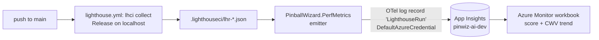

# Performance Trend Tracking (Phase 1 — synthetic)

Durable Lighthouse trend on top of the per-PR gate. Each merge to `main` records the
public site's Lighthouse scores + Core Web Vitals as a time series in App Insights, charted in
the "PinballWizard Ops" Azure Monitor workbook.

**Design:** [`docs/superpowers/specs/2026-07-08-performance-trend-tracking-design.md`](../superpowers/specs/2026-07-08-performance-trend-tracking-design.md) ·
**Plan:** [`docs/superpowers/plans/2026-07-08-performance-trend-tracking-phase1.md`](../superpowers/plans/2026-07-08-performance-trend-tracking-phase1.md) ·
**Baseline that motivated it:** [`docs/perf/2026-07-07-admin-perf-baseline.md`](2026-07-07-admin-perf-baseline.md)

## How it works



- `lighthouse.yml` runs on **PRs** (gate only, as before) and now also on **push to `main`**. Only the
  `push:main` run emits a datapoint — PRs never write trend data, so unmerged work adds no noise.
- The emitter (`src/PinballWizard.PerfMetrics`) reads each `lhr-*.json`, derives the page from
  `finalDisplayedUrl`, and emits one OpenTelemetry **log record** named `LighthouseRun` per (page × run),
  carrying scores + Core Web Vitals as log-scope state → App Insights `customDimensions`.

## Secretless ingestion (no connection-string key)

- App Insights `pinwiz-ai-dev` has **`DisableLocalAuth: true`** — ingestion is **Entra-only**.
- The emitter authenticates with **`DefaultAzureCredential`**; in CI that resolves the **GitHub OIDC
  service principal** (`secrets.AZURE_CLIENT_ID`), the same identity `deploy.yml` uses.
- That SP holds **two** narrow roles on the App Insights component (both granted in
  `infra/modules/shared.bicep`, reusing `cicdDeployPrincipalId`) — **both are required**:
  - **`Monitoring Metrics Publisher`** — the *data-plane* write (`Microsoft.Insights/Telemetry/Write`).
    This is what lets the emitter **publish**.
  - **`Reader`** (scoped to the component) — the *control-plane* `Microsoft.Insights/components/read`.
    This is what lets the emitter **discover the ingestion endpoint** via
    `az monitor app-insights component show --query connectionString`.

  These are genuinely different permissions, and it's an easy trap: Monitoring Metrics Publisher does
  **not** include `components/read`, so with only the publisher role the emit step fails at the
  connection-string fetch with `AuthorizationFailed` (this happened on the first live `push:main` run).
  Granting Reader keeps Azure the single source of truth instead of duplicating the connection string
  into GitHub config. No InstrumentationKey, no connection-string secret.
- **Consequence:** you cannot smoke-test the emit as a personal `az login` — a non-publisher identity
  is rejected by Entra ingestion. The authoritative verification is the `push:main` CI run.

## Querying the data

Records land in the **`traces`** table (the Azure Monitor OTel **log** exporter maps `ILogger` logs
to `traces`; `customEvents` is the classic-SDK `TrackEvent` table — not used here).

```kusto
// Category-score trend (synthetic), per page
traces
| where message == "LighthouseRun"
| extend d = customDimensions
| where tostring(d.environment) == "synthetic"
| summarize avg(toreal(d.performance)), avg(toreal(d.accessibility)),
            avg(toreal(d.bestPractices)), avg(toreal(d.seo))
    by bin(timestamp, 1d), page = tostring(d.page)
| render timechart
```

```kusto
// Core Web Vitals trend (CLS "good" line = 0.1)
traces
| where message == "LighthouseRun"
| extend d = customDimensions
| summarize avg(toreal(d.cls)), avg(toreal(d.lcp)), avg(toreal(d.tbt))
    by bin(timestamp, 1d), page = tostring(d.page), env = tostring(d.environment)
| render timechart
```

The workbook ("PinballWizard Ops", `infra/dashboards/pinwiz-ops-workbook.json`, items
`perf-category-scores` + `perf-core-web-vitals`) charts these; open it in the App Insights → Workbooks
blade for `pinwiz-ai-dev`.

## Re-running / operating

- **Emit locally (requires an identity with `Monitoring Metrics Publisher`):**
  ```bash
  CS=$(az monitor app-insights component show --app pinwiz-ai-dev -g rg-pinwiz-shared-dev --query connectionString -o tsv)
  dotnet run --project src/PinballWizard.PerfMetrics -- \
    --reports-dir .lighthouseci --environment synthetic --commit-sha <sha> --connection-string "$CS"
  ```
- **Deploy note (the `searchLocation` gotcha):** the shared stack deploy requires the gitignored
  `infra/main-shared.dev.local.bicepparam` (a copy of `main-shared.dev.bicepparam` with
  `searchLocation = 'eastus'`) — the committed default is `eastus2` (preferred region), but the live
  AI Search service is relocated to `eastus` per the sibling-region-fallback design (commit `54e674c`).
  Without the override, `az stack sub validate` 409s on the AI Search location. New worktrees don't
  inherit gitignored files, so recreate the override there.

## Not in Phase 1

The **live-edge** collector (a weekly ACA Job running Lighthouse against `pinwiz.ai` with a Cloudflare
Access service token, emitting `environment=live`) is Phase 2 — same emitter, same schema, same
workbook. Alerting (e.g. CLS > 0.1, Perf drop) is deferred until there is a baseline of trend points.
