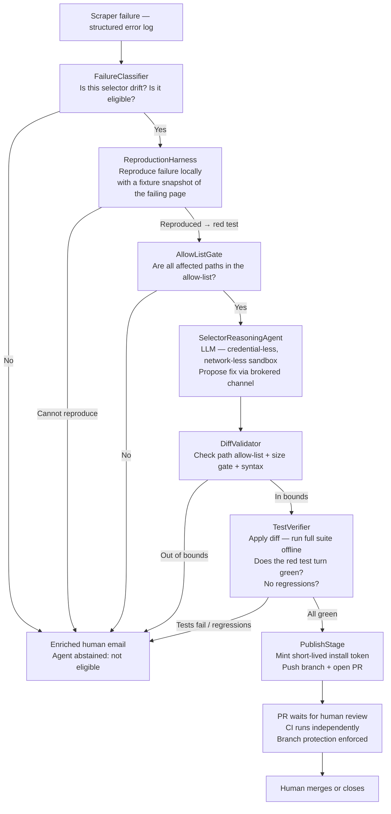

# Self-Healing Agent — Architecture Roadmap (Part 1 of 2)

> **Status:** Draft for review
> **Phase:** 7 (post-launch; depends on live deployment + stable scraper failures to reproduce)
> **Owner:** Jim
> **Related ADRs:** [ADR 0030](adr/0030-self-healing-additive-responder.md) (additive responder posture), [ADR 0031](adr/0031-remediation-agent-untrusted-input-trust-boundary.md) (untrusted-input trust boundary)
> **See also:** [Part 2 — Sandbox & Permission Model](self-healing-agent-sandbox-model.md)

---

## 1. The problem this solves

PinballWizard's Phase 1 scraper uses Playwright to drive Stern's Vue.js game pages across three tabs (manuals, games, bulletins). Vue.js frontends change without notice — class names shift, DOM structure evolves, lazy-load triggers move. When a selector drifts, the scraper emits structured errors, logs them, and emails the operator. The current fix cycle is:

```
Scraper error → structured log → email notification → human reads email
→ human opens the failing page in a browser → human identifies the selector change
→ human opens VS Code → human writes the fix → human opens a PR → CI → merge
```

This is the correct fix cycle for a live third-party site. The human is never cut out of it. What makes it tedious is the gap between "error lands in email" and "PR is ready to review" — a gap that a narrow, well-constrained agent can compress from hours to minutes for the specific class of failures that are unambiguously selector drift.

---

## 2. The design principle: additive, not replacement (ADR 0030)

The most important sentence in ADR 0030: **the agent is an additional responder on the existing failure pipeline, not a replacement for it.**

The human email path is not eliminated. It is enriched. On every run where an eligible failure occurs:

- **Without the agent**: operator gets "ScrapingError: selector .stern-manual-link-list not found after page load"
- **With the agent**: operator gets the same error **plus** a PR link, a description of what changed, and the diff to review

On runs where the agent does nothing (ineligible failure, no reproduction, low confidence, out-of-bounds diff), the email contains a summary explaining why the agent abstained. The email path is strictly more informative by the agent's existence.

---

## 3. What the agent is competent to fix

The agent operates within a code-enforced **competence envelope**: a narrow set of failure patterns for which an automated fix has a high probability of being correct and a bounded blast radius.

**In envelope (agent may attempt):**
- CSS class or attribute selector drift (e.g., `.stern-manual-list` → `.manufacturer-manual-list`)
- XPath index drift (e.g., `tr:nth-child(3)` → `tr:nth-child(4)`)
- Playwright `waitForSelector` timeout where the element now has a different locator
- Text-based selector drift (`.getByText("Manuals")` → `.getByText("Product Manuals")`)

**Out of envelope (agent abstains, enriched email only):**
- Structural DOM changes (entire feature section removed or restructured)
- HTTP-level failures (site down, rate limiting, authentication added)
- Data model changes (a field that was always present is now missing or renamed)
- Any failure class not in the above list

The envelope is defined in code, not in the prompt. The agent cannot extend its own competence envelope.

---

## 4. End-to-end pipeline



Stages 1–4 (classify → reproduce → allow-list → reason → verify) run with **no credentials and no network**. A credential token is minted only in Stage 5, scoped only to `contents: write` + `pull_requests: write`, and expires in ≈1 hour. Full sandbox detail in [Part 2](self-healing-agent-sandbox-model.md).

---

## 5. The portfolio narrative (why this feature exists in a showcase)

Three exhibits in one feature:

1. **Enterprise-grade AI safety.** The agent demonstrates that "AI agent with write access" is not incompatible with a security-conscious repo — it requires a designed trust boundary, not a prohibited category. The defense-in-depth design (ADR 0031) is the senior-engineering signal: we treated the scraper's inputs as untrusted, we isolated the model from credentials, we made the tests the final arbiter of correctness rather than the model's self-assessment. A reviewer who has shipped agents into production will recognise every layer.

2. **The right level of AI for the actual problem.** The scraper failing on selector drift is *this project's* actual failure mode. Solving the specific real problem (not a hypothetical showcase problem) with a narrowly scoped agent is a judgment call that distinguishes senior AI engineers from demos.

3. **Honest scope.** The agent does not pretend to fix every scraper failure. The competence envelope, the abstain-to-email path, and the human PR gate are documented non-goals. A reviewer who checks that the system knows its own limits gains confidence in the system that does act.

---

## 6. Non-goals (deliberate, per `ENGINEERING_STANDARDS.md` §16)

- **Not a general-purpose code fixer.** The agent fixes selector drift in scrapers and nothing else.
- **No auto-merge.** The PR gate is unconditional — the agent opens; only a human approves.
- **No self-modification.** The agent cannot edit the self-healing module, the CI configuration, the allow-list, or any security/provenance infrastructure.
- **Not a replacement for the notification email.** Removing the human notification path is the one thing the design is built to prevent.
- **Not a runtime decision-maker.** The agent acts only on a reproduction from a committed snapshot, never on live production state.

---

## 7. Integration points

| Integration | Role | Notes |
| --- | --- | --- |
| GitHub Actions | Trigger on scraper-job failure | Failure event dispatches the classification job |
| GitHub App (dedicated, repo-scoped) | Identity for PR creation | Scoped permissions — see Part 2 §1 |
| Playwright reproduction harness | Reproduce failures offline | Fixture-snapshot from the failing page; required before agent acts |
| Repository allow-list | Enforce path bounds | Defined in code; the model cannot read or modify it |
| `PinballWizard.Scraper.Tests` | Verify fix offline | Full suite; must stay green with no new failures |
| Human operator | Terminal gate | Reviews PR; branch protection requires human approval |

---

## 8. Build sequence and gates

This feature is **Phase 7** and depends on:

1. **Live deployment with real failures** (Phase 6 complete) — the agent needs actual selector drift to be worth building; manufactured failures in a test environment don't stress the real edge cases.
2. **Stable reproduction harness** — the fixture-snapshot mechanism must be built and validated against real failures before the LLM reasoning phase is added.
3. **Deterministic verifier** — the offline full-suite run must be reliably green on main and reliably red on a genuine selector failure before the agent's output is trusted.

The sandbox model ([Part 2](self-healing-agent-sandbox-model.md)) and ADRs 0030/0031 are accepted and locked before any code is written. The trust boundary is immutable once accepted.
