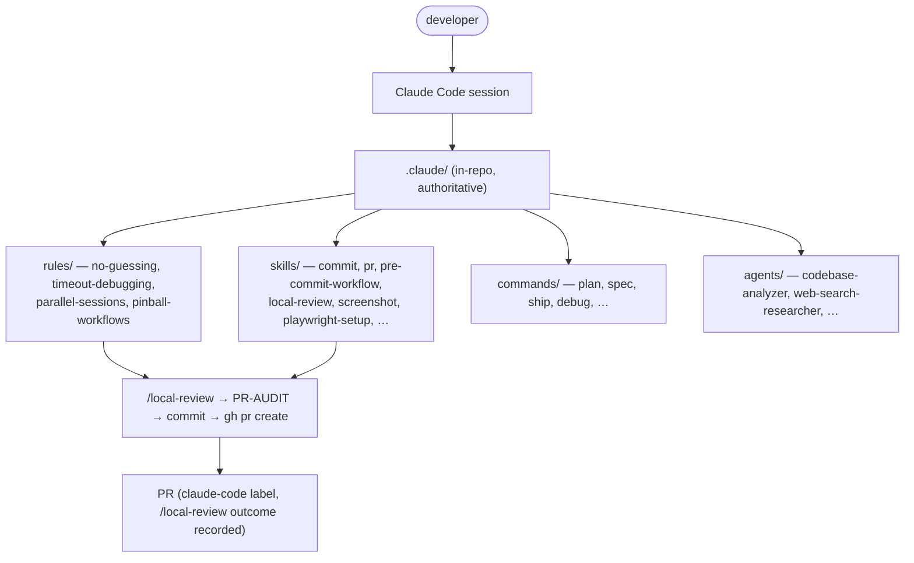

# PinballWizard Claude Code Config Ownership — Implementation Plan

> **For agentic workers:** REQUIRED SUB-SKILL: Use superpowers:subagent-driven-development (recommended) or superpowers:executing-plans to implement this plan task-by-task. Steps use checkbox (`- [ ]`) syntax for tracking.

**Goal:** Make PinballWizard own its full Claude Code configuration in-repo (pristine, documented, adapted to GitHub/personal-identity/no-Jira) and make the APS standards corpus self-suppress so it stops loading in this repo.

**Architecture:** Two halves in two separate PRs. **Half A** vendors rules/skills/commands/agents into `PinballWizard/.claude/` with provenance headers + a drift-check, plus showcase docs (README, `docs/claude-code.md`, ADR-0039). **Half B** adds `paths:` frontmatter to the ~20 APS standard rules in `APS.JimClaudeCodeConfig` so they fire only on APS/Neighborli paths, and adds an `orgs/earlybird/CLAUDE-ADDON.md` org identity.

**Tech Stack:** Markdown (Claude Code skills/commands/rules/agents), Python (drift-check + leak assertion, matching existing `~/.claude/bin` tooling), YAML frontmatter, Mermaid, MADR-lite ADRs.

## Global Constraints

- **Upstream pin SHA:** `6dfd2cf` (`APS.JimClaudeCodeConfig` `origin/main` @ 2026-06-19). All provenance headers reference this SHA.
- **Source repo path:** `C:\aps\projects\APS.JimClaudeCodeConfig` (git-bash: `/c/aps/projects/APS.JimClaudeCodeConfig`).
- **Commit identity:** author MUST be `Jim Keeley <94459922+jkeeley2073@users.noreply.github.com>` (INVARIANT). No `Co-Authored-By: Claude` trailer (non-APS GitHub repo → smart-commit default; matches repo history).
- **Commit format:** `<type>(scope) message` (conventional; GitHub issue ref `#NN` optional, not mandatory).
- **No ASCII diagrams** — Mermaid only (`feedback_no_ascii_diagrams`).
- **No XML doc comments** anywhere (`feedback_no_xml_docs`) — N/A to markdown but applies to the Python scripts (no docstring-as-API-contract theater; normal comments fine).
- **Provenance header template** (exact — adjust comment syntax per file type):
  ```
  <!-- vendored-from: APS.JimClaudeCodeConfig/global/<path> @ 6dfd2cf
       adapted-for: PinballWizard (GitHub / personal identity / no Jira)
       last-synced: 2026-06-19 — drift: scripts/check_claude_config_drift.py -->
  ```
- **Half A branch:** `chore/claude-config-ownership` (already created off `origin/main`; the design spec is already committed there).
- **Half B branch:** created off `APS.JimClaudeCodeConfig` `origin/main` at execution time (Task 14).
- **Do NOT vendor APS sidecars:** `smart-commit/APS-CONVENTIONS.md`, `smart-pr/APS-PR-REQUIREMENTS.md` are excluded; replaced with GitHub equivalents.
- **Spec reference:** `docs/superpowers/specs/2026-06-19-claude-config-ownership-design.md`.

---

## File Structure (decomposition)

**Half A — `PinballWizard/` (branch `chore/claude-config-ownership`):**

```
.claude/rules/no-guessing.md            # verbatim vendor
.claude/rules/timeout-debugging.md      # verbatim vendor
.claude/rules/parallel-sessions.md      # adapted vendor
.claude/rules/pinball-workflows.md      # authored (replaces mandatory-workflows)
.claude/skills/commit/SKILL.md          # adapted from smart-commit
.claude/skills/pr/SKILL.md              # adapted from smart-pr
.claude/skills/pre-commit-workflow/SKILL.md
.claude/skills/context-management/SKILL.md
.claude/skills/screenshot/SKILL.md
.claude/skills/playwright-setup/{SKILL.md,prompt.md}
.claude/skills/ci-preview/SKILL.md
.claude/commands/*.md                   # 14 curated commands
.claude/agents/*.md                     # 4 generic agents
.claude/README.md                       # rewritten
docs/claude-code.md                     # authored (Mermaid)
docs/adr/0039-fork-claude-config-for-pinballwizard.md
docs/adr/README.md                      # index row added
scripts/check_claude_config_drift.py    # drift-check
scripts/assert_no_excluded_aps_skills.py# leak assertion
tests/... or scripts/ self-test          # for the two scripts
```

**Half B — `APS.JimClaudeCodeConfig/` (new branch):**

```
global/rules/<each-aps-standard>.md     # add paths: frontmatter
orgs/earlybird/CLAUDE-ADDON.md          # authored
```

---

## Task 1: Vendor the two verbatim universal rules

**Files:**
- Create: `.claude/rules/no-guessing.md`
- Create: `.claude/rules/timeout-debugging.md`

**Interfaces:**
- Produces: two repo-local rules that load in every PinballWizard session.

- [ ] **Step 1: Copy sources verbatim**

```bash
cd /c/earlybird/PinballWizard
mkdir -p .claude/rules
cp /c/aps/projects/APS.JimClaudeCodeConfig/global/rules/no-guessing.md .claude/rules/no-guessing.md
cp /c/aps/projects/APS.JimClaudeCodeConfig/global/rules/timeout-debugging.md .claude/rules/timeout-debugging.md
```

- [ ] **Step 2: Prepend provenance header to each**

At the very top of each file, insert (HTML comment, before the `#` title):

```
<!-- vendored-from: APS.JimClaudeCodeConfig/global/rules/no-guessing.md @ 6dfd2cf
     adapted-for: PinballWizard (verbatim — universal engineering rule)
     last-synced: 2026-06-19 — drift: scripts/check_claude_config_drift.py -->
```

(Use the matching path for `timeout-debugging.md`; note "verbatim" since no content change.)

- [ ] **Step 3: Verify content is intact apart from the header**

Run:
```bash
diff <(tail -n +4 .claude/rules/no-guessing.md) /c/aps/projects/APS.JimClaudeCodeConfig/global/rules/no-guessing.md && echo "BODY IDENTICAL"
```
Expected: `BODY IDENTICAL` (header is 3 lines + the comment close; adjust `+N` so only the header is stripped).

- [ ] **Step 4: Commit**

```bash
git add .claude/rules/no-guessing.md .claude/rules/timeout-debugging.md
git commit -m "chore(claude) vendor universal rules: no-guessing, timeout-debugging"
```

---

## Task 2: Adapt and vendor `parallel-sessions.md`

**Files:**
- Create: `.claude/rules/parallel-sessions.md`

**Interfaces:**
- Produces: worktree-safety rule scoped to this repo's reality (GitHub, `.worktrees/`).

- [ ] **Step 1: Copy source**

```bash
cp /c/aps/projects/APS.JimClaudeCodeConfig/global/rules/parallel-sessions.md .claude/rules/parallel-sessions.md
```

- [ ] **Step 2: Apply adaptations**

Edit `.claude/rules/parallel-sessions.md`:
- Add the provenance header (path `global/rules/parallel-sessions.md`, `adapted-for: PinballWizard (worktree-safety; APS-repo framing removed)`).
- Remove the DRS-15951 / `APS.JimClaudeCodeConfig` / `APS.ClaudeCodeConfig` "Scope" framing in the final section; replace the Scope paragraph with:

  > ## Scope
  > Applies to this repo whenever more than one Claude session (or a teammate)
  > may touch the working tree. Worktrees live under `.worktrees/` (gitignored).
  > The hazard is real here: see `feedback_worktree_contamination_pattern`.

- Keep the four numbered rules (one tree per session; never discard foreign changes; commit early; foreign-session evidence) verbatim — they are the load-bearing content.

- [ ] **Step 3: Verify the rule still reads coherently**

Run: `grep -c "worktree" .claude/rules/parallel-sessions.md`
Expected: ≥ 3 (core guidance retained).

- [ ] **Step 4: Commit**

```bash
git add .claude/rules/parallel-sessions.md
git commit -m "chore(claude) vendor parallel-sessions rule, scoped to this repo"
```

---

## Task 3: Author `pinball-workflows.md` (replaces mandatory-workflows)

**Files:**
- Create: `.claude/rules/pinball-workflows.md`

**Interfaces:**
- Produces: the authoritative workflow rule for this repo (commit/PR/branch/push), GitHub-native.

- [ ] **Step 1: Write the file**

Create `.claude/rules/pinball-workflows.md` with this content (authored — derived from `mandatory-workflows.md` but GitHub-native; cross-references the vendored skills):

```markdown
<!-- authored-for: PinballWizard — replaces APS mandatory-workflows.md (GitHub-native).
     Derived from APS.JimClaudeCodeConfig/global/rules/mandatory-workflows.md @ 6dfd2cf
     last-synced: 2026-06-19 — drift: scripts/check_claude_config_drift.py -->

# PinballWizard Workflows (repo-local, authoritative)

This repo is a **personal GitHub** project in the **earlybird** org. It does NOT use
Jira, Azure DevOps, or work-item time-tracking. Identity is personal.

## 1. Branch protection (BEFORE any code change)

If `git rev-parse --abbrev-ref HEAD` is `main`, STOP and create a feature branch
(`AskUserQuestion` to confirm name). Never edit on `main`.

## 2. Before commit

- Run the pre-commit-workflow skill (`.claude/skills/pre-commit-workflow/`) — verifies
  not on `main`, no secrets/debug leftovers, no temp files staged.
- Then the commit skill (`.claude/skills/commit/`) for conventional formatting.
- **Identity:** every commit MUST author as
  `Jim Keeley <94459922+jkeeley2073@users.noreply.github.com>` (INVARIANT).
- **No Claude attribution trailer** (matches repo history).

## 3. After git push

**No time tracking.** This repo has no work-item system; do NOT prompt for hours
(see memory `feedback_skip_time_tracking`). Keep momentum on the next work stream
while PRs are reviewed async (`feedback_proceed_while_user_reviews_prs`).

## 4. Create PR

- Run the pre-push self-audit FIRST: `/local-review` (Step 0, qualitative) then the
  12-item `.claude/PR-AUDIT.md` checklist. Treat 🔴 as blocking.
- Create via `gh pr create` (GitHub, not `az repos`).
- Add the `claude-code` label and verify it (`feedback_verify_claude_code_label`).
- Always put the full PR URL in the response (`feedback_always_link_prs`).
- The PR description records the `/local-review` outcome.

## 5. Quick reference

| Trigger | Action |
|---|---|
| Code change on `main` | Block → prompt for feature branch |
| "commit" | pre-commit-workflow → commit skill |
| After push | (nothing — no time tracking) |
| "create PR" | `/local-review` → PR-AUDIT → `gh pr create` → add+verify `claude-code` label |
```

- [ ] **Step 2: Verify cross-references resolve**

Run:
```bash
for p in .claude/skills/pre-commit-workflow .claude/skills/commit .claude/PR-AUDIT.md; do test -e "$p" && echo "OK $p" || echo "PENDING $p (created in a later task)"; done
```
Expected: `PR-AUDIT.md` OK; the two skills `PENDING` until Tasks 4/6 (acceptable — they land before this rule is exercised).

- [ ] **Step 3: Commit**

```bash
git add .claude/rules/pinball-workflows.md
git commit -m "chore(claude) author pinball-workflows rule (GitHub-native, no Jira/time-tracking)"
```

---

## Task 4: Vendor + adapt `commit` skill

**Files:**
- Create: `.claude/skills/commit/SKILL.md`

**Interfaces:**
- Consumes: nothing.
- Produces: `commit` skill invoked by `pinball-workflows.md` §2.

- [ ] **Step 1: Copy the main skill body (NOT the APS sidecar)**

```bash
mkdir -p .claude/skills/commit
cp /c/aps/projects/APS.JimClaudeCodeConfig/global/skills/smart-commit/SKILL.md .claude/skills/commit/SKILL.md
# Deliberately DO NOT copy smart-commit/APS-CONVENTIONS.md
```

- [ ] **Step 2: Apply adaptations**

Edit `.claude/skills/commit/SKILL.md`:
- Add provenance header (path `global/skills/smart-commit/SKILL.md`, `adapted-for: PinballWizard (GitHub / personal identity / no Jira; APS-CONVENTIONS sidecar dropped)`).
- Update the frontmatter `name:` to `commit` and `description:` to a PinballWizard-specific one-liner.
- Remove every reference to `APS-CONVENTIONS.md`, Jira/DRS ticket requirements, Azure DevOps `AB#`/`DRS-` commit grammar, and the `Co-Authored-By: Claude` trailer rule.
- Replace the work-item section with: "Issue reference (`#NN`) optional; never required. Conventional type(scope) subject ≤72 chars."
- Add the identity assertion: author must be the personal noreply email (INVARIANT).

- [ ] **Step 3: Verify no APS residue**

Run:
```bash
grep -iE "DRS-|AB#|jira|azure devops|APS-CONVENTIONS|Co-Authored-By" .claude/skills/commit/SKILL.md && echo "RESIDUE FOUND — fix" || echo "CLEAN"
```
Expected: `CLEAN`.

- [ ] **Step 4: Commit**

```bash
git add .claude/skills/commit/SKILL.md
git commit -m "chore(claude) vendor commit skill, adapted to GitHub + personal identity"
```

---

## Task 5: Vendor + adapt `pr` skill

**Files:**
- Create: `.claude/skills/pr/SKILL.md`

**Interfaces:**
- Produces: `pr` skill invoked by `pinball-workflows.md` §4.

- [ ] **Step 1: Copy main skill body (NOT the APS sidecar)**

```bash
mkdir -p .claude/skills/pr
cp /c/aps/projects/APS.JimClaudeCodeConfig/global/skills/smart-pr/SKILL.md .claude/skills/pr/SKILL.md
# Deliberately DO NOT copy smart-pr/APS-PR-REQUIREMENTS.md
```

- [ ] **Step 2: Apply adaptations**

Edit `.claude/skills/pr/SKILL.md`:
- Add provenance header (path `global/skills/smart-pr/SKILL.md`, `adapted-for: PinballWizard (gh CLI; no ADO/work-item link; APS-PR-REQUIREMENTS sidecar dropped)`).
- `name:` → `pr`.
- Replace all `az repos pr create` / `az repos pr work-item add` flows with `gh pr create` and `gh pr edit --add-label claude-code`.
- Drop the work-item-link-mandatory and ADO iteration-compare conventions.
- Keep: pre-PR `/local-review` gate, PR-AUDIT reference, the `claude-code` label + verification step, full-PR-URL-in-response rule, attribution footer in the **PR description body** is OPTIONAL here (repo history omits it) — state it as optional, not required.

- [ ] **Step 3: Verify no ADO residue**

Run:
```bash
grep -iE "az repos|azure devops|work-item add|DRS-|iteration=" .claude/skills/pr/SKILL.md && echo "RESIDUE — fix" || echo "CLEAN"
```
Expected: `CLEAN`.

- [ ] **Step 4: Commit**

```bash
git add .claude/skills/pr/SKILL.md
git commit -m "chore(claude) vendor pr skill, adapted to gh CLI"
```

---

## Task 6: Vendor + adapt `pre-commit-workflow` skill

**Files:**
- Create: `.claude/skills/pre-commit-workflow/SKILL.md`

- [ ] **Step 1: Copy**

```bash
mkdir -p .claude/skills/pre-commit-workflow
cp /c/aps/projects/APS.JimClaudeCodeConfig/global/skills/pre-commit-workflow/SKILL.md .claude/skills/pre-commit-workflow/SKILL.md
```

- [ ] **Step 2: Adapt**

- Provenance header (path `global/skills/pre-commit-workflow/SKILL.md`).
- Remove the work-item-context requirement (`.work-item-context`, DRS lookup).
- Keep: branch-not-protected check, no-secrets/no-debug-leftovers scan, no-temp-files-staged check.
- Where it references `local-pr-review.py` from `~/.claude/bin`, change to the repo-local convention: this repo uses `/local-review` + PR-AUDIT (point there).

- [ ] **Step 3: Verify**

Run: `grep -iE "work-item|DRS-|jira" .claude/skills/pre-commit-workflow/SKILL.md && echo RESIDUE || echo CLEAN`
Expected: `CLEAN`.

- [ ] **Step 4: Commit**

```bash
git add .claude/skills/pre-commit-workflow/SKILL.md
git commit -m "chore(claude) vendor pre-commit-workflow skill, no work-item gate"
```

---

## Task 7: Vendor generic skills verbatim (context-management, screenshot, playwright-setup, ci-preview)

**Files:**
- Create: `.claude/skills/context-management/SKILL.md`
- Create: `.claude/skills/screenshot/SKILL.md`
- Create: `.claude/skills/playwright-setup/SKILL.md`, `.claude/skills/playwright-setup/prompt.md`
- Create: `.claude/skills/ci-preview/SKILL.md`

- [ ] **Step 1: Copy all**

```bash
for s in context-management screenshot ci-preview; do
  mkdir -p .claude/skills/$s
  cp /c/aps/projects/APS.JimClaudeCodeConfig/global/skills/$s/SKILL.md .claude/skills/$s/SKILL.md
done
mkdir -p .claude/skills/playwright-setup
cp /c/aps/projects/APS.JimClaudeCodeConfig/global/skills/playwright-setup/SKILL.md .claude/skills/playwright-setup/SKILL.md
cp /c/aps/projects/APS.JimClaudeCodeConfig/global/skills/playwright-setup/prompt.md .claude/skills/playwright-setup/prompt.md
```

- [ ] **Step 2: Add provenance headers + scrub any APS-path assumptions**

For each file: add the provenance header. Then scan for hardcoded APS paths / org assumptions:
```bash
grep -rinE "DRS-|jira|azure devops|APS\.|distilledtech|beneighborli" .claude/skills/{context-management,screenshot,playwright-setup,ci-preview} && echo "REVIEW these" || echo "CLEAN"
```
Fix any hits (e.g. screenshot dir path → this repo's configured screenshots dir; ci-preview commands → this repo's `dotnet`/CI). If a file is genuinely generic, header-only.

- [ ] **Step 3: Commit**

```bash
git add .claude/skills/context-management .claude/skills/screenshot .claude/skills/playwright-setup .claude/skills/ci-preview
git commit -m "chore(claude) vendor generic skills: context-management, screenshot, playwright-setup, ci-preview"
```

---

## Task 8: Vendor curated slash-commands

**Files:**
- Create: `.claude/commands/{local_review,clean-context,create-spec,create_plan,implement_plan,validate_plan,research_codebase,create_worktree,debug,describe_pr,ship,push-only,pr-only,quick-commit}.md`

- [ ] **Step 1: Copy all 14**

```bash
mkdir -p .claude/commands
for c in local_review clean-context create-spec create_plan implement_plan validate_plan research_codebase create_worktree debug describe_pr ship push-only pr-only quick-commit; do
  cp /c/aps/projects/APS.JimClaudeCodeConfig/global/commands/$c.md .claude/commands/$c.md
done
```

- [ ] **Step 2: Provenance header + APS-residue scrub on each**

Add provenance header to each. Then:
```bash
grep -rinE "DRS-|jira|az repos|azure devops|work-item add|sync-from-shared|humanize" .claude/commands && echo "REVIEW" || echo "CLEAN"
```
For any command that references `az repos`/Jira/work-items (likely `ship`, `push-only`, `pr-only`, `describe_pr`), rewrite those flows to `gh` + the repo's `/local-review`+PR-AUDIT path, consistent with `.claude/skills/pr/SKILL.md`. `create-spec`/`create_plan`/`implement_plan`/`validate_plan`/`research_codebase`/`create_worktree`/`clean-context`/`debug` are largely generic — header-only unless residue found.

- [ ] **Step 3: Verify clean**

Run: `grep -rinE "DRS-|az repos|jira|work-item add" .claude/commands && echo RESIDUE || echo CLEAN`
Expected: `CLEAN`.

- [ ] **Step 4: Commit**

```bash
git add .claude/commands
git commit -m "chore(claude) vendor 14 curated slash-commands, adapted to GitHub"
```

---

## Task 9: Vendor generic agents

**Files:**
- Create: `.claude/agents/{codebase-analyzer,thoughts-analyzer,web-search-researcher,modernization-analyst}.md`

- [ ] **Step 1: Copy all 4**

```bash
mkdir -p .claude/agents
for a in codebase-analyzer thoughts-analyzer web-search-researcher modernization-analyst; do
  cp /c/aps/projects/APS.JimClaudeCodeConfig/global/agents/$a.md .claude/agents/$a.md
done
```

- [ ] **Step 2: Provenance header + residue scan**

Add header to each. Run:
```bash
grep -rinE "DRS-|jira|APS\.|distilledtech" .claude/agents && echo REVIEW || echo CLEAN
```
Fix any hits (these are generic; expect CLEAN).

- [ ] **Step 3: Commit**

```bash
git add .claude/agents
git commit -m "chore(claude) vendor generic agents (codebase-analyzer, thoughts-analyzer, web-search-researcher, modernization-analyst)"
```

---

## Task 10: Drift-check script (TDD)

**Files:**
- Create: `scripts/check_claude_config_drift.py`
- Test: `scripts/test_check_claude_config_drift.py`

**Interfaces:**
- Produces: `check_drift(vendored_root, source_repo) -> list[DriftReport]` where each report has `path`, `recorded_sha`, `status` ∈ {`current`, `behind`, `source-missing`, `no-header`}.

- [ ] **Step 1: Write the failing test**

```python
# scripts/test_check_claude_config_drift.py
import subprocess, sys, pathlib, tempfile, textwrap
from check_claude_config_drift import parse_header, Drift

def test_parse_header_extracts_path_and_sha():
    text = textwrap.dedent('''\
        <!-- vendored-from: APS.JimClaudeCodeConfig/global/rules/no-guessing.md @ 6dfd2cf
             adapted-for: PinballWizard (verbatim)
             last-synced: 2026-06-19 -->
        # No Guessing Rule
        ''')
    h = parse_header(text)
    assert h.source_path == "global/rules/no-guessing.md"
    assert h.recorded_sha == "6dfd2cf"

def test_parse_header_none_when_absent():
    assert parse_header("# plain file, no header\n") is None
```

- [ ] **Step 2: Run to verify it fails**

Run: `cd scripts && python -m pytest test_check_claude_config_drift.py -v`
Expected: FAIL (`ModuleNotFoundError: check_claude_config_drift` / `parse_header`).

- [ ] **Step 3: Implement the script**

```python
# scripts/check_claude_config_drift.py
"""Report whether vendored .claude/ files have drifted behind their upstream source.

Reads each vendored file's provenance header (vendored-from: <path> @ <sha>) and,
if the upstream APS.JimClaudeCodeConfig repo is available, checks whether the
source file has advanced past the recorded SHA. Degrades visibly (status
'source-missing') when the upstream repo is not present — never silently passes.
"""
from __future__ import annotations
import re, subprocess, sys
from dataclasses import dataclass
from pathlib import Path

HEADER_RE = re.compile(
    r"vendored-from:\s*APS\.JimClaudeCodeConfig/(?P<path>\S+)\s*@\s*(?P<sha>[0-9a-f]{7,40})"
)
DEFAULT_SOURCE = Path(r"C:/aps/projects/APS.JimClaudeCodeConfig")

@dataclass
class Header:
    source_path: str   # e.g. global/rules/no-guessing.md
    recorded_sha: str

@dataclass
class Drift:
    path: str
    recorded_sha: str
    status: str        # current | behind | source-missing | no-header

def parse_header(text: str) -> Header | None:
    m = HEADER_RE.search(text)
    if not m:
        return None
    return Header(m.group("path"), m.group("sha"))

def _git(source: Path, *args: str) -> str | None:
    try:
        out = subprocess.run(["git", "-C", str(source), *args],
                             capture_output=True, text=True, check=True)
        return out.stdout.strip()
    except Exception:
        return None

def check_drift(vendored_root: Path, source: Path = DEFAULT_SOURCE) -> list[Drift]:
    reports: list[Drift] = []
    source_ok = source.exists() and _git(source, "rev-parse", "HEAD") is not None
    for f in sorted(vendored_root.rglob("*.md")):
        h = parse_header(f.read_text(encoding="utf-8", errors="replace"))
        rel = str(f.relative_to(vendored_root))
        if h is None:
            reports.append(Drift(rel, "", "no-header"))
            continue
        if not source_ok:
            reports.append(Drift(rel, h.recorded_sha, "source-missing"))
            continue
        # latest sha that touched the source file
        latest = _git(source, "log", "-1", "--format=%h", "origin/main", "--", h.source_path)
        if not latest:
            reports.append(Drift(rel, h.recorded_sha, "source-missing"))
            continue
        # is recorded_sha an ancestor that still matches the file's latest commit?
        same = _git(source, "rev-parse", f"{h.recorded_sha}") and \
               _git(source, "merge-base", "--is-ancestor", h.recorded_sha, latest) is not None
        # behind if the file changed after recorded_sha
        contains = _git(source, "log", "--format=%h", f"{h.recorded_sha}..origin/main",
                        "--", h.source_path)
        status = "behind" if contains else "current"
        reports.append(Drift(rel, h.recorded_sha, status))
    return reports

def main() -> int:
    root = Path(sys.argv[1]) if len(sys.argv) > 1 else Path(".claude")
    reports = check_drift(root)
    behind = [r for r in reports if r.status == "behind"]
    missing = [r for r in reports if r.status in ("source-missing", "no-header")]
    for r in reports:
        print(f"{r.status:14} {r.path} (@{r.recorded_sha or '-'})")
    if missing:
        print(f"\nNOTE: {len(missing)} file(s) unverifiable (upstream absent or no header).")
    print(f"\n{len(behind)} file(s) behind upstream.")
    return 0  # informational; never fails the build
if __name__ == "__main__":
    raise SystemExit(main())
```

- [ ] **Step 4: Run tests to verify pass**

Run: `cd scripts && python -m pytest test_check_claude_config_drift.py -v`
Expected: PASS (both tests).

- [ ] **Step 5: Smoke-run against the real vendored tree**

Run: `python scripts/check_claude_config_drift.py .claude`
Expected: every file `current` (just vendored at the pin SHA), or `source-missing` if run where the APS repo is absent — and it prints the note, not a silent pass.

- [ ] **Step 6: Commit**

```bash
git add scripts/check_claude_config_drift.py scripts/test_check_claude_config_drift.py
git commit -m "chore(claude) add config drift-check (provenance SHA vs upstream)"
```

---

## Task 11: Excluded-skill leak assertion (TDD)

**Files:**
- Create: `scripts/assert_no_excluded_aps_skills.py`
- Test: `scripts/test_assert_no_excluded_aps_skills.py`

**Interfaces:**
- Produces: `find_leaked(skills_dir) -> list[str]` returning any excluded APS skill names present under `.claude/skills/`.

- [ ] **Step 1: Write the failing test**

```python
# scripts/test_assert_no_excluded_aps_skills.py
import tempfile, pathlib
from assert_no_excluded_aps_skills import find_leaked, EXCLUDED

def test_flags_excluded(tmp_path):
    (tmp_path / "jira").mkdir()
    (tmp_path / "commit").mkdir()
    leaked = find_leaked(tmp_path)
    assert "jira" in leaked
    assert "commit" not in leaked

def test_clean_tree(tmp_path):
    (tmp_path / "commit").mkdir()
    (tmp_path / "pr").mkdir()
    assert find_leaked(tmp_path) == []
```

- [ ] **Step 2: Run to verify fail**

Run: `cd scripts && python -m pytest test_assert_no_excluded_aps_skills.py -v`
Expected: FAIL (`ModuleNotFoundError`).

- [ ] **Step 3: Implement**

```python
# scripts/assert_no_excluded_aps_skills.py
"""Fail if any excluded APS skill leaked into .claude/skills/."""
from __future__ import annotations
import sys
from pathlib import Path

EXCLUDED = {
    "jira", "work-item-time-tracking", "azure-devops-pipeline", "teamcity",
    "basecamp", "linear", "sonarqube", "ado-wiki-edit", "investigate",
    "vpn-troubleshoot", "sso-troubleshoot", "ssl-certificate",
    "azure-sql-optimizer", "aps-devops-agent-pool", "setup-azure", "spec-driven",
}

def find_leaked(skills_dir: Path) -> list[str]:
    if not skills_dir.exists():
        return []
    present = {p.name for p in skills_dir.iterdir() if p.is_dir()}
    # any aps-*-standard dir is also a leak
    leaks = sorted((present & EXCLUDED) | {n for n in present if n.startswith("aps-")})
    return leaks

def main() -> int:
    leaked = find_leaked(Path(sys.argv[1]) if len(sys.argv) > 1 else Path(".claude/skills"))
    if leaked:
        print("LEAKED excluded APS skills:", ", ".join(leaked))
        return 1
    print("OK — no excluded APS skills present.")
    return 0
if __name__ == "__main__":
    raise SystemExit(main())
```

- [ ] **Step 4: Run tests + real tree**

Run: `cd scripts && python -m pytest test_assert_no_excluded_aps_skills.py -v` → PASS.
Run: `python scripts/assert_no_excluded_aps_skills.py .claude/skills` → `OK — no excluded APS skills present.`

- [ ] **Step 5: Commit**

```bash
git add scripts/assert_no_excluded_aps_skills.py scripts/test_assert_no_excluded_aps_skills.py
git commit -m "chore(claude) add leak assertion: no excluded APS skill in .claude/skills"
```

---

## Task 12: Rewrite `.claude/README.md`

**Files:**
- Modify: `.claude/README.md`

- [ ] **Step 1: Replace the "skills layer" + global paragraph**

Replace the existing §"The skills layer" paragraph (the one ending "those are personal workflow tools and aren't checked in here.") with a section that states the repo now owns its full config, plus an **include/exclude table**. Concretely add:

```markdown
## The config layer (self-contained)

As of ADR-0039, this repo owns its full Claude Code workflow config in-repo — no
dependency on any personal/global config. Each vendored file carries a
`vendored-from: … @ <sha>` provenance header; `scripts/check_claude_config_drift.py`
reports when an upstream source has moved.

| Included | Why |
|---|---|
| `rules/no-guessing.md`, `rules/timeout-debugging.md` | Universal engineering discipline |
| `rules/parallel-sessions.md` | Worktree safety (multi-session hazard) |
| `rules/pinball-workflows.md` | GitHub-native commit/PR/branch flow (replaces APS mandatory-workflows) |
| `skills/commit`, `skills/pr`, `skills/pre-commit-workflow` | Commit/PR/pre-commit, adapted to `gh` + personal identity |
| `skills/local-review` | This repo's 13-category diff critique |
| `skills/context-management`, `screenshot`, `playwright-setup`, `ci-preview` | Generic dev workflow |
| `commands/*` | 14 curated slash-commands (plan/spec/ship/debug/…) |
| `agents/*` | 4 generic research/analysis agents |

**Deliberately excluded** (and why): all `aps-*-standard` rules/skills, `jira`,
`work-item-time-tracking`, Azure DevOps/TeamCity/Basecamp/Linear, `sonarqube`,
SSO/VPN/SSL ops — they belong to APS work, not a personal GitHub showcase. The APS
standards are also path-scoped upstream (ADR-0039 Half B) so they no longer load here.
```

- [ ] **Step 2: Update the file inventory table** at the top to add `rules/`, `commands/`, `agents/` rows.

- [ ] **Step 3: Verify the stale sentence is gone**

Run: `grep -c "aren't checked in here" .claude/README.md`
Expected: `0`.

- [ ] **Step 4: Commit**

```bash
git add .claude/README.md
git commit -m "docs(claude) rewrite .claude/README — repo now owns its full config"
```

---

## Task 13: Author `docs/claude-code.md` (Mermaid) + ADR-0039

**Files:**
- Create: `docs/claude-code.md`
- Create: `docs/adr/0039-fork-claude-config-for-pinballwizard.md`
- Modify: `docs/adr/README.md` (index row)

- [ ] **Step 1: Write `docs/claude-code.md`**

Author a page with: purpose (showcase how this repo uses Claude Code), the self-contained-vs-global boundary, and a **Mermaid** diagram (no inline colors per the doc standard) such as:

```markdown
# How PinballWizard uses Claude Code

This repo treats Claude Code as a first-class engineering participant and owns its
full configuration in-repo (ADR-0039). Nothing here depends on a personal/global setup.



## Provenance & drift
Each vendored file records `vendored-from: … @ <sha>`. `scripts/check_claude_config_drift.py`
reports staleness; `scripts/assert_no_excluded_aps_skills.py` guards against APS leakage.

## Watch it work
See any recent PR description for the `/local-review` finding count and how each was
addressed. (Link 1–2 representative PRs here.)
```

- [ ] **Step 2: Write ADR-0039** (MADR-lite: Status/Date/Deciders/Context/Decision/Consequences) covering: context (APS noise + showcase + self-containment), decision (fork config in-repo + path-scope global), alternatives (shared global; org-addon-only; do-nothing), consequences (vendoring drift mitigated by provenance + drift-check). Use the existing ADR format from `docs/adr/0038-*`.

- [ ] **Step 3: Add the index row** to `docs/adr/README.md` for 0039.

- [ ] **Step 4: Verify Mermaid + ADR present**

Run: `grep -c '```mermaid' docs/claude-code.md` (≥1); `test -f docs/adr/0039-fork-claude-config-for-pinballwizard.md && echo OK`.

- [ ] **Step 5: Commit**

```bash
git add docs/claude-code.md docs/adr/0039-fork-claude-config-for-pinballwizard.md docs/adr/README.md
git commit -m "docs(claude) add docs/claude-code.md (Mermaid) + ADR-0039"
```

---

## Task 14: Half-A verification + open PR

- [ ] **Step 1: Run the leak + drift checks**

```bash
python scripts/assert_no_excluded_aps_skills.py .claude/skills   # OK
python scripts/check_claude_config_drift.py .claude              # all current/source-missing, with note
```

- [ ] **Step 2: Confirm self-containment** (no runtime dependency on the APS repo)

Run:
```bash
grep -rinE "/c/aps/projects|C:\\\\aps\\\\projects|APS\.JimClaudeCodeConfig/global" .claude && echo "RUNTIME DEP — only allowed inside provenance headers" || echo "CLEAN"
```
Expected: hits ONLY inside `vendored-from:` headers (those are documentation, not runtime deps). Any non-header hit must be fixed.

- [ ] **Step 3: Run `/local-review` then the PR-AUDIT checklist.** Address 🔴.

- [ ] **Step 4: Open the PR**

```bash
gh pr create --title "chore(claude) PinballWizard owns its Claude Code config (Half A)" \
  --body "<summary + /local-review outcome; links the design spec + ADR-0039>"
gh pr edit --add-label claude-code
gh pr view --json labels   # verify label
```
Put the full PR URL in the response.

---

## Task 15: Half B — path-scope APS standards (separate repo)

**Files (in `APS.JimClaudeCodeConfig`):**
- Modify: each `global/rules/*-standard.md` + APS-flavored `dotnet.md`, `bicep.md`, `ui-design.md`, `frontend-react.md`, `azure-pipelines.md`, `infrastructure.md`, `api-conventions.md`, `coding-standard.md`, `testing-standard.md`, `documentation-standard.md`

- [ ] **Step 1: Branch off origin/main**

```bash
cd /c/aps/projects/APS.JimClaudeCodeConfig
git fetch origin --quiet
git checkout -b fix/scope-standards-exclude-earlybird origin/main
```

- [ ] **Step 2: Enumerate the target rule files + check existing frontmatter**

```bash
ls global/rules/*-standard.md
for f in global/rules/*-standard.md global/rules/{dotnet,bicep,ui-design,frontend-react,azure-pipelines,infrastructure,api-conventions,coding-standard,testing-standard,documentation-standard}.md; do
  printf "%s: " "$f"; head -1 "$f" | grep -q '^---' && echo "HAS frontmatter" || echo "NO frontmatter"
done
```

- [ ] **Step 3: Determine the correct allowlist per rule.** Default scoping glob set (fire on APS + Neighborli, NOT earlybird/PinballWizard):

```yaml
paths:
  - "**/APS.*/**"
  - "**/aps/**"
  - "**/Neighborli*/**"
  - "**/beneighborli/**"
```

For each rule, add this `paths:` block to existing frontmatter (or create frontmatter if none). If a rule is APS-only (references DRS epics with no Neighborli applicability), drop the Neighborli globs. **Do not** include any `earlybird`/`PinballWizard` glob.

- [ ] **Step 4: Verify the match logic** with a representative path check:

```bash
# A PinballWizard file must NOT match; an APS file MUST match.
python - <<'PY'
import fnmatch
globs = ["**/APS.*/**","**/aps/**","**/Neighborli*/**","**/beneighborli/**"]
def matches(p): return any(fnmatch.fnmatch(p, g) for g in globs)
assert matches("c:/aps/projects/APS.OFAC/src/Foo.cs"), "APS should match"
assert not matches("c:/earlybird/PinballWizard/infra/main.bicep"), "PW must NOT match"
print("glob logic OK")
PY
```
Expected: `glob logic OK`. (Note: Claude Code's actual matcher may differ from `fnmatch`; if so, adjust globs so the two assertions above hold under the real matcher — verify by a fresh session probe in Task 17.)

- [ ] **Step 5: Commit**

```bash
git add global/rules
git commit -m "fix(rules) scope APS standards to APS/Neighborli paths, exclude earlybird/PinballWizard"
```

---

## Task 16: Half B — earlybird org addon

**Files:**
- Create: `orgs/earlybird/CLAUDE-ADDON.md` (in `APS.JimClaudeCodeConfig`)

- [ ] **Step 1: Author the addon** mirroring `orgs/aps/CLAUDE-ADDON.md` structure:

```markdown
---

## earlybird Organization Configuration

### Work Tracking
- **System:** GitHub Issues (no Jira, no Azure DevOps)
- **Time tracking:** none — never prompt for hours after push

### Commit Format
`<type>(scope) message` — GitHub issue ref `#NN` optional, never required.
Author identity MUST be personal: `94459922+jkeeley2073@users.noreply.github.com`.
No `Co-Authored-By: Claude` trailer.

### Compute & Deploy
- Compute default: Azure Container Apps / ACA Jobs
- Deploy: Deployment Stacks only (`az stack …`), never `az deployment … create`
- Budget posture: $300–400/mo cap

### Session Start
No APS `/start-auto` Jira flow. Repos in this org carry their own `.claude/` config
(e.g. PinballWizard is fully self-contained per its ADR-0039).
```

- [ ] **Step 2: Verify pattern parity**

Run: `diff <(grep -oE '^### .*' orgs/aps/CLAUDE-ADDON.md) <(grep -oE '^### .*' orgs/earlybird/CLAUDE-ADDON.md)` — sections need not be identical, but confirm earlybird covers Work Tracking + Commit Format + Session Start at minimum.

- [ ] **Step 3: Commit**

```bash
git add orgs/earlybird/CLAUDE-ADDON.md
git commit -m "feat(orgs) add earlybird org addon (GitHub, personal identity, ACA, deployment stacks)"
```

---

## Task 17: Half B — verification + open PR

- [ ] **Step 1: Fresh-session noise probe.** Start a new Claude Code session in
  `c:/earlybird/PinballWizard` and confirm NO `aps-*-standard` content appears in the
  loaded context (the giant standards banners from the SessionStart reminder should be
  gone). If they still load, the standards reach context via a path OTHER than the
  symlinked `rules/` (e.g. a user-CLAUDE.md import) — trace and make that conditional
  too (spec §6.1 / §11). Record the finding.

- [ ] **Step 2: APS-unaffected probe.** In an `APS.*` repo (or via the glob check in
  Task 15 Step 4 under the real matcher), confirm a representative standard still fires.

- [ ] **Step 3: Neighborli-unaffected probe.** Confirm Neighborli-targeted standards
  still fire for a Neighborli path.

- [ ] **Step 4: Open the Half-B PR** in `APS.JimClaudeCodeConfig` via `gh pr create`,
  referencing this plan and PinballWizard ADR-0039. Add `claude-code` label; verify.

---

## Self-Review (completed during planning)

- **Spec coverage:** §5.1/§5.2 inventory → Tasks 1–9; §5.4 provenance+drift → Tasks
  1–9 headers + Task 10; leak guard (§8) → Task 11; §6.1 path-scope → Task 15; §6.2
  earlybird addon → Task 16; §7 docs → Tasks 12–13; §8 verification → Tasks 14, 17.
  No spec section left unmapped.
- **Placeholders:** the only deferred items are explicit spec §11 open questions
  (exact per-standard globs — Task 15 Step 3; real-matcher behavior — Task 15 Step 4 /
  Task 17 Step 1; drift-check language fixed to Python). No silent TODOs.
- **Type consistency:** `parse_header`/`Header(source_path, recorded_sha)`,
  `check_drift`/`Drift(path, recorded_sha, status)`, `find_leaked`/`EXCLUDED` are used
  consistently across Tasks 10–11 and their tests.
```
