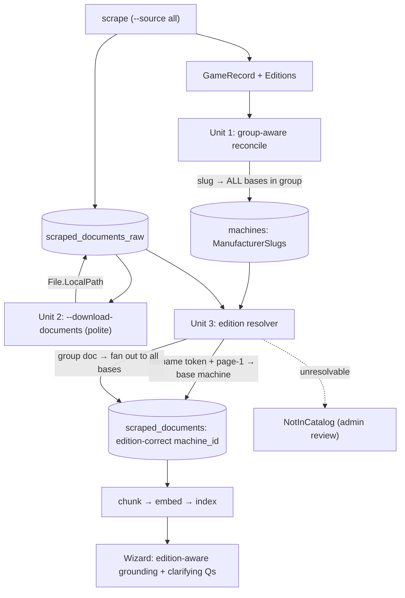

# Edition-Aware Reconciliation + Linking — Design Spec (AB#259)

**Date:** 2026-06-01
**Branch:** `fix/AB-259-linker-slug-population`
**Status:** Approved — ready for implementation plan
**Related:** ADR-0031 (linking source of truth), ADR-0029 (version-aware answering), `thoughts/shared/plans/2026-06-01_AB-259_data-pipeline-reassessment.md`

## Problem

One scraped Stern game page (`Title="Godzilla"`, `Slug="godzilla"`, with `game.Editions=[Pro, Premium, LE, …]`) corresponds to **two or more distinct OPDB base machines** that share an OPDB group segment:

- `GweeP-MW95j` — "Godzilla (Pro)", `features:['Pro edition']`
- `GweeP-Ml9pZ` — "Godzilla (Premium/LE)", `features:['Limited edition','Premium edition']`
- (both share `GroupId = "GweeP"`; per ADR-0029 each base stays a **distinct** Machine)

Stern publishes **per-edition documents** that the old slug-only linker collapsed under one slug `godzilla`, mislabeling all of them onto a single (wrong) machine — the root mechanism behind the 281-chunk Sega/Stern mislabel.

| Document | Correct target |
|---|---|
| `Godzilla_Pro_web.pdf` | `GweeP-MW95j` (Pro) — **verified**: page 2 reads "GODZILLA PRO MANUAL 500-55T5-01" |
| `Godzilla_LE_Pre_web.pdf` | `GweeP-Ml9pZ` (Premium/LE) |
| `Godzilla_70th_web.pdf` | `GweeP-Ml9pZ-AOvNL` (70th Anniversary) |
| `GODZILLA-PRO-New-Address-*.pdf` | `GweeP-MW95j` |
| `GODZILLA-PREM-New-Address-*.pdf` | group `GweeP-Ml9pZ` |
| `GODZILLA-LE-New-Address-*.pdf` | group `GweeP-Ml9pZ` |
| `Godzilla-Pinball-Feature-Matrix-*.pdf` | **all** group bases (group-level) |
| `Godzilla-Rulesheet.pdf` | **all** group bases (group-level) |

The current reconciler is 1-game→1-machine and matches by normalized `Title` alone; when >1 base machine shares the normalized title it returns `Ambiguous` and writes nothing (22 ambiguous on the last run; 47 more unmatched from decorated titles). Result: 36 of 2,158 machines carry slugs; the linker links 0/405 documents.

## Constraints (locked)

- `Machine.ManufacturerSlugs` stays the slug source of truth (ADR-0031); consumer `DocumentLinker` reads it.
- Each OPDB base stays a distinct Machine; `GroupId` is a *relational* key, not a merge key (ADR-0029).
- Provenance is sacred; host↔manufacturer consistency is a write-time invariant (ADR-0031 §4, gate G3).
- Edition-awareness is a first-class Wizard requirement (Jim, 2026-06-01): editions preserved end-to-end so the Wizard can navigate them and ask clarifying questions for edition-unspecified queries.

## Design — three units

### Unit 1 — Group-aware reconciler

**File:** `src/PinballWizard.Application/Sync/ScraperReconciliationService.cs`

Changes to `FindMatch` / `ApplyScraperFields`:

1. **Decoration-stripped normalization.** `NormalizeTitle` additionally strips edition/format decorations before comparison: `"Remake"`, `"Pinball"`, `"Game Kit"`, `"(Deposit)"`, `"Limited Edition"`, `"Merlin Edition"`, trailing `"Edition"`. `"Cactus Canyon Remake"` → matches OPDB `"Cactus Canyon"`. (Closes D3 — 47 unmatched.)
2. **Franchise-title matching.** Scraped game titles are the bare franchise (`"Godzilla"`); OPDB base titles are edition-qualified (`"Godzilla (Pro)"`, `"Godzilla (Premium/LE)"`). A new `NormalizeFranchiseTitle` strips a trailing `(…)` edition parenthetical before normalizing, so the scraped game matches every edition base.
3. **Edition-family multi-match (CORRECTED — verified against full OPDB export 2026-06-01).** When the franchise title matches **multiple** base machines, this is an edition family — not ambiguous — **only when those machines share manufacturer (same partition) AND one OPDB group segment (`GroupId`) AND one release `Year`.** Write `ManufacturerSlugs[mfr] = game.Slug` to **every** base in the family (closes D4). **⚠️ Critical correction:** the OPDB group segment **alone is NOT an edition key** — it clusters unrelated games (group `G4xlK` = Free Fall / Sky Dive / Sky Jump, 5 different Gottlieb games; 178 of 257 same-segment+same-mfr groups have mixed franchises). The **`Year` guard** is essential: it separates genuine reissues/remakes (Williams Big Ben 1954 vs 1975 — same franchise, different year → stay distinct) from true editions (Godzilla Pro + Premium/LE, both 2021).
4. **True ambiguity preserved.** Multi-matches that do NOT satisfy the same-segment-AND-same-year conjunction (different segments, different years, or null either) keep the `Ambiguous` outcome and **log all candidate OPDB ids with their group+year** (no silent drop — gate G1).
5. New `MatchOutcome.Group` for telemetry; reconciliation result counts group-matched separately (`MatchedByGroup`).

The reconciler does **not** need an OPDB id on `GameRecord` — the catalog already carries `GroupId`, `Year`, and edition-qualified `Title`, sufficient to identify edition families and populate slugs. (Supersedes the ADR-0031 "add OpdbId to GameRecord" sketch.)

**Note on Premium/LE/70th:** these are OPDB *aliases* under the `GweeP-Ml9pZ` base (already modeled as `MachineEdition` with `OpdbAliasId` per ADR-0029), NOT separate base machines. So "Godzilla" resolves to exactly **two** base machines — Pro (`GweeP-MW95j`) and Premium/LE (`GweeP-Ml9pZ`) — and the per-edition documents map to those two bases (the 70th doc maps to the Premium/LE base whose 70th alias it documents, or stays group-level).

### Unit 2 — Document downloader (revives defect D13)

**Files:** new `--download-documents` CLI flag in `src/PinballWizard.Cli/Program.cs`; existing `IFileDownloader` / `FileDownloader`.

- Iterates `scraped_documents_raw` where `File?.LocalPath is null`, downloads each PDF **politely** (through `IPolitenessGate`, throttled, robots-honored), stamps `RawDocumentRecord.File.LocalPath`.
- Idempotent: skips docs already downloaded (local file present + size/hash match).
- Bounded read timeout (also addresses the OPDB-style hang class, D14, for document fetches).
- Runs before `--link-documents` so the page-text tiers (Tier 3–4) are reachable.

### Unit 3 — Edition resolver (in the linker)

**File:** `src/PinballWizard.Application/Linking/DocumentLinker.cs`

When a document's slug (Tier 1/2) resolves to a **candidate set** (>1 base machine sharing `GroupId`), or when page-text tiers (3/4) match a group:

1. **Filename pre-filter.** Extract an edition token from the document filename / `LinkText`: `_Pro_`/`-PRO-` → Pro; `_LE_`/`-LE-` → LE; `_Pre_`/`-PREM-`/`Premium` → Premium; `_70th_`/`70th` → 70th Anniversary. Produces a candidate edition or none.
2. **Page-1 authority.** Read page-1 extracted text (now available via Unit 2). An explicit "GODZILLA **PRO** MANUAL" overrides the filename token on conflict — page-1 is authoritative.
3. **Resolve to base machine.** Match the resolved edition against each candidate's `Title` (e.g. "(Pro)"), `features`, or edition `OpdbAliasId`. Link to that single base.
4. **Group fan-out.** A document with **no** edition token AND an all-editions signal (`Feature-Matrix`, `Rulesheet`) fans out to **every** base machine in the group (one `scraped_documents` row per `machine_id`) — so a question about any edition surfaces the shared doc.
5. **Genuinely unresolvable** (candidate set but no edition signal anywhere, not a known group-doc) → `NotInCatalog` with a diagnostic, for admin review. Never a wrong guess.

The `PreferByManufacturer` host-guard (G3) wraps the result: a `sternpinball.com`-sourced document can only resolve to a `stern`-partition machine.

## Data flow

## Error handling

- Download failure → `RawDocumentRecord` stays un-downloaded; logged; linker falls back to filename-only resolution for that doc (degraded but not wrong).
- Page-1 extraction failure → `Failed` status (existing behavior), filename token used as fallback.
- Edition token vs page-1 conflict → page-1 wins, conflict logged (operability).
- Host↔manufacturer mismatch at write → **reject** (G3), logged with both the URL host and the resolved machine's manufacturer.

## Testing (behavior-asserting — fixtures where the behavior actually fires)

- Godzilla Pro doc (filename `_Pro_`, page-1 "PRO MANUAL") → resolves to `GweeP-MW95j`.
- Godzilla LE doc → resolves to `GweeP-Ml9pZ`.
- Godzilla Rulesheet (no edition token) → fans out to **both** `GweeP-*` bases.
- Page-1 "PRO MANUAL" **overrides** a deliberately-misleading `_LE_` filename.
- Reconciler: two Stern bases sharing `GroupId=GweeP` + scraped "Godzilla" → slug written to **both**; `MatchOutcome.Group`.
- Reconciler: two **unrelated** machines colliding on title (no shared GroupId) → still `Ambiguous`, both ids logged.
- `"Cactus Canyon Remake"` scraped title → matches OPDB `"Cactus Canyon"`.
- A `sternpinball.com` doc resolving to a non-Stern candidate → **rejected** by the host guard.
- Downloader idempotency: re-run skips already-downloaded docs.

## Out of scope (later steps in the migration plan)

- The destructive index rebuild (Step 5), re-eval + eval-truth fix (Step 6), grounding fallback fix (Step 7, D12), and the `--doctor` command (Step 8) are separate steps in `2026-06-01_AB-259_data-pipeline-reassessment.md §4`. This spec covers the producer + linker fix (Steps 1–4 producer/link portions).

## ADR amendment

ADR-0031 decision #2 ("add OPDB id + edition hint to GameRecord") is **superseded** by this design: the catalog's existing `GroupId` + per-edition `Title`/`features` make a `GameRecord` schema change unnecessary. The reconciler resolves across the group using catalog data already present. ADR-0031 to be updated accordingly.
