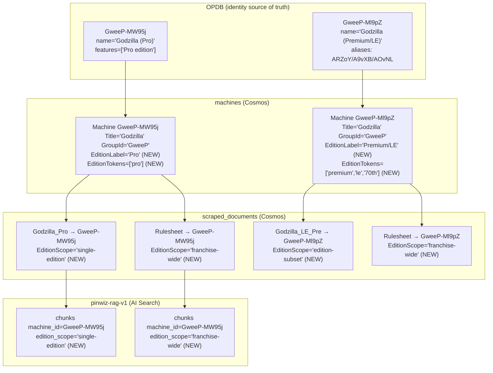

# Edition-Scope Model — Design Spec (AB#259)

**Status:** Proposed — awaiting Jim's approval
**Date:** 2026-06-01
**Branch:** `fix/AB-259-linker-slug-population`
**Extends/supersedes:** ADR-0029 §3/§5 (canonical-citation + clarify-first assumptions) and the parts of ADR-0031 that assumed `Machine.Title` carried the edition qualifier — both disproven by live point-reads this session.
**Locked requirements:** [2026-06-01_AB-259_edition-scope-REQUIREMENTS.md](../../../thoughts/shared/plans/2026-06-01_AB-259_edition-scope-REQUIREMENTS.md) (R1/R2/R3, north star = edition-aware citations)

> **Two prior assumptions disproven by live data — everything below is grounded on the corrected facts:**
> 1. **`GroupId` ≠ "edition family."** `GroupId` is the OPDB segment (`GweeP`), a relational key (`Machine.cs:50-51`, ADR-0029 §1). It groups Pro + Premium/LE bases, but edition-family (same group + year) is an inference, not a stored truth.
> 2. **`Machine.Title` is NOT edition-qualified.** `OpdbMachineMapper.Map:52` sets `Title = FirstNonBlank(dto.CommonName, groupTitle, dto.Name)` → the clean franchise title `"Godzilla"` wins for BOTH bases. The edition-qualified `dto.Name` (`"Godzilla (Pro)"`) and OPDB `features` (`["Pro edition"]`) are **never stored**. So `EditionResolver.Resolve` (`EditionResolver.cs:85`, `m.Title.Contains("pro")`) can never match within the Godzilla family → returns `Unresolved()` → the Pro doc fans out to BOTH bases (the over-linking correctness failure the requirements forbid).

---

## 1. The edition-scope model

Every catalogued **document** has exactly one **edition scope**:

| Scope | Meaning | Canonical example (verified in corpus) |
| --- | --- | --- |
| `single-edition` | Applies to exactly ONE edition base. | `Godzilla_Pro_web.pdf` → Stern Godzilla **Pro** only (`GweeP-MW95j`) |
| `edition-subset` | Applies to a NAMED SUBSET (2+ but not all) of a franchise's edition bases. | `Godzilla_LE_Pre_web.pdf` → Premium **and** LE (both owned by `GweeP-Ml9pZ` as aliases) |
| `franchise-wide` | Applies to ALL editions; the answer does not vary by edition. | `Godzilla-Rulesheet.pdf`, `Godzilla-Pinball-Feature-Matrix.pdf` → all bases |

This is a **document property**, not a machine property. The same franchise simultaneously holds documents of all three scopes. **Over-linking a `single-edition` doc to a non-target edition is a 🔴 correctness failure** (a Pro-only doc linked to LE would make the Wizard answer an LE question from Pro data without disclosing it).



---

## 2. Catalog change (minimal, ADR-0029-respecting)

Add two fields to `Machine` (`Machine.cs`), populated from OPDB data the sync **already fetches but discards**:

```csharp
/// <summary>Edition-qualified OPDB label for this base, e.g. "Pro", "Premium/LE".
/// Derived from dto.Name's parenthetical or dto.features. Null for singletons.</summary>
[JsonPropertyName("editionLabel")] public string? EditionLabel { get; set; }

/// <summary>Normalized edition tokens this base answers to: ["pro"] or
/// ["premium","le","70th"]. The reliable discriminator EditionResolver needs.</summary>
[JsonPropertyName("editionTokens")] public List<string> EditionTokens { get; set; } = [];
```

**Why this option:** `dto.Name` is already deserialized and read by `Map` as a title fallback — zero new HTTP. `EditionTokens` is a *list* — correctly models that `GweeP-Ml9pZ` answers to premium AND le AND 70th (its three alias children), which a single label cannot. `Title` stays the clean franchise name (ADR-0029 §2); each base stays distinct (ADR-0029 §1). Rejected alternatives: re-attaching the suffix to `Title` (reverses ADR-0029, breaks title-lookup); `features`-only (a tier label, needs token normalization anyway); a canonical-base bool (doesn't tell the linker which base a doc's token maps to).

Also add `OpdbMachineDto.Features` (`List<string>`) as the `EditionLabel` fallback when `dto.Name` lacks a parenthetical.

**Derivation** (in `OpdbMachineMapper.Map`, after Title): `EditionLabel = ExtractEditionLabel(dto.Name)` (parenthetical); `EditionTokens` = normalized label split + each alias's `MachineEdition.Name` folded in during OPDB sync pass 2 (which already iterates aliases). Result: `GweeP-MW95j` → `["pro"]`; `GweeP-Ml9pZ` → `["premium","le","70th"]`.

**OPDB re-sync required** (full `--source opdb`). `MergeOpdbFieldsInto` extended to write the new fields on re-sync (idempotent).

---

## 3. Document edition-scope detection (in the linker)

Signals ordered by reliability (grounded in the real corpus taxonomy). First definitive signal wins:

1. **Franchise-wide by doc type** — filename/link_text ends in `Feature Matrix`/`Rulesheet` → `franchise-wide`. Extend `EditionResolver.IsGroupLevelDoc` to also read `link_text`. (~35 game-page matrices/rulesheets carry no edition token.)
2. **`edition-subset` from explicit link_text** — "Pro and Premium", "Premium and LE" (3 historical Stern manuals state the subset in link_text only).
3. **`edition-subset` from the `_LE_Pre_` filename convention** (~28 manuals) — means "Premium AND LE in one PDF," maps to the single `GweeP-Ml9pZ` base; `EditionScope` recorded as `edition-subset`.
4. **`single-edition` from a single filename token** — `_Pro_`, `_LE_`, `_70th_`, `_Prem_`, `_VE_`, `_Vault_`, `_SLE_`, `_BRK_`, `_30th_`, `_60th_`, `_Pin_`. Extend `EditionResolver.FilenameMarkers` to the full set.
5. **`single-edition` from page-1 text** (authoritative override) — `ExtractEditionFromPageText` already reads "PRO MANUAL"/"PREMIUM MANUAL". Requires `--download-documents`.
6. **`franchise-wide` as the no-signal default** — a doc naming a franchise with no edition token and no type classification. Trivially correct for singleton franchises. For multi-base franchises with no signal, franchise-wide is the safe choice (applies to all editions; correct when the answer doesn't vary).

**Edge cases:** Beatles (Gold/Platinum/Diamond — tokens come from OPDB alias names, so handled generically); Star Wars: Fall of the Empire (three separate per-edition manuals); service bulletins (scope in post-`|` link_text — recommend a follow-up); `_Pin_`/Home editions (own base or admin-review, never fan out).

---

## 4. Linker resolution + index representation

| Scope | Links to | Strategy |
| --- | --- | --- |
| `single-edition` | The ONE base whose `EditionTokens` contains the token | `filename_edition` |
| `edition-subset` | Every base whose `EditionTokens` intersects the token set | `filename_edition_subset` (new) |
| `franchise-wide` | Fan out to all bases in the group | `filename_edition_group` |

**The root-cause fix:** `EditionResolver.Resolve` matches the token against **`EditionTokens`, not `Title`**:
```csharp
var matches = candidates.Where(m =>
    markers.Any(marker => m.EditionTokens.Contains(marker, StringComparer.OrdinalIgnoreCase))).ToList();
```
`Godzilla_Pro_web.pdf` → token `"pro"` → `GweeP-MW95j` (`["pro"]`) matches, `GweeP-Ml9pZ` (`["premium","le","70th"]`) does not → **single base, Pro only.** Over-linking fixed at the root. Add `EditionResolution.ForSubset(matches)`.

**Franchise-wide = fan out to all bases (recommended), NOT a franchise-link primitive.** The retriever filters `machine_id eq '...'` only and has no group filter; a primitive would need a new index field + filter + two-pass merge. Fan-out means `searchCorpus(machineId: GweeP-MW95j)` *already* returns Pro single-edition chunks PLUS franchise-wide rulesheet chunks (both physically exist under `GweeP-MW95j`) — "edition query gets edition docs + franchise-wide docs" with **zero retriever change**. Cost: franchise-wide chunks duplicated per base (2× for Godzilla) — negligible pre-launch.

**Carry scope into the index** (closes the dropped-edition gap where `edition` dies at `ScrapedDocumentIngestionPipeline.cs:114`): thread `EditionScope`/`Edition` through `ScrapedDocumentRecord` → `ChunkRequest` → `IndexedChunkDocument` + `AiSearchIndexFields` (`edition`, `edition_scope`, filterable/retrievable). **This is how the Wizard knows the edition of each chunk** (the R2/R3 enabler).

---

## 5. Wizard reasoning — implements R1/R2/R3 (evidence-driven)

**Grounding fix:** `getMachineByTitle("Godzilla Premium")` can't resolve today (both bases `Title="Godzilla"`). OPDB sync writes **edition-qualified lookup rows** keyed off `EditionTokens`: `"godzilla pro"` → `GweeP-MW95j`; `"godzilla premium"/"godzilla le"/"godzilla 70th"` → `GweeP-Ml9pZ`. `getMachineByTitle` returns per-sibling `EditionLabel`/`EditionTokens`.

**The Wizard decides edition-behavior from the `edition_scope` distribution of retrieved hits** — evidence-driven, not prompt-guessing:
1. Ground the title → primary base + Siblings.
2. Retrieve (union across sibling bases for version-dependent + edition-unspecified questions), dedupe by `document_url`.
3. Inspect the hits:
   - all relevant hits `franchise-wide` → **answer does not vary → R1**
   - hits include differing `single-edition` evidence under different bases → **answer varies → R2**
   - user named edition X but hits only under edition Y → **R3**

**R1 (same answer)** → answer once, franchise level, no clarifying question, no friction.

**R2 (differs by edition)** → ONE response, attributed per edition: *"For the Pro edition, multiball works like X (cited: Godzilla Pro Manual); for Premium/LE, like Y (cited: Godzilla Premium/LE Manual)."* **No clarifying round-trip** (the locked preference). The Wizard knows which evidence is which edition because every chunk carries `edition`/`edition_scope`.

**R3 (requested edition absent)** → honest substitution: *"I don't have LE-specific details for that, but here's what the Pro manual says (cited: Godzilla Pro Manual): …"* Never silently answers from the wrong edition; never blanket-refuses. Disclosure is mandatory, driven by the base mismatch.

**`Wizard.md` changes:** replace Step 3's clarifying-question block with the R1/R2/R3 evidence-driven rule (clarifying demoted to last-resort fallback per the requirements NON-GOAL); Step 4 unions retrieval across siblings and reads `edition`/`edition_scope`; new Step 4.5 classifies the hit set.

---

## 6. Eval rework (edition-aware)

`EvalQuestion` gains: `acceptable_citation_sets` (any-of list-of-sets), `franchise_wide_ok` (franchise-wide docs accepted for any edition), `expected_outcome` (`grounded` | `answered_all_editions` (R2) | `honest_substitution` (R3)), `required_editions` (R2 — each named edition must appear attributed). The current all-Godzilla→`["GweeP-Ml9pZ"]` model **rewards collapsing** and is removed. New evaluators: `AnsweredAllEditionsEvaluator` (R2), `HonestSubstitutionEvaluator` (R3).

Example rewritten rows:
```json
{"id":"ev-rules-0002","question":"How does multiball work in Stern's Godzilla?","expected_outcome":"answered_all_editions","required_editions":["Pro","Premium/LE"],"acceptable_citation_sets":[["GweeP-MW95j","GweeP-Ml9pZ"]],"franchise_wide_ok":true,"notes":"R2: answer BOTH attributed in one response."}
{"id":"ev-rules-0010","question":"What is the theme of Stern Godzilla?","expected_outcome":"grounded","acceptable_citation_sets":[["GweeP-MW95j"],["GweeP-Ml9pZ"]],"franchise_wide_ok":true,"notes":"R1: title-level, identical across editions, no clarify, either base ok."}
{"id":"ev-repair-0003","question":"My Stern Godzilla LE flippers feel weak?","expected_outcome":"honest_substitution","acceptable_citation_sets":[["GweeP-MW95j"],["GweeP-Ml9pZ"]],"franchise_wide_ok":true,"notes":"R3: LE named; if LE data absent, disclose + cite Pro/franchise. Silent Pro or blanket refusal both FAIL."}
{"id":"ev-valuation-0002","question":"What does the Stern Godzilla Premium retail for?","expected_outcome":"grounded","acceptable_citation_sets":[["GweeP-Ml9pZ"]],"franchise_wide_ok":false,"notes":"Edition named → exactly GweeP-Ml9pZ. MSRP must be edition-specific; citing Pro is a FAIL."}
```

---

## 7. Migration & sequencing (each gated; pre-launch, index freely rebuildable)

1. **Catalog + re-sync.** Add fields + `OpdbMachineDto.Features`; extend `Map`/`MergeOpdbFieldsInto`/pass-2; full `--source opdb`. **Gate:** point-read shows `GweeP-MW95j`→`["pro"]`, `GweeP-Ml9pZ`→`["premium","le","70th"]`; `getMachineByTitle("Godzilla Premium")` → `GweeP-Ml9pZ`.
2. **Stale-Sega cleanup.** Delete legacy `G5po2-MeP6B` Sega Godzilla rows from `scraped_documents` + purge their index chunks (relink doesn't delete them; they shadow Stern Godzilla). **Gate:** `getMachineByTitle("Stern Godzilla")` no longer returns `G5po2`.
3. **Linker.** Match `EditionTokens` not `Title`; add `ForSubset`; extend markers; scope classification; thread `EditionScope`/`Edition` through fan-out. **Gate:** unit test — Pro doc → `GweeP-MW95j` only; rulesheet → both.
4. **Re-link.** **Gate:** no single-edition doc under a non-target base.
5. **Index rebuild.** Add `edition`/`edition_scope` fields; rebuild from scratch. **Gate:** Pro chunk `edition_scope='single-edition'`; rulesheet chunk `'franchise-wide'`; zero `G5po2` chunks.
6. **Wizard.** R1/R2/R3 rules; DTO additions. **Gate:** "How does multiball work in Stern's Godzilla?" → one R2 response citing both bases attributed.
7. **Eval.** Schema + evaluators; rewrite Godzilla rows. **Gate:** R1/R2/R3 rows pass.

---

## 8. Open decisions for Jim

1. **Franchise-wide = fan-out (recommended) vs. franchise-link primitive?** Fan-out: zero retriever change, edition-query-gets-franchise-docs free, modest duplication. The primitive is purer but adds an index field + filter + merge.
2. **R1 default base when no edition named + answer is franchise-level — which base id is the citation?** Either Godzilla base is factually correct. Recommend **Pro (`GweeP-MW95j`)** as representative (most-common). Eval rows accept either.
3. **Confirm the prior `GweeP-Ml9pZ`-for-everything eval was accidental collapse to rip out** (vs. a deliberate canonical choice).
4. **Service bulletins (85 docs, unlinked)** — in scope or follow-up? Recommend **follow-up**; this pass handles manuals/flyers/matrices/rulesheets.
5. **`edition-subset` transparency** — should the Wizard volunteer "this manual covers both Premium and LE" (via the `edition` field value)? Recommend yes.
