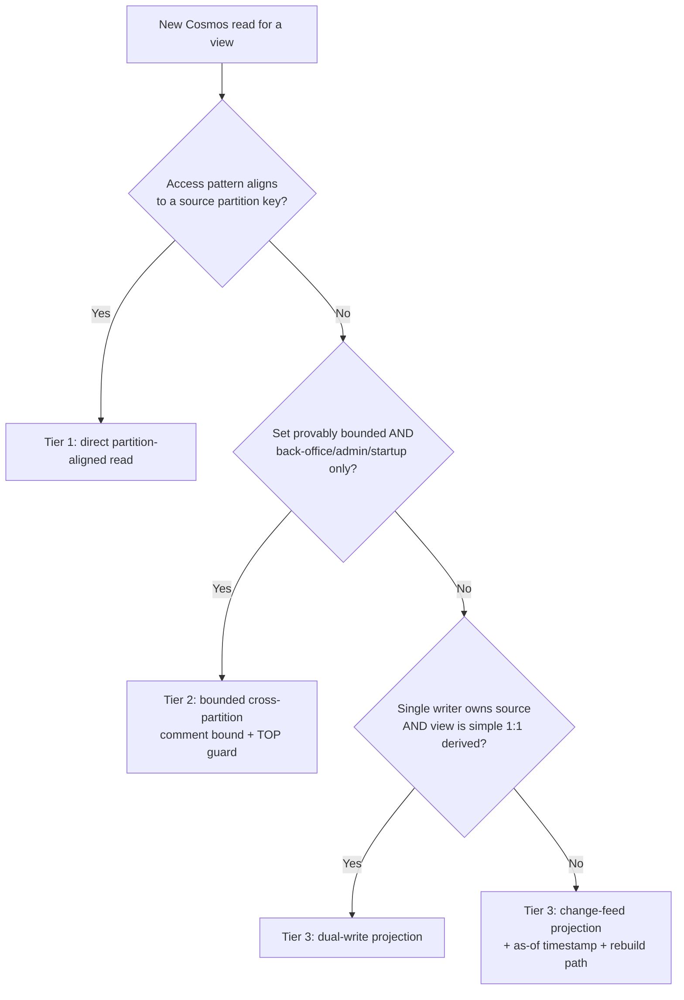

# Design: Cosmos read-access standard + Admin Machine Catalog

This spec has two parts. **Part 1** establishes a project-wide standard for how
"data screens" read from Cosmos (to become **ADR-0036**). **Part 2** designs the
Admin Machine Catalog + per-game document detail pages as the **first consumer**
of that standard.

The standard is the load-bearing decision; the catalog is the proving ground.

---

## Part 1 — Cosmos read-access standard (ADR-0036)

### Context

The app is acquiring many read-heavy "data screens" (admin/QA dashboards,
public catalog browsing, user activity). Each one needs a defensible answer to
"which partition does this read hit, and is that affordable at scale." Without a
standard, screens drift into cross-partition `SELECT *` fan-outs that pass in
dev and degrade in production.

This is not a new direction. **ADR-0025 already chose it**: *"Cosmos as primary
document store with targeted CQRS-style materialized views per query pattern.
NOT full event sourcing,"* and it explicitly **rejected** full event sourcing on
`machines` (point-lookup-shaped reads; OPDB is the upstream source of truth, not
authored state; the event-log + replay + snapshot tax is unearned). ADR-0025 also
pre-declared that the *second* projection over `machines` should adopt the
change-feed hosted-service abstraction the RAG worker already uses. ADR-0036
**generalizes that machines-scoped decision into a standing, enforced project
standard.**

Current data-access inventory (2026-06-15) that the standard is calibrated against:

- **Source-of-truth containers:** `machines` (`/manufacturer`), `scraped_documents`
  (`/machine_id`), `scraped_documents_raw` (`/document_id`), `ingestion_sources`
  (`/partitionKey`="config"), `link_overrides` (`/source_pattern`), `admin_settings`
  (`/key`), `admin_prompts` (`/agent_name`), `featured_machines` (`/slug`).
- **Existing projections:** `machine_title_lookups` (`/normalizedTitle`, dual-write
  off `machines`), `rag_index_state` (`/document_id`, pipeline-internal), and the
  Azure AI Search index (change-feed projection of `scraped_documents`).
- **Reusable change-feed abstraction:** `CosmosChangeFeedHostedService<T>` +
  `ICosmosChangeFeedHandler<T>` (RagIngestionWorker).
- **No event sourcing exists** in the codebase (confirmed).

### Decision: the tiered model

Every Cosmos read is classified into one of four tiers. A read's tier is declared
in a comment on the repository method.

- **Tier 0 — Source of truth.** Containers partitioned by their dominant
  write/identity key. Unchanged.

- **Tier 1 — Direct partition-aligned read (default).** Any view that aligns to a
  source partition key reads it directly: point read or single-partition scan
  (`pk` supplied). No projection. *Reference: machines-for-a-manufacturer,
  docs-for-a-machine, prompt-versions-for-an-agent.*

- **Tier 2 — Bounded cross-partition (allowed, justified).** A `pk: null` query is
  permitted **only** for back-office / admin / startup paths over a **provably
  bounded** set, and **must** carry a comment stating the bound and a `TOP`/limit
  guard. **Not permitted** for user-facing or unbounded reads. *Reference: featured
  machines (~6), link overrides (<1k), admin settings (tens).*

- **Tier 3 — Projection / read model (required) when** the read access pattern does
  not match the source PK **and** the set is large/unbounded, **or** the view is an
  aggregate across many source docs, **or** it is a user-facing/scale read. Two
  implementation styles, with a selection rule:
  - **Dual-write projection** — when a *single writer* owns the source and the view
    is a simple derived (≈1:1) shape; synchronous, immediately consistent.
    *Reference: `machine_title_lookups`.*
  - **Change-feed projection** — when the source has *multiple writers*, high change
    volume, the view is an *aggregate*, or rebuildability matters. Reuse
    `CosmosChangeFeedHostedService<T>` + `ICosmosChangeFeedHandler<T>`. Eventual-
    consistent → the screen surfaces an "as of" timestamp; rebuildable by lease
    reset + replay. *Reference: RAG ingestion pipeline.*

- **Event sourcing — not the data model.** Reserved for a *future* subsystem whose
  value *is* its history (e.g. an admin-action audit log, or user activity/scoring).
  When one appears it gets its own ADR and is implemented as an event container +
  change-feed projections — i.e. it *composes with* Tier 3, never a global rewrite.

### Selection flow



### Enforcement

- Each repository read method declares its tier in a comment.
- Any `pk: null` query must state its bound + justification (Tier 2) or be replaced
  by a Tier 3 projection.
- User-facing aggregate views must be projection-backed.
- An **architecture test** flags any new `pk: null` Cosmos query for explicit review
  (allow-list keyed to the justified Tier 2 sites). This makes a new cross-partition
  query a conscious, reviewed act — not an accident.

### Consequences

- **Positive:** every data screen has a defensible, partition-aligned (or projection-
  backed) read; cross-partition becomes a reviewed exception, not a default; the
  standard reuses abstractions already in the repo; strong showcase narrative
  (textbook CQRS on Cosmos). Generalizes ADR-0025 rather than contradicting it.
- **Negative:** Tier 3 projections add eventual-consistency lag (mitigated by an
  "as of" stamp on QA screens) and a rebuild path to maintain; some up-front
  ceremony (tier declaration, architecture test).
- **Neutral:** existing Tier 2 sites (featured/overrides/admin-settings) are
  grandfathered with explicit bound comments; no rewrite required.

---

## Part 2 — Admin Machine Catalog (first consumer)

### Goal

Replace the empty `/admin/machines` skeleton with a manufacturer-grouped (and
re-groupable) catalog that flags scraping gaps, and add a per-game detail page
showing exactly what is linked, how it linked, and how it compares across
editions — so the admin can spot scraping issues (e.g. the Godzilla edition
mislink class from ADR-0031/0032).

### Summary page `/admin/machines` — Tier 3

**Read model: `catalog_stats` (new container), partition key `/manufacturer`,
one rollup doc per manufacturer.** Each doc holds that manufacturer's machines'
document statistics:

```jsonc
// id = manufacturer (e.g. "stern"), pk = /manufacturer
{
  "id": "stern",
  "manufacturer": "stern",
  "asOfUtc": "2026-06-15T12:00:00Z",     // last change-feed update; rendered on screen
  "machines": [
    {
      "machineId": "GweeP-MW95j",
      "title": "Godzilla", "editionLabel": "Pro", "groupId": "GweeP", "year": 2021,
      "docCount": 7,
      "docTypeCounts": { "Manual": 1, "Rulesheet": 1, "Bulletin": 5 },
      "hasManual": true
    }
    // … all Stern machines
  ]
}
```

- **Maintained by a change-feed projection** over `scraped_documents` (multiple
  writers: linker + CLI seeder; the stat is an aggregate). New
  `ICosmosChangeFeedHandler<RagSourceDocument>` sibling handler — call it
  `CatalogStatsChangeFeedHandler` — recomputes/updates the affected manufacturer
  rollup doc when a `scraped_documents` row changes. Reuses
  `CosmosChangeFeedHostedService<T>`; runs in the RagIngestionWorker host.
- **Rebuild/backfill path:** a CLI verb (e.g. `--rebuild-catalog-stats`) recomputes
  all rollup docs by streaming `scraped_documents` per machine — the same
  "rebuildable projection" guarantee as the RAG index (ADR-0031).
- **Read access:** the summary loads the rollup docs (per-manufacturer single-
  partition reads). Default manufacturer group-by expands one manufacturer = one
  read; "expand all" / non-manufacturer group-bys load the full bounded set
  (~8–9 docs). **No cross-partition aggregate.**
- **An "as of" timestamp** is shown (min across loaded rollup docs), making the
  eventual-consistency honest.

**Catalog list join:** machine identity/metadata (title, edition, year, groupId)
is denormalized into the rollup doc, so the summary needs only `catalog_stats`
(it does not also cross-partition `StreamAllAsync` the `machines` container).

**Group-by axes are client-side** (regrouping the loaded set costs zero DB calls):
Manufacturer (default), Health status, Franchise (`groupId`), Release year, Source.
"Source" = the manufacturer-slug source(s) on the machine; an OPDB-only machine
(no manufacturer-scraper slug) is itself a gap signal.

**Health flags** (computed in-app from the rollup stats):
- **Empty** — `docCount == 0`.
- **No manual** — `docCount > 0` and `!hasManual`.
- **Edition gap** — fewer docs than a sibling edition in the same `groupId`.
- **OK** — has docs incl. a manual, no edition gap.

**Layout: expandable grouped MudDataGrid (option A).** Collapsible group headers
with roll-up flag counts; rows sortable by docs/year; click a row → detail page.
Health rendered as **MudChips with Severity colors** (theme tokens, WCAG AA) —
**never row-background tint** (the contrast issue caught in mockup review).

### Detail page `/admin/machines/{opdbId}` — Tier 1

- **Header:** title · edition · manufacturer · year · OPDB id (+ OPDB link) ·
  last sync · health chip.
- **Edition-sibling strip:** via `IMachineRepository.GetSiblingsByGroupIdAsync`
  (existing Tier 2, bounded 1–10) — each sibling's doc count side by side, with a
  plain-language edition-gap callout. This is the headline diagnostic.
- **Linked-documents table:** **Tier 1 single-partition read** of `scraped_documents`
  by `machine_id` (new read method, below). Columns: Type · Document (link
  text/filename) · Edition scope · Status · How-linked · Downloaded (size/pages) ·
  file link. Each linked doc is enriched with `LinkStatus` + `ResolutionStrategy`
  by a point read of `scraped_documents_raw` (Tier 1, by `document_id`). Empty-state
  when zero.
- **Actions:** deep-links to `/admin/document-triage` and "Create link override"
  (existing pages), prefilled for this game.

### New / changed code

- **Application:**
  - `IMachineDocumentReadRepository` (new, read-only) with
    `IAsyncEnumerable<MachineDocumentLink> StreamByMachineIdAsync(machineId)`
    (Tier 1). Kept separate from the write-side `IScrapedDocumentRepository` so the
    write repo stays focused.
  - `ICatalogStatsReadRepository` with `Task<ManufacturerCatalogStats?>
    GetByManufacturerAsync(manufacturer)` and `IAsyncEnumerable<ManufacturerCatalogStats>
    StreamAllManufacturersAsync()` (reads the Tier 3 projection).
- **Infrastructure:**
  - Cosmos impls of the two read repos.
  - `CatalogStatsChangeFeedHandler : ICosmosChangeFeedHandler<RagSourceDocument>`
    + hosted-service registration + `catalog_stats` container provisioning
    (`CosmosOptions.Containers`).
  - `--rebuild-catalog-stats` CLI verb.
- **Web:** rewrite `AdminMachines.razor` (`/admin/machines`); new
  `AdminMachineDetail.razor` (`/admin/machines/{opdbId}`). Both `AdminLayout` +
  `[Authorize(Policy="AdminOnly")]`, MudDataGrid per ADR-0008. Add a nav entry.

### Non-functional (showcase bar)

- **Perf:** summary = bounded per-manufacturer reads; detail = single-partition.
  No cross-partition aggregate anywhere in the user path.
- **Error handling:** degrade visibly (Snackbar + empty/error states); never
  fabricate counts (Invariant #17). If the projection is unavailable, say so —
  don't render zeros as truth.
- **Observability:** OTel spans around the projection reads and the change-feed
  handler; a metric for projection lag (now − asOfUtc).
- **Freshness honesty:** the "as of" stamp is a first-class UI element on the
  summary, not a footnote.

### Testing

- **Standard:** an architecture test that flags new `pk: null` Cosmos queries
  (allow-list of justified Tier 2 sites).
- **Health-flag computation:** unit tests with fixtures where Empty / No-manual /
  Edition-gap each actually fire (behavior, not structure — per CLAUDE.md).
- **Projection handler:** test that a `scraped_documents` change updates the right
  manufacturer rollup doc and recomputes counts/`hasManual` correctly; idempotency
  on replay.
- **Tier 1 reads:** against the Cosmos emulator (Aspire) — docs-for-machine returns
  exactly the machine's partition.
- **bUnit smoke** for both pages; a contract test that the detail route is
  reachable from a summary row.
- **Rebuild path:** `--rebuild-catalog-stats` reproduces the projection from
  `scraped_documents` alone.

### Out of scope (v1)

- **Fuzzy candidate matching** — associating failed/`NotInCatalog` docs to a
  specific game by title heuristic. Deferred; the precise edition-sibling strip
  covers the highest-value case without the fuzziness. Logged as a future
  enhancement.

### Open questions / risks

- **Rollup doc size & write amplification:** a per-manufacturer doc is rewritten on
  each change-feed update for that manufacturer. Largest manufacturer (Stern, ~140
  machines) is a small doc; acceptable. If a manufacturer ever grows large, revisit
  per-machine stat docs (the third grain option).
- **Projection lag during bulk relink:** a `--relink-all` run produces many change-
  feed events; the "as of" stamp will visibly lag until it drains. Acceptable for an
  admin QA view; documented in the runbook.
