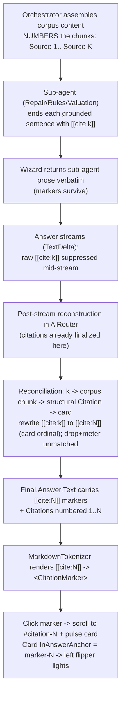

# Inline Citation Markers — Design

**Date:** 2026-06-20
**Status:** Approved (design) — pending implementation plan
**Author:** Jim Keeley (with Claude Code)
**Design authority:** [`docs/ui/themes/modern-lcd.md`](../../ui/themes/modern-lcd.md) "Inline citation markers" (locked Option C)
**Governing rule:** `FE-09` (citation-as-hero) in [`.claude/standards/frontend-blazor`](../../../.claude/standards/frontend-blazor/STANDARD.md)

---

## 1. Purpose

Make the design system's **inline citation markers** real in the app — the last of the
"citation-as-hero" centerpieces (design-system audit gap #3). Today the answer body is
flowing prose and the citation cards are built separately from tool-call traces; **nothing
associates a sentence with a source**, so there is no way to place a marker that points at
the right card. This feature creates that association, truthfully.

**Success:** a grounded answer renders small **numbered pinball-insert markers** inline;
hovering a marker shows `[SOURCE TYPE] Source name`; clicking it scrolls to and pulses the
matching (numbered) citation card; and the card's left flipper (`◀ VIEW IN ANSWER`, already
built in PR #463) round-trips back to the marker. Every rendered marker is **truthful** —
it points at the source the model actually used for that sentence.

### Locked decisions (from brainstorming)

- **Mechanism A — the model tags its own sentences.** The model is the only component that
  knows which source grounds each sentence, so it emits the marker; we reconcile to the
  authoritative structural citation set. (Post-hoc text-matching was rejected: the model
  paraphrases sources, so matching mislabels sentences — worse than no marker for a
  provenance showcase.)
- **Scope: markers now, tokenizer designed to extend to entity portals later.** The inline
  *entity-portal* layer (machine/manufacturer names → outbound `↗` links) is NOT built here,
  but the tokenizer's inline-insert mechanism is designed so that layer drops in with no
  rework.

---

## 2. Architecture & data flow

Two numbering schemes exist and must not be confused:

- **`k`** — the corpus-source number the model was handed and echoes (`[[cite:k]]`). Local
  to one answer's corpus content; the model only has to repeat a small integer.
- **`N`** — the citation **card's display ordinal** (render order = RelevanceScore-desc,
  unchanged). What the user sees on both the marker and the card.

Reconciliation rewrites `k → N` server-side, so the frontend only ever deals with `N`:
the body carries `[[cite:N]]` and the cards are numbered `N`.

---

## 3. The tokenizer marker — CSP-safe, extension-ready

`MarkdownTokenizer` is the CSP-safe renderer for the answer body (it HTML-encodes every
string; `MarkupString` is never used). Inline markers therefore CANNOT be injected HTML —
they must be a **tokenizer-level construct that renders a real Razor component**.

Add **one generic inline-insert mechanism**, not a one-off:

- The tokenizer recognizes a closed family of `[[<kind>:<payload>]]` inline tokens within a
  text run and renders a registered component per `kind`.
- This spec registers exactly one: `cite` → `<CitationMarker Number="N" />` (payload = `N`).
- A later spec registers `portal` → `<EntityPortal …/>` against the same mechanism with no
  tokenizer rework. (Designed-for, not built — §9.)
- Unknown `kind` or malformed payload → rendered as the literal text (fail safe, never a
  blank or an exception), and metered.

**Interface (illustrative — finalized in the plan):**

- `MarkdownTokenizer.Render(string text)` already exists; it gains inline-insert tokenization
  inside text runs. The set of recognized `kind`s and their renderers is a small registry so
  the entity-portal layer is additive.

---

## 4. Reconciliation, numbering, and degradation

Reconciliation runs in `AiRouter`'s post-agent guardrail step (`ApplyPostAgentGuardrailsAsync`
/ the one-shot reconstruction), where the structural `Citation[]` is already final.

Rules:

- **Map** each `[[cite:k]]` to a structural `Citation` by the stable handle the numbered
  corpus carried — the corpus chunk's id (`DocumentChunkId`) or normalized `SourceUrl`.
- **Number** cards `1..N` by their existing render order (RelevanceScore-desc; ordering is
  unchanged — markers reference, they do not re-order).
- **Rewrite** each matched `[[cite:k]]` → `[[cite:N]]` (the matched card's ordinal). The same
  source cited in multiple sentences yields multiple markers all **showing** the same `N`, but
  each marker element gets a **unique DOM id** (`marker-N-{occurrence}`, occurrence 1-based) so
  HTML ids stay unique. The card's `InAnswerAnchor` targets the **first** occurrence
  (`marker-N-1`) — "view in answer" jumps to where the source is first used.
- **Degrade visibly (OBS-01):** a `[[cite:k]]` with NO matching structural citation is
  **dropped** (never rendered as a fake/blank marker) and **metered**
  (`pinwiz.ai.citations.inline_marker_dropped_total`, tagged with reason). A structural
  citation with NO inline token renders normally as a numbered card with `InAnswerAnchor`
  left null (its left flipper stays hidden — the PR #463 path).
- **Meter** marker yield (`…inline_marker_rendered_total`, `…inline_marker_total`) so the
  model-compliance rate is observable, not assumed.

Citation cards gain a **visible ordinal** (`N`) so the marker and its card read as the same
number. The number is an additive UI element on `CitationCard`; it does not alter the
card's existing slots.

---

## 5. Prompt change + evaluation

Touched prompts: **`Wizard.md`** (the corpus-content block it passes to sub-agents gains
per-chunk numbering) and the **three sub-agents** `Repair.md` / `Rules.md` / `Valuation.md`
(the `[[cite:k]]` instruction). The Wizard already returns sub-agent prose verbatim
("do not paraphrase, do not strip"), so markers survive the hand-back.

Prompt rule (each sub-agent): *"When a sentence is grounded in a numbered source from the
corpus content provided, end that sentence with `[[cite:k]]` where k is that source's number.
Cite the source you actually used; never invent a number; a sentence may carry more than one
marker if it draws on more than one source; sentences you did not ground need no marker."*

Because prompts change, the **eval baseline is re-run** (guardrails.md goal #5 / the 5%
citation-accuracy regression gate). Re-baselining is part of this work's definition of done,
not a follow-up. The eval set gains assertions that markers are emitted and reconcile.

---

## 6. Streaming behavior

Markers **resolve at `Final`**, consistent with the existing one-shot guardrail
reconstruction (cache, cost-ceiling, confidence, citation-required all run post-stream per
INVARIANT #14 / ADR-0026). During streaming:

- Raw `[[cite:k]]` tokens are **suppressed** from `TextDelta` text (the user never sees raw
  tokens mid-stream).
- The `Final` chunk's `WizardAnswer.Text` carries the resolved `[[cite:N]]` markers; the
  frontend renders markers when the answer settles.

Live mid-stream markers are explicitly NOT built — they add real complexity (resolving
against an incomplete citation set) for a wayfinding layer the spec does not require to be
live. The `AnswerChunk` discriminated-union wire contract (FE-04) is unchanged.

---

## 7. Frontend rendering

New `<CitationMarker>` in the Citations delight-surface family
(`src/PinballWizard.Web/Components/Citations/`), within the four locked delight surfaces
(FE-03 OK; FE-09 satisfied):

- **Look (Option C, locked):** small numbered pinball-insert (circular/diamond), `accent-grounded`
  glow. `--pw-accent-grounded` token. Recognizably *not* a footnote, quiet enough to keep
  paragraphs readable at 5+ citations.
- **Hover:** tooltip `[SOURCE TYPE]  Source name` (from the matched citation).
- **Click:** scroll to `#citation-N` and **pulse** the card border (one-shot animation,
  `prefers-reduced-motion`-safe).
- **Round-trip:** the matched card's `InAnswerAnchor` is set to the first marker occurrence
  (`marker-N-1`, the existing PR #463 parameter), lighting the card's `◀ VIEW IN ANSWER` left
  flipper, which scrolls back to where the source is first cited. The citation-navigation loop
  closes. (A card with no inline marker leaves `InAnswerAnchor` null — left flipper hidden.)

The marker and card share number `N`; peer parity (FE-09) holds — every marker/card pair is
treated identically regardless of source.

---

## 8. Confidence signal (scope guard)

`citation_coverage` (ConfidenceCalculator) currently estimates "fraction of factual claims
with at least one citation" heuristically from `answerText` + `citations`. Explicit markers
*could* make this exact, but this spec **leaves the confidence calc untouched** — markers are
an additive UX layer and widening the confidence formula's blast radius here risks the
threshold-refusal behavior (ADR-0017) for no UX gain. Tightening `citation_coverage` to use
markers is a noted **optional follow-up**, not built here. (YAGNI.)

---

## 9. ADRs, testing, out-of-scope

**ADRs:** amend **ADR-0026 §8** (citation surface gains the inline-marker layer + the
marker↔card numbering contract) and **ADR-0022** (citation extraction records the
`[[cite:k]]` inline-token contract and the reconciliation step). Append-only follow-up
entries; FE-09 already governs the surface.

**Testing:**

- `MarkdownTokenizer` inline-insert parse tests (valid `[[cite:N]]` renders a marker;
  malformed/unknown `kind` falls back to literal text + meter).
- Reconciliation unit tests: `k→N` mapping by chunk id / SourceUrl; multi-sentence same-source
  → same `N`; unmatched `[[cite:k]]` dropped + metered; card-without-marker → `InAnswerAnchor`
  null.
- `<CitationMarker>` bUnit: number renders, tooltip content, anchor href `#citation-N`,
  reduced-motion-safe pulse trigger.
- Mid-stream suppression test: `TextDelta` never contains raw `[[cite:k]]`.
- End-to-end fixture: an answer containing `[[cite:k]]` → numbered markers + numbered cards +
  lit left flippers + working scroll round-trip.
- Eval re-baseline (goal #5): markers emitted + reconcile; citation-accuracy gate holds.

**Out of scope (designed-for, not built):**

- Inline **entity portals** (machine/manufacturer/tournament → outbound links). The tokenizer
  inline-insert mechanism (§3) is designed so this is additive.
- **`citation_coverage`** tightening (§8).
- **Live mid-stream markers** (§6).

---

## 10. Success criteria

- A grounded answer renders truthful numbered markers inline; each points at the source the
  model actually used (verified by the reconciliation mapping, not by fuzzy matching).
- Clicking a marker scrolls to + pulses the matching numbered card; the card's left flipper
  scrolls back. The citation-navigation loop is closed.
- Unmatched model tokens are dropped + metered (never a fake/blank marker); cards without a
  marker still render and keep their hidden left flipper.
- The marker rate is observable via `pinwiz.ai.citations.inline_marker_*` meters.
- The eval baseline is re-run and the citation-accuracy gate holds.
- Raw `[[cite:k]]` tokens never reach the user (mid-stream or final).

## 11. Open questions for the implementation plan

- The exact stable handle for `k→Citation` mapping: `DocumentChunkId` (preferred when
  populated) vs normalized `SourceUrl` (fallback) — confirm which the numbered corpus block
  and the structural extractor both reliably carry.
- Token syntax final form (`[[cite:k]]` vs an alternative that can't collide with legitimate
  answer text / the safe-markdown subset) — pick one the `MarkdownTokenizer` can scan
  unambiguously and that the model emits reliably.
- Whether card numbering is a new `CitationCard` parameter (`Ordinal`) threaded from
  `CitationStrip`/`CitationGroup`, or computed in the strip — the strip already orders groups,
  so ordinals are assignable there.
