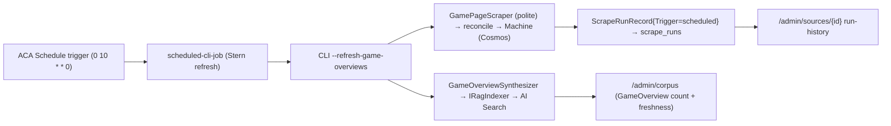

# Design: reusable scheduled-CLI-job pattern + weekly Stern overview refresh

**Date:** 2026-06-24
**Status:** Draft (awaiting review)
**Author:** Jim Keeley (with Claude)
**Branch:** `feat/scheduled-cli-jobs`

## Context & problem

The Stern game-page enrichment (#495) shipped the `--sync-game-overviews` verb but nothing runs it on a cadence — the corpus only reflects new Stern content when someone runs a manual load (as just done by hand). The same is true for any future maintenance op. Today, scheduling a CLI operation as an Azure Container Apps **Job** means hand-writing a self-contained Bicep module under `deploy/<job>/` and wiring it in **5 places** in `shared.bicep` (module call, Cosmos RBAC role assignment, cron param, output × 2). Two such jobs exist (`linker` daily, `opdb-sync` weekly `0 3 * * 0`) — adding a third is copy-paste-with-drift.

This is the *cross-cutting* gap: **scheduling + running a CLI op should be a reusable primitive**, not bespoke per job.

## Goals

- A **reusable `scheduled-cli-job` Bicep module** so any scheduled CLI op is one module instance (job body written once).
- A **weekly Stern game-page refresh** job (scrape → reconcile → overview index sync) using that module — **politeness-respecting**.
- The job's runs are **visible in the existing admin monitoring UI** (small touch-ups), without building a full Jobs page yet.

## Non-goals (→ Spec B / follow-ups)

- The `/admin/jobs` page (list jobs, execution history via the ACA management API, "run now"). Decided **view + run-now only; schedules stay in Bicep** (no UI schedule-editing — it would drift from the IaC source of truth). Separate spec.
- A proper **sync-run history** table (per-sync outcome/duration). Spec B.
- **Migrating** the existing `linker`/`opdb-sync` jobs onto the new module. Forward-only; opportunistic later.
- Scheduling other sync verbs (`--sync-metadata-cards`, `--run-rag-backfill`) — trivial once the module exists; do when wanted.

## Components

### 1. Reusable module — `deploy/scheduled-cli-job/scheduled-cli-job.bicep`

A generic `Microsoft.App/jobs@2023-05-01` with `triggerType: 'Schedule'`, modeled on the existing `opdb-sync-job.bicep` shape but parameterized:

| Param | Purpose |
| --- | --- |
| `jobName` | resource name |
| `cronExpression` | `scheduleTriggerConfig.cronExpression` |
| `command` (array) | the CLI invocation, e.g. `['dotnet','PinballWizard.Cli.dll','--refresh-game-overviews']` |
| `containerImage` | the CLI image (`cliImageTag`) |
| `replicaTimeout` | seconds; default generous |
| `cpu` / `memory` | default `0.5` / `1Gi` |
| `env` (array) | the env block (caller supplies the right profile) |
| `managedIdentityId`, `containerRegistryLoginServer`, `containerAppsEnvironmentId` | shared wiring |
| `secrets` (array, optional) | KV-sourced secrets (e.g. an API token), default `[]` |

Outputs: `jobName`, `jobPrincipalId` (for the caller's cross-resource RBAC). Fixed config matches the existing jobs: `parallelism: 1`, `replicaCompletionCount: 1`, dual identity (UAMI for ACR pull + KV; system-assigned MI available), `registries[]` gated on a non-empty login server.

Cross-resource RBAC (Cosmos/Search/Foundry role assignments) stays in `shared.bicep` keyed off `jobPrincipalId` — role-assignment resources are scoped to the target resource, so they can't live inside the job module. This mirrors today's `linkerJobCosmosDataContrib` pattern.

### 2. CLI verb — `--refresh-game-overviews`

A thin orchestration verb that runs, in one process: the Stern game-page **scrape** (`--source games` path through `ScraperOrchestrator`) → reconcile onto `Machine` → then the **`--sync-game-overviews`** index step. Pure composition over existing handlers; no new business logic. Atomic so the sync always runs on fresh data (no inter-job timing race against a polite, variable-duration scrape).

- **Polite by construction**: the scrape is the same `GamePageScraper` through `IPolitenessGate` + unconditional robots.txt + per-source throttle — running in a job changes nothing.
- Requires Cosmos + AI Search + Foundry configured (same gate as `--sync-game-overviews`). Honors `--dry-run` (skips persistence/index), matching the orchestrator.

### 3. The Stern weekly job (instance of the module, `deployPhase2`-gated)

Wired in `shared.bicep`:

- `command: ['dotnet','PinballWizard.Cli.dll','--refresh-game-overviews']`
- **cron `0 10 * * 0`** — Sunday 10:00 UTC, *after* the OPDB sync's 3 am window, so the reconcile matches against the freshly-synced catalog.
- **`replicaTimeout: 7200`** (2 h), **`parallelism: 1`**, **`replicaRetryLimit: 0`** — politeness-respecting: never bursts requests, and a failed polite run doesn't immediately re-hammer the source (it retries next week).
- **env**: `Cosmos__AccountEndpoint`, `Cosmos__AccountResourceId`, `AiSearch__Endpoint`, `AiSearch__IndexName`, `AiFoundry__ProjectEndpoint`, `AiFoundry__EmbeddingDeploymentName`, `Scraper__DataPath=/tmp/pinwiz`, **`AZURE_CLIENT_ID`** (the shared UAMI's client id — pins `DefaultAzureCredential` to the UAMI in ACA; the ACA-side counterpart to the local `AZURE_TOKEN_CREDENTIALS=dev` gotcha).
- **RBAC** in `shared.bicep` on the job's identity: Cosmos Built-in Data Contributor (data-plane), Search Index Data Contributor, Cognitive Services OpenAI User (Foundry resource) — mirroring the RAG-indexer grants.
- New `sternRefreshCronExpression` param (default `0 10 * * 0`) + `sternRefreshJobName`/`...PrincipalId` outputs in `shared.bicep` and `main-shared.bicep`.

### 4. Monitoring touch-ups (small — make the run visible in the existing UI)

Tracing showed: the **scrape** half already writes a `ScrapeRunRecord` unconditionally (`ScraperOrchestrator.WriteSourceRunAsync`) → appears in `/admin/sources/{id}` run-history and updates the `IngestionSource` accumulators. Two gaps to close cheaply:

- **`Trigger` field** (`manual` | `scheduled`) on `ScrapeRunRecord` (+ `ScrapeRunCosmosRecord` + a "Trigger" column in `AdminSourceDetail.razor`'s run-history table). The orchestrator stamps it from a signal the CLI passes — an env var **`Run__Trigger`** (default `manual`); the scheduled job sets `Run__Trigger=scheduled`. Now the weekly run is distinguishable from an ad-hoc one. (Env-var signal, not a CLI flag, so it composes with the orchestration verb without threading a parameter through.)
- **Sync visibility via `/admin/corpus`**: ensure the corpus page surfaces the `GameOverview` doc count + freshness (`MostRecentScrapeUtc`) so the overview-refresh's effect is observable. (Largely present already — verify and, if needed, add the GameOverview line. A dedicated *sync-run history* is Spec B, not this.)

## Architecture / data flow

## Error handling / operability

- Job: `replicaRetryLimit: 0` surfaces failures immediately (no silent retry storm); the next weekly run self-heals. Best-effort run-record write already swallows Cosmos hiccups without failing the scrape.
- Auth in ACA uses the pinned UAMI (managed identity) — works natively (no IMDS issue; that was local-only).
- Idempotent: `--sync-game-overviews` is safe to re-run; the scrape reconcile is upsert-based.

## Testing

- **Bicep**: `az bicep build` + lint clean; `what-if` against dev shows only the new job + role assignments.
- **Verb**: unit/integration coverage that `--refresh-game-overviews` runs scrape then sync (and respects `--dry-run`); the `Run__Trigger` env stamps the `ScrapeRunRecord.Trigger`.
- **Post-deploy**: `az containerapp job show -n <stern-job> --query "properties.configuration.{trigger:triggerType,cron:scheduleTriggerConfig.cronExpression}"` asserts schedule; a manual `az containerapp job start` smoke run completes and a `scheduled`-tagged run appears in `/admin/sources/games`.

## Out of scope / upgrade path

- **Spec B** — `/admin/jobs` page (view + run-now; schedules view-only, IaC-sourced) + proper sync-run history.
- Migrate `linker`/`opdb-sync` onto the reusable module; schedule other sync verbs. Trivial once this lands.
