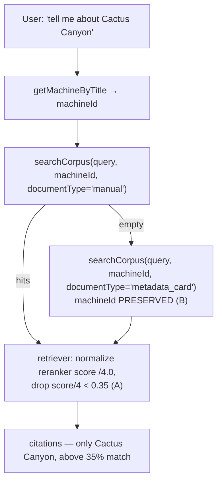

# RAG relevance floor + machine-scope retention — design

**Date:** 2026-07-06
**Status:** Proposed
**Trigger:** `https://pinwiz.ai/wizard?q=tell me about Cactus Canyon` returned 10 citation
cards, including **Attack from Mars — Metadata (28% match)** and **Alice Cooper's Nightmare
Castle — Metadata (28% match)** — machines unrelated to the question.

## Problem

A title-level question about one machine surfaced metadata cards for **other** machines at low
relevance. Investigation found two independent defects that compound:

### Defect 1 — the machine scope is silently dropped on the retry

"Tell me about Cactus Canyon" is a *general machine* question. Per the Wizard routing table
([`Wizard.md`](../../../src/PinballWizard.Application/Ai/Agents/Wizard.md) line 16) it routes to
`Rules` with corpus scope `documentType='manual'`, **retry `documentType='metadata_card'` if empty**.

Cactus Canyon (Bally, 1998) has no indexed *manual*, so the first `searchCorpus` call returns
empty and the model fires the `metadata_card` retry. `Wizard.md` Step 3 (line 37) instructs the
model to *"call `searchCorpus` again with the retry `documentType`"* but **never says to preserve
the `machineId`** it resolved in Step 2. Because `machineId` is an optional, model-supplied tool
argument ([`SearchCorpusTool.cs`](../../../src/PinballWizard.Application/Ai/Tools/SearchCorpusTool.cs)
line 101, `string? machineId = null`), the model drops it on the retry. The retry then runs
**corpus-wide**. Metadata cards are short title/manufacturer/year/theme blobs that embed close to
one another, so unrelated machines' cards become candidates.

### Defect 2 — the relevance floor is mis-scaled and cannot fire (verified bug)

The retriever filters candidates with `if (score < options.MinimumScore) continue;`
([`AiSearchRagRetriever.cs`](../../../src/PinballWizard.Infrastructure/Rag/Retrieval/AiSearchRagRetriever.cs)
line 92). `score` is the **Azure semantic reranker score** (`@search.rerankerScore`), whose
documented range is **0.0–4.0**. The UI confirms this: it renders "% match" as
`round(score / 4.0 * 100)` with `MaxRerankerScore = 4.0`
([`CitationCard.razor`](../../../src/PinballWizard.Web/Components/Citations/CitationCard.razor)
lines 255–272). So the **28% match** cards have an actual score of **~1.12**.

But the admin key `rag.retrieval_minimum_score` is **range-clamped to 0.0–1.0**
([`WellKnownSettings.cs`](../../../src/PinballWizard.Application/Ai/Hosting/WellKnownSettings.cs)
line 55), and its comment (line 44–45) wrongly asserts *"the semantic re-ranker and BM25 both
produce scores in this range."* `CitationCard.razor` documents the opposite and even names the
historical bug it caused ("rendered a reranker score of 1.9 as '190% match'").

**Consequence:** the two ends disagree on scale. Even at the maximum settable floor (1.0), the
filter only removes scores below 1.0 — i.e. below **25% match**. The unrelated cards sit at
**28% (score 1.12)**, *above* the maximum floor. The relevance floor, as built, **cannot remove
the records the user saw.** Naively "raising the floor to 0.5" would cut everything below 12.5%
match — a no-op against this problem.

## Goals

- A title-level question that resolves to a machine must not surface other machines' records.
- The relevance floor must be *capable* of cutting the low-relevance tail, and must speak the
  same "% match" language the UI already shows.
- No regression to the deliberate machine-less paths (indirect-reference row; "what Stern games
  shipped in 2023").

## Non-goals

- Enabling the Cohere cross-encoder reranker (gated on the H5b eval; out of scope here).
- Title-collision handling for Cactus Canyon (Bally 1998 vs Chicago Gaming remake). Step 2 says
  to ask a clarifying question on unqualified collisions; that it answered instead is a *separate*
  gap — filed as a follow-up, not fixed here.
- Any change to `topK` defaults or the citation-strip grouping/rendering.

## Design

### A — fix the score-scale mismatch, then set a real floor

**A1. Single source of truth for the reranker ceiling.** `MaxRerankerScore = 4.0` currently
lives in `CitationCard.razor` (Web layer). Lift the constant to a shared location the retriever
can also reference (Core/Application), so the retriever and the UI normalize against one value.
Exact home to be decided in the plan (candidate: a small `RetrievalScoring` constants type in
Application alongside `RetrievalOptions`, re-referenced by the Web card).

**A2. Normalize before comparison.** In `AiSearchRagRetriever`, divide the resolved reranker
score by `MaxRerankerScore` (clamped to `[0,1]`, matching the UI's `Math.Clamp`) *before* the
`< MinimumScore` test. After this, `MinimumScore` is a **0–1 fraction equal to the "% match"/100**
the UI displays. BM25-fallback scores (semantic ranker bypassed, unbounded) clamp to ≤ 1.0 exactly
as the UI does — the two normalizations stay identical by construction.

**A3. Fix the wrong documentation.** Correct the `WellKnownSettings.cs` comment (lines 44–47) to
state that the stored value is a normalized 0–1 fraction of the reranker ceiling, matching the UI
"% match". Keep the admin range at `(0.0, 1.0)` — it is now *correct* rather than accidentally
plausible.

**A4. Set the floor to 0.35.** 35% match. Above the 28% junk with margin; below a machine's own
title-matched card (which scores high). Set via the runtime admin key `rag.retrieval_minimum_score`
so it is tunable without a deploy. The record default `RetrievalOptions.MinimumScore` stays `0.0`
(safe for hosts without admin settings — CLI, fixtures); the live value comes from the admin key.

### B — retain the machine scope on the retry (prompt)

Amend `Wizard.md` Step 3 (line 37) so the retry **carries the same `machineId`** that the first
call used, whenever Step 2 resolved a machine. Make explicit that a machine-grounded question
never widens to a corpus-wide search on the retry; only the indirect-reference routing row and
genuinely machine-less questions issue an unscoped `searchCorpus` (both already do so by design).

B makes wrong-machine records structurally unlikely; A is the code-side safety net that cuts the
low-relevance tail regardless of prompt adherence. Neither alone is sufficient — A cannot know the
result is the *wrong machine* (only that it scored low), and B relies on probabilistic prompt
adherence. Together they cover both failure surfaces.

## Data flow (after the change)

## Testing

Tests assert **behavior**, not structure (showcase bar). This bug slipped through because it was
*structurally untestable as written*: `MaxRerankerScore` lived only in the Web layer (no shared
seam to pin), the retriever fixtures only used 0–1 scores (matching the mistaken mental model), and
the eval scores precision by OPDB ID (a widened search that still surfaces the right card scores
1.0 and hides the scope drop). The coverage below closes each surface.

### Surface 1 — shared numeric assumption drifting between layers (the scale bug)

- **Cross-layer parity contract test** (new — models `SourceAliasContractTests` /
  `CrossPartitionQueryAllowListTests`): assert the retriever and `CitationCard.MatchPercent`
  normalize an identical reranker score to the same fraction/percent, both referencing the single
  shared `MaxRerankerScore` constant (A1). Fails the build if anyone reintroduces a divergent
  constant. **General rule this encodes:** whenever two components compute independently from the
  same raw value (scale, threshold, ID format), pin the agreement in a contract test.
- **`WellKnownSettingsTests`:** update the `rag.retrieval_minimum_score` range assertion and add a
  row pinning the corrected semantics (0–1 = normalized %match), replacing the rows that encoded
  the wrong 0–1-is-the-raw-scale belief.

### Surface 2 — deterministic filter behavior with realistic inputs

- **`AiSearchRagRetrieverTests.ResolveScore_*`:** add `[InlineData]` cases exercising reranker
  scores **> 1.0** (1.9, 2.5, 3.4, 4.0) — the range the prior fixtures never touched.
- **Minimum-score boundary test** (new — the fixture where the filter actually fires): a chunk at
  reranker score 1.12 (28% match) is **dropped** at `MinimumScore = 0.35`; a chunk at 1.6 (40%) is
  **kept**; a BM25-fallback score above 4.0 clamps to 1.0 and is kept. Discipline encoded:
  *fixtures use values from the real 0–4 system, not values that match an assumption.*

### Surface 3 — LLM prompt adherence (machineId dropped on retry) — NOT unit-testable

An LLM cannot be asserted to pass an argument, so this is covered statistically + by a backstop:

- **Eval regression fixture** (new): add a `slice: "machineId-filter-stability"` row to
  `data/eval/wizard.v2.jsonl` targeting a machine whose title/theme collides with another machine's
  content in a corpus-wide search (Cactus Canyon itself is the canonical case). Expected citation
  set is machine-specific, so if the retry drops `machineId` the corpus-wide search returns the
  wrong machine and **precision collapses to 0** — surfacing the drop the aggregate would otherwise
  hide. Turn the observed incident into a permanent fixture (learning-from-failure loop).
- **Eval slice for A:** add a `slice: "reranker-sensitive"` row targeting a machine whose correct
  chunks score in the 1.0–2.5 reranker range, so the harness measures whether the 0.35 floor cuts
  genuine low-relevance results without cutting real ones. (The slicing infra exists;
  `EvaluationHarnessTests` already asserts per-slice aggregates — only the fixture rows are missing.)
- **Code-side backstop (the real lesson):** because Surface 3 is non-deterministic, A (the
  relevance floor) is the safety net, not an optimization. If eval shows B's prompt adherence is
  unreliable, the follow-up is to thread the resolved `machineId` as ambient tool context so
  `SearchCorpusTool` *defaults* it when the model omits it — converting a prompt hope into a code
  guarantee. Deferred until eval shows it's needed.
- **Regression guard:** the indirect-reference row and a machine-less query ("what Stern games
  shipped in 2023") still issue an *unscoped* `searchCorpus`.

### Known infrastructure gap (follow-up, not this PR)

The eval harness sees only the final `WizardAnswer` (citations, sub-agent, refusal) — **not the
tool-call trace**, so it cannot *directly* assert "the retry carried `machineId`"; it infers it from
precision collapsing (Surface 3 fixture above). Closing this properly means surfacing a
`ToolCallTrace` onto `WizardAnswer` so an evaluator can grade tool arguments directly. Larger change
— filed as a follow-up, out of scope here.

Full CI-equivalent suite before push (per `feedback_run_full_ci_suite_before_push`).

## Rollout

1. Ship A (code + corrected comment) and B (prompt) together in one PR.
2. Set `rag.retrieval_minimum_score = 0.35` via the admin control plane on live after deploy
   (runtime key — no second deploy).
3. Re-run the eval harness after the live setting change; confirm citation_precision does not
   regress and the Cactus Canyon query returns only Cactus Canyon records.
4. File the title-collision follow-up (non-goal above) as a GitHub issue.

## Risks

- **Floor too high drops a real chunk.** 0.35 is deliberately conservative and is a runtime knob —
  tune down if the eval shows genuine mid-relevance chunks being cut.
- **Prompt adherence (B).** The model could still omit `machineId`; A is the backstop. If B proves
  unreliable in eval, a follow-up can enforce scope in code (thread the resolved machineId as
  ambient context the tool can default to) — deferred until eval shows it's needed.
- **Shared-constant placement (A1).** Moving `MaxRerankerScore` out of the Web layer must not add a
  Web→Infrastructure dependency; it lands in Core/Application, which both layers already reference.
