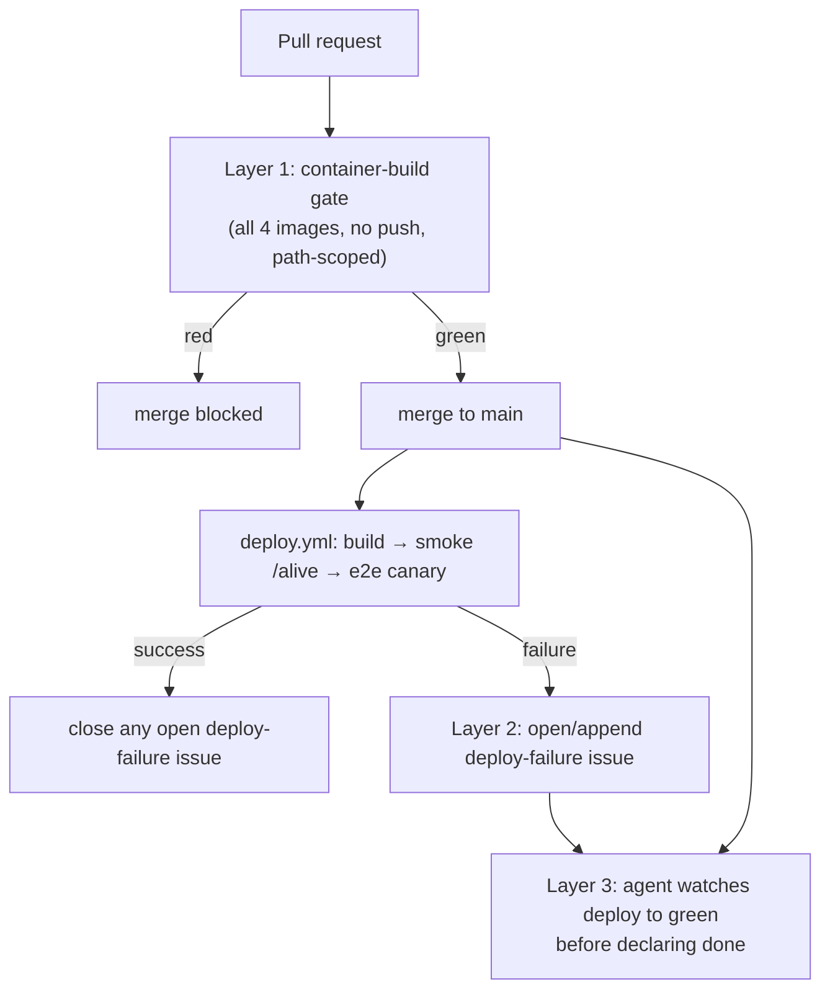

# Build/deploy/test validation in the SDLC — design

**Date:** 2026-07-07
**Status:** Proposed
**Trigger:** The `pinwiz-web` container build failed on **9 consecutive merges** to `main`
(since #689 on 2026-07-06) and no one knew until the operator viewed the admin site and
noticed a change that had "already been merged" (the flat machine catalog, #695) was still
grouped. The RAG relevance-floor fix (#716) was stuck the same way. The failure was silent;
discovery was manual and days late.

## Problem

Three independent gaps let a broken build sit on `main` undetected:

1. **CI never exercises the container build.** [`ci.yml`](../../../.github/workflows/ci.yml)
   runs `dotnet build`/`test`, which see the full working tree (including `docs/`). Only the
   **Docker** build filters the context via `.dockerignore`. So a Docker-context break
   (`.dockerignore` / Dockerfile / embedded-resource-path) passes CI clean and only fails in
   the image build.
2. **The image build runs post-merge only.** [`deploy.yml`](../../../.github/workflows/deploy.yml)
   triggers on `push: [main]`. The image build is never exercised on the PR, so the break
   cannot block the merge — by the time it fails, it's already on `main`.
3. **A failed deploy is silent.** `deploy.yml` has no failure notification (no issue, no
   chat, no gated status). The post-deploy smoke `/alive` + E2E canary are good, but they are
   *skipped* when the build fails, and their failure is silent too. "Done" in both the repo
   flow and the agent's ship flow ends at **PR merged + code-scanning green** — neither waits
   for, or reports on, the deploy.

## Goals

- A Docker-context/build break **cannot merge** — it fails the PR.
- When a post-merge deploy (build / smoke / e2e) fails, the operator is **alerted
  immediately** through a durable channel, not by viewing the site.
- "Done" means **merged AND the post-merge deploy is green** — encoded in both the automated
  pipeline and the agent's working process.

## Non-goals

- **A bespoke "EmbeddedResource under `docs/`" lint.** The generic container-build gate
  (Layer 1) catches that entire class; a special-case rule would be redundant (YAGNI).
- **Moving the *deploy* itself pre-merge.** The deploy needs real Azure (ACR push, ACA
  revision swap, RBAC, env) and must stay post-merge. We gate the *build* at PR time and
  *watch* the deploy post-merge — we do not deploy from a PR.
- **A new external chat/push channel.** Alerting uses a GitHub issue (Layer 2); adding
  Slack/Teams/ntfy is a future option, not this design.

## Design

### Layer 1 — Prevention: PR-time container-build gate

A dedicated `container-build.yml` workflow (NOT in `ci.yml`) that runs on `pull_request` for
paths covering image inputs (`src/**`, `docs/**`, `.dockerignore`, `**/Dockerfile`,
`Directory.Build.props`, `Directory.Packages.props`):

- For each of the four images (`web`, `api`, `cli`, `rag-indexer`), full `docker buildx build
  --file <dockerfile> .` (no `--target` — not every Dockerfile names its first stage `build`),
  **no push**, `cache-from/cache-to: type=gha` (the same layer cache `deploy.yml` uses, so
  incremental PR builds are fast).
- Matrix over the four Dockerfiles, mirroring the deploy matrix so the two never drift.
- Lives in a **dedicated `container-build.yml`** rather than `ci.yml` so it is NOT subject to
  `ci.yml`'s `paths-ignore: ['docs/**', '.claude/**', '**/*.md', ...]`. A docs-only PR that
  changes an embedded doc (e.g. a new ADR the web image copies in) still triggers this gate.
- Marked a **required status check** on `main` branch protection, so a red build blocks merge.

This closes the CI-vs-Docker divergence: the exact #689 break (`docs/engineering-manifest.json`
+ ADR docs excluded by `.dockerignore`) would have turned the PR red.

**Cost:** cached incremental builds are cheap; the first build on a cold cache is the
expensive one. Acceptable under the cost-discipline bar — a broken deploy costs far more.

### Layer 2 — Detection: `deploy-failure` auto-issue

A final job in `deploy.yml` with `if: failure()` (covering the build-deploy, smoke, and e2e
jobs) that:

- Collects the failing job name, commit SHA + title, the run URL, and a short error tail.
- **Opens or updates** a GitHub issue labeled `deploy-failure`:
  - If an **open** `deploy-failure` issue exists → add a comment (new failing commit + run
    link). This dedups: consecutive failures append to one issue instead of spamming N issues.
  - Else → open a fresh issue titled `🚨 Deploy failed on main — <short sha> <title>`.
- Uses the built-in `GITHUB_TOKEN` (`issues: write`); no new secret.

This is the durable "know now" channel: visible in the repo, and the agent can auto-triage it
(mirrors the existing `pr-feedback-triage` bot pattern). When a deploy later succeeds, a
success step **closes** any open `deploy-failure` issue with a "resolved by <sha>" comment, so
the issue's open/closed state tracks live deploy health.

### Layer 3 — Definition of Done: "done" waits for the deploy

The SDLC/process change — it binds both the automated pipeline and the agent's behavior:

- **Agent ship/SDD flow:** after a merge, the agent **watches the post-merge Deploy run to
  completion** (build → smoke `/alive` → E2E canary) — the same background-watch pattern
  already used for code-scanning — and does **not** report work "done" until it is green. On
  failure, it triages immediately (root-cause + fix, or open/annotate the `deploy-failure`
  issue). Encoded as a new **"Step 3 — post-merge deploy verification"** in
  [`.claude/PR-AUDIT.md`](../../../.claude/PR-AUDIT.md) and referenced from the `ship` / `pr`
  skills and `pinball-workflows.md`.
- **Session start / picking up work:** the agent checks for open `deploy-failure` issues and
  surfaces them **first**, before starting new work.
- **PR template:** [`.github/PULL_REQUEST_TEMPLATE.md`](../../../.github/PULL_REQUEST_TEMPLATE.md)
  gains a "done" checklist item: *post-merge Deploy green (build + smoke + e2e)*.

## Data flow

## Validation

The gates must be shown to actually gate — tests-as-evidence, applied to CI:

- **Layer 1 proof:** confirm the new container-build job goes **RED** against the pre-#720
  tree (the incident state) and **GREEN** after the fix. A gate that has never failed on the
  bug it targets is unproven. (Do this by pointing the job at the pre-fix commit, or a
  scratch branch that reverts the `.dockerignore`/Dockerfile fix.)
- **Layer 2 proof:** force a deploy failure (e.g. a `workflow_dispatch` run with an injected
  failing step, or a scratch commit) and confirm exactly one `deploy-failure` issue opens,
  a second failure **comments** rather than opening a duplicate, and a subsequent success
  **closes** it. Assert the dedup and close behavior — not just that an issue can be created.
- **Layer 3 proof:** the PR-AUDIT Step 3 text + PR-template item exist and are referenced from
  the ship/pr skills; a dry run of the ship flow shows the agent watching a deploy to green.

## Rollout / sequencing

1. **PR #1 (shipped separately, urgent):** the `.dockerignore` + Dockerfile fix that unblocks
   the current 9-merge backlog. Already verified locally and in flight.
2. **This PR:** Layers 1–3. Its Layer-1 gate becomes the permanent regression guard; we prove
   it catches the #689 class before merging.

## Risks

- **PR CI time.** Four image builds add minutes. Mitigated by `type=gha` caching and the
  dedicated workflow's `paths:` filter (it runs only when image inputs change — `src/**`,
  `docs/**`, `.dockerignore`, `**/Dockerfile`, `Directory.*.props`). If it still proves too
  slow, per-image path-filtering (build only images whose inputs changed, fanning shared files
  like `.dockerignore`/`Directory.Build.props` to all) is a follow-up.
- **Alert fatigue.** The dedup (comment-not-duplicate) + auto-close keeps `deploy-failure` to
  one open issue at a time, so it signals "deploy is currently broken," not a pile of noise.
- **Required-check bootstrapping.** Making the container-build a required check needs a branch-
  protection update (operator action). Documented in the plan; until then the job runs and is
  visible but advisory.
