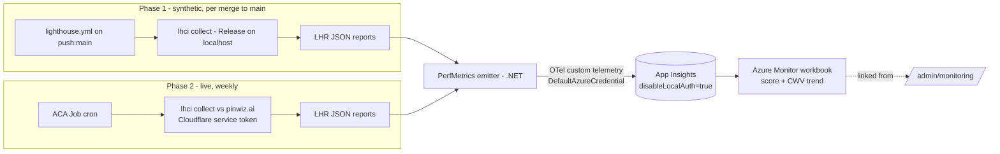

# Performance Trend Tracking — Design

**Date:** 2026-07-08
**Status:** Draft (awaiting review)
**Origin:** Follow-up to the admin perf baseline (#729) and the CLS fix (#728). We have a
per-PR Lighthouse *gate* but no *history* — this spec adds durable trend tracking.
**Scope:** Record Lighthouse scores + Core Web Vitals over time into App Insights and chart
them in an Azure Monitor workbook. Phase 1 (synthetic, per-merge) is buildable now; Phase 2
(live edge) is a scoped fast-follow.

---

## 1. Context — what exists, what's missing

- **`.github/workflows/lighthouse.yml`** runs `@lhci/cli` (`collect` + `assert`) on **PRs that
  touch `src/PinballWizard.Web/**`**, publishing a Release build to `localhost:5000` and gating
  on thresholds (Perf ≥70 *warn*, A11y/Best-Practices ≥90 *error*, SEO ≥90 *warn*; config in
  `.lighthouserc.json`). Reports upload as artifacts with **14-day retention**.
- **Gap:** this is a *point-in-time regression gate*, not a *trend*. Nothing persists beyond 14
  days; there is no way to see performance drift across weeks/releases, and it never measures the
  live edge (Cloudflare + CDN + ACA) where the real user experience — and CLS — actually lives.
- **Assets we build on:**
  - CI authenticates to Azure via **GitHub OIDC federated credentials** (`deploy.yml`) — secretless.
  - The app already **reads Log Analytics** (`LogAnalyticsMonitoringStatsReader`,
    `LogAnalyticsJobLogReader`) for `/admin/monitoring` — an established Azure Monitor query path.
  - **`PinballWizard.ServiceDefaults`** is OpenTelemetry-based.
  - An **ACA Jobs + user-assigned managed identity** pattern exists (`infra/modules/shared.bicep`).
  - Phase 2 already provisions **App Insights**.

## 2. Locked decisions (from brainstorming, 2026-07-08)

1. **Measure both** synthetic (lab) and live (edge), **phased** — synthetic first.
2. **Store + view in App Insights + an Azure Monitor workbook** (not a git-committed file, not a
   self-hosted LHCI server).
3. **Secretless ingestion** — an OpenTelemetry emitter authenticating with `DefaultAzureCredential`
   (OIDC token in CI, managed identity in the ACA Job). App Insights `disableLocalAuth = true`. No
   connection-string secret (honors the Key-Vault/MI invariant).
4. **Phase 1 = synthetic-per-merge → emitter → App Insights → workbook.** No Cloudflare dependency.
5. **Phase 2 = live weekly ACA Job**, gated on a Cloudflare Access **service token** to pass the
   OTP gate unattended. Same emitter, same schema, same workbook.

## 3. Architecture

Two collectors feed one pipeline; an `environment` dimension keeps them apart in the same store.

### 3.1 The emitter (`PerfMetrics`)

A small .NET tool — the one new unit of code — with a single job: read one or more Lighthouse
`lhr-*.json` report files and emit one telemetry record per (run × page) to App Insights via the
Azure Monitor OpenTelemetry exporter, authenticated by `DefaultAzureCredential`.

- **What it does:** parse LHR JSON → project the fields in §4 → emit.
- **How it's used:** invoked as a final step after `lhci collect`, pointed at `.lighthouseci/`.
  Same binary in CI (Phase 1) and in the ACA Job (Phase 2); only `environment` + the credential
  source differ, both supplied by config/env — no code fork.
- **What it depends on:** the LHR JSON shape, `ServiceDefaults`' OTel setup, and an identity with
  publish rights on the App Insights resource.
- **Placement:** a dedicated small tool/verb rather than bloating the scraper CLI — it shares
  nothing with the ingestion domain. (Exact host — new console project vs a `perf` verb — settled
  in the plan; the emitter's contract above is fixed either way.)

### 3.2 Auth (secretless)

- App Insights component: **`disableLocalAuth = true`** (Bicep) — ingestion keys off; Entra only.
- The **CI OIDC identity** and the **ACA Job UAMI** each get **`Monitoring Metrics Publisher`** on
  the App Insights resource (Bicep role assignment).
- The emitter uses `DefaultAzureCredential`; no connection string, no ingestion key anywhere.

## 4. Telemetry schema — one record per (run × page)

**Dimensions (properties):** `page` (`/`, `/wizard`, …), `environment` (`synthetic` | `live`),
`commitSha`, `lighthouseVersion`, `runTimestampUtc`.

**Values (measurements):**

| Field | Source (LHR) | Unit |
|---|---|---|
| `performance` | `categories.performance.score × 100` | 0–100 |
| `accessibility` | `categories.accessibility.score × 100` | 0–100 |
| `bestPractices` | `categories["best-practices"].score × 100` | 0–100 |
| `seo` | `categories.seo.score × 100` | 0–100 |
| `lcp` | `audits["largest-contentful-paint"].numericValue` | ms |
| `cls` | `audits["cumulative-layout-shift"].numericValue` | unitless |
| `tbt` | `audits["total-blocking-time"].numericValue` | ms |
| `fcp` | `audits["first-contentful-paint"].numericValue` | ms |
| `speedIndex` | `audits["speed-index"].numericValue` | ms |

`commitSha` is high-cardinality, so records are modeled as **custom events/logs** (not
pre-aggregated metrics) — the exact App Insights table (`customEvents` vs `customMetrics`) is
confirmed against the Azure Monitor OTel exporter mapping during implementation; the schema above
is the contract regardless of table.

## 5. The workbook (Bicep-deployed)

An Azure Monitor **workbook**, checked in as Bicep (matches the IaC posture), querying the records
via KQL. Charts:

1. **Category-score trend** — one line per category, over time, filterable by `page` + `environment`.
2. **Core Web Vitals trend** — LCP / CLS / TBT, with the **CLS 0.1 "good" threshold** drawn as a
   reference line (so the #728 fix stays visibly regression-free).
3. **Synthetic vs live** — same metric, both environments overlaid (Phase 2).

Linked from `/admin/monitoring` (a link-out, not an embed — no new render surface).

## 6. Phasing

### Phase 1 — synthetic per-merge (buildable now)
- Add a `push: [main]` trigger to `lighthouse.yml` (keep the existing PR trigger + gate).
- Add the emitter step after `lhci collect` on the main-branch run only (PRs stay gate-only — no
  trend noise from unmerged work).
- Bicep: `disableLocalAuth` + the CI-identity role assignment + the workbook.
- **Verification:** after a merge to `main`, a KQL query returns the new datapoint; the workbook
  renders the point; a second merge shows two points trending.

### Phase 2 — live weekly (fast-follow)
- New ACA Job (cron, weekly) in `shared.bicep`, reusing the Jobs/UAMI pattern, running `lhci
  collect` against `https://pinwiz.ai` with a **Cloudflare Access service-token** header pair to
  bypass the OTP gate; emits with `environment=live`.
- **New dependency:** provision the Cloudflare Access service token (client id/secret) + allow it
  on the Zero Trust application. Stored per the app's existing secret posture (Key Vault).
- **Verification:** the weekly job run produces a `live` datapoint; the workbook's synthetic-vs-live
  overlay populates.

## 7. Non-goals (YAGNI)

- **No alerting in Phase 1** — establish the trend first; a regression alert (e.g. CLS > 0.1 or
  Perf drop > N) is a clean follow-on once there's a baseline of points.
- **No self-hosted LHCI server** — cost + ops against the $300–400/mo cap; rejected in brainstorming.
- **No git-committed history file** — App Insights is the chosen store.
- **No real-user monitoring (RUM)** — this is synthetic + scheduled-synthetic-against-live, not
  field data from real visitors; RUM is a separate, larger initiative.
- **No change to the existing PR gate thresholds** — the "ratchet Perf to 90" note in
  `lighthouse.yml` is tracked separately (now that #728 + caching are understood, it may be
  actionable, but it is not part of *tracking*).

## 8. Verification summary

- **Phase 1 done when:** two consecutive merges to `main` produce two datapoints per page in App
  Insights, the workbook charts them, and the pipeline added no secret (grep CI + Bicep for a
  connection string → none).
- **Phase 2 done when:** the weekly ACA Job emits a `live` datapoint and the synthetic-vs-live
  overlay renders.

## 9. Open items (resolved in the plan, not blockers to it)

- Emitter host: standalone console project vs a verb on an existing entry point.
- Exact App Insights table mapping for the OTel record shape (confirm, don't guess).
- Whether `disableLocalAuth=true` affects any *existing* App Insights ingestion path (audit current
  telemetry auth before flipping it).
