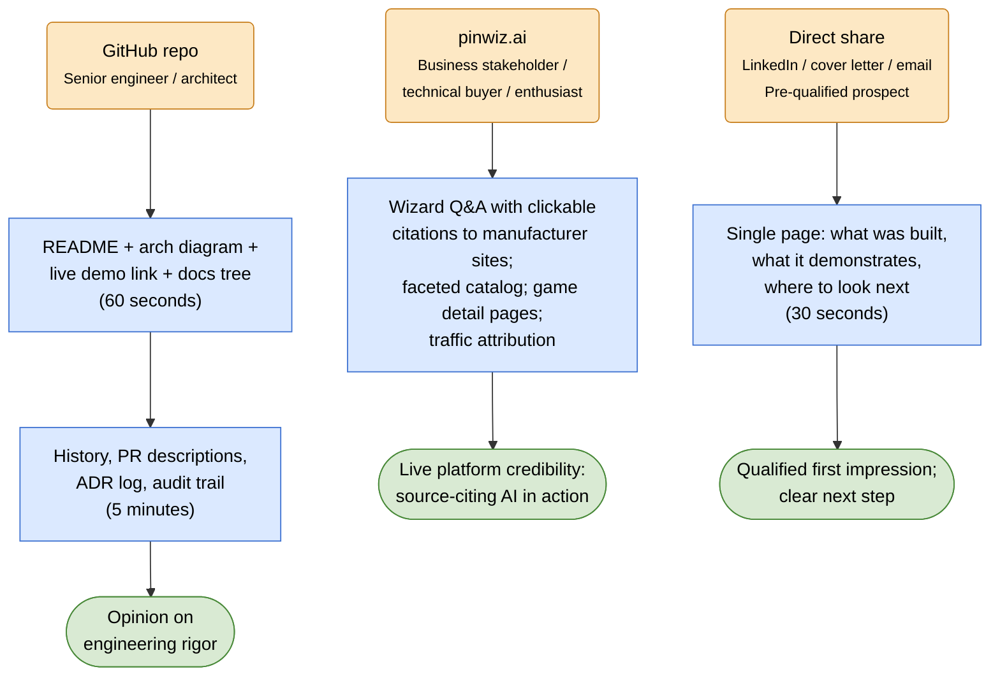

# Vision

PinballWizard / pinwiz.ai is a public reference application by Earlybird Solutions, demonstrating the end-to-end architecture, build, and operation of a modern, enterprise-class AI platform on Azure. It's a working system any prospect can read, run, or click — built to the same quality bar as the consulting engagements it's meant to evidence.

The pinball domain is the vehicle. The engineering is the point.

## What this app is

A polite, manufacturer-agnostic content-ingestion pipeline feeding an event-driven, source-citing RAG platform, fronted by a Blazor + MudBlazor application with administrative tooling, hosted on Azure Container Apps behind Cloudflare Pro. Public users ask the Wizard questions about pinball machines and get answers that cite original manuals, schematics, and bulletins on the manufacturers' own sites when grounding is available — refusing rather than fabricating when it isn't. Authenticated users (when passport features ship) can track their gameplay, refine strategy with the Wizard, and capture scores via OCR.

Every architectural decision is justified in an ADR. Every PR clears a two-step pre-push audit (qualitative critique + mechanical checklist). Every external request is throttled, identified, and respectful of robots.txt by construction. The code, infrastructure, tests, and documentation are all part of what's being demonstrated — not just the runtime behavior.

## What this demonstrates

Capabilities a prospect can verify directly, mapped to Earlybird Solutions service areas:

- **Cloud-native architecture (Azure + .NET Aspire).** Container Apps, Cosmos Serverless, AI Search Basic, Azure OpenAI, Functions on Cosmos Change Feed, Aspire-orchestrated local development that mirrors production.
- **AI engineering.** Retrieval-augmented generation with provenance-preserving chunking, hybrid (semantic + keyword) search, threshold-driven refusal, sub-agent surface scaffolded in Phase 3 with structural connected-agents wiring landing in Phase 4, evaluation harness with held-out queries and citation-accuracy scoring.
- **Clean Architecture and engineering discipline.** Core / Application / Infrastructure / Web layering enforced by architecture fitness tests, behavior-asserting test culture, ADRs for non-obvious decisions, two-step pre-push audit on every PR.
- **Identity, access, and admin separation.** Microsoft Entra External ID with admin RBAC from day one, social-login federations (Google, Apple, Discord) for end-user features when those features ship.
- **Infrastructure-as-code and operability.** Bicep with two-tier deploy gating, ARM-vs-data-plane Cosmos abstraction, OpenTelemetry, structured logging, defined SLOs, runbooks, cost dashboards, periodic disaster-recovery drills.
- **Polite integration with external systems.** Robots.txt honored unconditionally, machine-consumer metadata (OG / JSON-LD / sitemap) preferred over DOM scraping, identifying User-Agents, traffic-attribution telemetry — visible in the code, not hidden behind config.
- **Cost discipline.** $300–$400/month steady-state cap with cost-per-feature attribution; demonstrates that "enterprise-grade" doesn't require "enterprise-priced."

## How a prospect should encounter this

Three landing surfaces, each calibrated for a different audience and time budget.

**From GitHub** (senior engineer, senior architect). The README opens with the showcase positioning, an at-a-glance architecture diagram, links to the live demo, and the documentation tree (vision / build-spec / quality-spec / guardrails / ADRs). Within 60 seconds the visitor knows what was built, why each major decision was made, and where to drill down. Within 5 minutes they have an opinion on the engineering rigor. The repo itself is a portfolio — its history, PR descriptions, ADR log, and audit trail are all part of the demonstration.

**From pinwiz.ai** (business stakeholder, technical buyer, pinball enthusiast). The site loads quickly behind Cloudflare; the Wizard takes a question and answers it with clickable citations to the original manuals on the manufacturers' own sites. Faceted browse exposes the catalog. Game detail pages link out to OPDB, Pinball Map, and the manufacturer. The platform tells source sites the value it sends them via traffic attribution — outbound clicks back to those sites are tracked and surfaced.

**From a direct share** (LinkedIn post, cover letter, follow-up email). The link points to a single page — either the README or a dedicated showcase page — that compresses the demo into one screen of "what was built, what it demonstrates, where to look next." Pre-qualified prospects don't need the full GitHub journey; they need the thirty-second case.

The diagram below maps how each surface reaches its audience and what impression it is designed to leave.

## What this is not

- **Not a SaaS or commercial product.** Free to use; no monetization roadmap; no pricing page; no signup wall in front of the public Wizard.
- **Not a competitor to OPDB, Pinball Map, Pinside, or any community platform.** PinballWizard cites them as sources and routes traffic back to them; it does not seek to replace them.
- **Not the authoritative source of pinball data.** Manufacturers, OPDB, and the established databases are. PinballWizard makes that data searchable and Q&A-able with citations preserved end-to-end.
- **Not a marketplace, tournament organizer, or social network.** Not a moderation surface for user-generated content beyond OCR score capture (auth-gated, narrow scope) and Strategy Tracker entries (private to the user).
- **Not a content scraper for content's sake.** Robots.txt is honored unconditionally; sites that opt out are not crawled, period. The platform sends value back via citation traffic, not the reverse.

## Why pinball

The domain is deliberate, not incidental:

- **Public, non-proprietary content.** No PII, no customer data, no NDA risk. Safe to host publicly, safe to demo, safe to leave running in production.
- **Technical content suits RAG well.** Manuals, schematics, service bulletins, and firmware notes are dense, source-cited reference material — the kind of content that benefits most from retrieval-augmented Q&A and where hallucination would be most harmful.
- **Enthusiast community.** A domain with passionate users surfaces real questions and real edge cases; demo audiences engage genuinely rather than politely.
- **Manufacturer and era diversity.** Modern Stern + JJP + American + Spooky + boutique manufacturers + classic re-issues exercise the architectural patterns (canonical-id-vs-slug, static HTML vs Vue.js, JSON-LD vs DOM heuristics, modern API vs legacy site) without contrived complexity.
- **Personal interest is credible motivation, not the showcase.** A developer who builds a serious project around something they care about reads as authentic; the rigor of *how* it's built is what's actually being evaluated.

The pinball domain is the vehicle. The engineering is the point.
